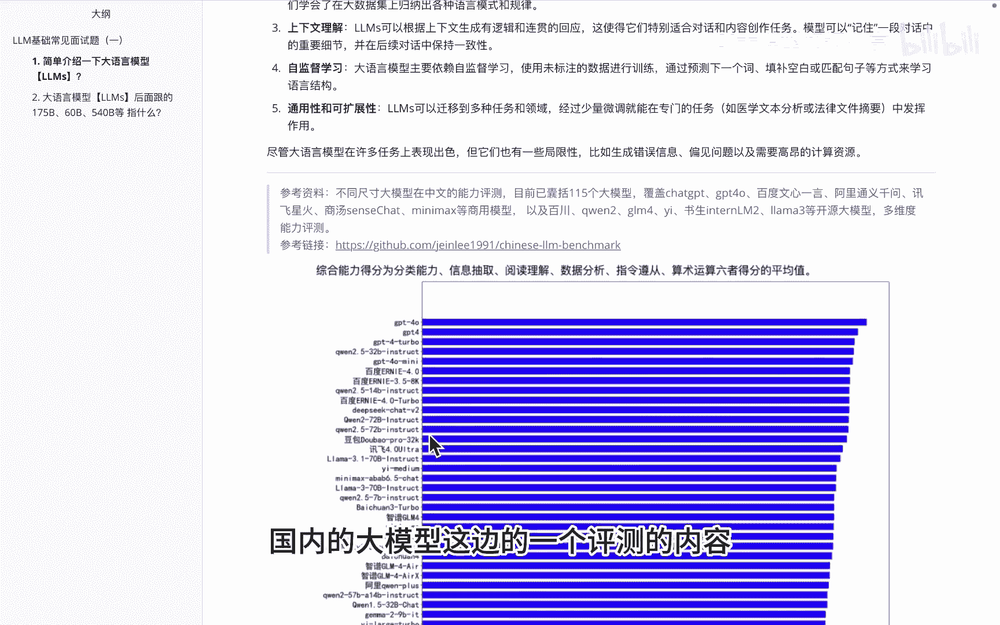
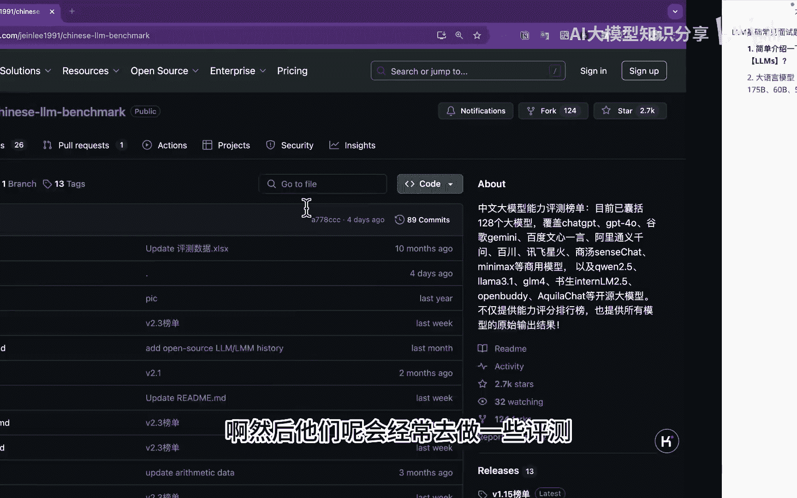
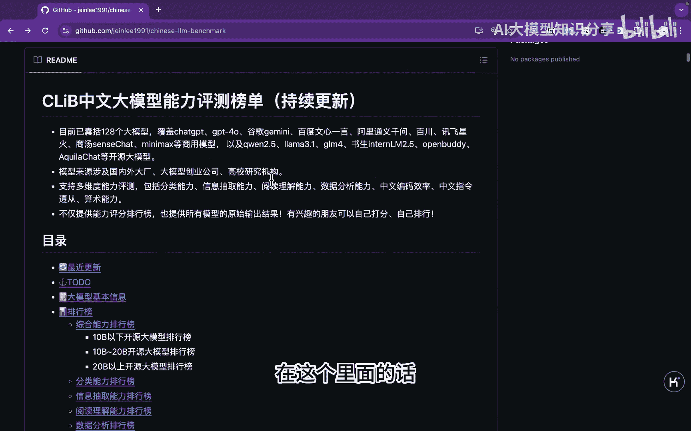
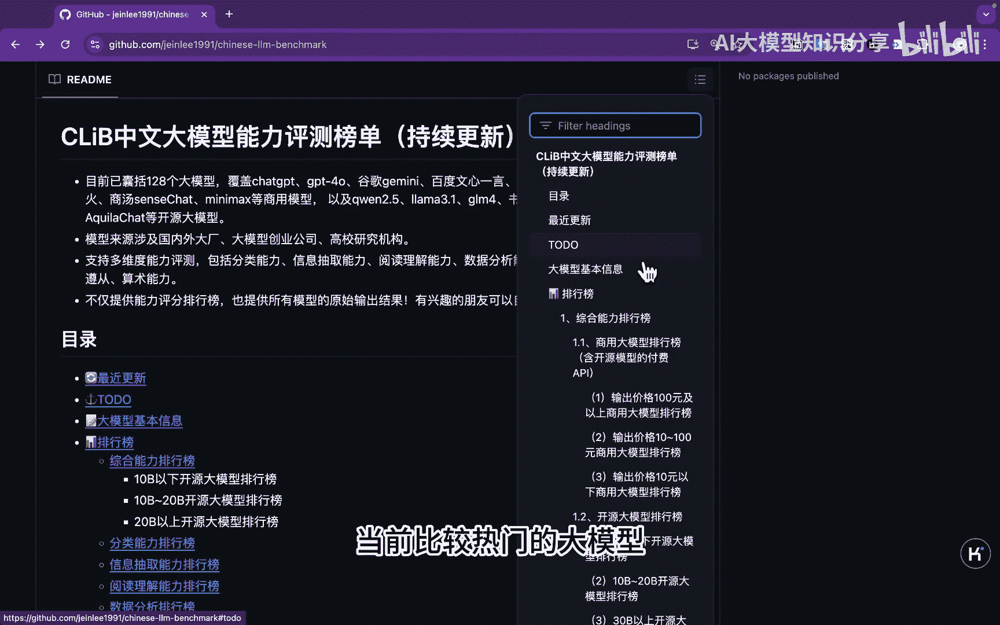
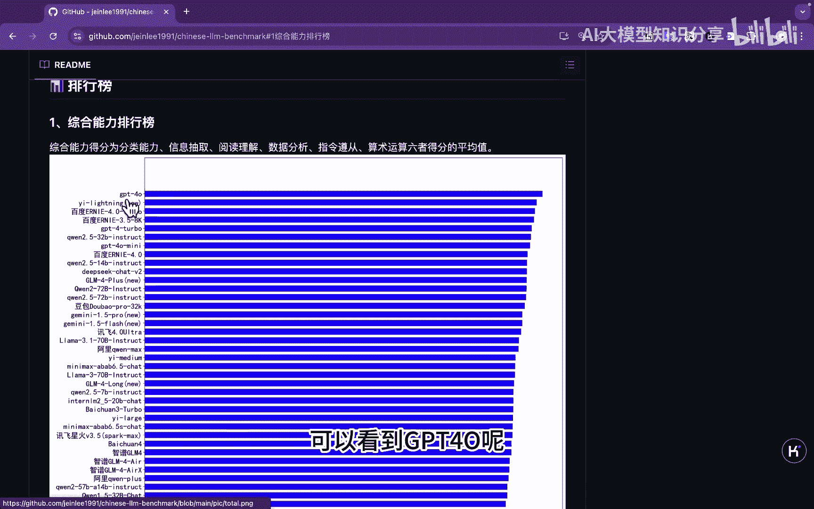
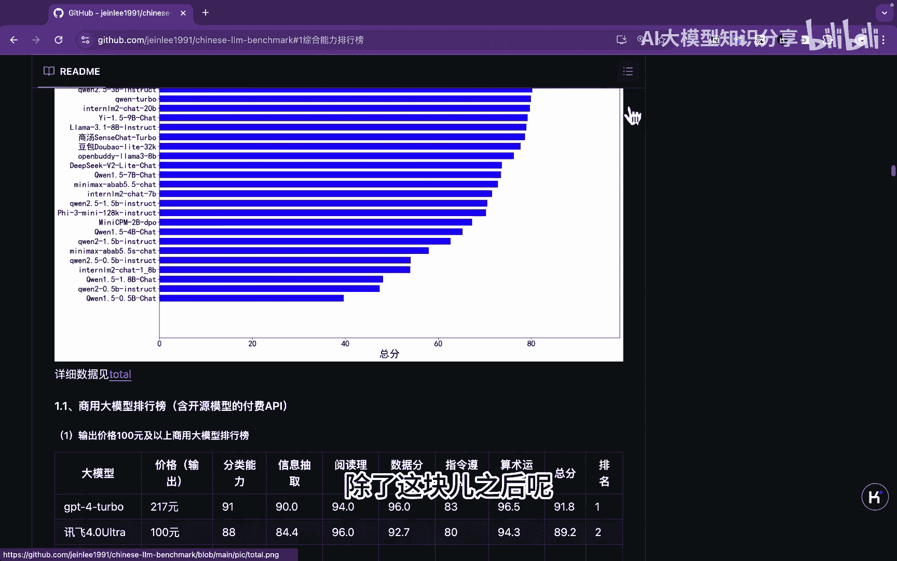
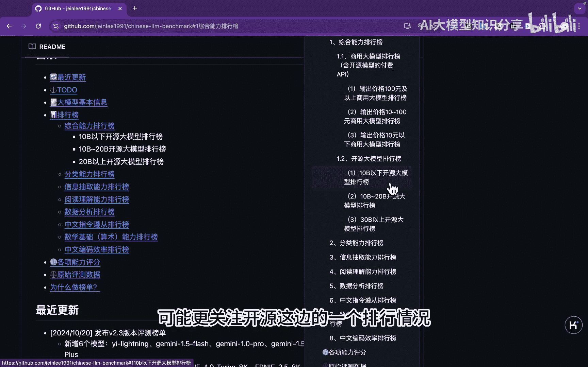
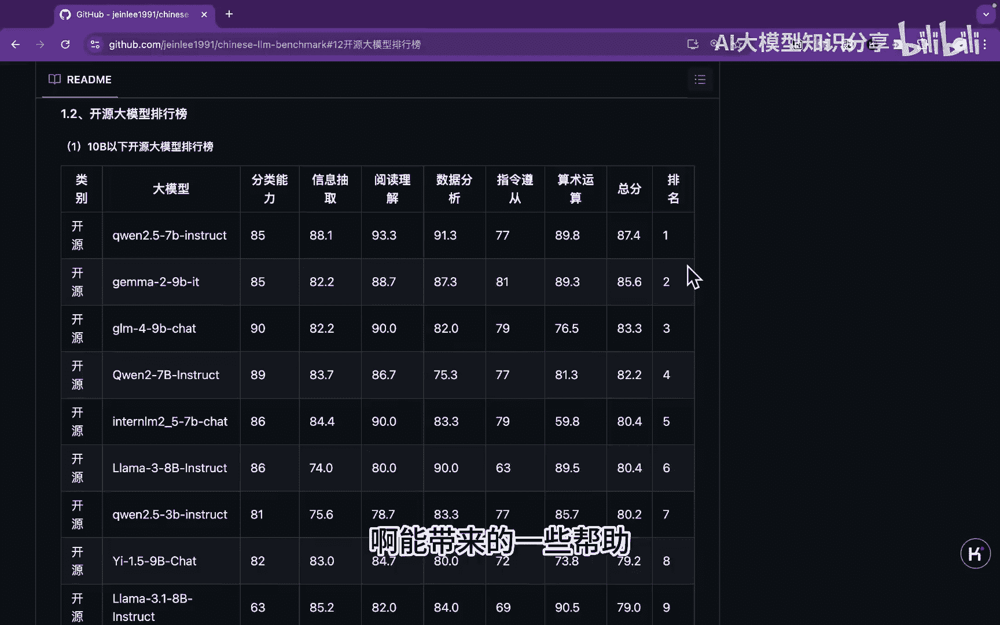
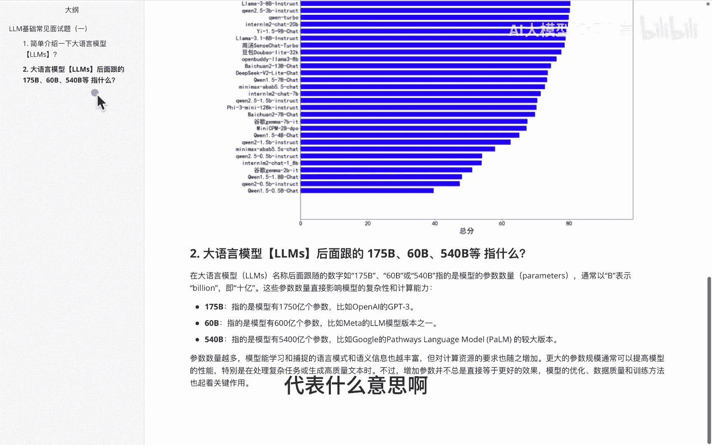

# P1：大语言模型面试题系列（ 一） - 1.大语言模型面试题系列（一） - AI大模型知识分享 - BV1UkiiYmEB9

大家好哈，今天的抽时间给大家讲一讲，关于啊啊大医院模型的一些基础的常见面试题，那么在啊正式给大家讲题之前啊，给大家说一下，就是这块呢我打算做成一个序列好，从大语言模型以及基础讲起。

然后到哈大圆模型的一些微调啊，再到带约模型里边的一些，比如说RG啊这块一些相关的内容，然后啊从浅到深啊，逐步的去给大家做一个讲解，那么啊首先我们看一下啊，这个第一题就是啊简单介绍一下啊，大医院模型。

那么啊大医院模型这个事呢，其实已经提及很长时间了，但真正这边的这个大模型，其实并没有一个明确的界限，说啊多大的就算一个啊大模型啊，没有超过这个参数就不算一个大模型，那么一般呢就是说。

而超过1亿以上的一些参数模型呢，而我们就认为它是一些啊大模型，当然目前了其实语气有一些就万亿级别，这种模型呢啊也已经存在了，比如说mini max这个ABAB6。5啊，那么大于模型这边的话。

一般会包含如下几个特点，比如说它的一些啊参数量会非常大，另外一方面呢就是啊，他的这个多任务处理能力啊，他比如说做一些什么文本摘要啊，情感分析啊等等的都可以的，然后啊上下文理解，就是我这边可以做一些啊。

多罗的里面有一个history历史的一个记忆，还有就是他可以做一些自监督学习，以及它的一个通用性和可扩展性啊，当然大家也需要注意的是啊，在代悦模型里面，虽然他在一些任务上表现不错，不过也有些局限性。

比如说他的一些错误信息呀，偏见问题啊，以及啊高昂的一个计算资源，然后在这块呢给大家推荐一个啊，关于啊国内的大模型这边的一个评测的内容。

开源的数据集啊，然后他们呢会经常去做一些评测。

可以大家看一下，在这个里面的话。

主要针对一些啊当前比较热门的大魔弦。

在中门的数据站表现的一个综合能力，然后在这个里面呢是针对他列大模型里边的，不同结果的一个得分的排名，可以看到GBTSOO呢啊遥遥领先。

那这个是啊初步的一个概览，除了这块之后呢。

大家可以看到除了那块内容，还有呢包含比如说啊如果要商用，那商用这边的话啊，针对不同的价格，它的一个啊对比情况，以及开源模型的一些对比情况，对于我们开发者而言。

可能更关注开院这边的一个排行情况，那么这边这个开源项目也是针对，也要一些开源大模型，分别从啊分类能力信息抽取，这些呢东方面呢去做一个啊打分啊，最后做一个排名，那么希望这个东西大家如果用的过程中呢。

R能带来的一些帮助。

然后这是啊讲到的第一道题，那么第二题呢是说到叫啊大岳母系这边，后面跟的这个什么，比如说175B和60B，这个B呢它代表什么呢，其实这个币呢代表就是贝利就11DISS，比如说175B。

就是1750亿个参数啊，60币就600亿啊，以此类推，但这个里面大家需要注意的，包括我在前面讲那道题里面说到啊，真的就是参数量越大，然后模型就越强嘛，啊在一些意义上来说啊，是的。

但是参数量呢这个他总觉得有到头，就是你一卷到某个量级，它其实是卷不动的，不管是因为你的算力这边，还因为你的数据量，这边其实都in到了一定瓶颈之后不行了啊，所以呢才有了啊，比如说前段时间比较火的O1啊。

相关的一些营救啊，当然这块的话我们放到后面就跟大家讲解，那么啊今天呢给大家先简单的介绍两道题，其中一道呢是耳热单加简单的了解一下啊，什么是大语言模型，而另外一块呢给大家讲一下。

带原模型里面后边这个币还代表什么意思啊。

