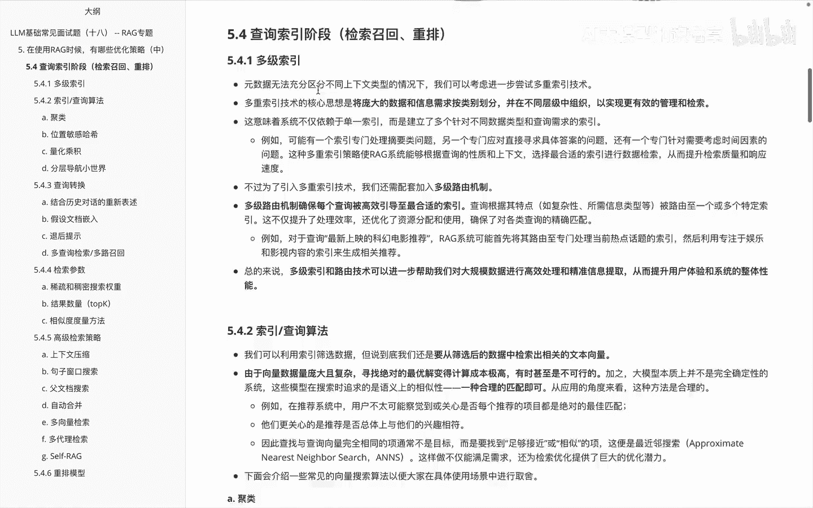

# P18：LLM基础常见面试题（十八） -- RAG专题 - 1.LLM基础常见面试题（十八） -- RAG专题 - AI大模型知识分享 - BV1UkiiYmEB9

到这个视频呢我们终于来到了啊，关于这个RG优化策略里边，在查询所有阶段里边儿啊，的最后一个优化的建议就是重排模型，那我们来看一下关于重拍模型里边，它的一些技术细节。

关于重排模型呢，额首先说在完成语义搜索优化步骤后呢，我们能够检索到语义上最相似的文档，但是呢有一个问题就是，语义相似性是否总代表最相关呢，这个是不一定的，就比如下面给大家举几个例子啊。

就是当用户查询说最新上映的科幻电影推荐时，它可能匹配的结果是科幻电影的历史演变，因为有科幻电影这种关键词嘛，啊从语义上呢是科幻电影相关的，但是并不是用户想要真正的答案，这个时候我们其实就需要重排。

来给我们做一个啊方案的解决，重排呢是说啊，通过对初始检索结果进行更深入的相关性，评估和排序，确保呢最终展示给用户的结果，更加符合其查询意图，就拿额上面举这个例子，我们接着给大家举例看。

说对于查询说最新上映的科幻电影推荐，在首次检索的时候呢，系统可能基于关键词返回，包括科幻电影的历史文章，科幻小说介绍最新电影新闻等等，然后呢在重排阶段，模型会对这些结果呢进行深入分析，并将最相关。

最符合用户查询意图的结果排在前面，同时将那些关于科幻电影历史不相关，或者说呃我们在前面召回的时候，有问题的那些内容排在后面，这样呢，重排模型就能有效提升检索结果的相关性，和准确性，更好的满足用户的需求。

在呃实际的项目里边的话，我这边建议大家就是说呃在RG构建系统里面，都应该去啊尝试考虑重排REEQ，然后呢提高我最后这个性能的一个准确性，OK讲完这块之后呢，呃我们总算把关于查询所有阶段里面的。

所有的啊优化建议都给大家说了一遍。

然后我们来看一下关于查询索引里边儿的优化。

内容，会发现包含什么呢，包含啊多级索引，然后索引查询算法查询转换，索引参数的介绍啊，检索参数的介绍，高级检索策略以及存盘模块，来快速过一下之前讲的内容。

比如说啊在查询索引阶段的时候呢，多级索引就是我们这里边给它设置一层一层的，里边有多级索引和多级路由，来完成我们所有的优化，讲完这个又给大家讲了一下，关于呃索引查询算法的一些内容。

然后主要说了一下关于聚类算法。

还有位置敏感哈，希啊以及啊量化沉积。

还有呃分层导航小事件，那这块讲完之后呢，我们又给大家讲了下关于查询转换。

也就是说前面那块其实主要给大家讲的是，关于啊索引查询这边该怎么去做的对应内容，那下面呢关于讲了下啊，查询转化里面该怎么去做优化，其实就是把用户输入的这些查询问题，怎么进行一个改写。

然后呃讲到了说结合历史对话的一个重新表述，还有假设文档的嵌入以及退后提示和多查询。

检索和多路召回。

然后又给大家讲一下，关于呃检索参数里面的一些设计，其实就是超参嘛，就是说啊这块里面第一个就是建议大家啊，比如说稀疏和稠密搜索呢啊做一个权重，他们都应该考虑进去。

以及我们召回的时候返回的数量的top k，再一个呢就是相似度的一个度量的方法。

那这块儿说完啊，其实是啊检索里面的一些啊超参，那下面呢又给大家讲了一下，关于检索的一些策略的一些方法，这个呢因为内容比较多。

就给大家介绍一些思想，比如说啊上下文的压缩句子窗口的一个搜索。

以及啊副文档搜索，还有就是自动合并。

在呢讲了下关于多向量检索怎么做，以及多代理检索怎么做。

最后呢又给大家讲一下，surf i g的一个内容思想，最后的最后啊给大家讲了下，关于这块里面的重排模型，重排这边的话呃，我建议是大家在项目里面如果要用，尽量都使用上。

