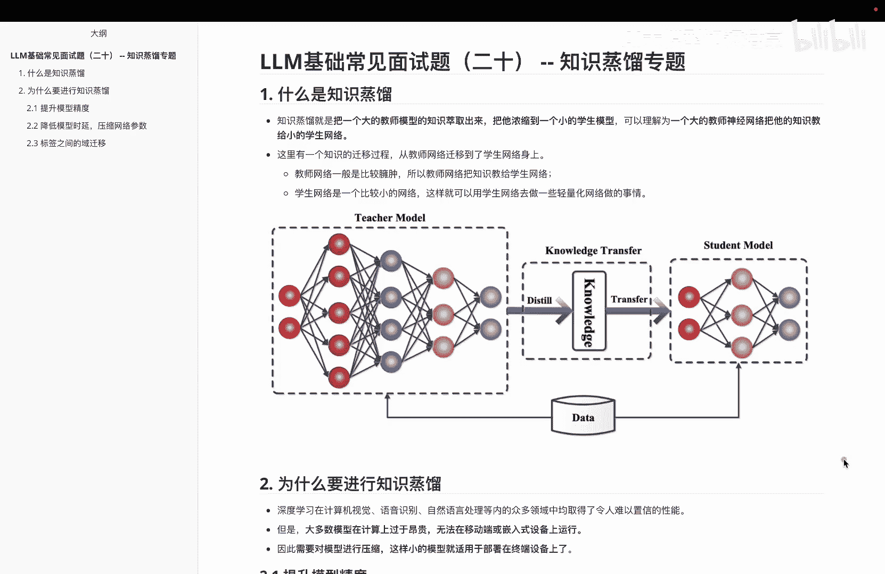
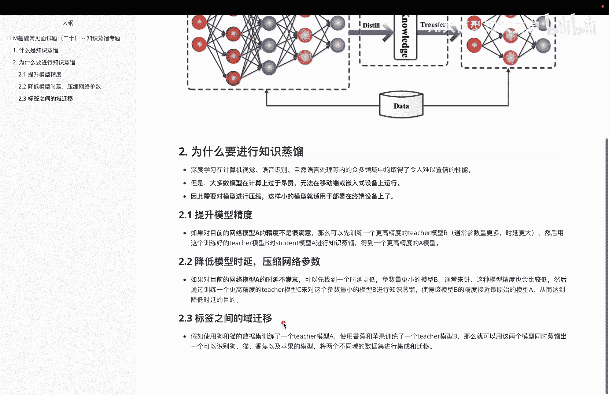

# P20：LLM基础常见面试题（二十） -- 知识蒸馏专题 - 1.LLM基础常见面试题（二十） -- 知识蒸馏专题 - AI大模型知识分享 - BV1UkiiYmEB9

大家好呃，从这个专题开始呢，我们要进入另外一个新的专题了，呃，叫知识争流专题，那么在讲之前呢，啊先给大家解释一下，为什么我们在前面讲完RG之后呢，啊紧接着后面要进入这么一个专题呢，大家知道呃。

在进入2024年之后，其实关于大模型这边的话不断的在进行迭代，比如说国外这边的话，关于GBT系列，他们也在不断的迭代大模型，然后呢不断的去卷他们的参数，不断的卷他们的一个模型的一个复杂度。

国内这边的话呃，拿千万模型来说，其实他们也在不断的去迭代自己的模型的大小，但是啊，所有这种AI公司都在啊，迭代的过程中发现一个问题，就是随着这种模型的参数变大啊，呃发现它需要的数据量会越来越多啊。

需要的算力也越来越多，但是呢呃算力这方面还好解决，可是数据这方面，其实大家发现，能把现在能用的数据都已经用上去了，会发现在需要去收集数据的时候，一个是成本非常高，另外一个呢就是收集到的数据呢。

其实都是一些重复的数据了，此时啊数据遇到一个瓶颈，除了这些，还有一个瓶颈呢是大家发现，就算我这边能收集到更多的数据啊，数据没有，我就做一部分数据生成呗，那算力能提升，但是发现此时这个模型这边啊。

随着前面内容的增加，好像他的这个能力呢再迭代不上去了，那额模型既然没法变得越来越大了，大家就会考虑到另外一个问题，就是既然模型没法变得越来越大，那我能不能说啊在当前这些模型上，然后继续提升他的能力呢。

甚至啊更有甚者说，我能不能把这种啊当前模型的这种能力呢，放到一个更小的模型里面去，让更小的模型具备这种啊大的模型里面的，这种能力呢，那此时啊关于蒸馏啊，关于知识蒸馏。

其实就是我在前面给大家说的这一系列的原因，就是我们想着把一个什么呢大模型的能力，然后呢啊给它提取出来，放到一个小模型里面去，让小模型在小尺寸里面具有把大模型那种啊，相同的能力，呃。

然后我们来看一下关于知识蒸馏这边内容说啊，知识蒸馏呢，其实就是说把一个大的教室模型的知识，提取出来，浓缩到一个小的学生模型里边，可以理解为呢就是说一个大的教师神经网络，把他的知识呢啊教给小的学生网络。

然后从这个教师网络啊，迁移到学生网络身上的时候呢，首先教师网络这边呢一般是比较臃肿的，所以呢啊教师网络呢需要把这些知识呢，教给学生网络，另外一方面呢，就是说学生网络呢是一个比较小的网络。

这样呢就可以让学生网络去做一些，轻量化的网络呃工作的内容，就比如说我们要把这个轻量化的网络啊，部署到手机端或者汽车端，他这边的话会成本更小一些，下面这个图呢大家可以看到。

其实就是呃关于啊知识蒸馏做的一个事吧，比如说啊这个tech model，它是一个比较复杂的一个模型，然后这个student model呢它比较一个简单的模型，然后我经过一些知识的迁移做蒸馏。

然后把这种知识呢转移到学生模型里边，此时就让啊小的学生模型拥有啊，和大的这个教师模型相同的能力，那么这么介绍完之后呢，相信大家对这个啊知识蒸馏的基本概念啊，有一个认识。

那说完这块啊，我们再看第二块，就是为什么要进行知识蒸馏，相信我在这个视频开始之前给大家介绍那段话，大家也一定的啊对这个为什么进行知识蒸馏呢，有一定的理解了，那我们来看一下说。

首先呢啊深度学习在啊这些不同的任务里边的，各个领域里面都取了一些不错的效果了，但是呢大多数模型在计算上呢都成本太高了，无法在一些移动端或者嵌入式的设备上运行，所以我们需要对这些模型进行压缩啊。

这样呢小的模型就能部署在一些终端设备上了，那么呃我们说做质蒸馏它会有几个目的，第一个呢就是说为了提升整个模型的精度，比如我们对目前的这个网络模型A的精度呢，不是非常满意，那我就可以啊。

先训练一个更高精度的一个teacher模型，这个模型的参数一般会更大一些，然后我用训练好的这个基础模型，对这个啊学生模型A进行知识蒸馏，得到一个更高精度的A模型，这个A模型呢。

首先它要比当前这个A模型效果更好，同时我们有时候还会希望，比这个B模型的效果也要强，那这是第一个啊，叫提神模型的精度，第二个呢是额降低模型的一个额时延性，压缩网络的一个参数。

假设我们对目前的这个网络模型A的时延，不满意，实验呢就是说他这边响应的时间嘛，比如说我发送出去一个请求，他一两秒两三秒才给我一个响应，这是不是太慢了，那么我们就先可以找一个时延更低。

参数量更小的模型B那通常来说的话，这种模型的精度呢也会比较低，此时我们就需要啊介入这个模型蒸馏来做一下，那怎么做呢，就是说通过训练一个更高精度的，这个老师模型C啊，对这个参数量小的模型B呢进行蒸馏。

使得这个模型B的精度接近最原始的模型A，从而达到一个啊降低实验的目的，这是第二块叫降低模型的一个实验性，第三块呢是标签之间的一个预迁移，这个说了一个什么事呢，其实就是说啊。

我们假设啊我们使用啊猫狗的分类，训练了一个啊，老式模型A又呢用啊分一个香蕉，苹果的一个呃这么一个数据集，来训练这个模型B，那我们就可以把这两个模型呢，同时蒸馏出一个可以识别猫狗香蕉苹果的模型。

把它俩的数据呢做一个集成和迁移啊，这是关于我们想在知识之类里面做的，第三块工作，那么讲完这块，大家相信呃对这个为什么要进行知识蒸馏啊，有一定的理解了，第一个是提升模型的精度，第二个是降低模型的时延。

