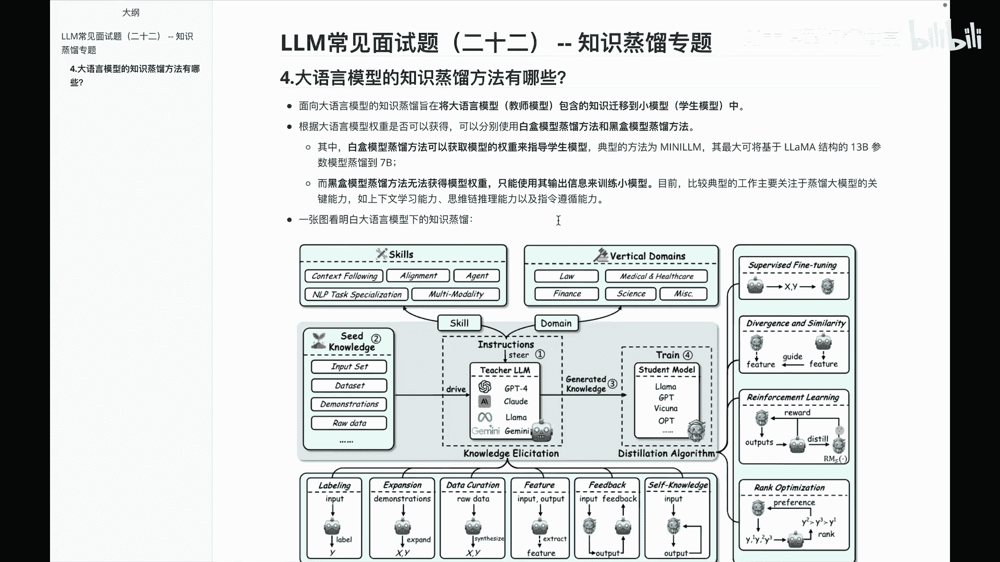
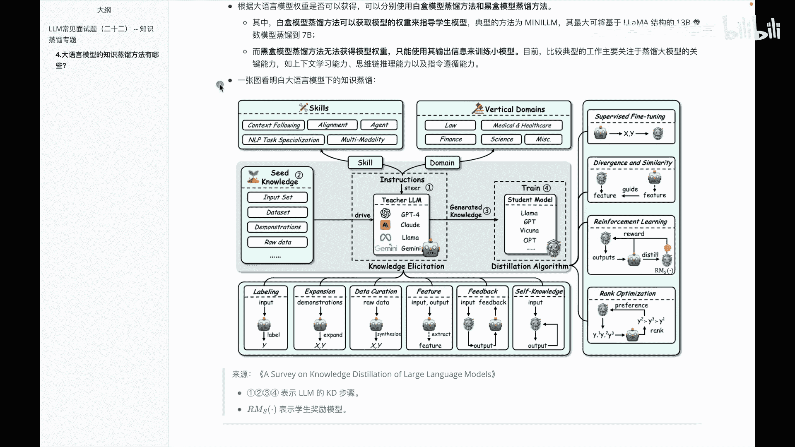

# P22：LLM基础常见面试题（二十二） -- 知识蒸馏专题 - 1.LLM基础常见面试题（二十二） -- 知识蒸馏专题 - AI大模型知识分享 - BV1UkiiYmEB9

Hello，各位我们接着来到知识真流专题，我们知道前面呢我们是给大家讲过，关于啊传统的一些知识蒸馏方法有哪些呢，那么这个视频里面，我们看一下大语言模型的知识，争论方法又有哪些呢。

那么其实不管是面向大语言模型，还是说一些传统的知识争论方法，他的目标其实都是把这种啊，教师模型呢迁移到这种啊学生模型里面去，但是呢在大语言模型里面，其实分又分为了叫白盒模型，支流和黑盒模型支流。

这个怎么分呢，其实白盒呢我们就知道说，他这边呢是参数可调的，黑盒这边呢就类似于比如说X的GP系列，因为我们这边他们没有开源嘛，所以我们就没法去更改这些参数，那我们来分别看一下。

比如说白合蒸馏方法呢可以获取模型的权重，来指导学生模型，典型的方法呢就是比如说mini l m啊，它呢是最大可以将基于拉马结构的13B模型，蒸馏到7B，那么黑盒模型直流发法呢啊。

因为没法获得一个模型的权重嘛，所以只能使用输出的信息来训练小模型，目前比较典型的工作呢，就是关于这里边的一些啊，通过比如说上下文学习思维链，coo t或者直链遵循来完成啊。

我呢找了一篇综述的文章的一个图。

来给大家讲一下，关于这个代言模型的一个知识蒸馏，然后这篇啊这个图呢主要来自于啊，下面这篇文章的，大家感兴趣的也可以搜的去看一看，然后我们来分别看一下图里面那些细节啊，其中在这个图里面的话，呃。

我们先看这个1234这几个步骤，它表示的就是大于模型里面的一个，知识蒸馏的一个步骤，我们来看一下，一是在这一呢啊表示说通过一些instructions对，就是对应那些啊指示，来完成一个大模型的相关内容。

然后这个指示呢需要由什么来驱动呢，是由这种啊相关的一些啊种子知识，你就理解成数据吧来做一些驱动，驱动完成之后呢，啊第三步干嘛呢，是做一些关于这种啊知识的生成，那生成之后呢，把这些东西我们在啊。

第四步train就是训练这个学生模型，基本上大家可以发现呃，串起来，就是我通过大模型里面指示，来获取一些相应的种子知识，然后生成知识，最后呢啊反向的训练这个学生模型，那么这是串起来一个基本的理解。

然后我们分别来看一下整体这个图里面的啊，各个模块的一个细节啊，大家呃在看之前需要先知道一下，就这两个图的一个表示，稍微注意一下，这个呢表示的是啊老师模型啊，大家注意这个呢表示的是一个啊学生模型。

那好我们分别来各个模块看一下，首先呢我们来看一下这个skill，就是这块里面在skill里面的话，其实就是说哎我这个大模型，就是老式模型的大模型，它呢可以有哪些技能来做来使用的。

那我们分别看一下第一个啊，context flow in就是我的啊指令遵循里面的，比如说上下文的遵循，还有这种强化学习agent，还有MVP相关的一些任务，以及我的多模态相关内容。

那么这是关于指令里面的一些啊技能，然后读main呢，这边表示的是一些它在垂类领域的应用，它可以用于一些啊法律相关的，还有一些医疗与健康领域的，金融领域的等等这些领域里面的内容啊。

这是关于啊就是大语言模型，它这边教师模型里边可用的一些技能和啊，可以赋能的领域，那我们看完这块之后呢，再看一下，就是大于原模型里面它呢可以做嗯，有哪些数据集可以拿来用呢，或者说有哪些数据可以做驱动呢。

首先是有输入集，就是没有做一个限制，再一块呢是关于数据集，再一个呢是一些啊关于一些指示啊，指令啊相关内容以及一些原始的数据，然后拿这些数据呢可以驱动我的啊教师模型，那么在教师模型里面的话。

这里面举了一部分例子，比如说有GPT4cloud啊，lama等等相关内容吧，那好驱动完成之后呢，我们再看一下，这个里面就开始来训练学生模型了，比如说哎拉满的小模型啊，GPT相关的小模型啊等等相关的内容。

OK有了之后咱们再分别看一下啊，这块内容，这个呢是一个啊知识的提取，我个人理解呢，这块其实主要集中在啊把教室的模型中的内容，怎么更好的给它激发出来，就是说怎么可以更好的把教师模型里面，那种知识提取出来。

那我们来分别看一下这里边有相关的内容，这个时候大家就需要注意到，这个这个图标和这个图标了，第一块里面就是关于就是啊label，就是他这边的一些关于啊标签嘛，那么这个可以理解成什么呢。

就是说他这边过来之后呢，一些知识，我怎么能把这些啊知识呢，更好的给它做一个分门别类，或者说我怎么可以把这些知识做一个，更好的利用，比如说我输入内容，然后呢经过教师模型，然后呢产出这个对应的一个标签。

或者产出对应的知识，然后这是labeling这块定，然后第二个是expansion，这个呢其实是一个啊数据扩充，就是说我有了这些东西之后呢，我经过这个数据扩充之后呢，通过指令。

怎么可以把这个扩充成我的输入和输出，然后第三个啊，这个呢其实是说呃，我经过一个数据的管理或者数据管道来，怎么把这种原始的数据啊，给它做成一个对应的输入输出，然后第四个呢是feature，就是特征吧。

特征呢自然而然就是啊，中间的一些中间态的内容，所以它就变成了说，我怎么可以把这些输入输出哎，经过教师模型提取出它的些特征，然后啊用到我们后面的学生模型里面来，然后feedback就是反馈嘛。

那么大家跟着这个箭头流来走一下，就说哎我的输入经过学生模型，学生模型输出，然后把这个输出呢给到教师模型，教师模型再给我一个反馈啊，我更加关注的是教师模型的一个反馈，然后这个呢呃比较特殊。

它是一个呃self knowledge，他这边可以理解成一个自蒸流，就是说我输入之后呢给到学生模型，学生模型呢给到输出，然后呢哎又回流给学生模型，然后学生模型这边的话，怎么去把这些知识呢作为更好的学习。

经过一个反馈啊，大家可以发现在这块里面啊，其实是更好的，怎么把这种啊教师模型的内容给激发出来啊，当然这个是除外的，不过这个呢啊我觉得也不算除外，为什么呢，因为他是啊自征流嘛，就是我自己去用自己啊。

你这个呢可以看成既是学生模型，又是教授模型好，这是关于啊叫知识的提取或者知识的激发，那么我们再看一下，就是叫蒸馏算法这块相关内容，关于蒸馏算法呢是这一类里面的东西，首先第一个SFT啊。

就是我怎么去做一个微调来完成，大家可以发现，在这里面我经过教师模型输出XY，然后呢就是输入输出嘛，然后怎么给到学生模型好，第二块呢，这个里面是一些啊叫差异性和相似性，就是怎么缩小它的差异性。

怎么增加它的相似性，大家会发现这个里面呢就是说学生模型啊，给出来一些特征，教师模型也给出一些特征，那么这个特征指导我的学生模型，这个特征呢他俩之间做的一个差异性更小，或者说我这边的话呃相似性更高。

第三个呢强化学习，大家会发现基本上就是强化学习那一套路啊，就是我学生模型先输出一个内容，然后哎给到教师模型，教师模型做个蒸馏之后呢，给到学生模型，学生模型这边的还做一个反馈，然后这样一个东西过程。

然后这个就是reward models，这个也给大家讲就是学生奖励模型，然后第四个呢叫啊就是排序的一个优化，这个怎么理解呢，其实大家看完图也可以理解，比如说学生模型先输出一个Y1Y2Y三。

然后经过教师模型做一个排序，发现排完之后呢是Y2大于Y3啊，再大于Y1，那么这个里面再把这种对应的排序的一个偏好，给到学生模型，让学生模型去学习啊，这是关于啊算法里面的一个啊蒸馏的相关内容。

那么说完这块之后呢，大家发现其实不管是大语言模型啊，还是说传统的那种啊呃模型的一个蒸馏啊，无非的流程，就是，怎么把教师模型提取成到学生模型里边去啊，让学生模型能更好的去应用，那么呃大语言模型里面呢。

不同是说它呢会分成白盒和黑盒，白盒这边的话就是我们的教师模型，可以看到中间的一些内容，可以更改教师模型的中间的一些权重，而黑盒这边的话就是说啊，我们因为呃在大于模型里面，有些模型没有开源。

所以呢我们没法去更改模型的权重，只能通过一些指令啊，或者其他的东西来进行一个调整，然后进而让我们的学生模型学的更好一些，那么这是在这个里面想给大家分享内容，然后这块主要讲的是关于这个啊。

大语言模型的一个知识蒸馏方法啊，有哪些内容，通过一个图给大家做了一个基本的介绍。

