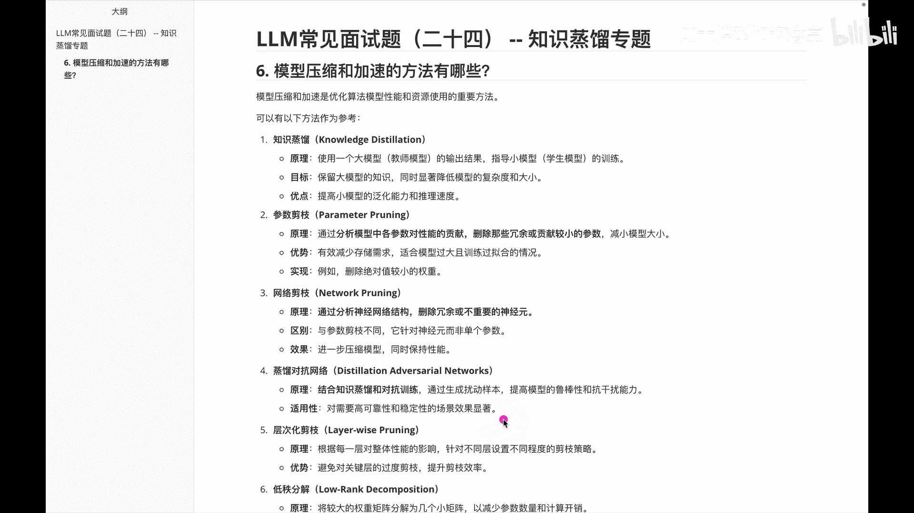
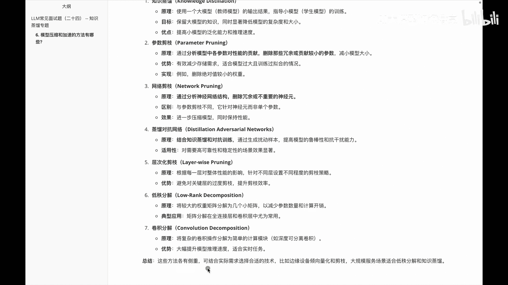
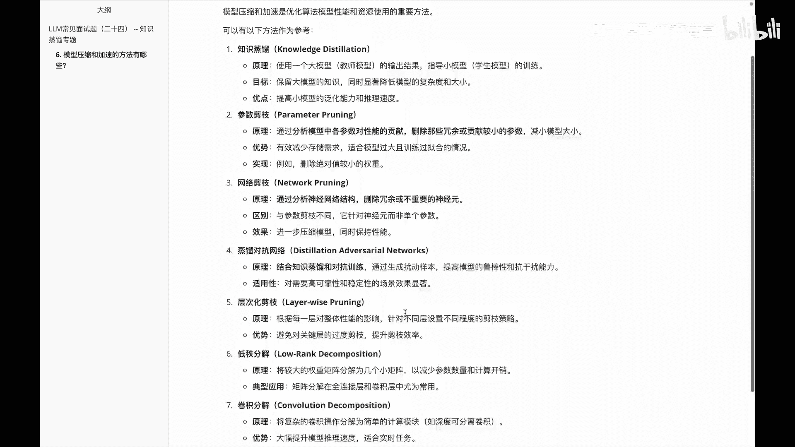
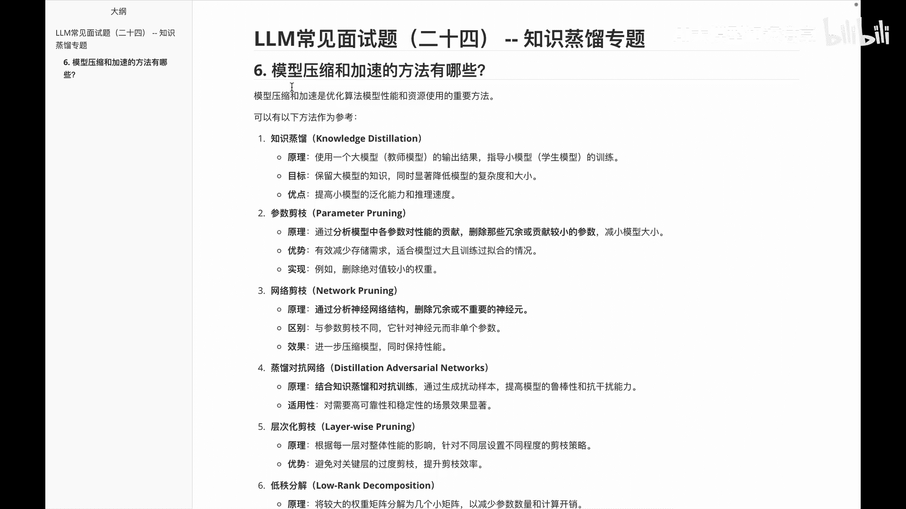

# P24：LLM基础常见面试题（二十四） -- 知识蒸馏专题 - 1.LLM基础常见面试题（二十四） -- 知识蒸馏专题 - AI大模型知识分享 - BV1UkiiYmEB9

哈喽各位，我们接下来看一下关于知识蒸馏专题中的啊，这么一道题叫模型压缩和加速的方法有哪些呢，这是我在知识蒸馏专题里面，给大家整理的最后一道面试题啊，然后这道题呢可能面试官有时候呃不会这么问。

他可能会问你说呃模型压缩和加速呢，你们会在工作里面怎么去用，那么前面我们说的知识蒸馏呢，它是里面的一种方法，除了知识蒸馏，还有很多大家具体用的时候呢啊，再基于我在这儿讲的内容，再去深入的了解各个知识点。

那我们来看一下具体里面的细节，首先呢第一个就是知识蒸馏，知识蒸馏到这，大家应该对这块的内容有一个深刻的理解了，它的原理呢就是使用一个大模型的输出结果，来指导小模型训练嘛，目标呢就是啊保留大模型的知识。

同时呢显著降低模型的一个复杂度和大小，然后他的优点是，可以提高小木屑的泛化能力和推理速度，这是关于第一个叫知识蒸馏，那我们看下第二个叫参数减值，它这个呢是通过啊分析模型中的各参数，对性能的贡献。

删除那些冗余或者贡献较小的参数，进而减小模型大小，然后他的优势是什么，是有效减少一个存储的需求，适合模型过大且训练过拟合的情况，注意啊是过拟合，然后他的实例呢是删除绝对值较小的一些权重。

第三个呢叫啊网络减脂，这个它是通过啊分析神经网络结构，删除冗余或者不重要的那些神经元，这个需要大家注意的是啊，和前面的参数减值不一样的是网络减值，这呢它其实是针对网络这边做的啊，并不是针对一个单个参数。

然后第四个啊关于叫啊蒸馏对抗网络，这个呢它是把知识蒸馏和对抗训练呢结合起来，然后提高模型的一个鲁棒性和抗干扰能力，然后它的适用性呢，是对一些高可靠性和稳定性的场景的，一些啊效果显著。

要求提升的时候会用到。

然后后面这几个啊，第五个呢是叫啊层次化减脂，这个呢是根据每一层对整体性能的影响，针对不同层设置不同程度的一个减值策略，然后这个是针对层次化做的内容，然后第六个呢叫啊低质分解，它这个呢主要是啊。

将较大的权重矩阵分解为几个小矩阵，进而呢减小一个参数量的数量和计算开销，典型的应用呢就是啊矩阵分解，在全连接层和卷积层的一个应用，然后第七个是关于卷积分解，这个是啊将复杂的一些卷积操作呢。

分解为简单的一些计算模块，比如深度可分离卷积，它的优势呢就是可以大幅提升模型的推理速度，适合一些实时任务，然后前面给大家讲的这些任务里面的话，这些方法各有侧重点啊，大家需要结合实际的一个需求。

然后去看一下使用哪个会更加优化一些。

然后我们在这个专题里面，主要给大家讲的其实是关于知识中流。

那么最后这么一道题里面，分别给大家介绍一下啊，就是关于模型压缩和加速，里面的其他的一些方法内容。

