# P29：LLM常见面试题（三十） -- 微调专题 - 1.LLM常见面试题（三十） -- 微调专题 - AI大模型知识分享 - BV1UkiiYmEB9

哈喽各位呃，我们接着看一下微调专题里面的一些内容，呃，上一个视频呢给大家讲了一下，关于微调里面的adapt类里面的一些相关内容，那么接下来几个视频呢，我会给大家介绍一下关于微调里面的另外一类。

就是prefix类里面的一些微调内容，在这个里边的话呃，基本内容就会如大家现在这个框里面，看到的东西一样，会介绍这些东西，那么呃首先给大家说一下关于这个啊，prefix类微调里边的话啊。

我会给大家分享的东西，第一块呢是讲一下关于prefix tuning，然后第二块啊PROPERTUNING，还有PETUNING和petuniv two。

然后里面呢会有一些延伸的面试题，除此之外呢啊还会给大家做一些啊整理的附录。

这个附录里边的话就是这几个分享的内容，他们论文发的一个时间以及论文地址啊，源码这块的一些链接。

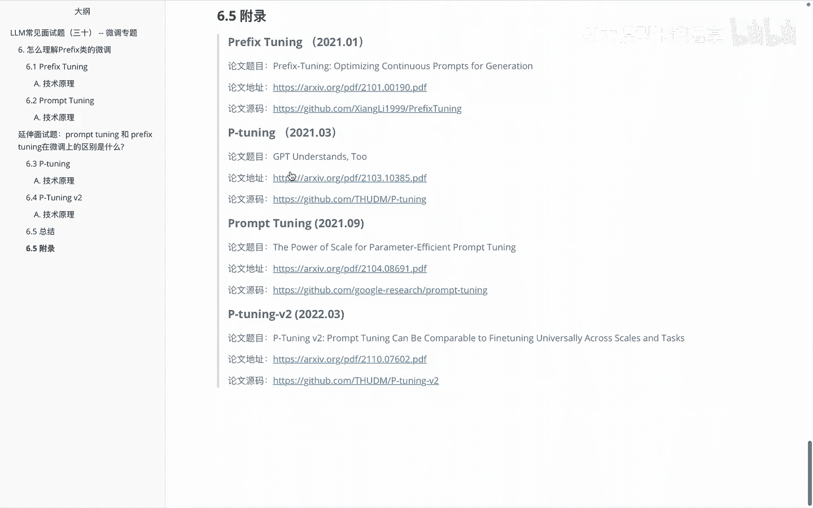

那我们啊进入正题来看一下关于这个呃，首先第一个内容就是怎么理解对应的这个。

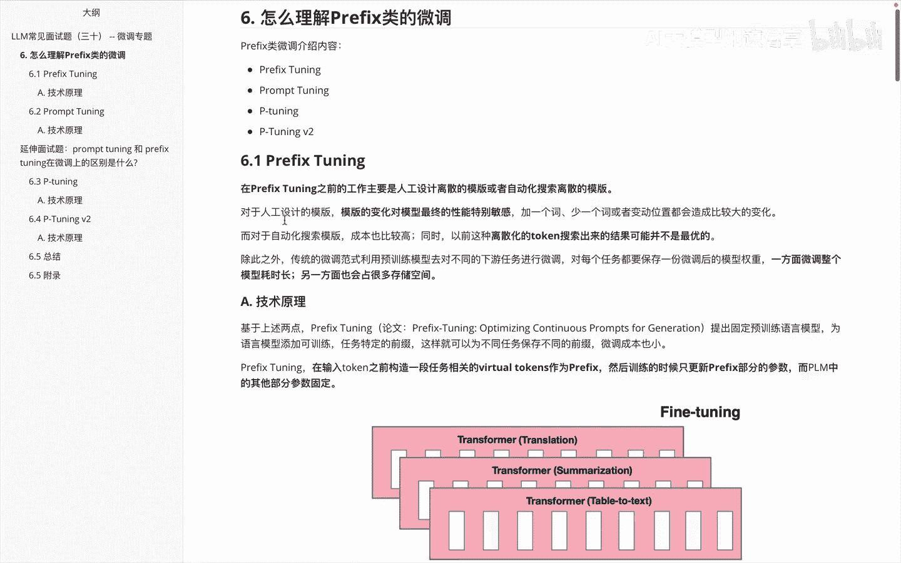

prefix类的微调，首先第一个呢看一下这个prefix tuning，这个里边的话呃，大家先理解一下，就是在这个prefix tunning之前呃，的工作主要做怎么做呢，他这其实主要是通过啊。

人工设计一些理想的模板，或者是呃自动化的搜索一些离散的模板，来完成我们这个里面的一些TUNNING，那么对于我们人工设计的模板来说的话，其实模板的变化对模型的最终性能的影响，特别敏感的。

例如加一个词或者少一个词或者变动位置，都会造成一些比较大的变化，大家如果体验过初期的XSGPT就会发现，比如你描述的一些东西呃，让它输出的时候呢，你描述方式不同，它就会给你输出的东西不同的。

甚至最近比如说大家在研究推理的时候呢，比如COP的思想啊，就告诉他，比如如果输出一个结果，让他一步一步的去思考，他就会输出的结果和你直接问一个问题，让他输出在一些复杂问题里面，输出答案是不一样的。

这块呢其实就是啊在这个里面说的一些啊问题，那好呃，除此之外啊，就是对于一些自动化的搜索模板，成本也是比较高的，呃以前的这种离散化的通过搜索出来的结果呢，可能并不是我们想要的最优的。

那么呃还有一个点大家需要注意的就是啊，传统的微调范式，利用预训练模型时，对不同的下游任务进行微调时候啊，对每个任务都要保存一份微调后的模型的权重，比如说啊我们啊翻译啊。

做微调需要保存一个全量微调之后的一个结果，然后如果我们再做一个啊summary，就是总结，还有需要保存一份，那么这个里边它就是需要，你在不同任务里面的话，做微调耗时比较长，另外一方面呢。

就是说每个微调之后的结果都要去存储，它要占的空间比较多，那基于上面说的这一堆的问题，然后呃作者提出了一个优化的方法叫PREFETUNING，具体来看一下他这边是怎么做的呢。

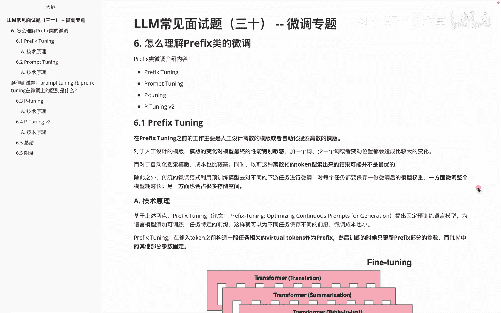

我们说呃prefix tuning，他其实提出的思想叫固定预训练与语言模型，为这个语言模型呢添加可训练啊，任务特定的一些前缀，这样呢就可以为不同任务呢保存不同的前缀。

然后我们的整个大模型的这个transformer，这块结构并不需要去做一些修改，具体而言就是啊prefix，tony呢在输入token之前会构造一段相关的任务。

叫啊虚拟的token叫virtual tokens，作为它的prefix，然后呢在训练的时候呢，我们只更新啊这一段前缀的参数，而我们说对呢，这个大圆模型它的一些其他部分参数是固定的。

就如现在大家看到的这幅图里面的绘制一样，上半部分呢是啊FTUNING就是啊全参微调，而下半部分这边呢其实就是我们做prefix tuning，他这边的一个结果，大家可以看到啊，上面这部分里面的啊。

先说这个颜色，红色这部分呢，其实它表示的是我们可以更新的一些，微调的一些参数的内容，而灰色部分呢表示的是，我这边不需要做微调的内容，那我们看一下上面这块，比如说第一个啊做翻译。

我这边就需要更新所有的结果，做这个summary，就是我这边做总结依旧是一样，然后我再做一个，比如说table to text，就是我这边呃数据库或者数据表对文本的转换，他这边也需要做一次微调。

而下面这个任务他就并不需要这么做了，他这边只是加了一些前缀，大家会发现后面这部分并没有做一些更改，而我只针对前面这部分呢做一些啊调整，就能使得我整体这块的任务，适合我们后面其他的一些内容。

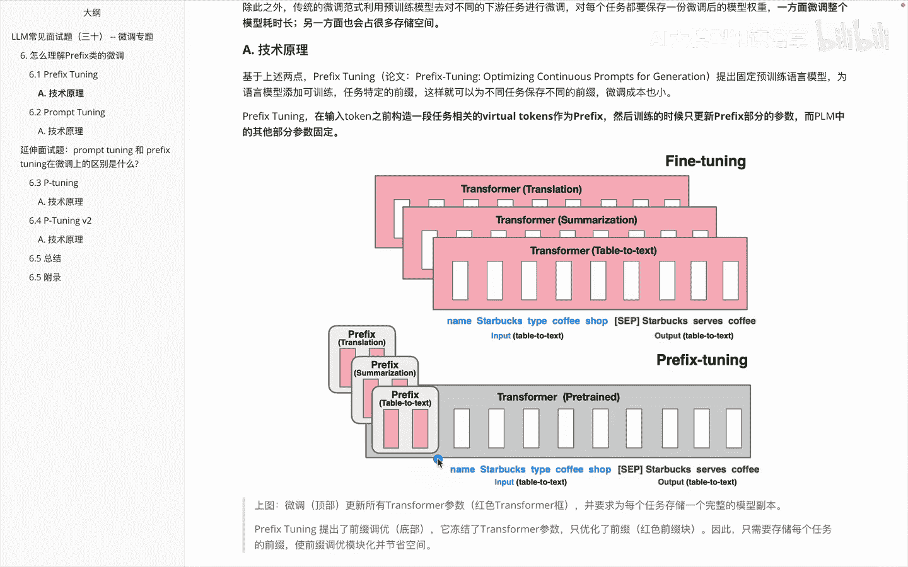

这是啊，关于咱们说的这个prefix tuning里边的一些思想。

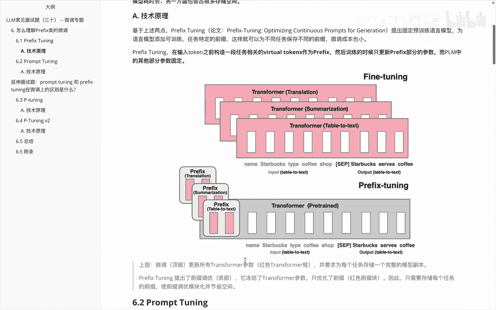

那理解了这个prefix tuning之后呢，我们接着看一下另外一块东西，就是prefix tuning，他这边就OK了吗，是不是还有些其他的问题依旧需要优化呢。

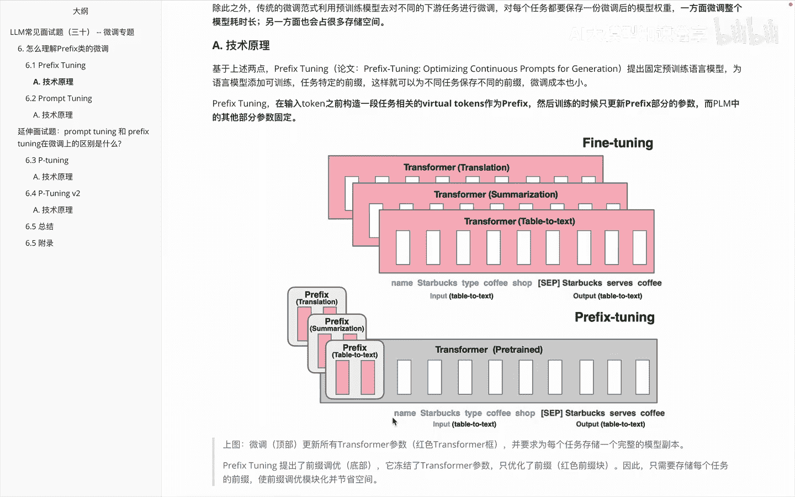

基于此，我们来看第二个叫PROMPTUNING，这个呃PROTI呢他其实呃解决的一些问题，或者说他是基于种什么样的背景，来提出他的这个思想的，前面两个呢介绍了。

和我们在prefix tuning里面说的一样，就是呃我们大模型做全量微调，它的一个开销和部署成本都比较高，还有呢就是我们如果用一些离散的PROT，成本比较高，效果也不太好。

这两个呢和prefix tuning一样的，第三个这边呢其实是他对prefix tuning的一个优化，它说之前的preface tuning呢，在更新参数的时候呢有些复杂了。

我需要把这些啊参数呢进一步做简化，那怎么做简化呢，我们来看一下，它是通过啊反向传播来更新参数，学习的这个proper，这个proper呢并不是人工设计的，同时去冻结模型的一个原始权重。

只训练这个prop的参数，训练完成以后呢，啊用同一个模型可以做多任务处理，大家注意啊，在这个里边其实是和我们前面的这个prefix tuning，不一样。

大家记得前面的prefix tuning呢是在更新哪块呢。

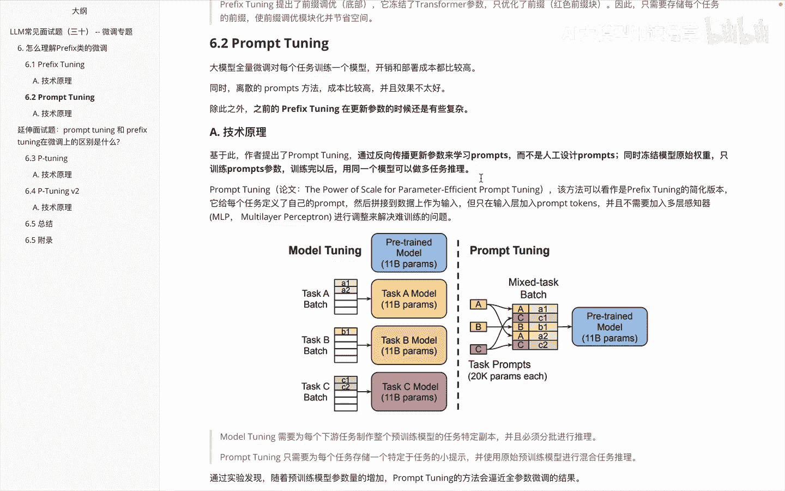

这是更新我的transformer，前面加了一些embedding的东西。

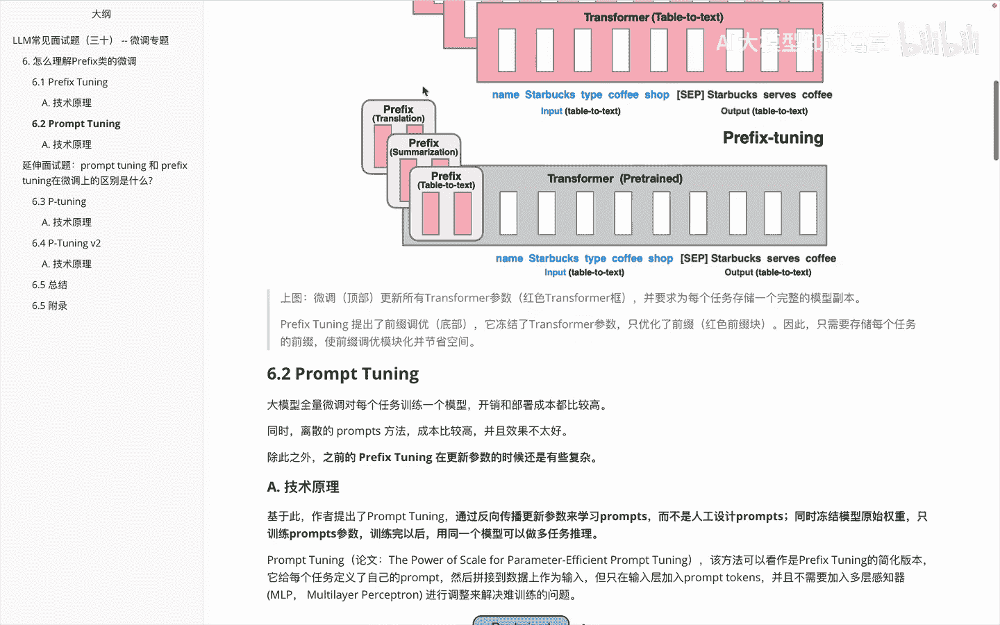

而props这边呢，它其实是根据这些提示props相关内容，我们接着看，说这个方法呢可以看作是啊，prefix tuning的一个简化版本，它呢呃给每个任务定义了自己的proper。

然后拼接到数据上作为输入，但只在输入层加入PROPERTOKENS，并且不需要加入这个多层感知器来调节，解决训练难的一个问题啊，这块就是和前面的prefix student的一个区别啊。

那就如啊作者在这个原文里面放的这张图一样，大家会发现啊，左边这边呢其实model tuning，它呢需要为每个下午任务，制定整个训练模型的一个特定任务，并且呢必须做一个分批次的推理。

大家会发现比如说呃任务A这边做一次推理，任务B啊，做一次任务C也是，那么property train这边的话，就是，我只需要为每个任务存储一个，特定于任务的小提示，并使用原始训练模型进行混合。

任务推理会发现哎我这边整体放一个，而我需要做的是啊。

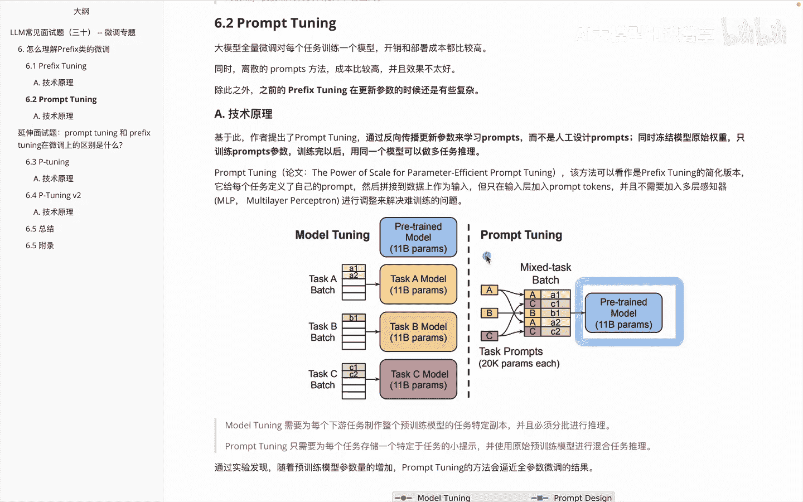

前面这块的一些调整就OK。

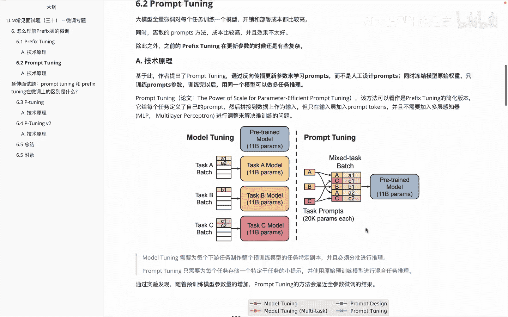

下面这个东西呢是给大家展示了一个什么呢，就是呃做这个PROPERTUNING啊，和其他的一些方法比起来，他们的一个对比效果，大家看这个图里边啊，先看这个纵坐标轴。

这个呢啊是一个super glue的一个啊得分，这个分呢是越高越好，而横轴这边呢表示的也是模型的参数，那么这几条线分别代表什么意思呢，先看这条蓝线啊，这条蓝线因为啊比较明显嘛。

它呢是直接通过这种PROT，就是我直接设计PROT来表现的一个结果，那再分别看一下下面这几条线，这条线呢啊，我们会发现它呢是通过叫啊model tuning，然后呢是一个多任务的发现了吧。

而这条红色的线呢它表的是我做一个model tuning，并没有设置多任务哦，然后这个呢是一个property tning，会发现整体这几幅图呢啊，这几条线这条线啊就很低嘛。

所以自然而它就是直接通过prod去设计，会发现效果确实不行，那么这几条线里面大家会发现啊，前面这边做的时候呢，会在相同参数量级里面，确实我们的这个啊PROPERTUNING会低一些，但是随着参数量变大。

到了这块的时候呢，其实PROTOTUNING和model tuning，基本上达到一个啊差不多的效果，这是啊在这幅图里边啊，作者原文想要表述的内容，讲完这个之后呢。

大家对啊property ta应该有一个基本的认识，那在面试里面的话，有时候别人还会这么问啊。

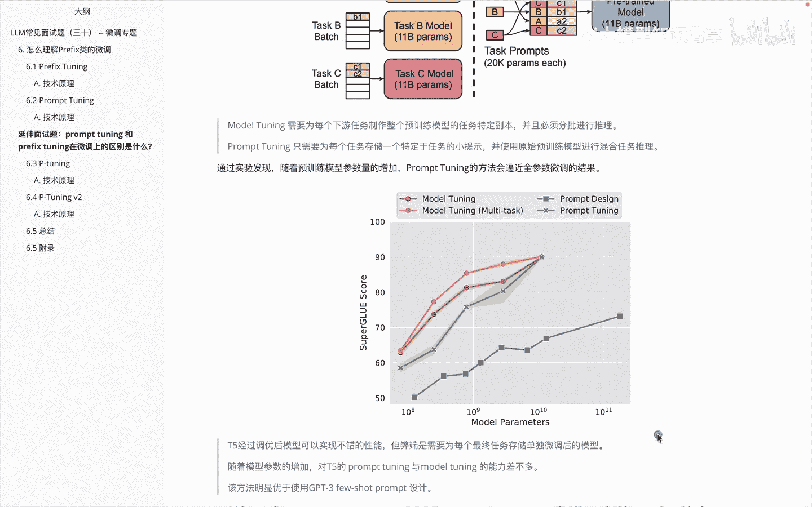

就是说嗯看这叫property tuning和prefix tuning，在微调上呢啊他们有什么区别呢，这个相当于前面两个概念理解了之后呃，可能有时候面试官会直接这么问的，那我们来看一下。

在这个里边说啊，property tuning和prefix tuning，它都是啊自然语言处理任务中，对预训练模型进行微调的方法啊，这个大家自然而然知道的，但是它们在实践的细节和应用场景上是不同的。

它的区别呢主要来自于下面的这四方面，第一方面啊是参数跟进的位置，我们知道说啊property tuning，这边通常只在啊输入层添加参数，而prefix tiny呢是在每一层都添加了参数。

第二个啊参数的数量，prefix tony呢，它通常要比啊property tony呢参数要学的更多一些，是因为他为模型的每一层都会添加前缀，第三个是啊适应的任务，说PROPERTUNITY这边呢。

它其实更多的会适用于一些分类任务，而prefix tuning它里边适用于一些啊生成任务，因为它可以在不同层次上调整的，模型的行为会更彻底一些嘛，嗯然后第四个是啊训练效率，训练效率这边的话。

因为property train他这边参数更少一些，所以他的训练效率呢自然而会更高一些嘛，嗯OK这是咱们给大家讲的关于啊整体里边呃，呃我们第一个内容想给大家分享的就是关于啊，prefix类微调里面的呃。

前两个概念一个是啊prefix tuning，另外一个呢是啊，PROFTUNING以及property tuning和prefix tuning。

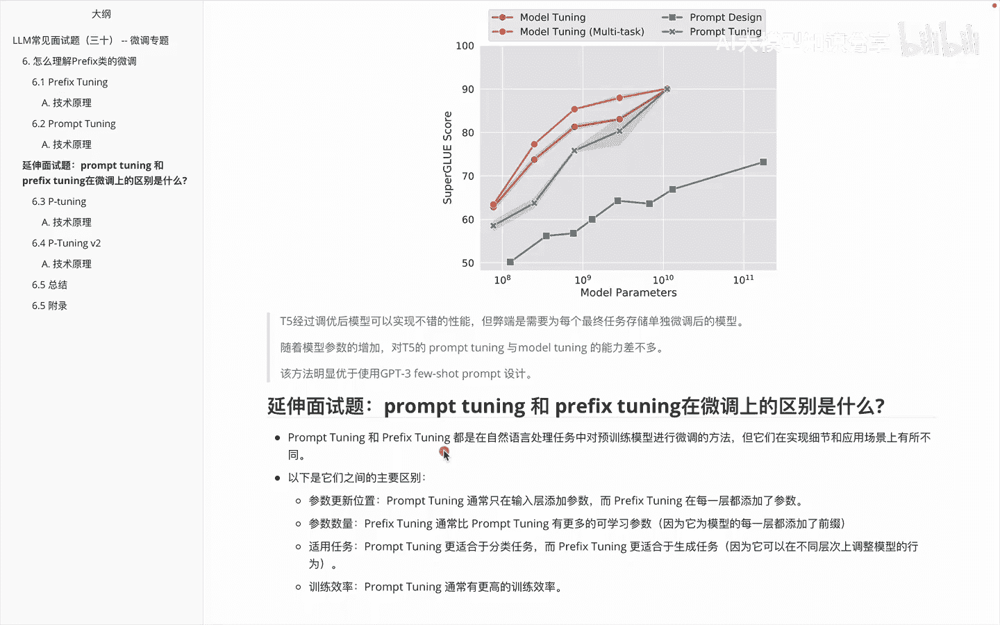