# P30：LLM常见面试题（三十一） -- 微调专题 - 1.LLM常见面试题（三十一） -- 微调专题 - AI大模型知识分享 - BV1UkiiYmEB9

在上一个视频呢给大家分享的是啊，微调专题里边关于prefix类微调的，prefix tuning和PROPERTUNING，那我们在这个视频里面啊，看一下PETI和petuniv two。

他们是什么意思，以及他们的些原理。

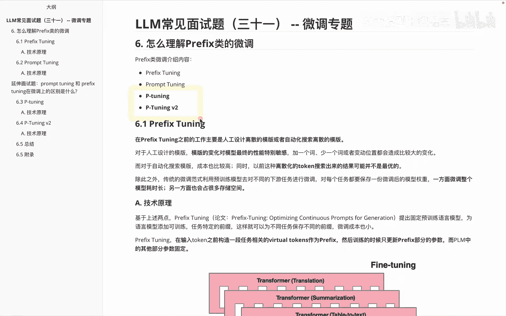

首先我们看一下关于PETAPETI他的这个提出啊，其实也是为了解决之前提到的两个问题啊，第一个就是啊大模型的proper构造方法，严重影响额下游的一个效果，这块啊前面也给大家说过，在这就不再赘述。

第二个呢就是呃，那种自动化搜索模板的工作成本比较高，而且那些离散化的token呢啊并不是最优的，导致性能呢可能不稳定，这两个问题其实我们在第一块啊，prefix tuning里面就已经给大家也说过啊。

那我们看一下PETUNING这边他又是怎么做的呢，啊基于前面那个问题呢，啊，作者在这设计了一种连续可微的，一些虚拟的token，这个方法呢是把啊，proper转化为可以学习的embedding层。

注意啊是把PROMP转化为可以学习的embedding层，并对这些啊property bending呢进行一词的处理，具体的区别大家可以看一下下面这个截图，这块里面的话啊。

他这个例子是啊问英国的首都啊是哪，然后这个里边不同的这个颜色区域，其中这个蓝色呢表示的是一个啊上下文，然后呢对应的这个mask，红色区域就是我们说呃想推出的结果嘛，而橙色区域就是它的些proper。

那这两幅图的区别在哪儿呢，其实我们说A这幅图呢，你会发现这个里边它是叫啊property generator，就是他这边的话是通过这些proper生成，接受一些离散的奖励来做一些整体内容了。

这个里面不是接受一些啊reward吗，那会发现右边这份PETUNING，它里边怎么做呢，大家会发现这个里面它从啊我的property生成，变成了property encoder。

就是我这边做一些啊encoder的方式，那此时的话我们就会发现，把这种方式给加入进来之后呢，因为他这边变成一些连续的嘛，所以就是可微的一种方式来加入进来。

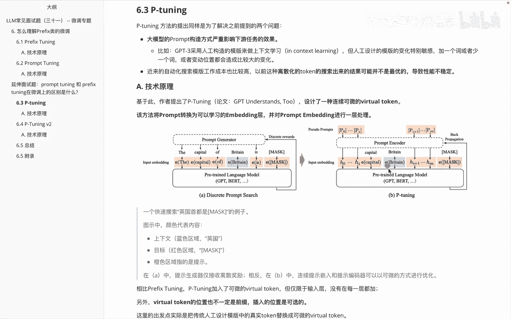

然后我再做一些啊反馈，相比于这个啊prefect tuning，PETI呢啊加入了一些可微的这种啊虚拟的token，但是呢仅限于在输入层，并没有在每一词都加，另外呢就是这些啊virtual token。

它的位置呢也不一定是前缀，就是它的插入位置是可选的，也可能是前面的，也可能是中间的啊，这块里面的实际出发点，就是把传统的人工设计模板中的一些真实token，替换为一些可微的一些VTUTOKEN。

这是呃关于PETUNI的他的一个思维，那么讲完pony啊。

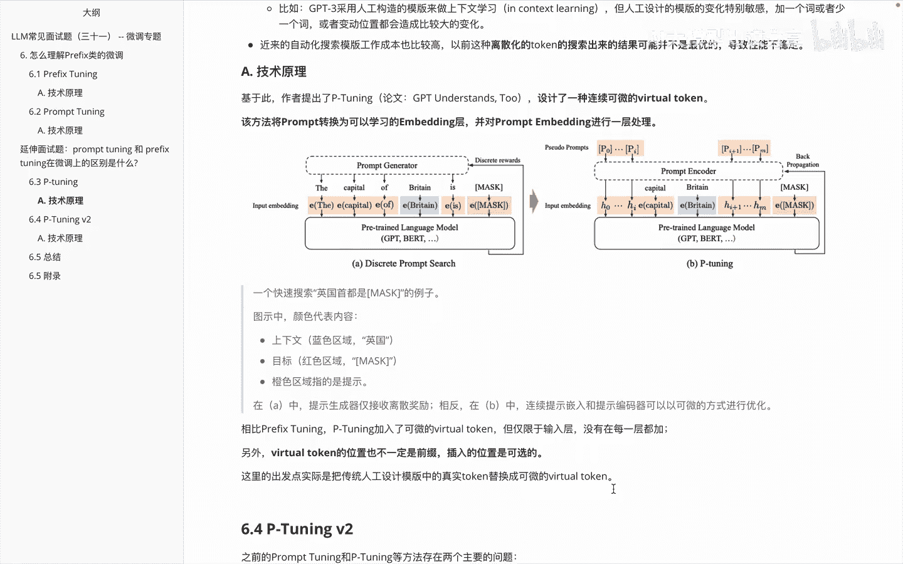

pti v two这边的话说啊，之前的这个啊PROPERTURING还是PETA，他们其实都存在两个主要问题，第一个就是缺乏模型的一个参数，规模和任务的通用性，分别看一下，首先说啊缺乏这个规模的通用性。

大家会发现啊，我在前面给大家讲到的。

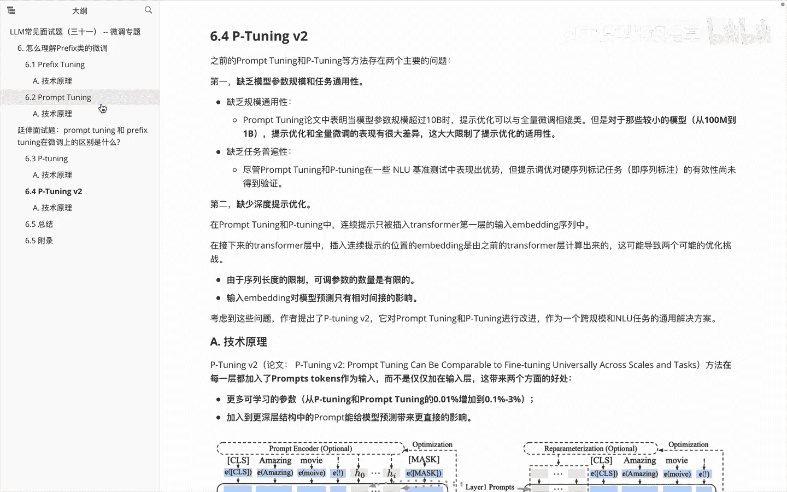

关于这个啊，property tuning里面其实分享了一个图，就这个图在这个图里面会发现呃，前面里边只有在这个位置的时候才达到说啊，我的效果不错，但是今参数量比较小的时候。

我才出它的效果是不怎么OK的，那么啊petuniv two就是说啊。

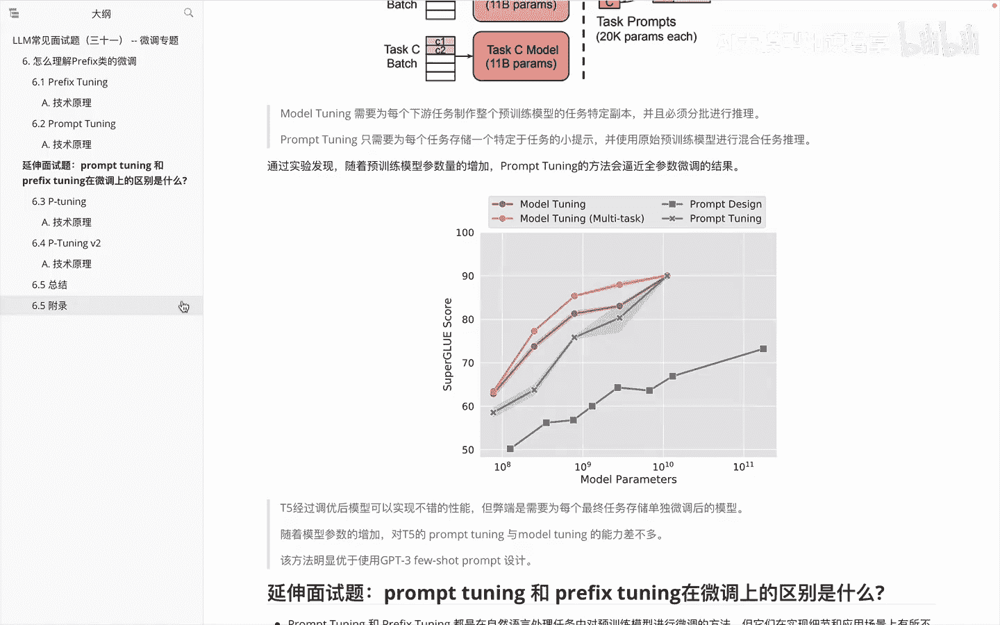

我想把这部分给解决了，在这里边你会发现说啊PROTUNING呢在论文中表明，当啊模型的参数规模超过十币的时候，它的提示优化可以与全量微调相媲美，但是对于一些啊较小规模的，比如从100兆到1B的。

它的提示优化和全量微调的表现，就有很大的差异，这个限制了提示优化的一个适用性，第二就是缺乏任务，这个普遍性就是property tuning和PETONY呢，在一些啊自然语言理解的这种任务上。

他的表现是OK的，但是对一些啊序列标注任务，它的效果呢就不行了，这是第一个问题，第二个问题呢就是啊缺少一些深度的提示优化，这个怎么理解呢，就是说啊property tuning和PTI呢，它的连续提。

连续提示只是被插入了在transformer里面的，第一层的embedding里面的序列中，但是在接下来的这些transformer层中，它的这个插入连续提示的位置呢，其实是由我之前的词儿来计算的啊。

这个应该也比较好理解，大家知道啊，transformer这边，它其实是通过一层一层的这种串联起来的，计算的嘛，那么啊后面一层的经过，是通过前面一层的计算内容来输入进去，来进而进行计算的。

那此时的话就是说，我由于这个序列的长度的限制，它可以调的参数的就是有限的，另外呢就是说我的输入embedding，对模型的预测只有相对近的影响，因为我这边是后面一层通过前面一层来导出，进一步来影响的嘛。

考虑到前面这些问题呢。

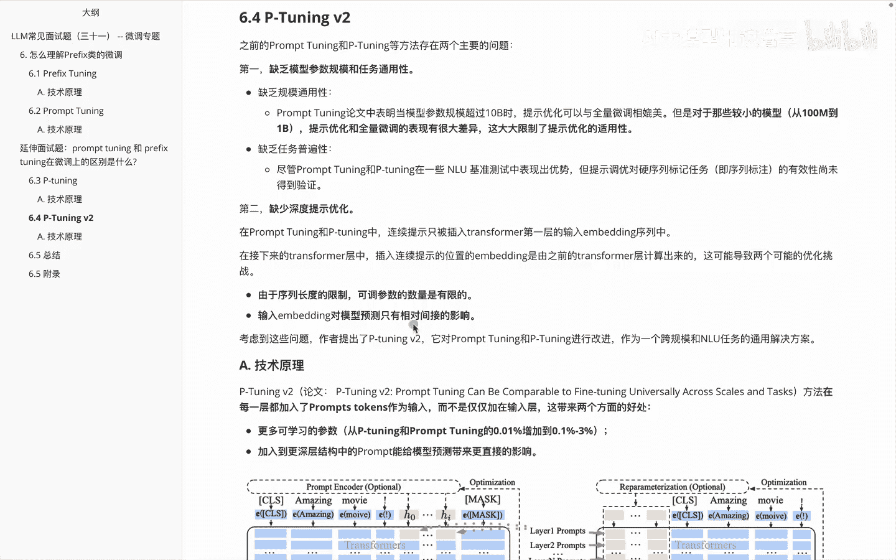

啊作者就对这些内容做了一些优化，那我们来看一下具体的优化内容。

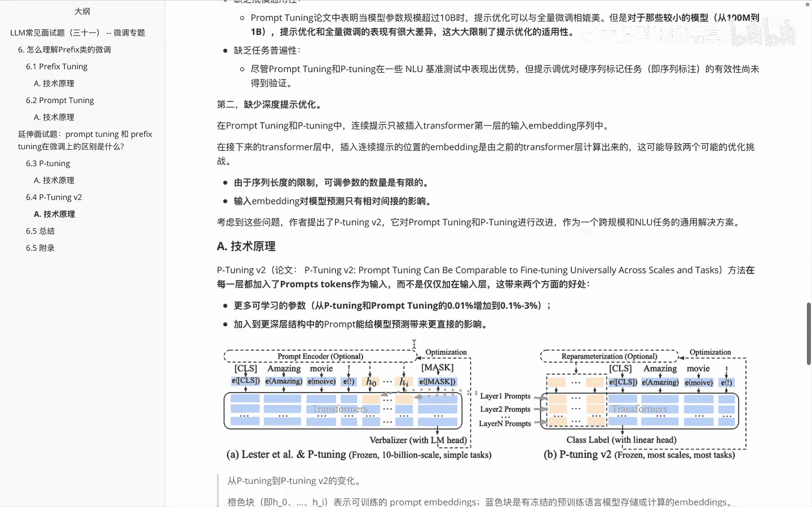

啧关于这个petuniv two啊，就是他其实是在每一层里面都加入这个，Prototokens，其实这块也比较好理解，大家想想只在第一层加加了之后呢，后面一层只能通过第一层的里边的计算的结果。

来进行影响，那说我们是不是可以在每一词儿都进行加入呢，这个思路是不是非常的啊顺畅好，那通过这种方式呢，你会发现我们加入进来参数多，自然而然可以学习的内容就多了嘛，所以就是说会发现他的学习参数。

从PETUNITY和property，tuning里面的0。01%，增加到了0。1%到3%，另外一块就是加入到更深层结构中的prompt，能给预测结果带来一些比较直接的影响，那下面这个图就是呃。

说PTON和PROTONING和pton v two他们俩一个区别，大家会发现这边儿这边儿你会发现它的影响，就是这个橙色块啊，只有这一部分内容，而后面这块比如说第二层，但后面的几层就没法做直接的影响了。

而在petuniv two里边，你会发现我的第一层，第二层以及第2N层，他这边其实都是可以啊影响的。

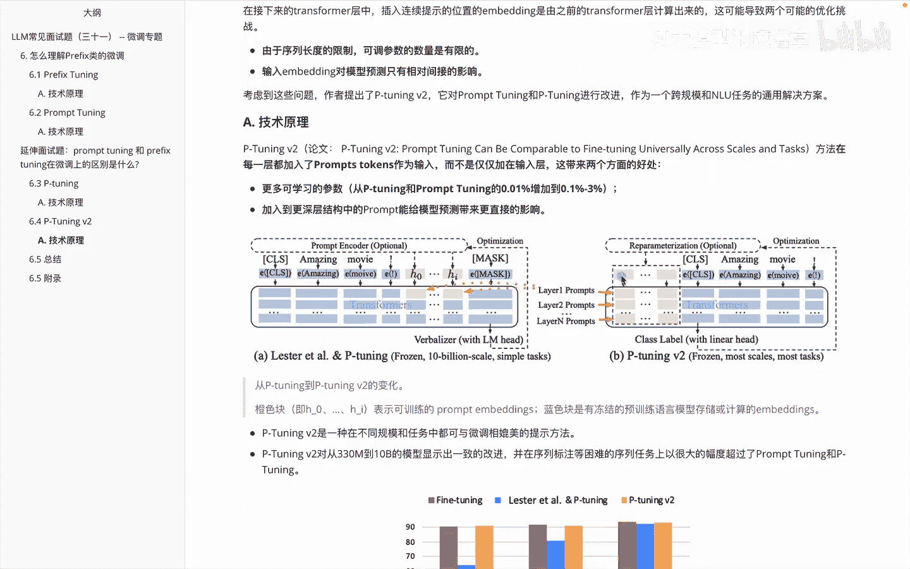

这是他设计的一个实验的一个内容，那么看完实验再看一下它这边的一个整体的啊。

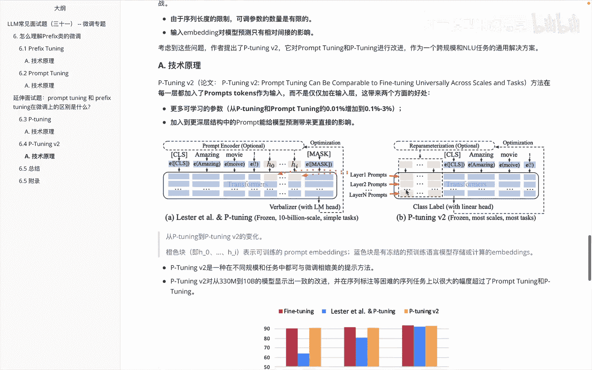

就是它这边必在不同的模型里面，它们的一个结果吧，我们看一下说平均维pti v two呢是啊，一种在不同规模的任务中，都可以与微调相媲美的提示方法，下面这个图里面就会发现到300。

30兆到10B它们的一个结果，其中这个红色的是a fat tuning，这个呢是啊，不管是在330兆，还是在两个币以及10B模型里面，它们的效能都是啊差不多的，这是啊关于这块里面petri v two。

他提出优化方法以及他的一个效果的展现啧，那讲到这块之后呢，呃就给大家把关于呃，prefix类里边想分享的内容都分享完了，分别给大家讲到了啊，Prefix tunning，Property，Tuning。

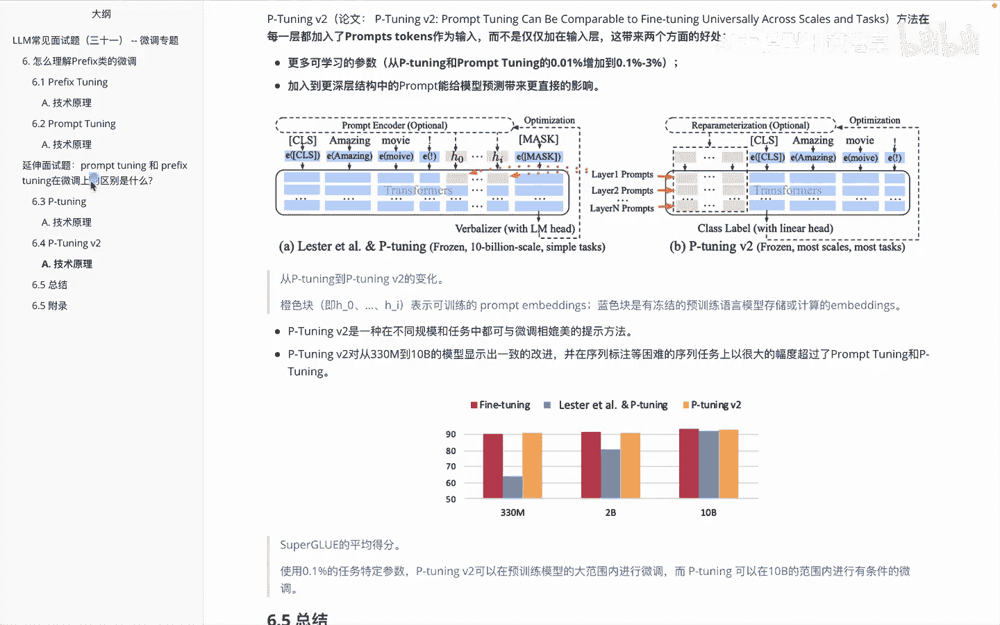

那么我们看一下这里边，它们一个总结的一个区别。

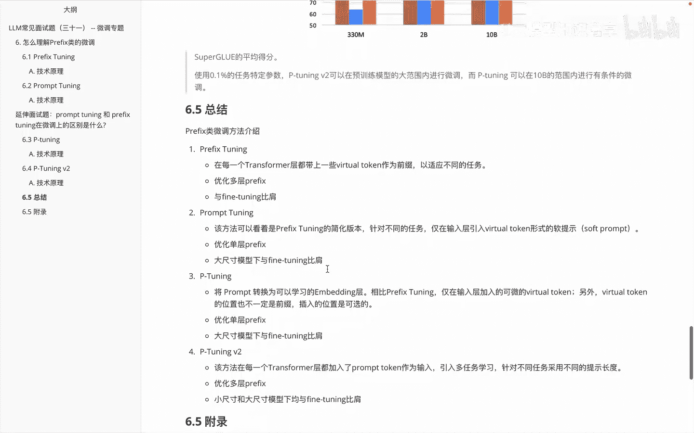

第一块是关于这个啊，Prefix tuning，它呢是啊，在每一个transformer层都带上一个虚拟的token，作为前缀，以适应不同的任务，它是会优化多层的一个prefix。

然后它的结果呢是和啊FTUNING差不多的，然后第二个是PROPERTUNING，这个呢可以看看的是什么呢，是啊prefix tuning一个简化版本，它呢是枕在仅仅在输入层引入了这个啊。

虚拟的token作为一个啊软提示，它仅会优化单词的prefix，在啊大尺寸模型下和FETI呢是差不多的，第三个啊讲了PETI，PETUNITY呢是把proper转化为可以学习的一个。

embedding的层，诚实这个词呢是可以可微的，然后啊virtue twin的位置也不一定是前缀，它可能是啊中间后面都有可能的，然后他也是优化单层的prefix。

然后在啊大模型的尺寸下与FTON呢是差不多的，然后第四个平均0v two，这个方法呢是在每一个transformer层，都加入这个啊property trance作为输入，它引入多任务学习。

针对不同的任务采用不同的提示长度，然后它也是优化了多层的prefix，同时不管是在小尺寸模型还是大尺寸模型，都和啊FTON的效果是表现差不多的，这是啊关于这几类它们的一个区别。

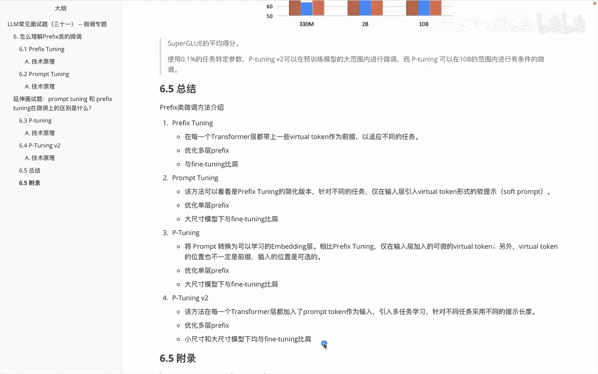

最后呢给大家啊放了一个附录，这个附录里边的话就是呃我整理的一个这几个。

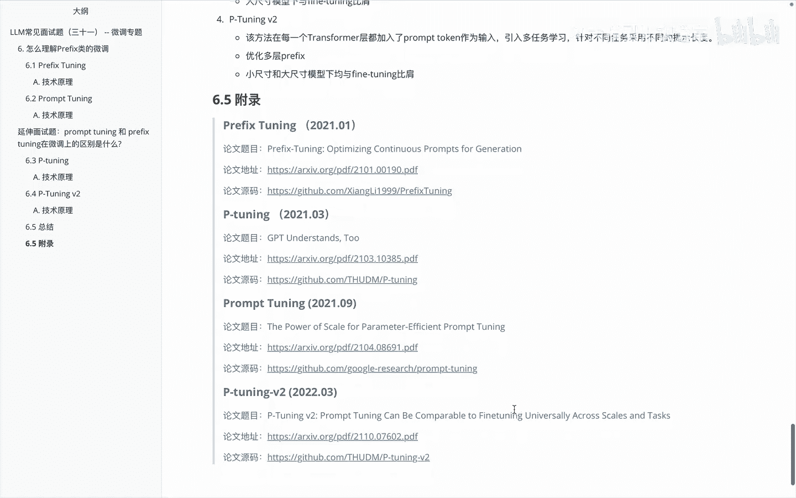

它们分别对应的一个呃论文的地址，以及论文的源码这块的一个内容，这是啊给大家分享的。

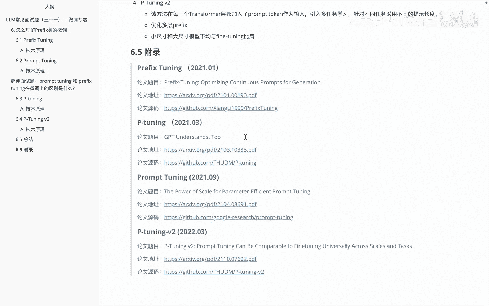