# P31：LLM常见面试题（三十二） -- 微调专题 - 1.LLM常见面试题（三十二） -- 微调专题 - AI大模型知识分享 - BV1UkiiYmEB9

Hello，各位我们接着进入微调专题，从这个视频开始呢，我们要介绍啊关于LAUER的一些类的微调了，那啊这个视频里面主要给大家讲的是，关于这个LAUN这块的啊，具体内容分别会见到什么是lawyer。

以及layer的思路是什么，还有lower的特点是什么，以及啊如果说一句话描述LAURA，那么他这边该怎么总结，那首先啊看第一个就是到底什么是lower呢，lower这边呢。

那英文全称呢其实law rock adaption of large language models，所以一翻译过来就是啊，大语言模型的一个低阶适应，这个呢是啊。

微软的研究人员提出来一个为了大模型微调的，一项技术基本介绍，就是通过啊低质分解来模拟参数的一个改变量，从而以极小的参数量来实现大模型的一个，间接训练，下面这个图呢是啊，他的原论文里边显示的一个内容。

大家啊先初步看一下，后面会做一个详细的介绍，我们会发现在这个里面，左边这个蓝色部分呢其实是一个啊，就是已经预设好预训练好的权重WFW是W吧，然后这边呢其实是啊lower，这边会加入一些新的东西。

他呢其实会加入两个矩阵，一个是A矩阵，一个呢是B矩阵，但这个图这么一看的话有点抽象，然后我在嗯找了些资料。

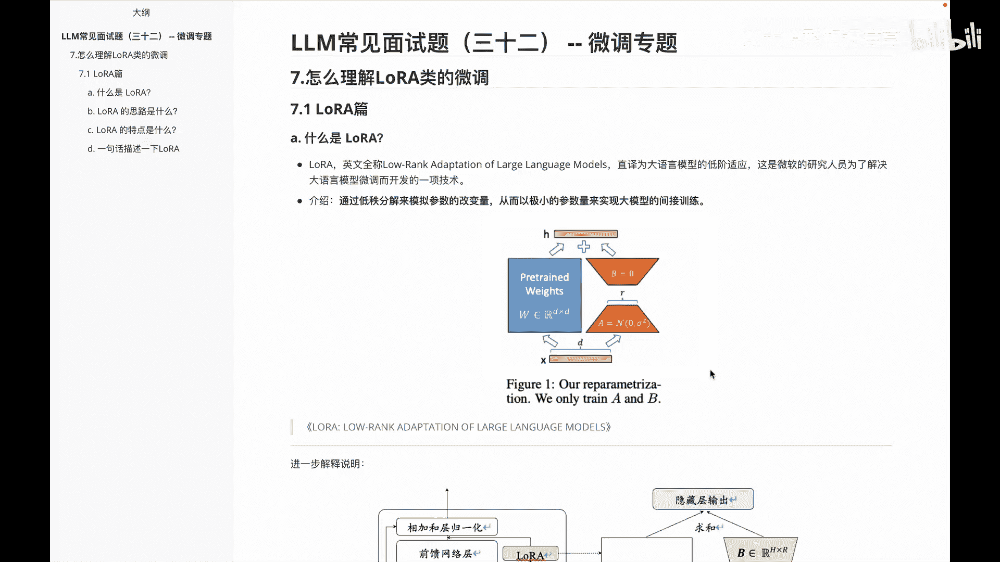

有有一本书呢叫l m book，然后在这本书里面的话。

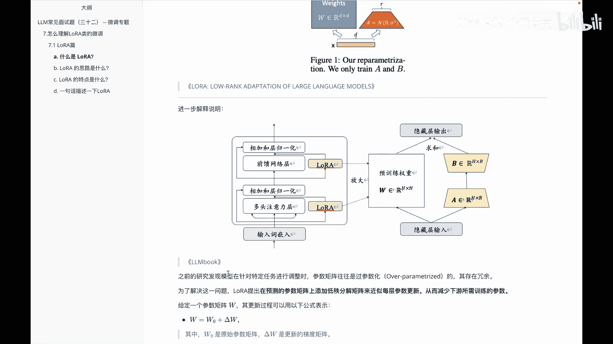

他针对这个lawyer呢做了一些介绍，我把它啊摘录过来给大家做一个介绍。

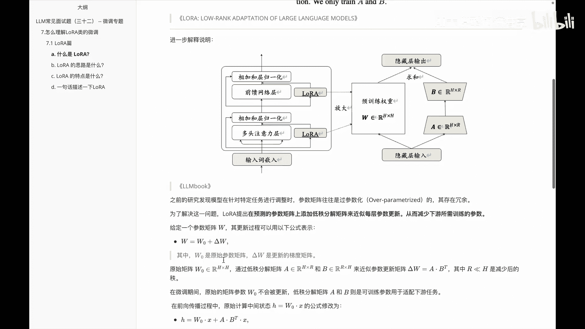

啧，那么额我们首先看一下这个图里面具体的说明，在这个图里面呢，大家会发现左边这部分其实啊就是他这边啊，transformer的一个基本结构，比如说啊输入的词切入，然后进入一个啊多头的注意力。

然后再加入一个啊相加的合成的规划，然后再做一个前馈神经的前馈网络层，然后再做一个相加和的层规划，那么在哪会加入lower呢，啊就是在这个区域会给它加入lawyer，然后做一个输入。

包括也有可能会在这块的区域，然后再加入一个LAURA，那么这个lower具体放大呢。

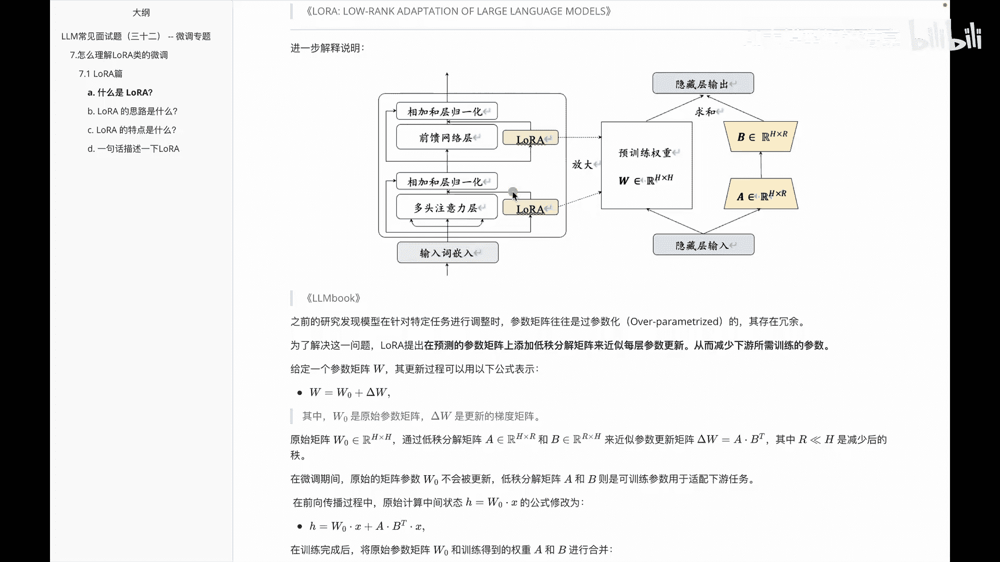

就是啊刚刚咱们看到原论文里面那个容会发现。

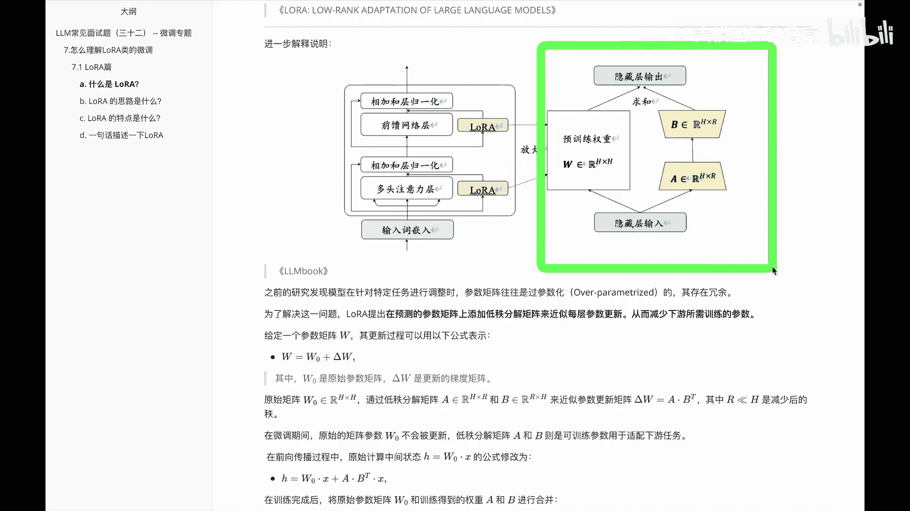

比如说在这有个隐藏层的输入，这边部分是啊预训练的一个权重，他呢并不会做改变，但是右边这部分，A和B这两个矩阵就会发生改变的，那么他们俩之间的最后做一个求和，就是隐藏层的一个总体输出。

然后具体这块里面的一个啊细节，我们来看一下下面这段的一个文字介绍，就说呃之前的研究呢啊，发现模型在针对特定任务进行微调的时候呢，参数矩阵往往都是一个叫什么呢，过参数化的就是啊存在一些冗余的问题。

为了解决这个问题呢，啊LAURA在这篇文章里边，他就提出，在预测的一些参数矩阵上添加低质分解矩阵，来近似每层的一个参数勾心，从而呢减少下游所需的一些训练的参数，然后呢我们给定一个参数的矩阵W。

然后更新下面这个表示，此时呢就会发现变成这么一个公式了，就是W等于上W01个德尔塔W，然后W0呢是一个原始的参数矩阵，而德尔塔W呢是更新的一个梯度矩阵，然后在原始的居住矩阵里面的话，我比如说我们W0呢。

就等于上一个H乘H的这么一个矩阵，那么这个H乘H矩阵呢啊，我们可以给他做一个低质的一个矩阵分解，怎么分解呢，分解成A和B两个矩阵，其中A呢是H乘R，B呢是一个R乘H。

然后通过这个来近似的更新这个参数的矩阵，那么我们就可以把它表示成，比如说啊这个德尔塔W等于A乘以B的转置，那么在这个里面的话，矩阵里边H和R有什么关系呢，我们说R呢是远小于H的。

这样就会发现它就变成一个就是类似梯形嘛，不过这个梯形呢，大家把它想的就是这条线是一个非常诶，这条线就是这条线啧是一个非常非常陡的线，就是这么过来，然后他就会变成一个比较小的一个啊矩阵，然后呢再从大小。

然后再小大这样一个过程，那么在微小的期间里边的话，原始的这个矩阵参数呢啊W0并不会被更新，然后D质分解的矩阵A和B，然后他呢是需要去做一些啊训练，来适配我们的下游任务的。

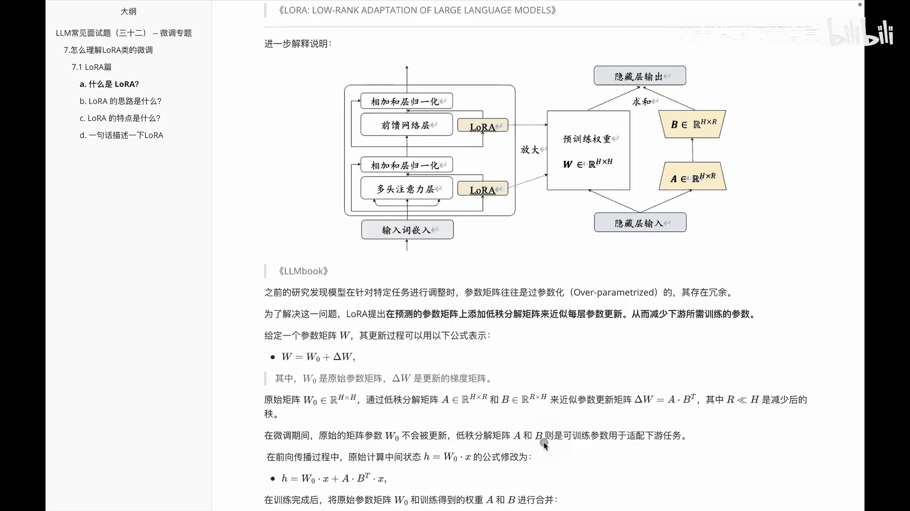

接着往下看一下啊，下面这块东西会发现说啊在前向传播过程中呢，啊原始计算中间状态H等于上一个啊W乘X，那么这公式呢，呃在经过我们下上面这块公式进一步做调整，会变成说H就是这个隐藏层吗，等于上什么呢。

W0乘以X加上一个A乘以B的转置，乘以X当然A乘以B转置呢，我们说在这里面算过是德尔塔，WOK整体有了这块之后呢，说在训练完了之后呢，啊，把原始的这些参数矩阵W0和训练得到的权重，A和B进行合并之后呢。

就会发现等于什么呢，等于RW等于上一个W0，加上一个A乘以B的转置，这是整体这块的一个变化过程。

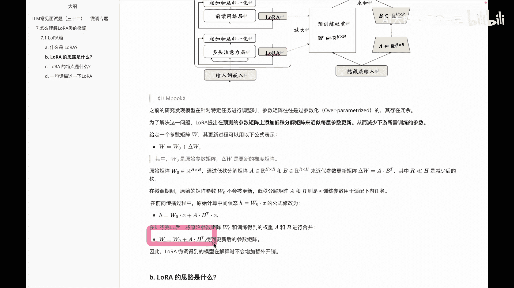

那经过啊这块的啊内容介绍，大家呢应该对上面这幅图里面的内容。

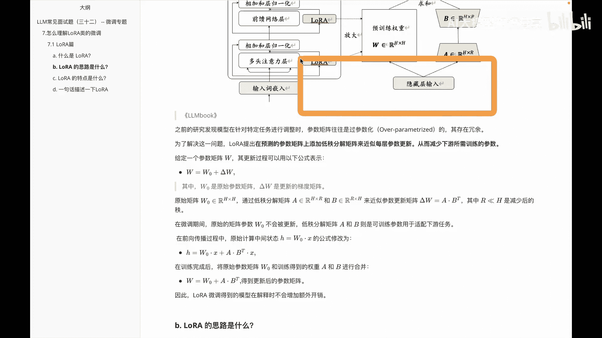

有一个啊基本的了解。

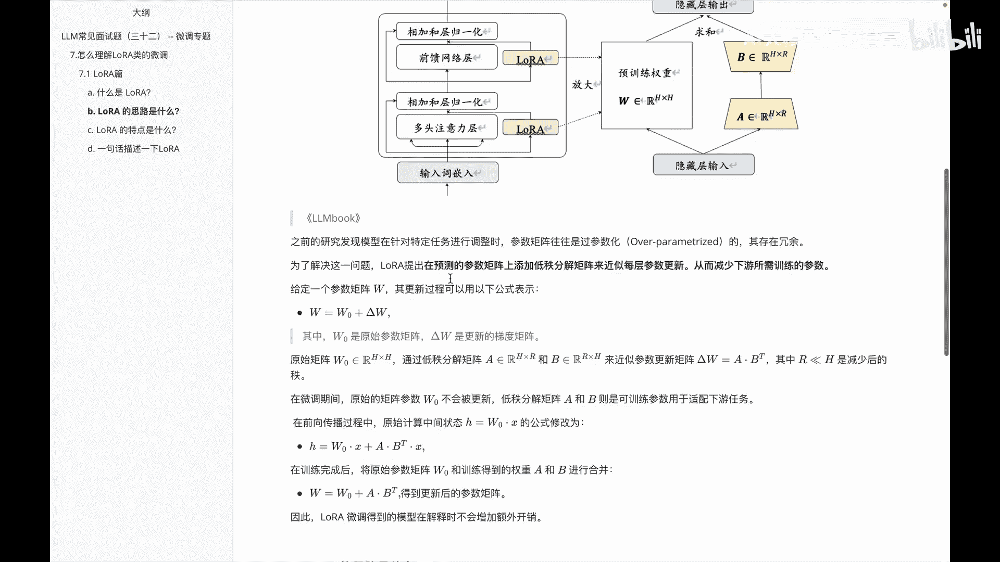

到这大家应该知道一下，或者说基本有些思维知道说我们是ALLOWER了。

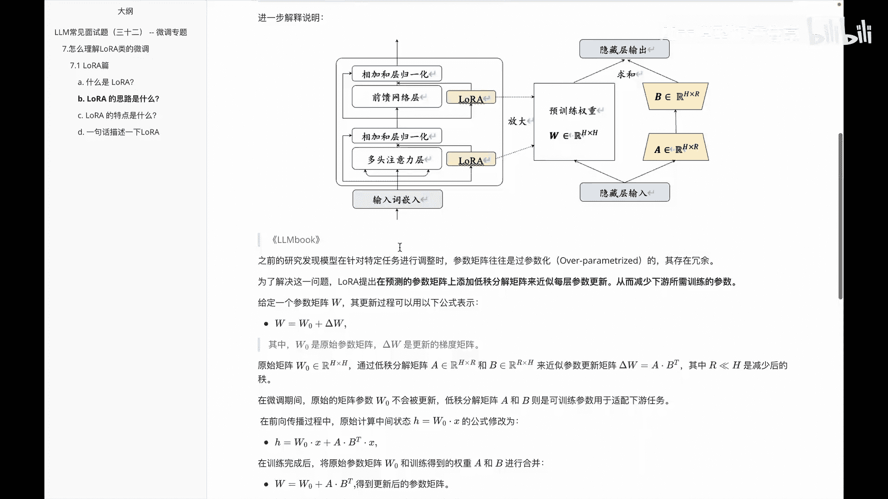

那我们再接着看一下啊，第二个问题就是说lower的这个思路，他这边到底是怎么去做微调的，他的思路是什么呢，其实呃会分成几个步骤来，我们分别看一下第一块啊，就是lower这个里面他会做的是什么叫啊。

旁入的增加和低质的分解，就是说在圆形圆模型的旁边呢，增加一个额外的路径，称为旁路，使得两个低质矩阵分解来近似更新量，首先呢我们把输入通过一个降维矩阵A，然后呢又通过一个设位矩阵B进行还原，这样就可以。

我们达到让各项的参数来捕捉一些必要的信息。

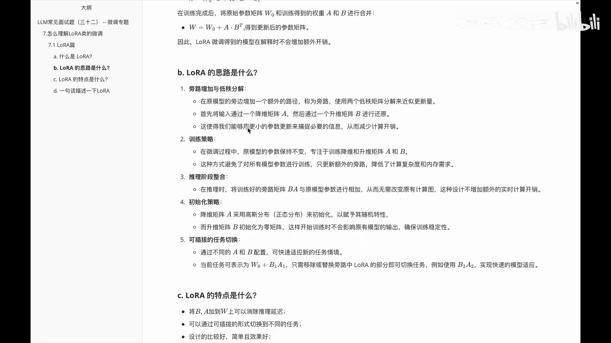

减少整个计算开销，就如啊上面这块里边。

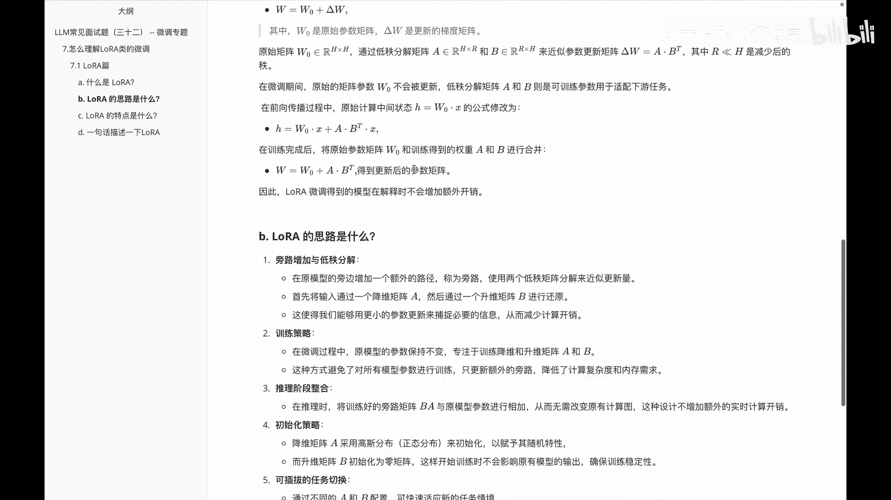

咱们看到这个里边，比如说哎先从多到少，再少到多，我把这个图呢啊截图放到下面，方便大家呢去进一步理解。

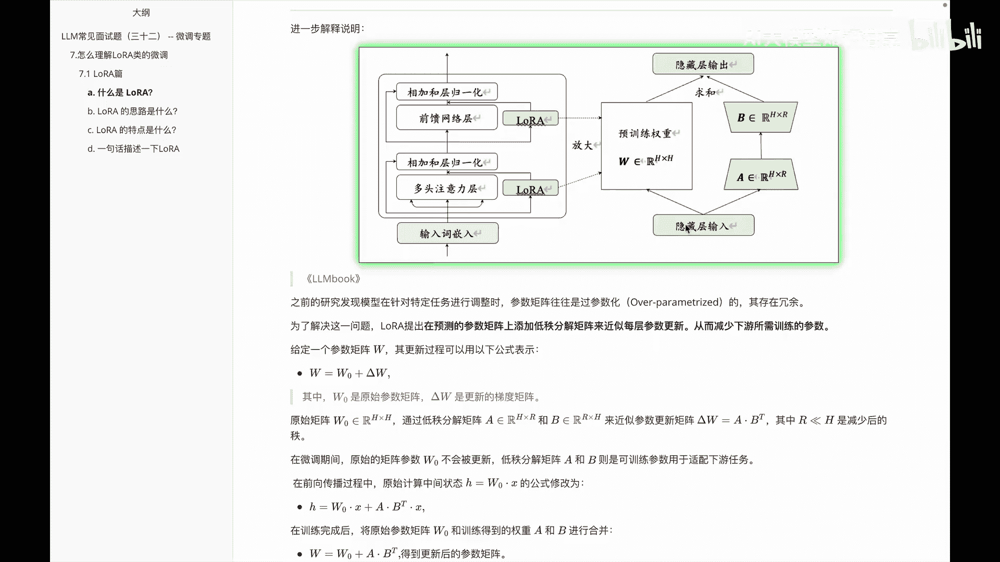

放到这个位置。

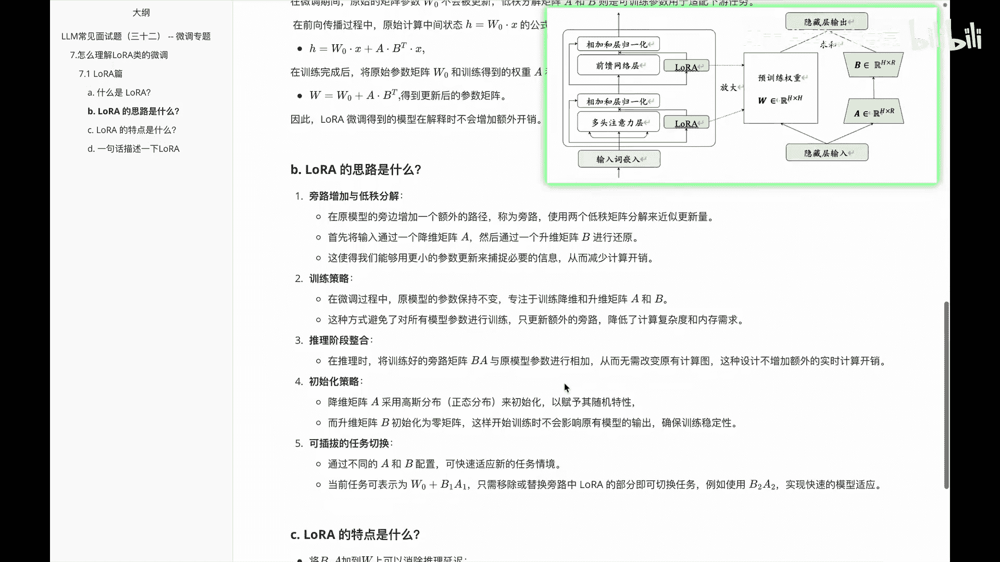

然后接着看第二块就是叫啊训练策略，这个是说在微调过程中，原模型的参数呢保持不变，主要专注的是什么，就是我们降维和升维的矩阵A和矩阵B，这种方式呢，就可以避免让所有的参数都进行训练。

我们只会更新它这个旁路，也就是更新这个A和B，而这边呢并不会做一些变动好这是在训练阶段，那么再看一下在推理阶段，在推理阶段的时候呢，说训练好的旁路，矩阵A和B与原模型的参数呢进行一个相将。

这样呢无需改变我原来的这个整体的结构，这样设计不仅增，不会增加额外的一个实时计算开销，接着看第四个就是初始化的策略，这个是说啊降维矩阵A呢是会采用高斯分布哎，就是正态分布来做初始化来赋予其随机性。

然后设为矩阵B呢会初始化为零矩阵，这样呢在开始训练的时候呢，不会影响原有模型的输出，保证整个训练的一个稳定性，这是第四块，第五块就是这个可插拔的一个任务切换，这个是说啊我们通过不同的A和B的配置。

就可以快速适应新的任务前进，比如说呃我们假设当前任务单切任务是什么，比如说我们是当前任务是个翻译任务，然后这边的话W01个B1乘A1，然后如果我们要换成另外一个任务，比如说我们要做一个总结任务。

这个时候我们只需要移除或者替换，爬楼中LAURA部分的一个内容，然后假设换成B2A2，此时呢就可以快速实行，从原来的翻译任务变成一个a summary，总结任务了。

好这是关于啊lower里面整体优化的一个思路。

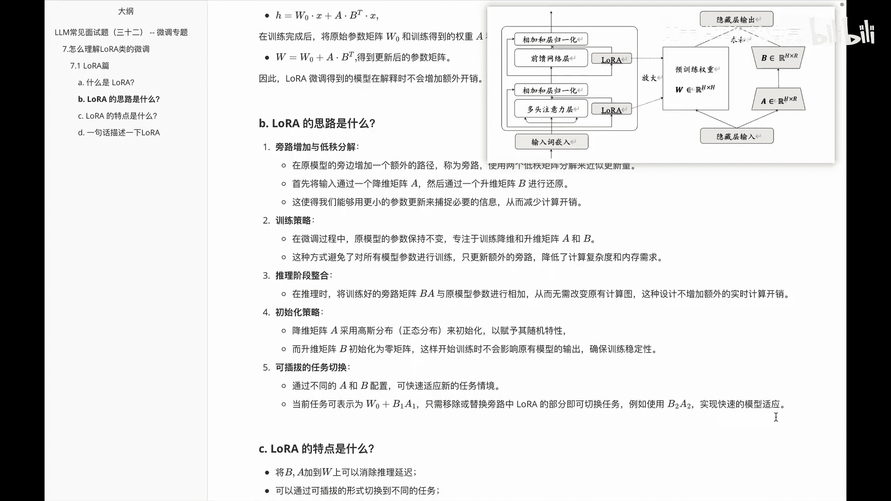

那说完我们接着看一下，就是lower这边的一个特点。

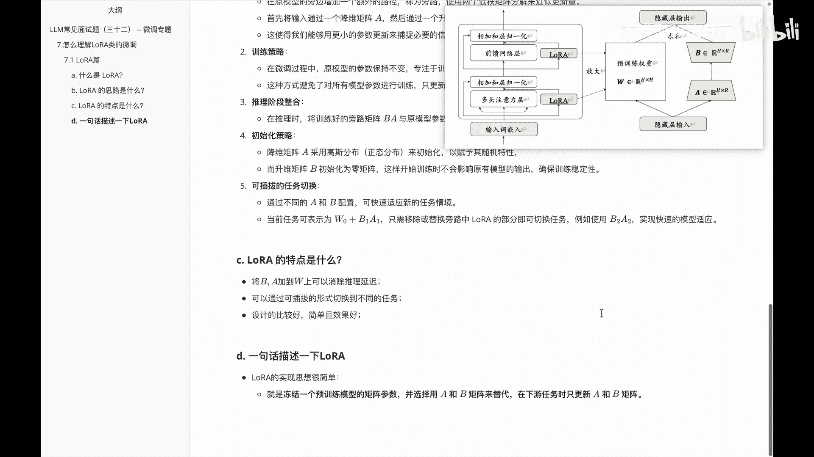

这个啊就给大家总结了一下，比较容易理解的通俗语言啊，比如说第一个，他是说把B矩阵和A矩阵加到原来的W上，可以消除这个推理的延迟，这是它的一个第一个特点，第二这点是说啊，可以通过这种可插拔的形式。

切换到不同任务里面，就是意思我前面举的，比如说从A1B1换到BA2B二就换成了，比如原来的是一个translation翻译任务，换成到一个summary总结任务了，然后第三个就是它的设计呢是比较好的。

简单而且有效，那最后就是说啊一句话描述下lower，然后其实就是说啊，冻结一个啊预训练的一个参数，的一个啊参数矩阵，然后选择用A和B矩阵来代替，在下任务的时候呢，我们只更新A和B的矩阵。

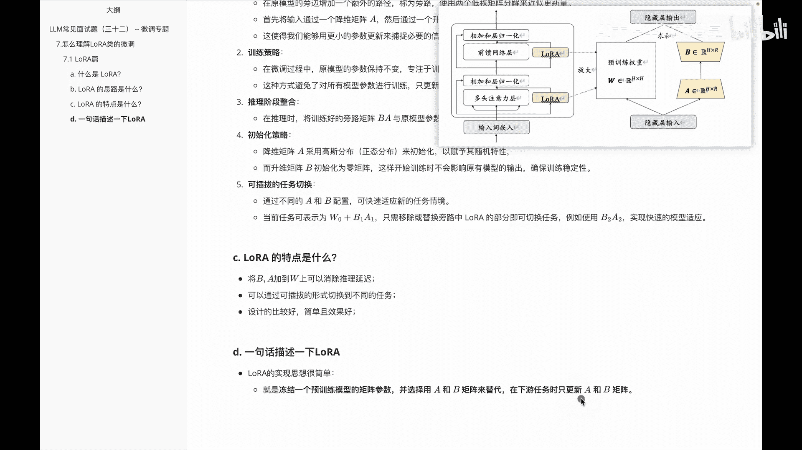

就是大家可以看到的啊，这个图里边对应内容就是我把这块冻结住，只更新A和B。

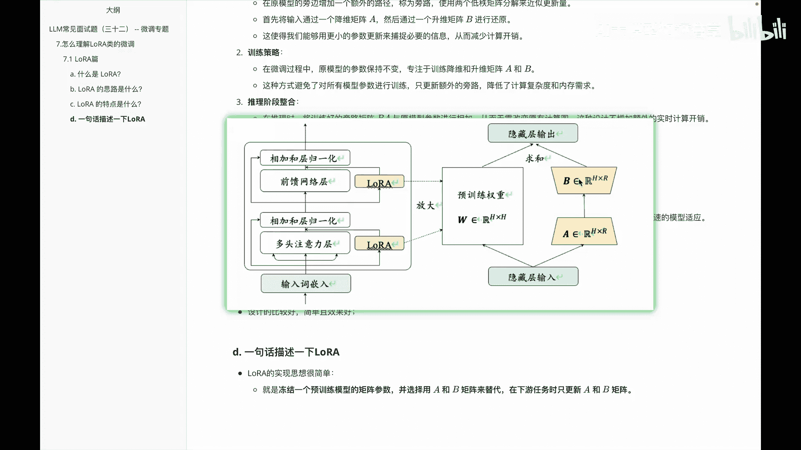