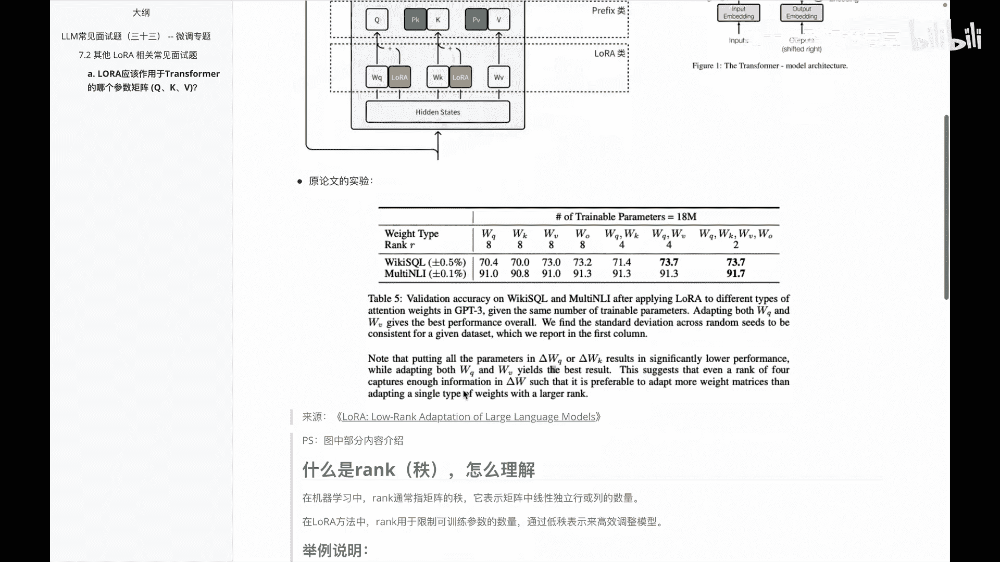
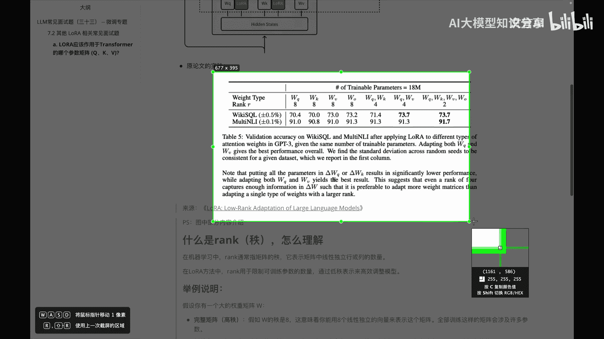
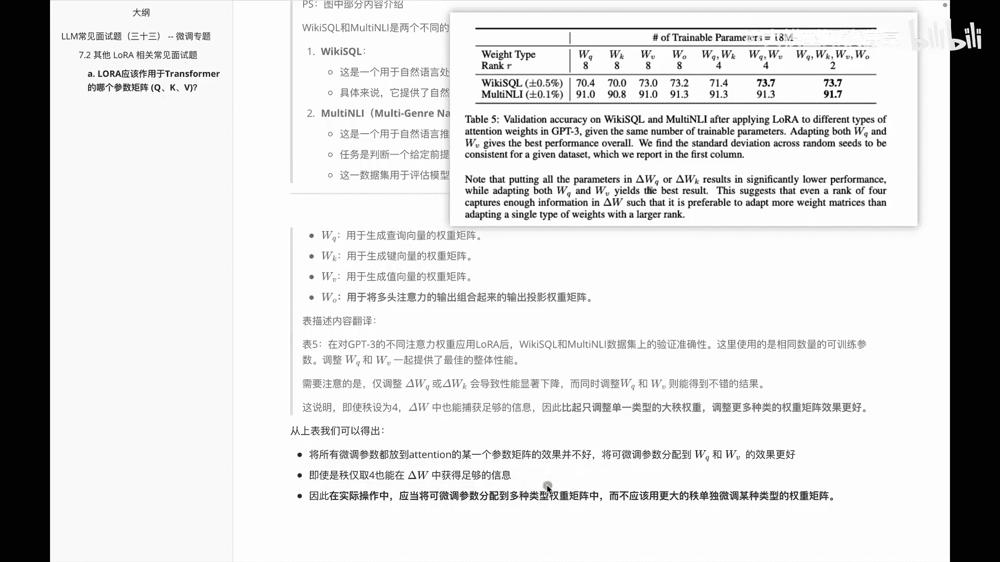

# P32：LLM常见面试题（三十三） -- 微调专题 - 1.LLM常见面试题（三十三） -- 微调专题 - AI大模型知识分享 - BV1UkiiYmEB9

我们这个视频呢接着看一下，关于LAURA这块相关的一些面试题，因为LAUER呢呃现在大家讨论的挺多的，而且说到微调这边，尤其参数高效微调就会啊聊到LAURA相关的东西。

所以呢我会啊讲LAURA相关的一系列内容，大家呢啊耐心的跟着一个一个视频来看一看，这个里边的话想跟大家分享的是说啊，lower呢应该作用于transformer的哪个参数矩阵，我们知道啊。

transformer里面其实有啊QKV，如果说啊不熟悉的小伙伴或者忘了小伙伴啊，可以看一下我前面讲的视频里面说到这块内容，大家说啊，transformer这边的结构呢是这样一个东西内容。

然后它呢其实主要会作用于啊这块儿的东西，那么具体而言这块里面怎么去作用，大家还记得我们在讲参数，参数高效微调里面的话，讲到adapter prefix和LAUREN，然后当时为了好区分，以及大家好理解。

我画的这个图里面说，layer这边的话主要会作用于比如说QKV，OK知道这块之后呢，大家对这道题应该有一个理解，就是啊transformer的那个作用，矩阵到底会作用在，比如说QKV其实在这块之外。

还有一块就是啊整体这块里面的一个输出，然后作者在呃论文里面是通过啊WO来表示的，Output，那么其实就是想问说QKV加那个O，它们对应的到底作用在哪儿，以及作用在哪呢，它更有效一些。

那么我们来一起看一下，原论文里面的实验是怎么做的，以及他这边呢啊整体的效果是怎样的。

现在看到这个截图呢，其实啊就是额对应的这个论文里面那个结果呃。

这个截图呢是来自于啊LAUER那篇论文里面，它对应的一个内容，然后链接呢放到这里边了，那么在说这个论文之前，我们得先了解几个啊，基本点方便大家更好的理解，第一个就是这个rec到底是什么。

第二个这块里面这些数据集又是什么意思呢，我们来分别看一下，首先啊这个rec就是这个质啊，它是怎么理解的呢，那么啊在机器学习里面的话啊，这个RECK这个质呢，通常表示的是线性独立的行或者列的一个数量。

那么在lower里边，rock呢是用来啊限制可训练参数的一个数量，通过低质来表示一些高效调整的模型，具体啊怎么理解呢，我通过一个举例给大家说明，现在假设呢啊有一个大的啊权重矩阵啊。

W这个W呢啊假设它的质量是八，这意味着啊，我们可以用八个线性独立的向量，来表示这个矩阵，然后全部训练，这样的矩阵呢会涉及到啊比较多的参数，那我现在想把这个高质变成一个低质，比如说我需用一些方法。

把它呢啊，使用置为四的一个啊数量来进行近似表示，那此时的话我们会发现此时由八变成四，它的一个参数量呢就减少了很多，那么通过这种降低质，我们就可以减少参数空间的自由自由度。

使得这个模型在训练时候呢更加高效一些，当然我们在减少这些制作过程中，还要有一个目的，就是不能啊影响我的性能，肯定会影响，就是说我们让它这个性能呢影响的稍微小一些，这个就是啊lower。

在权重矩阵上使用低质的一个核心思想，那么大家可以看到上面的这个rank r里面的，什么八呀，四啊二啊，这块其实就是啊它的一个质的一个数量，它表示的就是对原始大的一个权重矩阵，进行近似表示时啊。

所用的一个线性独立的一个向量的数量，然后通过调整数量呢，我们就知道他可以把这个高质降成低质，来进一步的一个表达，除了这块，第二个想给大家介绍的点呢。

就是啊在这个里边对应的这个什么vicky circle，以及MONTNLI，他这边又什么意思呢，这两个呢其实是两个数据集啊，那么首先看第一个这个啊，Vicky circle。

它呢是呃自然语言处理里面的一个数据集，然后主要是专注于结构化查询语言里面，circle的一个生成任务，具体来说呢就是提供了一个啊自然语言处理的，一个自然语言问题，和相应的circle这个查询的对照。

然后这个呢可以用于训练和评估，能将自然语言转化为circle的一个模型的数据集，第二个呃mount n l i n l i呢，就是啊这个其实就是自然语言推理吧，那其实它啊知道。

就是说它是一个啊多类型的一个自然语言，推理的这么一个数据集，然后呢主要包含了一些不同载体的文本对，那么这个的任务呢是判断一个给定的前提，和假设之间的一个关系，比如说包含蕴含啊，矛盾啊，中立啊这些关系。

然后这个任务呢啊，主要是用来评估模型，在跨领域推理任务中的一些表现，OK知道数据集，我们接着看一下，就是这个图里面的这一大堆英文，他说了一个什么意思，在这呢给大家做了个简单的翻译啊。

其实大家看完这段翻译啊，相信就能对我们这个啊，前面这个问题呢做一些解答了，那我们来看一下，在看之前，首先把这块的这几个做一个解释，Q k v，大家其实就是知道，Q就是我们用于生成查询向量的一个权重矩阵。

K就是由于生成键啊，就是K嘛的一个权重矩阵啊，V就是生成值value的一个权重矩阵，那么O呢就是说啊，用于将多头注意力的输出组合起来，输出投影权重的一个矩阵，那知道了之后呢。

我们看一下这个表里面内容的翻译，首先表五这个说哎，在对GPT3的一些不同注意力权重，我们应用lower之后呢，会发现在这两个数据上的一个验证准确性，然后这个里面使用的是一个相同数量的，可训练的参数。

然后调整WQ和WV一起，提供了一些整体的性能表示，然后大家需要注意的是啊，仅调整这个德尔塔WQ或者德尔塔WK，会导致啊性能显著下降，而同时调整这个wk和WV，则能得到一些不错的结果。

除此之外大家还发现就是我们这个质除以四，其实这个德尔塔W呢也能补足一些信息，比只调整一个单一的大致权重，调整多种类的权重效果会更好一些，那我们看一下这个里边儿对应的这些啊数据，这个是一个准确性的表示吗。

大家会发现标黑的是我来，对于我们来说是性能相对来说不错的，会发现他这边的话，我如果四个矩阵都去调的话，或者都参与的话，会发现它的值是最好的，然后再其次他这边质量其实是降的更低是二。

然后倒数第二列和第三列，第三列大家发现它呢是一个组合的，会发现啊效果也还不错，但反过来大家会发现，如果我只调整单独的一个权重的话，此时它的性能就没有那么好了，好这是原实验里面展示的一个结果。

那呃在这里做个总结，说根据上表里面我们就可以得出一些结论，首先啊，把所有的微调参数都放到attention里面的，某一个参数矩阵里面，它的效果并不好，我们可以把这些微调参数呢分到，分到一些综合的数据。

比如说啊Q和V或者说QKV加O，他这边效果的话就会不错嗯，第二个得出结果，即使它质值等于四，然后呢，我在德尔塔W中也可以取得一些不错的信息，第三个在实际操作中的话，建议大家应当将可微调的参数。

分配到多种类型的一些权重矩阵中，然后不应该用更大的痣，单独微调某种类型的权重矩阵，因为这样效果不怎么好，这就是我们解决这个问题里面的啊，给大家总结的内容，此时大家知道说。

lower里面作用transformer的哪个参数矩阵呢，其实它不是只做一个，而建议大家多作用几个，第二就是多作用几个之后呢，它的质降的比较低，我们也可以获取一些信息。

