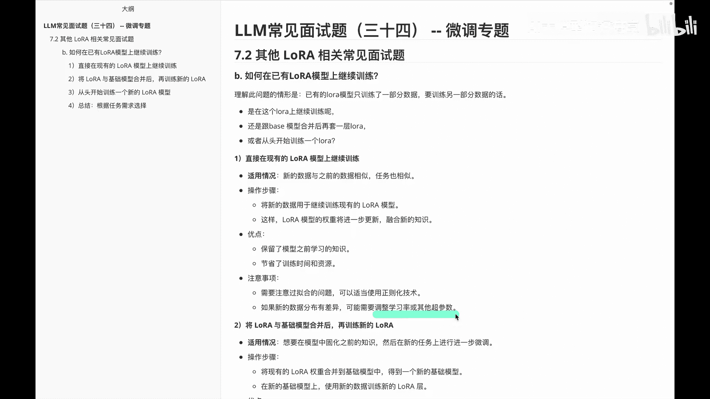
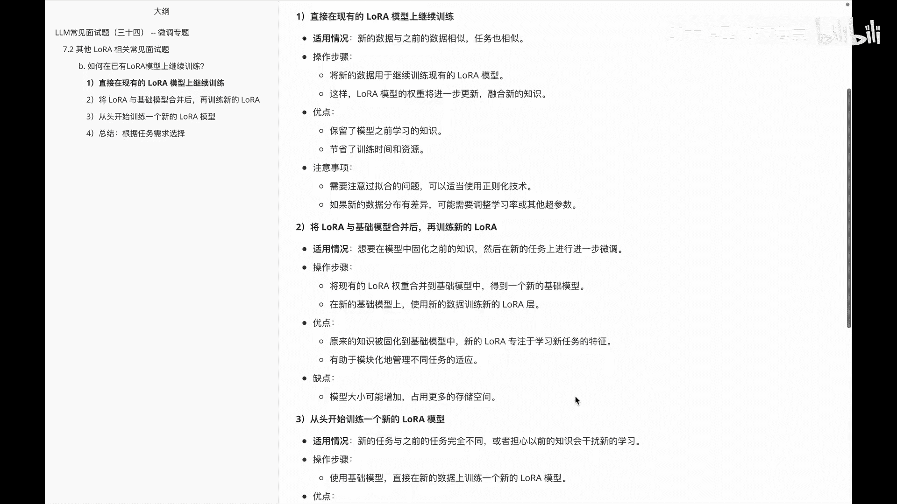
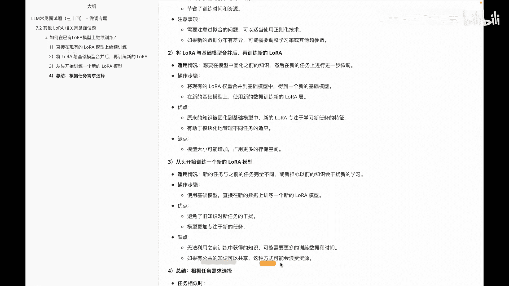
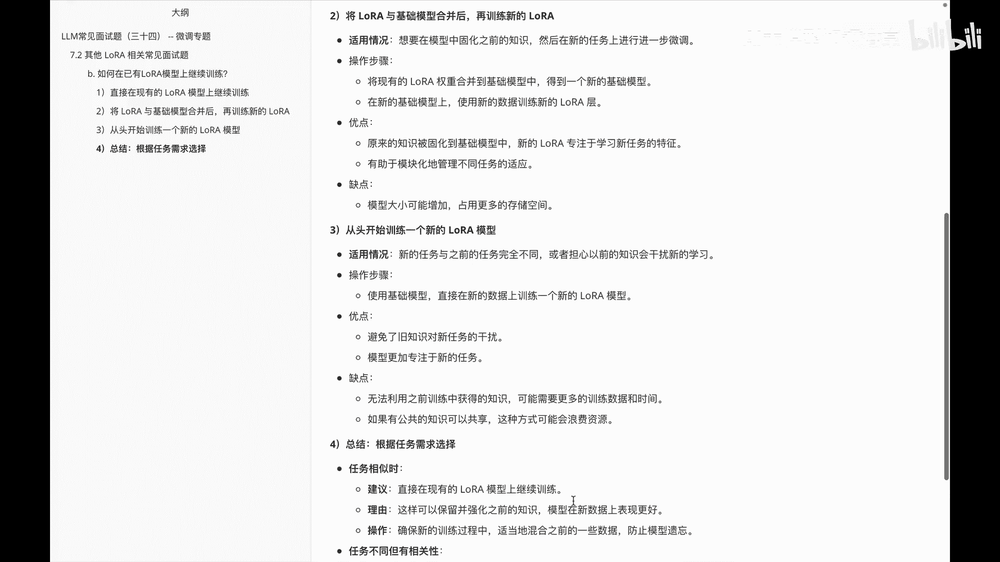
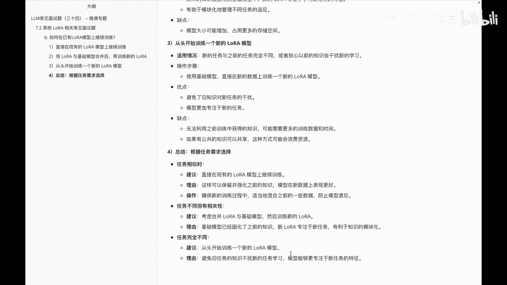
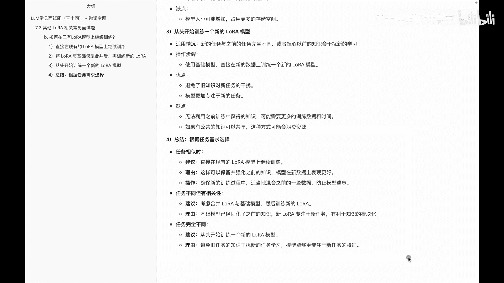

# P33：LLM常见面试题（三十四） -- 微调专题 - 1.LLM常见面试题（三十四） -- 微调专题 - AI大模型知识分享 - BV1UkiiYmEB9

我们继续看一下啊LAURA相关的面试题，这道题呢啊问的是，如何在you的LAURA模型上继续进行训练，那这个题呢啊进一步解释他是这样的，就是啊已有的lower模型呢，只训练了其中一部分数据。

然后呢要训练另外一部分数据，那此时这两部分数据呢，其实他们就会有些区分吧，然后这两部分数据的话，我们到底该怎么去处理呢，一种是说哎是在这个log上继续进行训练，第二个呢是说呃。

我们把这个之前训练好的模型，跟这个base模型合并，然后呢啊再套一层lower进行训练，第三种呢是我从头开始啊，训练，那么面对这三种情况，其实他们的呃在数据上在任务上不同，我们选择的方案也是不同的。

首先看第一种，就是我们直接在稀有的LOL模型上继续训练，这种它的适用情况呢是啊，新的数据与之前的数据相似，任务也是相似的，那么他的操作步骤呢，就是啊，把新的数据呢用于继续训练现有的lower模型。

这样呢lower模型的权重呢将进一步更新，融合新的知识，这个倒没什么，然后他的优点呢是，保留了模型之前的一些学习知识，节省了我的训练时间和资源，毕竟是我在原来的这个lower模型上，接着开始训练嘛。

那么在这个里面需要注意的事项，第一就是需要注意啊过拟合的问题，需要啊有时候呢用一些正则化，因为你这边训练的多的时候呢，他这边就可能出现过拟合，第二个呢就是我们如果新的数据分布有差异。

可能啊需要调整学习率或者其他的一些超参。

这是第一种情况，就是我直接啊进行一个啊训练，第二种情况呢是说呃。

我们把这个lower呢，和之前的这个基础模型进行合并，然后再训练新的lower，这个其实适用的情况就是，我们想要在模型中固化之前的知识，然后在新的任务上进行进一步的微调，然后他的操作步骤呢是。

首先啊把下面的lower，这个lower权重呢合并到基础模型里面，得到一个新的基础模型，然后呢啊在新的基础模型上，使得新的这个数据训练数据啊，更新到这个lower里面就OK，然后优点呢就是啊。

原来的这个ALLOWER已经训练好东西，我们已经固化了，而新的这个lower呢只要专注于学新任务就OK了，然后它有助于模块化的管理，不同的任务的适应，缺点呢就是它的模型大小可能会增加。

导致我们这个占用的存储空间会变大，这是第三个，那么第四个呢是我们从头开始，训练一个新的lower模型，这个是啊新的任务与之前任务完全不同，或者说啊我们担心以前的知识呢，会干扰性的学习。

然后操作步骤就是使用基础模型，直接在新的这个数据上啊，训练一个新的lower模型，相当于就是我重新开始一个呗，把原来的直接删掉啊，这个唉大家理解起来也是好理解的，优点呢。

就是我们避免了一些旧知识对新任务的干扰，那么模型呢会更加专注于新的任务，缺点，第一个就是我无法利用之前训练中获得的知识，可能需要更多的一个训练数据和时间，另外一块就是啊如果有公共的知识可以共享。

这种方式呢。

可能会造成那个浪费的资源，然后这三种呢大家会发现。

其实我的是按照啊任务的一个情况来进行。

一个划分的，那么下面这个给大家做一个小的总结，就是其实啊任务相似，任务不同，但是有相关性以及任务完全不同的几种情况，首先如果任务相似的话，呃，建议大家还是直接在现有的一个lower，模型上进行进行训练。

那么这样就可以保留之前强化的一个知识，同时呢呃模型在新注数据上也表现的更好一些，然后效率也会更高嘛，那么操作的就是我们确保新的一个训练过程，适当的混入之前一些啊数据，防止模型遗忘，然后如果说啊任务不同。

但是有些相关性呢，就是我们可以啊考虑合并这个layer基础模型，然后再开始训练这个新的LER，然后这么做的理由就是，基础模型已经固化了之前的一部分知识，而新的lower呢他只专注于啊新任务就OK。

那如果是任务完全不同的话，咱们就老老实实的重新开始训练一个lower吧，比如说拿到一个base模型，或者拿到一个基模型，我在基于模型的情况上，然后重新继续lower来开始做一些啊微调。

然后这样的话我就可以避免掉那些旧的知识，来干扰我们新事物学习，让我们的啊这个新学期的任务，然后只专注于新任务就OK，就是啊给大家分享的这么一个题，就是，如何在已有的这个lower模型上继续进行训练。

这道题呢还是比较好理解的。

