# P5：大语言模型面试题系列（五） - 1.大语言模型面试题系列（五） - AI大模型知识分享 - BV1UkiiYmEB9

嗯大家好，今天给大家录制的题目呢是大语言模型中，有些能力是什么原因呢，那么在这之前，我们首先来看一下到底什么是涌现能力呢，呃就如大家在这个图里面看到的内容一样，其实涌现能力呢都是由一些啊小的现象。

然后呢慢慢的拼凑起来变成一个大的现象，那么这个现象呢从量变到质变的一个过程啊，就可能是一个涌现的一个情况，就拿咱们大家看到的第一个这个呃图片来说，这里面是一个雪花对吧，那么我们知道说雪花的构成呢。

其实水分子，然后水分子呢非常小，但是啊大量的水分子呢，如果在外界温度条件变化前提下相互作用，此时就会形成一些非常规律对称啊，美丽的雪花啊，这就是被称为叫涌现能力，那么我们回到呃大语言模型中。

究竟大语言模型里面的有些能力，咱们知道它其实是从之前的一些啊，可能做预测的时候呢，预测效果不好，突然间啊经过啊大模型之后，发现预测的效果发生了一个质变，那是什么原因导致这种质变的呢。

现在呢并没有一个明确的说法，专家们呢主要啊有几个猜想，觉得说啊可能是这几方面运营啊。

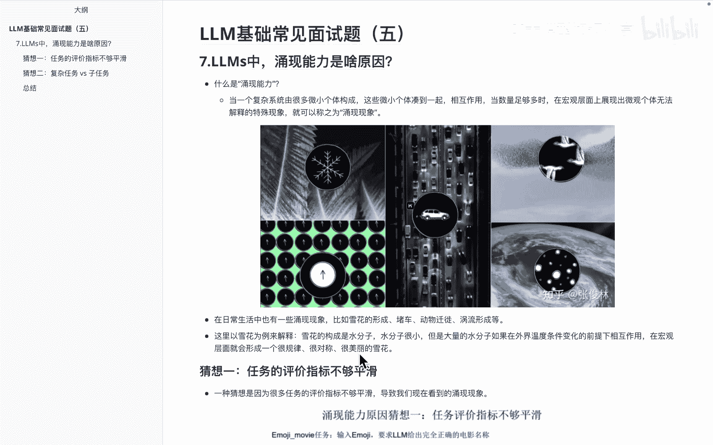

带来这么好的一个效果，第一个猜想呢是说呃，因为任务的这个评价指标呢不够平缓。

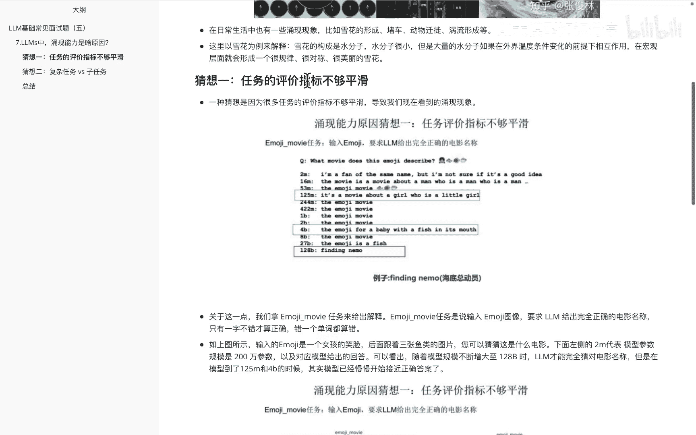

这个怎么理解呢，呃就拿咱们下面看到的这个图来说，比如说这个是一个什么任务呢，是啊通过一个问题，这个问题呢说的是说呃，就是通过前面这些后面这些表情来猜测，这个是一个什么电影，然后大家看到的这一类里面数据。

其实是这个模型的大小，随着这个模型的大小的逐渐变大，最后会发现啊达到128B的时候呢，这个模型是猜到了它就是海底总动员，就是通过这个图片来看，那么在这个里面的话呃，怎么体现中涌现的能力呢。

大家会发现额这个在这一类的模型大小里面啊，在200万这个参数的时候呢，它其实是不对的，然后得到125万的时候呢，他是大概能把这个事儿啊说的有一些意思。

比如说it's a movie about a girl，Who is a little girl，好像有一点意思，但是呢又不是很对，但是呢当它达到128B的时候，会发现诶从27B到128B。

直接把这个答案就能说出来。

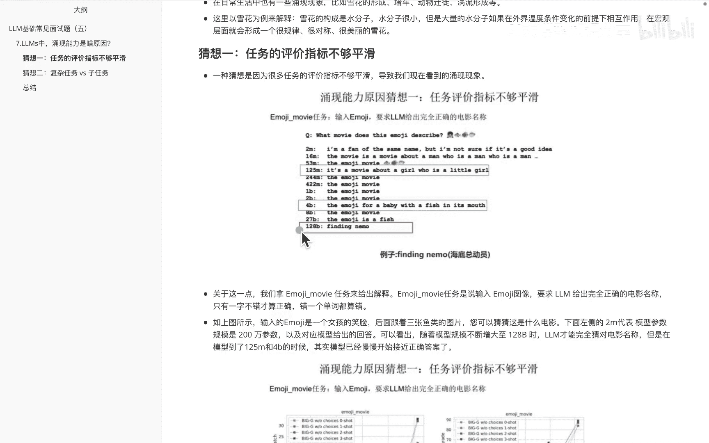

然后呃下面在这个截图里边又能说出来，另外一个从侧面来证明说啊，确实有些能力呢他其实是这种啊，在做精准匹配的问任务里面的话能展现出来，如果说你把这个任务降低难度，其实他这边的话会出现这种啊逐渐慢慢正确。

答案发生的这种情况。

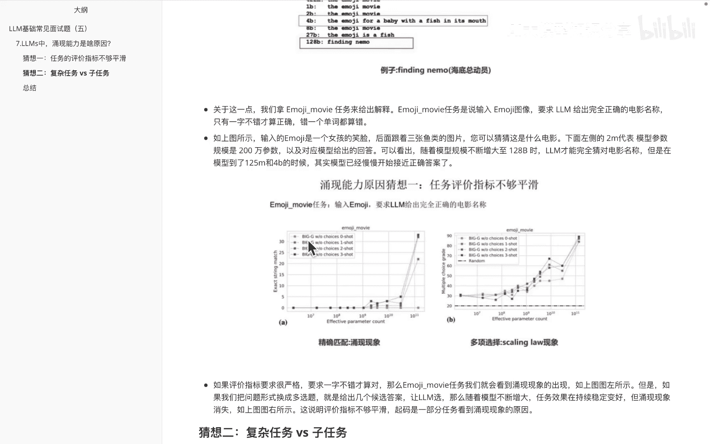

比如说我们把前面这个问题变成了。

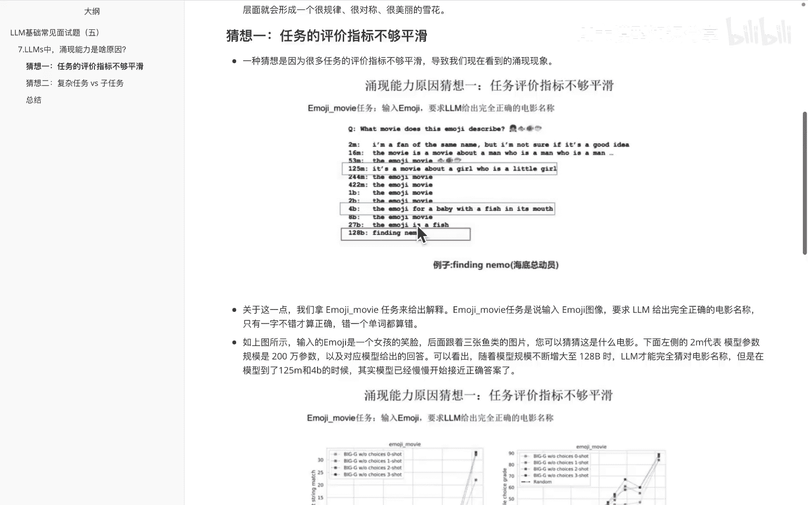

让它不是直接出答案，而是怎么弄呢，变成一个选择题，让他去选择哪个是确答案。

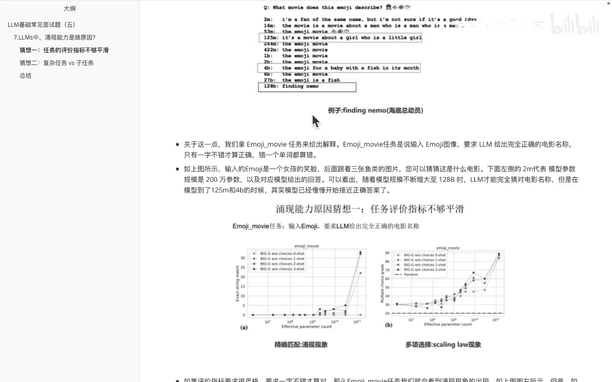

那么这两个里边的话，比如说这边是精准匹配，这边呢是通过这种多项选择，大家会发现这种金融匹配呢啊，在从这儿到这儿的时候呢，这个参数量啊从突然间啊增长了之后，它的效果呢发生了一个非常明显的一个增长。

而多项选择这边的话，会发现整体就是一个啊上升的这么一个趋势，慢慢慢慢这么上来的，然后这是呃第一个就是说这个评价指标呢啊，它是不够平滑的，比如说这边的话，它是直接出一个正确答案。

但如果说把这个评价指标呢啊，变得稍微平滑一点啊，基本上也是OK的啊。

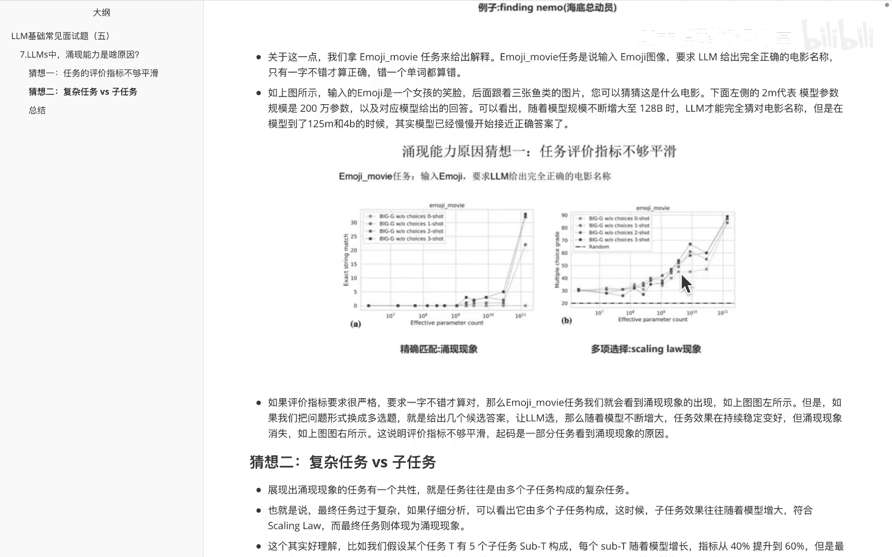

那第二个的猜想呢，就是说这种复杂任务和子任务的区别，这个怎么理解呢，也就是说在这个里面嗯，其实我们在做的这些任务里面，他是社会上都是由这种不同的这种啊子任务，或者不同的简单任务构成一个子任务。

然后这些简单任务呢，他在学习的过程中是一点一点的上升的，但是呢把这些简单任务呢给他混到一块，此时这个总任务呢就会发现一个啊质变，但是这些简单任务，其实还是一点一点发生变化的。

就拿在这个里面举的这块的例子来看啊，就是说比如说哎有个任务里边有五个子任务，是构成的，而这五个子任务呢，它随着模型增长的指标，从40%增长到60%，但是在这个40%到60%之间，它的最终任务指标呢。

就可能从1。1%提升到7%，也就是说它这边在逐渐上升，但是呢累积起来的话，他这边就会发现从量变到质变的一个过程。

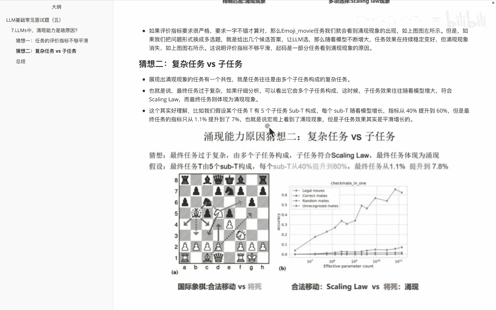

这个依旧也是啊给大家提供出来一个例子，这个例子呢大概就是说的一个呃。

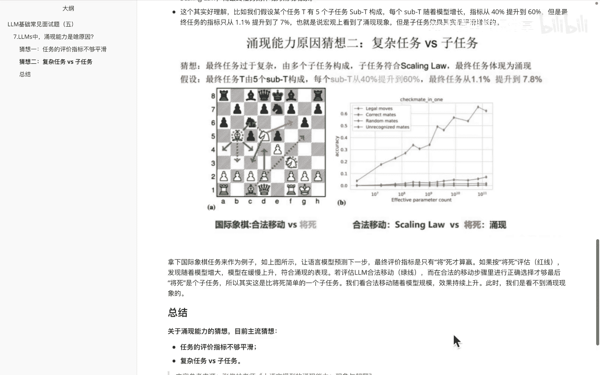

下象棋的一个事情，比如说国际象棋里面合法移动和将死这个情况，如果你说这道这个里面，比如说哎我在这儿这个象棋移动的过程中，绿线代表的是我合法移动，那么大家会发现他这边的话会有很多步走法。

其实他这边的话慢慢的慢慢的就会平缓的移动，但如果是将死的话，他这边是直接一步啊致命的那种，此时他这边的话就会出现一种涌现的情况，然后他这边是一个复杂任务嘛。

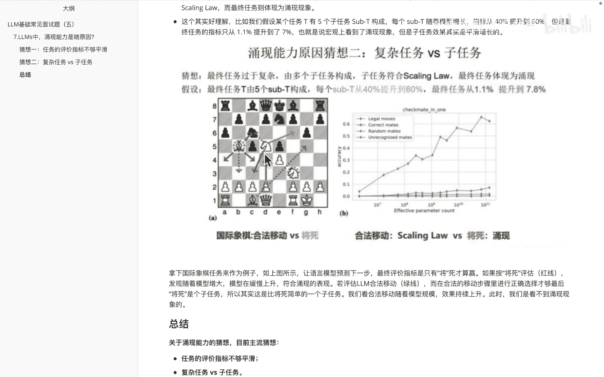

嗯OK那刚刚给大家讲的这个呢，其实是啊关于引线能力的话，一些专家的猜想，然后基本是啊两个原因，第一个呢是说任务的这个评价指标呢不够平缓，第二个呢是这种复杂任务和子任务，之间的一个啊pk。

然后因为复杂任务都是通过子任务来组成的，子任务他这边的成长呢其实是一些平缓的，但是呢把子任务堆积起来，变成一个复杂任务之后呢，就会子任务的这种慢慢慢慢的累小增长，然后累积起来之后呢就会变成一种质变。

然后这道题里边的问题，内容的参考资料呢，都是来自于啊知乎里面的张俊良老师，他讲的大语言模型的，有限能力的现象与解释内容，大家如果说想看更多的一些或者更长内容的话。

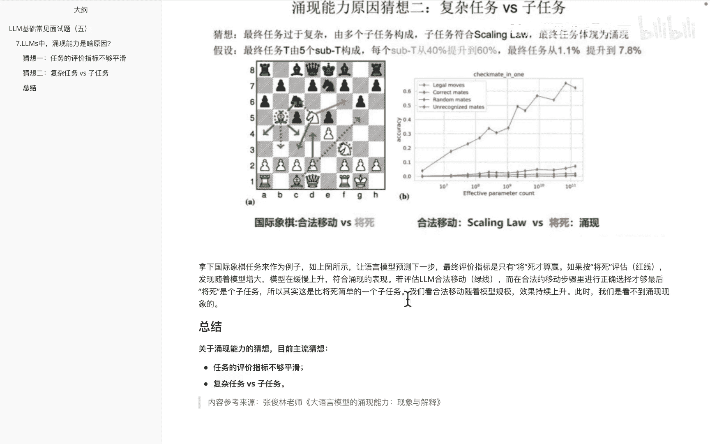