# P6：LLM基础常见面试题（六） - 1.LLM基础常见面试题（六） - AI大模型知识分享 - BV1UkiiYmEB9

各位大家好，今天我们给大家带来的是这么一道面试题，在面试的时候呢，呃面试官可能会这么问你啊，就说什么是scanning law，让你呢谈谈对他的理解，那么在解决啊这个问题之前。

我们先带着大家一步一步的去理解啊，先看一下关于这个scaling law这个目标是什么，下面这段内容呢其实是OpenAI，在出那个GPT4的技术报告的时候呢，他们的一段话说啊，在训练之前了解模型能力。

以改善关于大模型的对齐安全和部署的决定，其实这个大家也可以想象，就是我们大模型训练的时候呢，很耗耗费时间的，那如果说我们在训练之前啊，就能知道这个大模型它的能力啊，边界在哪，这样是不是对我们帮助很大呢。

我们就可以啊不用去浪费他的资源，不要去耗费更多的时间了。

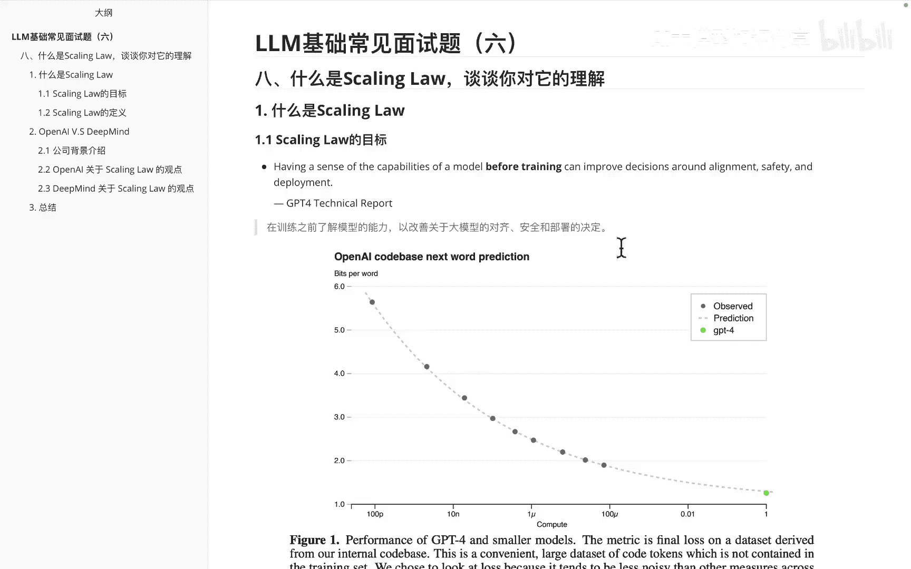

比如说唉就拿大家现在看到的这个啊截图一样，这个截图呢它也是啊，GPT4的技术报告里面的其中一部分内容，我们直接看一下啊，这个呢是GPT4和一个较小模型，的一个性能表现，也就是说其实GPT4呢。

他们在训练之前就大致的预测出了，GBT4的一个性能边界啊，大概在这个位置，大家看见这边呢是关于他已经得出的一些数据，那么整体里边他们怎么做呢，我们来看一下这个图里面的一些内容啊。

虚线呢表示一个呃对较小模型的一个密率拟合，那么这个拟合呢就可以准确的预测出，JPD4的一个最终损失，大概就是在这个位置，那么整体里边儿就预测出啊最后值是在这儿，这是呃关于scaling law呢。

他们在GPT4这个技术报告里面啊。

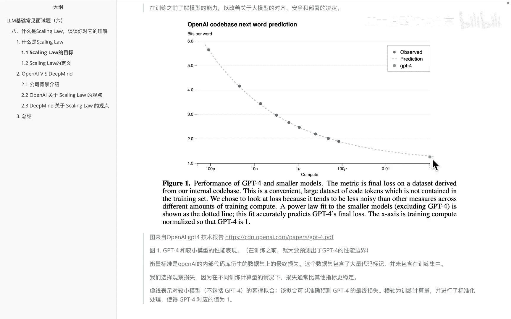

发挥的一个作用，那知道了这个之后，大家应该对这个啊scaling law呢，基本的定义呢有一个啊初步的印象，其实他就是呃想在大模型训练之前啊，用计算量啊，数据集规模，模型规模来预测啊，这个模型的能力。

当然他有一个追求，就是通过一些简单的函数形态，比如说啊像这种线性关系，那再看一下，就是说呃在大运模型里面呢，其实我们啊希望能干嘛呢，就是说这个模型呢能像人类的语言呢，有一般规律。

然后我们把这个规律呢总结出来，那其实scaling law啊，中文呢有时候叫缩放定律啊，他这边呢就想达到这个效果，那在这个里边的话，其实他的训练是由三方面数据来做一个博弈的，哪三方面呢。

分别是啊关于这个里面的一个啊计算量，还有啊数据集的一个大小，以及它那个模型的规模，但是这三者之间它们又是一个怎么样的作用呢，就是哎比如说是不是它这边呃，比如说我这个里边的呃计算的量啊，是不是作用最大呢。

或者说我模型的大小啊，对我作用更大呢，啊这个里边呃其实是你知道这个概念之后呢，啊紧接着想知道的另外一个问题。

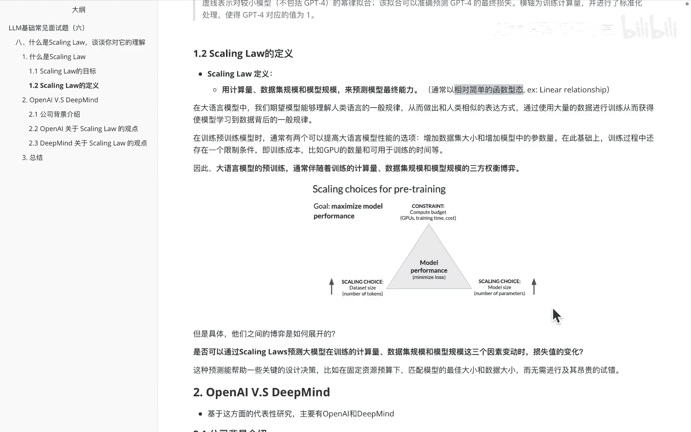

关于这个研究，其实呃当前有代表性的呢是OpenAI和deep end，他们两家公司呢，呃关于这边呢有一些额有说服力，或者说有脸性领先性的一些研究吧。

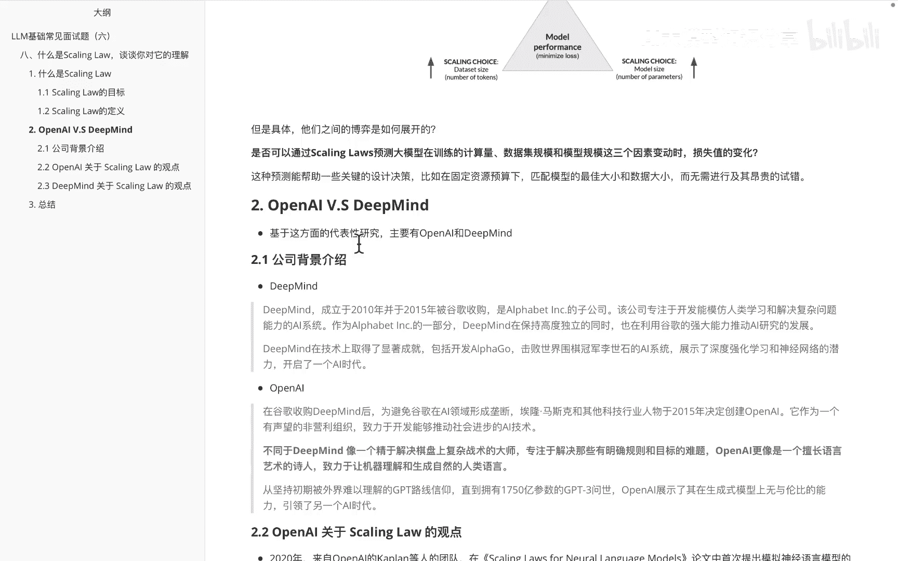

这个概念之前我先给大家说一下这两家公司啊。

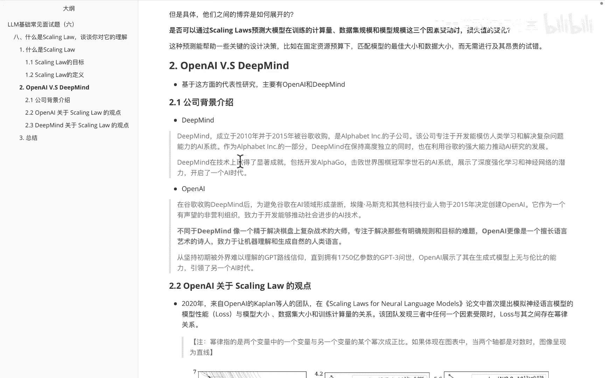

他们还是挺好玩的，首先来介绍一下这个demmad MAD这家公司呢，其实它呢是2010年成立的，然后呢2015年呢被谷歌收购收购之后呢，呃就是demand，他这边的话其实主要专注的是什么。

就是做一些啊高精钻的专业的一个啊大模型，你可以看到，比如说在呃整体取得的成就，比如说之后呢开发了阿尔法go，击败了这个啊围棋冠军李世石，这个大家应该都知道，那么open i这家公司是怎么起来的呢。

他呢其实是在谷歌收购了这个DEMD之后呢，呃为避免谷歌在这个AI领域形成的垄断，Elon mask，然后呃和一些其他的呃科技领先的一些人物，他们创建了OPPOAI，他当时的目标呢其实是想做一个呃。

非营利的组织，然后致力于开发能够推动社会进步的AI技术，同时呢他的目标并不像说deep end，他们那边要做的是一个啊高精钻的一个呃，某个方向的任务大师，而是他们想做的类似于ADI，就是我这边的话。

让机器理解和深沉自然的人类语言，然后之前走的路线呢，其实是基于transformer的decoder，这个大家应该都知道不被大家理解吧，直到啊他的GPT3chat g p t，然后出来之后呢。

这才发现啊，整个AI时代呢被这个decoder相关的模型呢啊，开创了一个新的纪元，好那我们回归正题啊，说一下啊，关于这两家公司或者这两个研究团队。

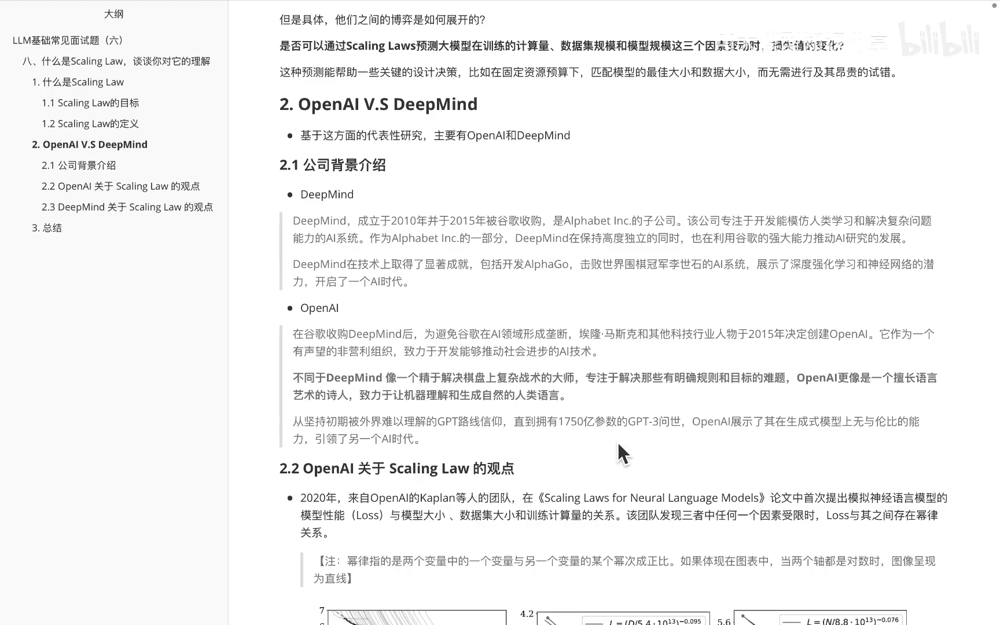

关于这个scaling law的一些观点，首先我们看一下关于open i对应的这个。

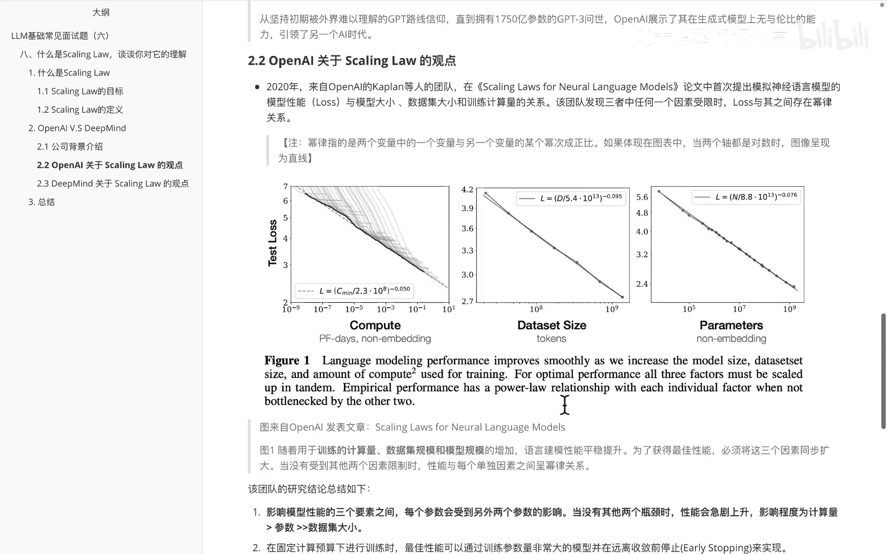

scanning la的观点，嗯他们呢是在2020年的时候呢，呃整个团队发表了一个paper叫呃，Scaling laws for natural language model，在这篇文章里面的话啊。

他们提出说模拟神经语言，模型的某些性能与模型大小，数据集大小和啊训练的计算量有一定的关系，同时它们之间的关系呢，当三者中任何一个因素受到限制的时候呢，啊另外两个之间存在一种密律关系。

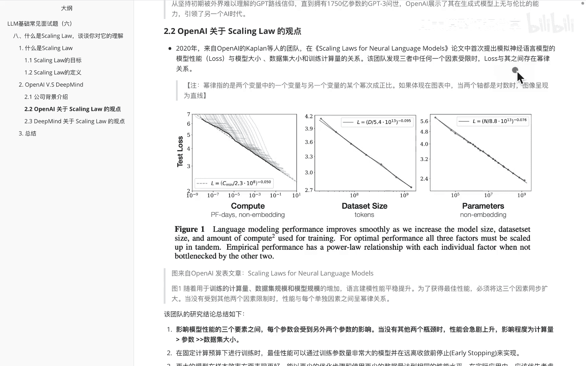

就如啊这个图里面的一样，比如说呃它整体的解释说啊。

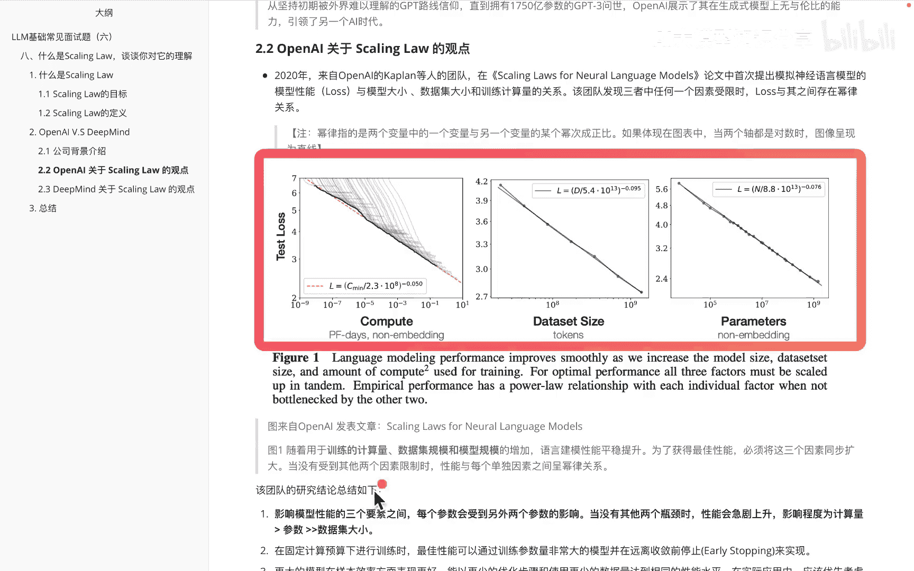

随着用于训练的计算量，数据集规模和模型规模的增加，然后语言呢啊整个建模性能呢是平稳的提升的，同时为了获得最佳性能呢，必须要把这三者因素呢同步扩大，当然当没有受到其他两个因素限制的时候呢。

性能与每个单独因素都是成这种密率关系的。

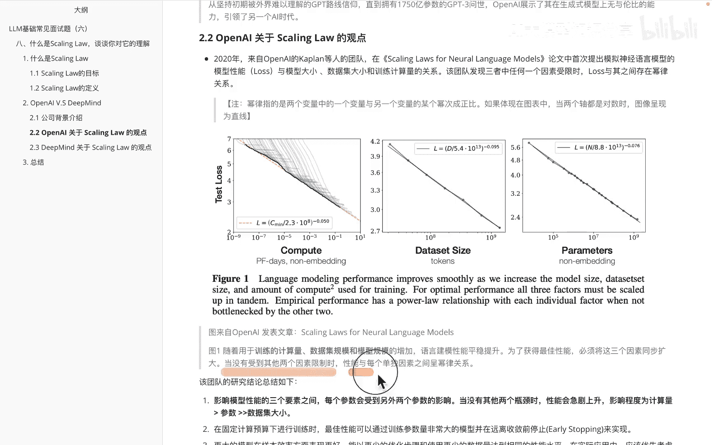

然后他们研究的时候呢也得出来一些结论啊。

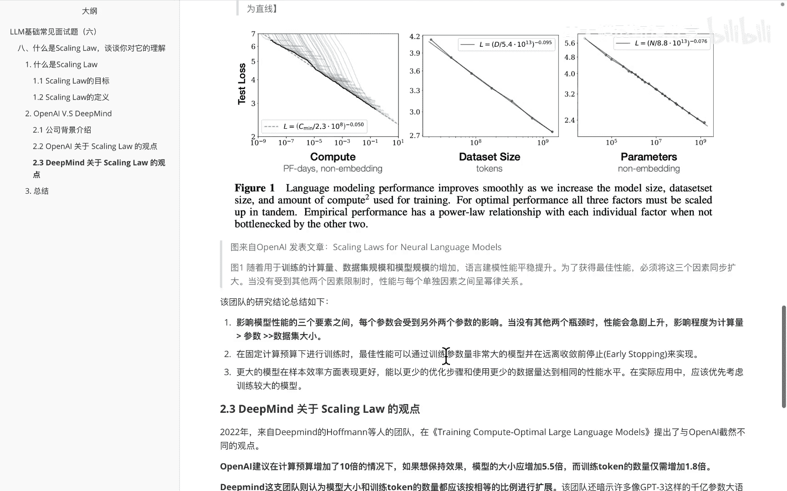

分别如大家在下面这块看到的一样，我分别给大家啊过一下，比如说第一个说啊模型，影响模型的性能的三个要素之间呢，每个参数都会受到另外两个参数的影响，当没有其他两个瓶颈的时候呢，它们的性能呢就会有上升。

同时这三者之间的话影响程度呢，首先是啊open editor公司呢认为是计算量影响最大，其次是参数，最后是关于数据集，那呃第二个观点呢是说，在固定这个计算预算下进行训练的时候呢。

最佳性能可以通过训练参数量非常大的模型，并且啊做一个early stop来进行收敛，达到一个模型的效果，第三个呢是呃更大的模型，在样本效率方面表现更好，能以更少的优化步骤和使用更少的数据量。

达到相同的性能水平，在实际应用中呢，应该优先去训练一些较大的模型，当大家看到这句话的时候呢，其实就不难理解啊，OpenAI这边出的他们啊，比如后面的175B的这种，大模型的一个效果啊。

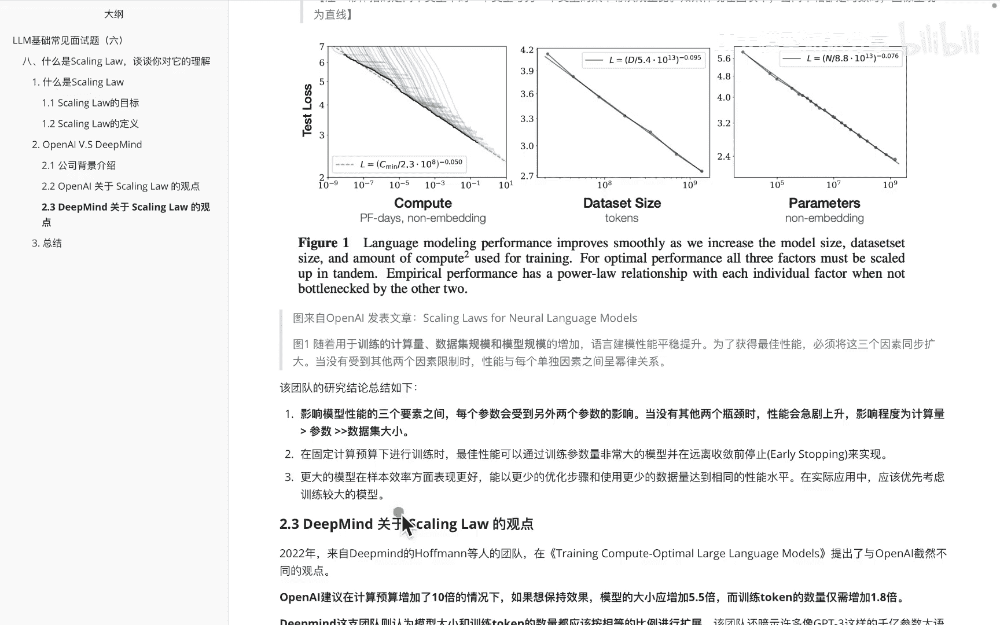

那讲完关于open a呃，对scaling law的一个观点之后呢。

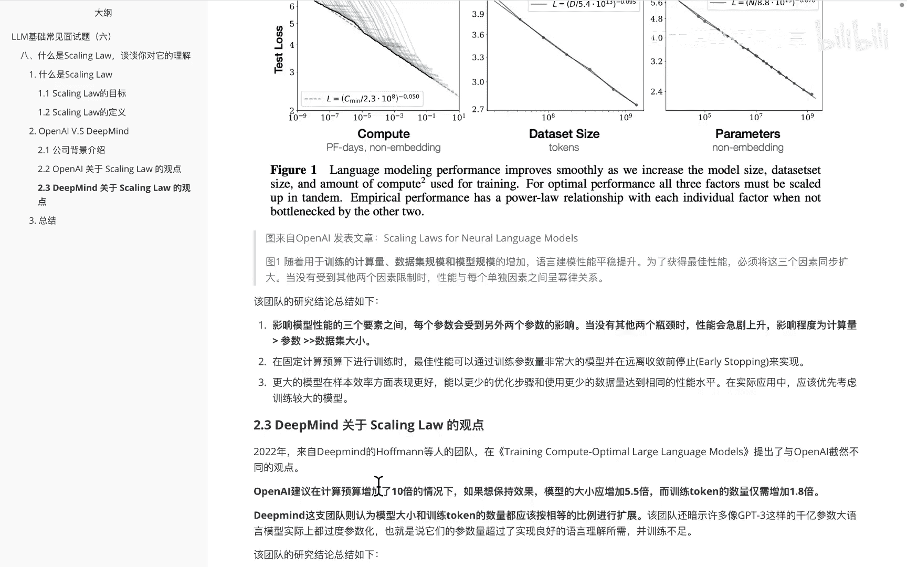

我们再看一下啊，JPM的这家公司，他们关于这个scaling law的一些观点。

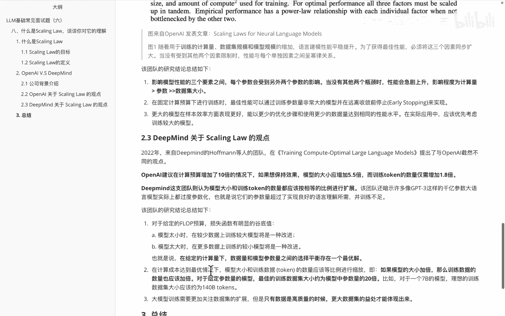

然后他们关于这个scaling law呢，是2022年的时候呢，在啊这么一篇文章中提出的啊，第一个啊，OpenAI当时啊出来的这个文章里面的技术报告呢，建议是在计算预算增加了十倍的情况下。

如果想保持效果的话，模型大小呢他们认为应该增加5。5倍训练，token呢应该增加1。8倍，而depend的这家公司或者这个团队，他们认为模型大小，训练的token的数量，都应该按照等比例进行扩展啊。

同时他们还有一种隐含的意义啊，呃说呃像GBT3这样的一些千亿参数大模型，其实都有些啊过度参数化了，也就是说他们的参数量呢其实超过了，实现良好的语言理解所需并训练不足。

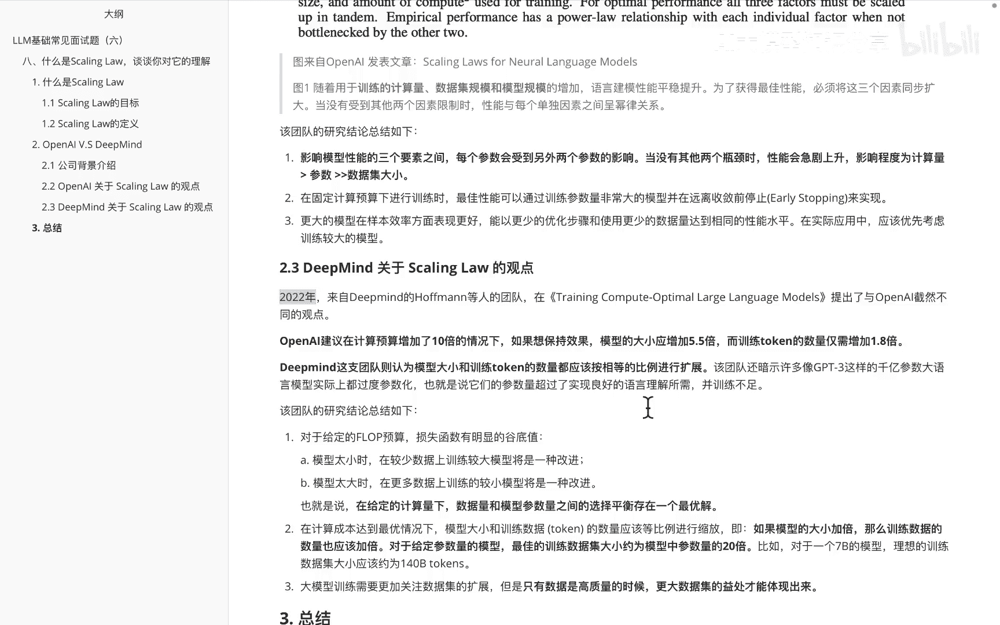

然后这个团队里面得出的结论如下面这些所述，第一个啊关于这个flop的预算，然后嗯基本的结果就是说啊，在给定的计算量下，数据量和模型参数量之间的选择平衡，其实是存在一个最优解的，这是第一个。

然后第二个呢是说呃，在计算成本达到最优的情况下呢，模型大小和训练的数据量，都应该进行一个等比例的缩放啊，后面也给了一个例子，比如说啊如果模型的大小加倍，那么训练的数据数量呢也应该加倍。

对于给定的参数量的模型，最佳的训练数据及大小，约为模型中参数的20倍啊，这个是他们当时研究的一个结果，然后第三个呢啊说的大概意思就是说，呃数数数据集是重要，但是呢他们认为，只有一些高质量的数据集才重要。

对于一些呃脏数据，其实他们觉得没有什么用，或者说给帮助的编辑性，给编著的那些啊。

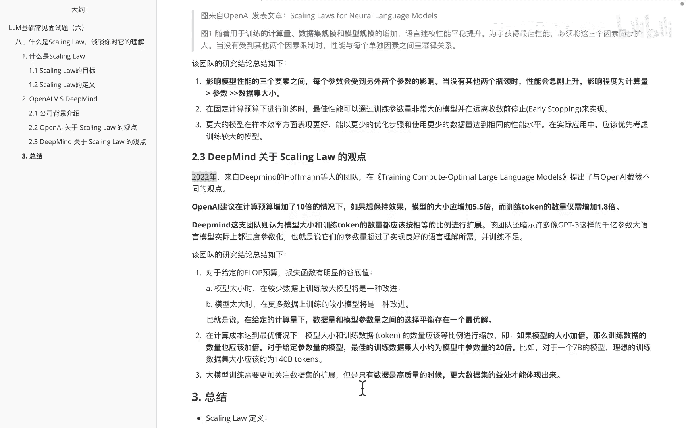

效益比较小，讲到这块之后呢。

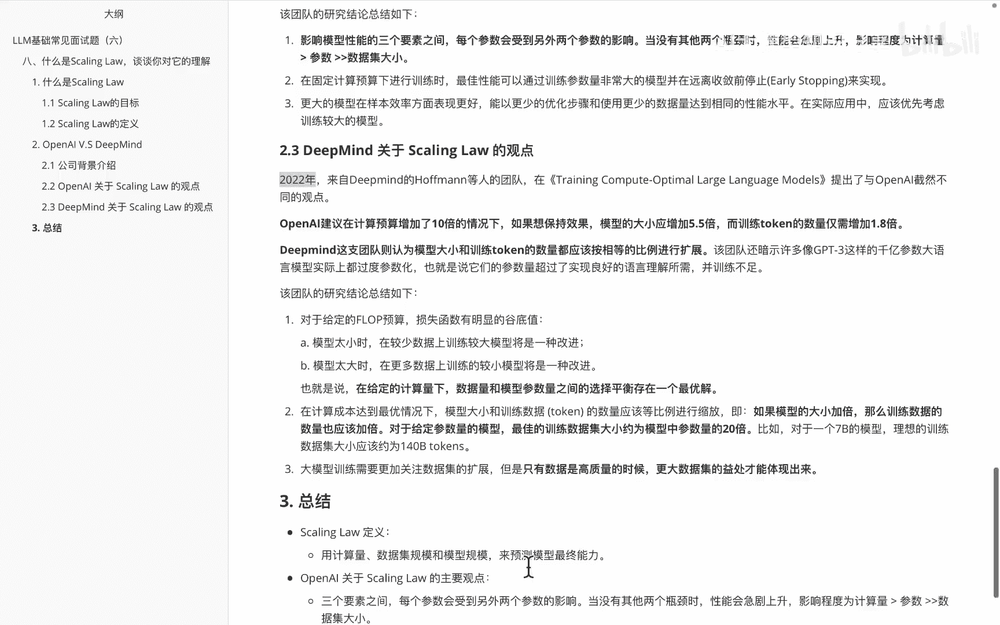

给大家看一下关于这个skin law呢，前面讲的一些内容的总结，首先大家需要知道sky law的一个定义啊，就是呃模型用来衡量，比如说计算量，数据集规模和模型规模，带来最后一个模型预测的最终能力。

这这个为什么在2023年比较火呢，是因为呃2023年呢，很多公司都在做模型的预训练嘛，我们就想知道说模型预训练他们的个边界在哪，所以就需要做这个skin law，那么关于这个skin law呢。

额两家代表性公司OpenAI和deep end，他们之间有不同的观点，OpenAI之间的观点呢，他们是认为说啊三个要素之间，每个参数都会受到另外两个参数的影响，当没有其他两个瓶颈时，性能会急剧上升。

影响程度呢是计算量大于参数量，远大于数据集的大小，而DeepMind的关于skin的观点呢，其实就是说啊。

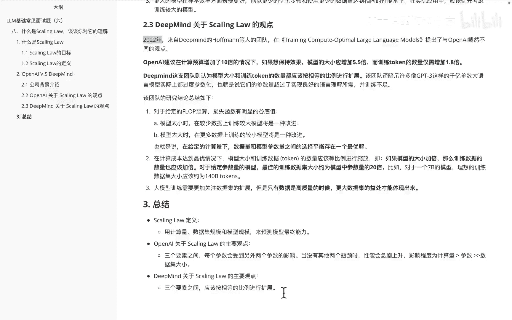