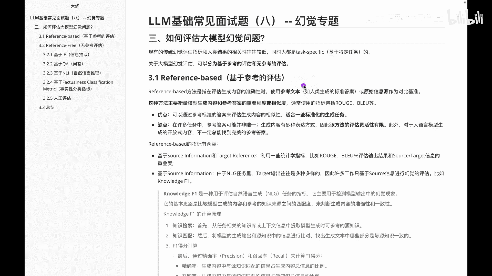
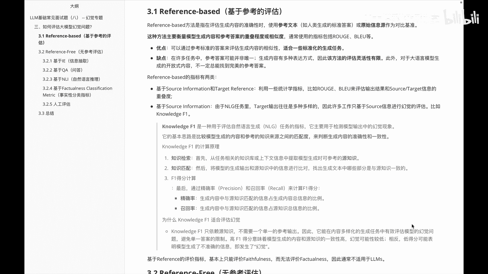
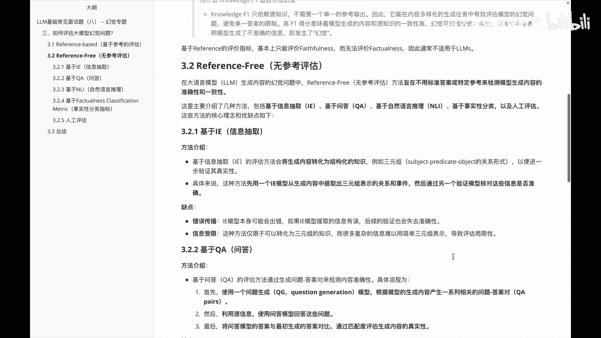
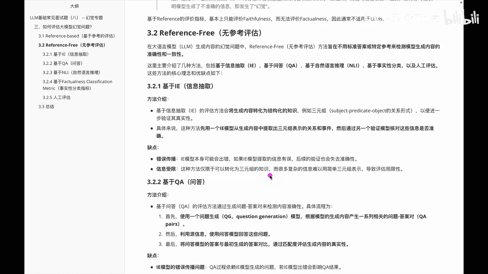
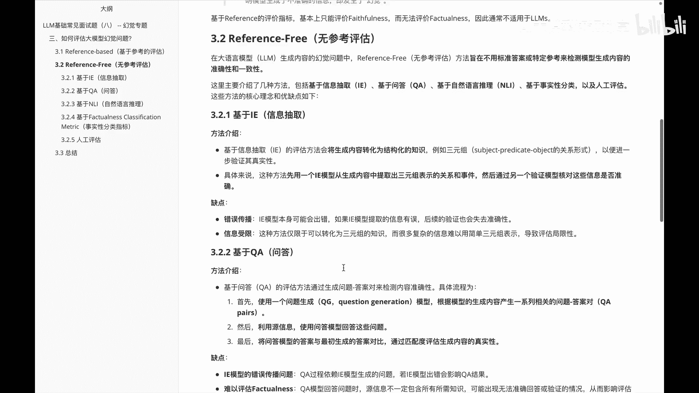
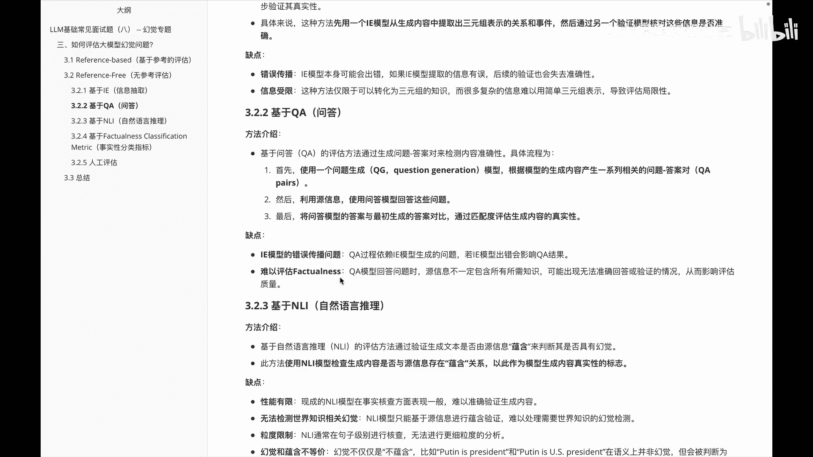
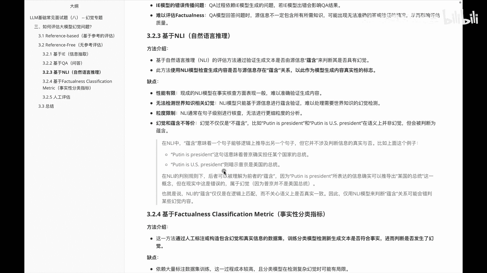
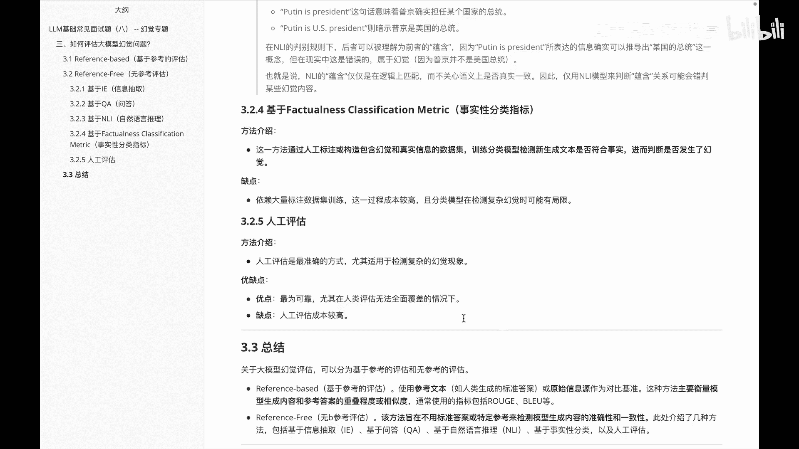
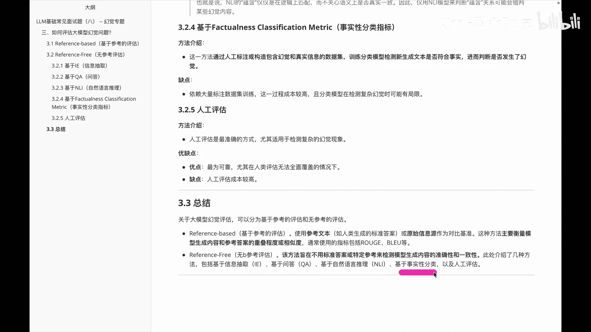

# P8：LLM常见面试题（八） -- 幻觉专题 - 1.LLM常见面试题（八） -- 幻觉专题 - AI大模型知识分享 - BV1UkiiYmEB9

在这个视频中呢，我们还是关注关于这个大模型的幻觉问题，不过呃此视频中我们会给大家讲到的是，关于这个大模型的幻觉问题呢，是该怎么去评估，那么呃关于这种评估呢，其实呃幻觉问题啊之前就有。

并不是说大模型出现之后啊才有的，但是呢之前这种幻觉评估呢，大多数都是基于种特定任务的，那么关于啊大模型评估，其实用特定任务来说效率并不高，或者说它不具有通用性，那此处我们就来看一下呃，关于大模型评估啊。

主要的方法有哪些，此处呢可以分为两种，一种呢基于这种啊参考的评估，还有一种是一种额无参考的评估，那首先我们来看一下关于这种啊，基于参考的评估里边啊，主要讲了什么东西，以及啊又怎么去分的呢。

额基于参考评估里面的话，呃大家可以额见民之意，其实就是基于一个参考的东西嘛，然后基本方法就是使用参考的文本，和原始的信息与原来做一个对比，看一下整体里面它们的一个相似性，或者其他的一些指标嘛。

那呃常用的指标呢有什么呢，有run on blue啊，这些方法，这个呃基于参考的评估的优点呢，就是适合一些标准化的一种生成任务，但是缺点呢它就是呃如果有一个任务，他身边的答案呢并不是唯一的。

此时我们会发现，它就并不适用于我们这种评估了，然后基于参考的评估呢，它的指标主要可以分成两类，一类型呢是呃，用这种原信息和他的目标生成内容，来做一个对比，然后通过一些土地习的指标来完成。

比如range blue来完成，然后另外一种呢是哎我们只用这种原信息来做，然后这种里面的话，因为他的这种生成的任务呢是多种多样的，所以呢它只能通过这种啊，圆的信息来进行一个评估。

比如说啊这个knowledge f1，那么如果大家啊对这个knowledge f1不知道的话，我在这简单说一下它的基本思路呢，其实就是用来比较啊模型的一个深沉的内容，和参考的知识来源之间的一个匹配度。

进而判断生成内容的一个准确性和一致性，下面这块呢是关于这个knowledge f1，的一个基本的计算原理，大家如果感兴趣可以暂停视频来看一看，OK这是关于呃基于参考的一个评估内容。

的一个呃评估幻觉问题的讲解，那下面我们来看一下关于这种呃无参考评估。

它又是怎么来进行啊，评估整个这个幻觉问题的，那么在额这种无参考评估里面呢，它的方法呢就是呃不用这种标准答案或者，特定参考来检测模型生成内容的，一个准确性和一致性的，在这里面给大家介绍这么几种方法。

一个是关于这种IE信息抽取的，还有基于问答的，基于自然语言推理的，基于事实分类的，以及基于人工评估的，啧，那我们首先看一下关于这个基于信息抽取的，信息抽取嘛，哎就是啊抽取出来固定的信息来看一下。

基本有没有一个幻觉，他的评估方法呢，就是把生成内容呢转化成一个结构化的知识，比如说啊三元组来核验它的真实性，具体来说呢就是我们先用一个信息抽取的模型，从这个生成内容中提取出一些三元组的。

一些表示的关系和事件，然后通过另外一个验证模型，核对这些信息是否准确，那大家听完这个就能知道他的一些缺点，第一个缺点就是这种错误的传播，因为这个命名哎，信息抽取里边它本来就会有一些出错嘛。

那如果它出错了的话，呃自然而然在检测幻觉就失效了嘛，再一个就是信息受限，因为我们这种评估方法，它仅限于可以转换成三元组的知识，如果说没法转换。

此时就没法去评估，讲完这个我们再看一下下面另外一种评估方法。

就是这个基于QA基于问答的，基于问答呢，它的一个方法呢就是，首先啊我们基于一个问题生成的模型，然后根据模型的生成内容，产生一系列的相关问题答案对，然后我们利用原信息使问，使用这个问答模型回答这些问题。

将回答模型的答案与最初试的答案做个对比，如果说匹配，那就是OK如果不匹配，他这边就不行，然后这个基于问答这种东西的缺点呢，第一个就是我们需要用到这种呃，信息抽取的这些知识，此时信息抽取如果出错了。

那很明显我们这个问答模型也会失效，第二个就是他是比较难去评估这种啊，Factoniss，这个是咱们上节课讲的这个里边儿的，一些事实性的问题，如果说呃他要评估的话，基于问答也是不好去评估的。

那么讲完上面这个之后呢，我们再看一下啊，基于这种自然语言推理的一个评估方法，基于自然语言推理的方法里边，其实它主要用了一个啊蕴含的关系，那什么是蕴含呢，其实就是说意味着一个句子。

能够在逻辑上推导出另外一个句子，此时表代表着他们有蕴含关系，但是这个其实会有个问题啊，就是啊幻觉并不等价于蕴含，后面呢会给大家举一个反例啊，大家知道一下这个内容就可以，那么说完我们就看一下它的一些缺点。

第一个它是性能有限的，因为呃现有的这种啊自然语言推理的模型，在事实核查方面呢表现比较一般，因为它难以去准确验证生成的内容，啧，下一个呢就是他无法去验证呃，世界知识相关的一个幻觉。

再一个就是他的一个力度限制他啊，只能在句子级别来进行核查细粒度的啊，做不到了，最后一个就是关于这个幻觉和蕴含的不等价，下面这个举了个例子，就是说呃第一个例子，比如说啊说普京是个总统。

再一个就是说啊普京是美国的总统总统，但很明显下面这个是错的，但是因为它们是有蕴含关系的，呃此时判断的时候呢，通过自然语言推理这种方式呢，会发现并检测不出来这种幻觉问题。

在下面给大家讲的是关于这种事实性的一个，分类的指标啊，事实性分类嘛很哎到这啊事实进行分类嘛，很明显就是基于分类来做，那分类这边的话，其实他就是要训练一个分类的一个模型，那此时它的一个缺点就是一啊。

我们训练这个分类模型，并不是说，所有的这种东西都可以通过分类来做的，二只要分类就需要做数据标注，成本比较高，然后下一个是关于这种人工评估的人工评估啊，它虽然说准确方面非常OK。

但是这个时候呢成本是非常高的。

OK讲完这些之后呢，我们来看一下呃，咱们在这个视频里面给大家讲的所有的内容，这里边主要给大家讲的是，关于这个大模型的一个幻觉评估，然后我们分成了基于这种参考的评估和，无参考的评估，那么基于参考的评估呢。

其实就是使用中参考文本和原始信息源，作为一个对比机种，然后这种方法呢主要是衡量一些模型生成内容，和参考答案的一个重叠程度和相似度，然后基于这种无参考的评估呢，这个方法主要是不用标准答案或特定参考。

来检测模型生成内容的准确性和一致性，然后在这个里面给大家介绍了啊一堆的方法，但是呢好多都有缺点啊，就是其实就是它的一些约束性嘛，一个是啊信息抽取，再一个是基于问答的，还有基于自然语言推理的。

