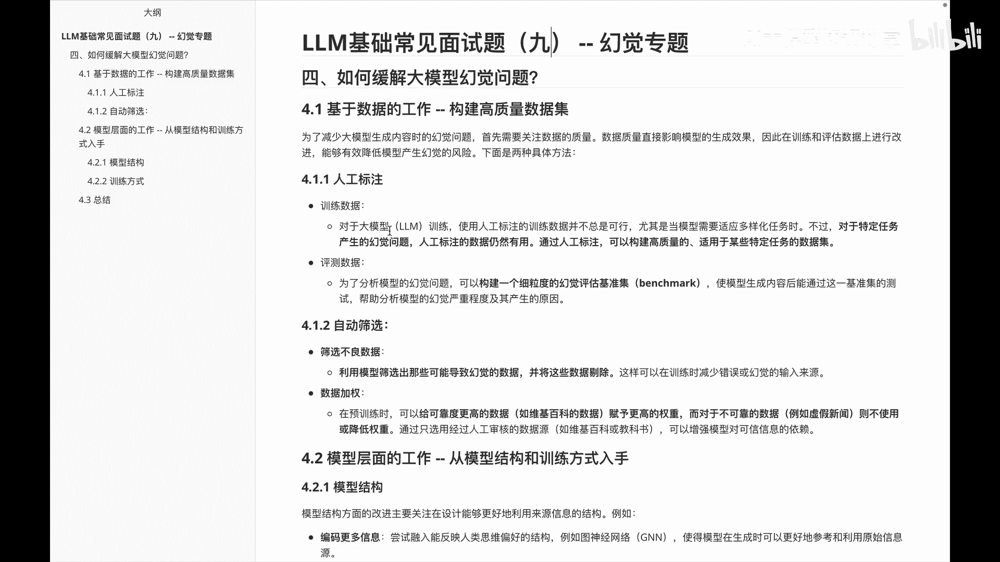
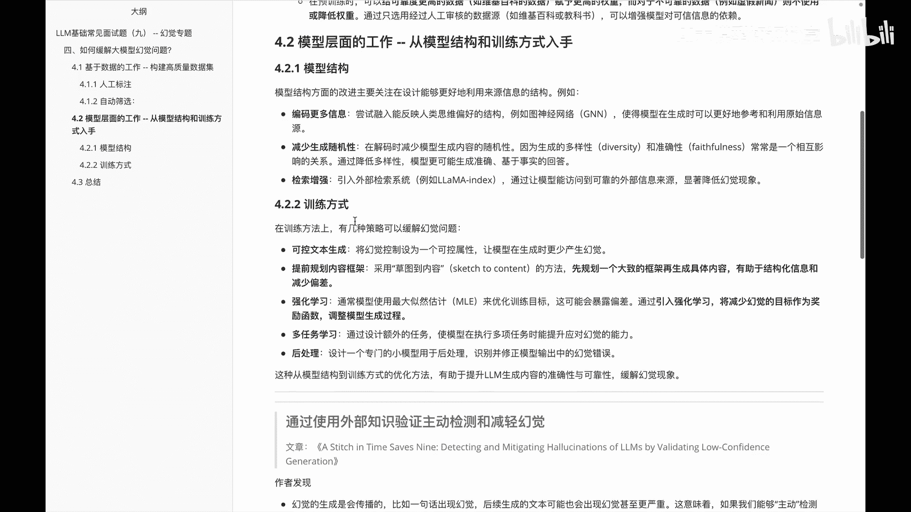
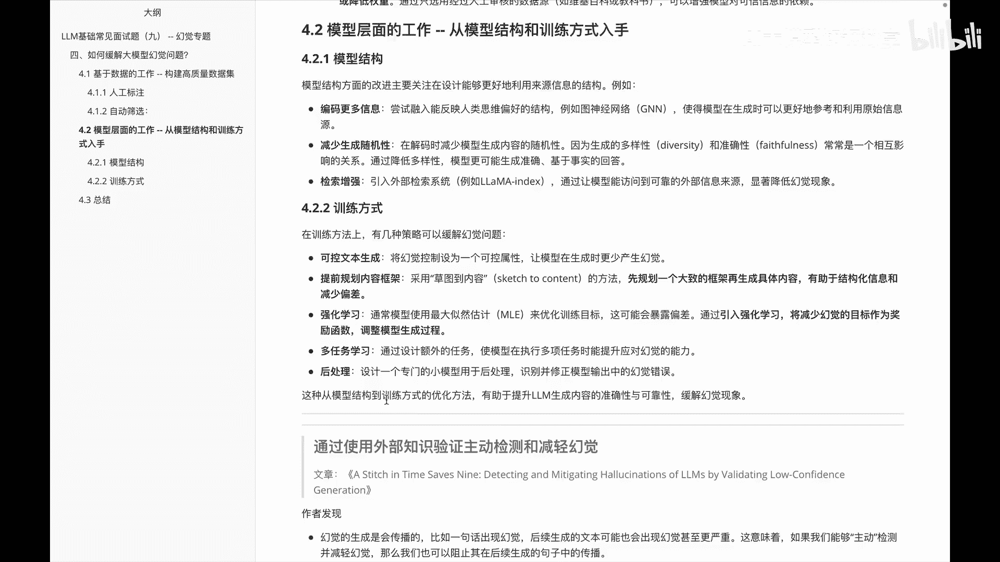
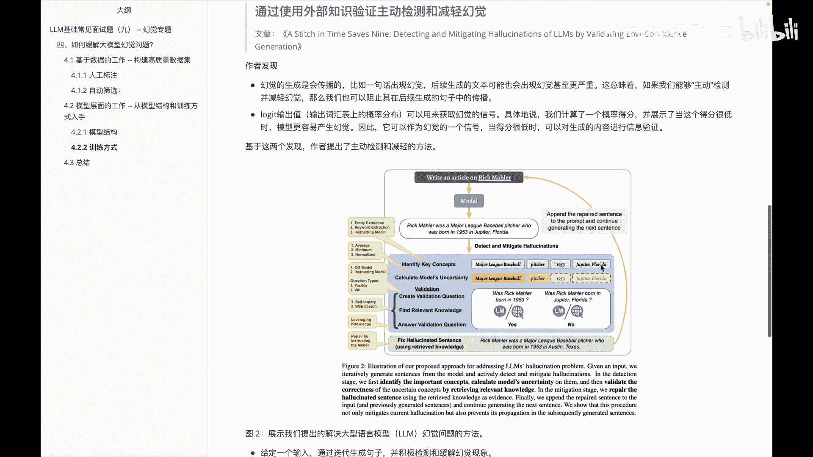
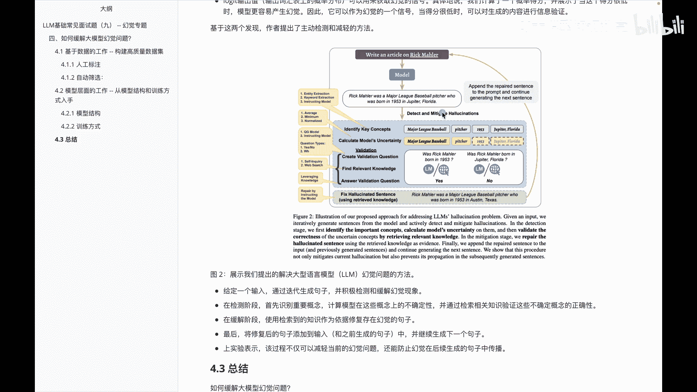
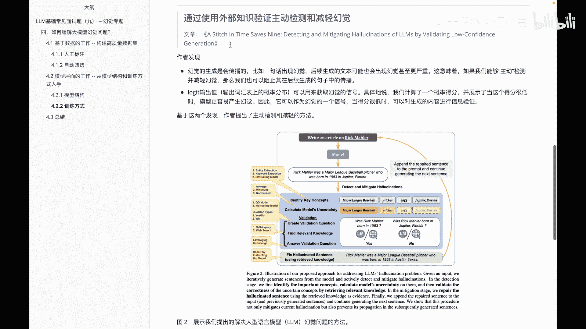
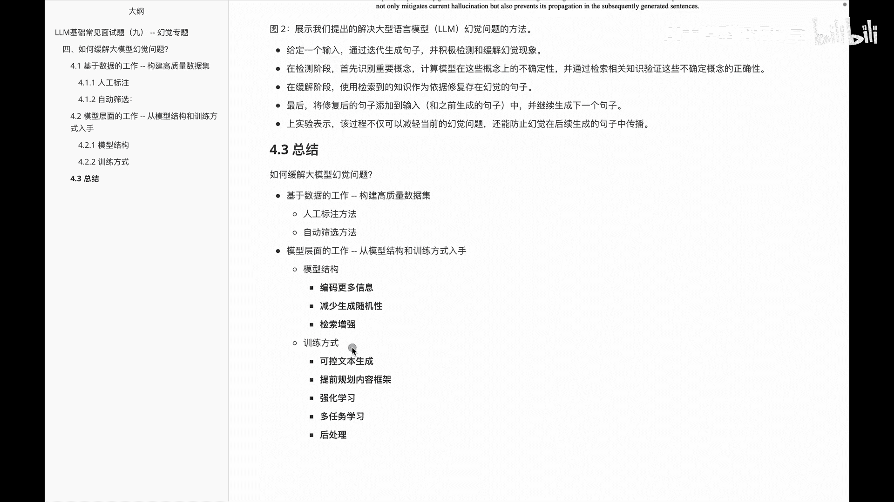

# P9：LLM常见面试题（九） -- 幻觉专题 - 1.LLM常见面试题（九） -- 幻觉专题 - AI大模型知识分享 - BV1UkiiYmEB9

这个视频呢我们接着分享幻觉专题里边如何缓解大模型的幻觉问题。我们会从呃数据层面和模型层面两个方面给大家去啊分享该怎么去缓解。那么首先从数据方面来看的话，其实主要目标就是啊构建这种高质量的数据集。

那么关于这里边主要有两种方法，一个是人工标注，另外一个是通过啊自动筛选。那么在人工标注里面的话，呃，我们先看看关于训练数据啊，训练数据呢其实呃对于大语言模型的训练来说，呃，使用人工标注的训练数据呢。

并不是啊总是OK的。尤其是当一些模型需要适应这种多样化的任务的时候。但是对于一些特定的任务产生的幻觉问题呢，我们人工做标注仍然是OK的。因为它这边的话呃构建的数据呢质量比较高。

而且也没有要求说要很多量的一些数据。😊，那么在呃评测数据里边的话，我们主要是为了啊分析模型的一个幻觉问题，构建一个细粒度的评估幻觉的一个基种集。然后基于这个基种集呢，我们可以进一步去啊缓解大模型幻觉。

然后做到一个优化。然后第二个呢是通过呃自动筛选的方式来完成这个数据集的构建。然后首先筛选这种不良的数据集，利用模型筛选出那些可能导致幻觉的数据，然后把这些数据给删了。再一个呢是关于数据加权。

就是我们给一些啊认为质量更高的数据集给它做一个权重的提高。而对于一些质量不高的，可能还有脏数据的数据集呢，给它家做一些啊降权的处理。😊，这块呢是关于呃数据的一个呃构造，然后缓解大模型的一个幻觉。

那我们接着看一下啊，我们从模型层面来看，怎么可以啊缓解这个大模型的幻觉呢？

然后在模型层面的话，主要从模型结构和训练的方式两方面来看。在模型结构里边的话，第一方面就是尝试在模型里面编码更多的信息。比如说啊融入能反映人类思维偏好的结构啊。

JN使得模型在生成时可以更好的参考和利用一些原始的信息。😊，另外一个呢是啊减少这种生成的随机性。记得前面给大家讲过，通过top P的方式来生成，有时候呢会带来一些随机性，导致我们产生幻觉。

那这个时候呢把这种东西给减少，此时也可以减少幻觉。但是这是一个博弈性问题啊，就看你要更多的多样性还是呃幻觉更少一些。😊，再一个呢是啊解锁增强做RE。那么在节索增强里面的话，其实呃现在用的比较不错。

比如laine index啊，lanch啊这块的东西，然后这种方式也是可以在某种程度上减少模型的幻觉的。下一个呢是关于这种训练方式。训练方式里面在这儿给大家罗列了几些啊。

一个是啊通过这种呃可控的文本生成。另外一个呢是提前规划好我们要的一个内容框架。然后至少知道了框架之后，让我们在生成一些信息的时候呢，减少偏差。再一个呢是用强化学习。还有呢做一些啊多任务的学习。

以及对我们生成之后呢，做一个后处理，方便我们在模型产出之后呢，比如说我们做一个识别修正或者做一个判断。😊。

那么接着给大家要分享的一个是什么呢？是呃一篇paper，就是它这边主要是怎么做的来呃去缓解这个大摩细的幻觉。并不是说只有这种方法，只是呃我这边看到这个视频啊，这个paper还讲的不错。

所以呢给大家放到这里边。它的一个主要思想呢，其实就是通过一些外部的知识验证来做主动检测和减轻幻觉。😊，然后作者呢在发现他的幻觉呢是可以传播的。比如说第一句话产生了幻觉。

那么后续的生成的文本里面大概率也会出现幻觉，甚至会出现这种啊牛鞭效应。就是我的幻觉会越传越越严重。那怎么做呢？就是通过这种啊loggs输出值来获取这个幻觉的信号。具体而言就是他们计算了一个概率得分。

展示了当这个得分很低的时候啊，模型是非常容易产生幻觉的。因此可以作为幻觉这个信号。当得分很低的时候呢，对生成的内容进行一个信息验证。😊。

然后基于这块呃的一个基本的操作流程，就如啊大家看到的这个图一样。那么我们来看一下，首先是啊给定一个输入，通过迭代生成句子来检积极检验和缓解幻觉现象。

然后在检验阶段呢呃识别一些重要的概念计算模型在这个概念的不确定性。通过检索相关知识，验证这个不确定性的一个概念的正确性。

那么在还原阶段阶段呢，是使用检测的知识作为依据修复存在的幻句的句子。最后呢把这个修复的句子呢添加到我们下一句里边，然后做一个生成。😊，整体大家可以看到。

比如说在这里面有一个module过来之后呢啊基于这个句话生成之后呢，我们再做一个验证。比如说验证它是否是啊1953年出生的，以及是否出生在佛罗里达，发现他确实是啊1953年出身。

但是通过一些网上的知识发现他并不是出生在啊佛罗里达。那么这个里面给他做一个修正，修正完成之后呢，哎再返回让他继续生成。这就是这个 paperper里面他讲的一个呃思维。大家感兴趣呢，也可以去啊看一看。

😊。

OK那么呃在这个视频里面主要给大家讲的是关于啊怎么去缓解大模型的幻觉问题。然后分别从呃数据的维度以及模型的维度两方面去给大家看的。那么在数据维度的话，给大家分享了下关于呃人工标注方法和自动筛选方法。

两种方式。在模型层面的话，从模型结构和训练方式两方面给大家去讲了讲怎么去缓解幻觉。😊。

