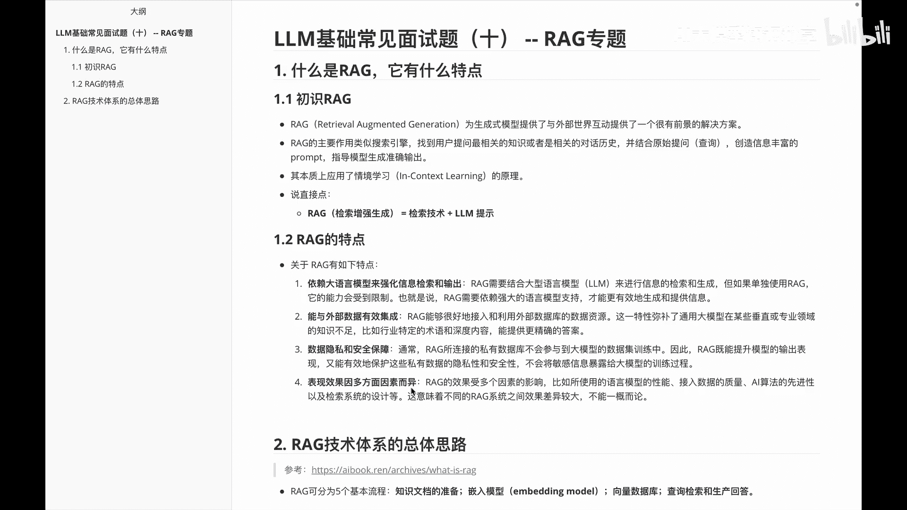
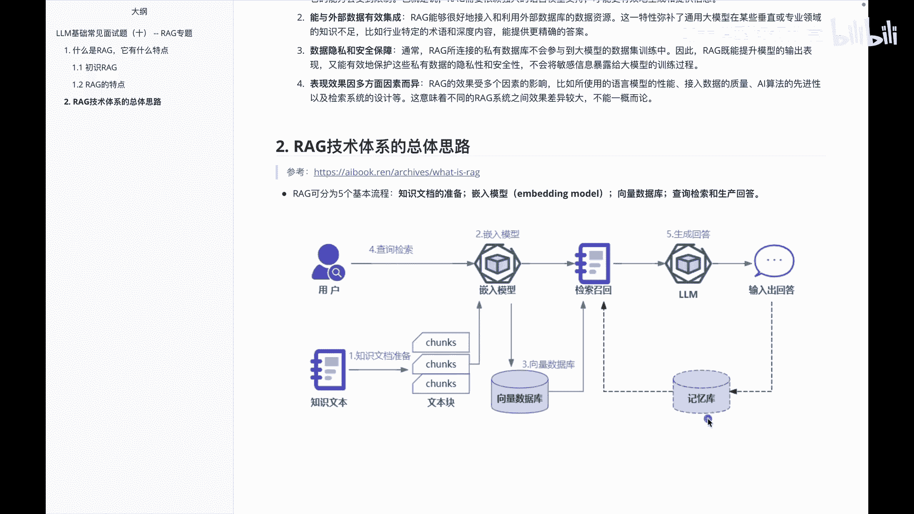
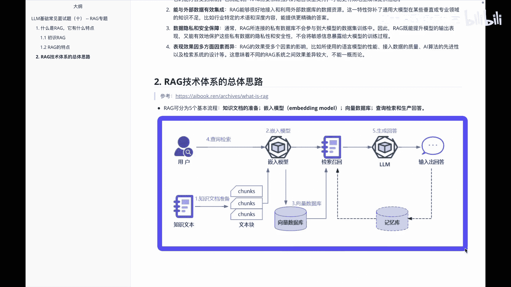

# P10：LLM基础常见面试题（十） -- RAG专题 - 1.LLM基础常见面试题（十） -- RAG专题 - AI大模型知识分享 - BV1UkiiYmEB9

Hello，各位从这个视频开始呢，我们进入了RAG专题，然后这块里面会给大家讲一下，关于RG的基本内容，以及RG相关的一些特点，以及我们IG怎么去做一些基本的搭建，那么首先我们看第一个题。

就是说哎什么是IG以及它有什么特点呢，啊RAG其实它对应的就是啊三个单词，分别代言的是检索啊，增强生成，基本定义就是啊，深圳式模型提供了与外界是与外部世界互动，然后整体是有一个比较有前景的解决方案。

IG的主要作用呢其实类似于一个搜索引擎，用快速的找到用户提问相关的一些知识，或者相关的一些对话历史，结合原用户的原始问题，创造信息丰富的一些proper，最后呢啊准确的输出。

它的本质呢其实还是一个in contents learning，就是说情景学习说的更直接点，或者大家需要记住的就是RG是什么呢，其实大家可以理解成RAG嘛，就是啊检索增强。

就是检索技术加大模型的一个提示，所以说他这边其实就是检索技术，加大于原模型的一个提示，这是RG的一个通俗理解，那么它到底有什么特点呢，啊在这给大家罗列了一些相关他的特点，第一个他这边说他的依赖呢。

其实是依赖大语言模型，来强化信息检索和输出的，这是RG的第一个特点，然后第二个特点呢啊，它是能够与外部的一些数据做一个有效的集成，第三个是IG这边的话，它可以保护一些数据的隐私，同时有安全保障。

因为我们可以通过一些啊自己的私有数据库，然后和我们的大摸起来连接，然后第四个呢就是说他的表现效果呢，因为接入的大模型不同，然后呢会有不同的一些啊表现形式，这个大家需要知道一下。

OK那么知道了我们额什么是RG。

以及它有什么特点，下面呢我们来看一下，关于RG这个体系的一个总体思路，呃，这个总体思路呢是呃，我参考了AI book里边的一个呃一个一个介绍，然后他把R键呢分成基本五个流程，首先是关于知识文档的准备。

再到一个embedding model的一个嵌入模型，再到向量数据库，最后呢是查询检索和生成答案，我们首先看一下啊，相当于这儿有一个知识文本，从这个知识文本呢做一个知识文本的track，就是做文本块嘛。

然后把这些块呢切入到模型里面，当然这个时候呢，它是同时有用户的一些查询的检索输入的，那把这些东西嵌入模型之后呢，我们把这些数据呢做成一个向量数据库，然后有了这个向量数据库的内容。

再做一个啊基于用户的一个查询解锁的问题，做一个解锁召回，然后检索召回之后呢，基于我的检索召回内容，最后生成就是g generation，生成相应的答案，最后输出对应的的结果，在输出这个结果里面的话。

如果说涉及到多轮的话，我们会把这些东西呢啊存到一个memory库里面去，方便我下次再做一个使用，这是关于IG技术的一个总体的思路啊。

其实就是从啊知识文档的准备。

再到切入模型，再到向量数据库，再到查询检索和深圳回答。

