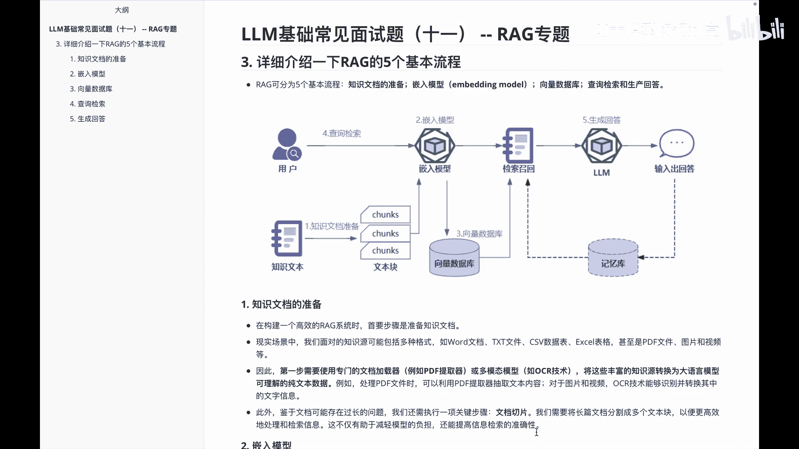
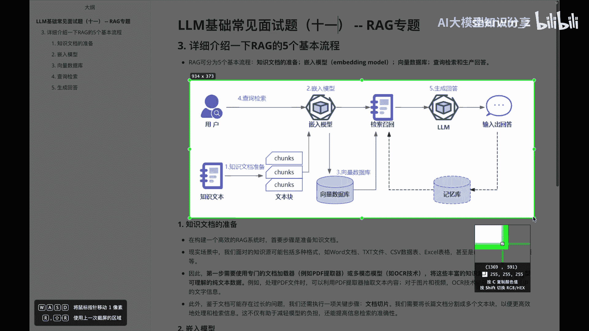
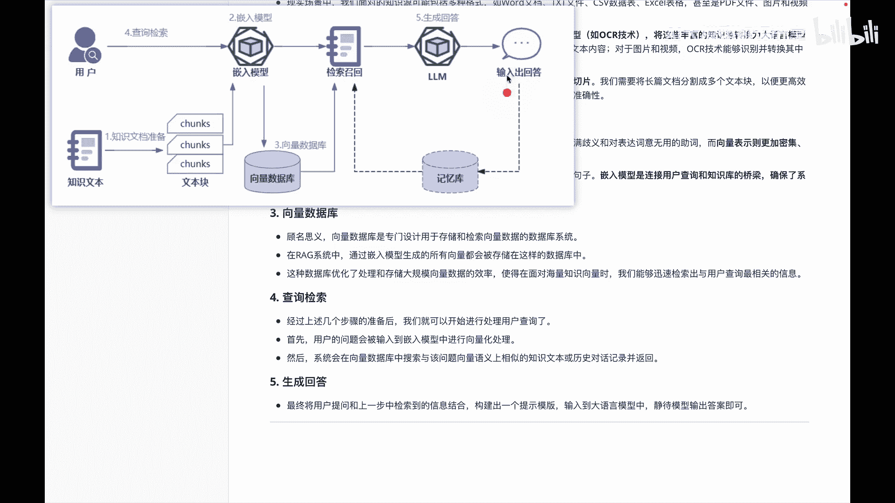

# P11：LLM基础常见面试题（十一） -- RAG专题 - 1.LLM基础常见面试题（十一） -- RAG专题 - AI大模型知识分享 - BV1UkiiYmEB9

哈喽各位我们书接上回啊，上一个视频录完之后呢，啊有伙伴反映说，想让讲一讲，关于这个lg里面的五个基本流程的一个，详细介绍，那我们啊接着给大家在这个视频里面说一说，我们知道关于RG里面的基本流程啊。

分别分为啊知识文档的准备好，嵌入模型向量数据库查询检索和生产，回答它的里边的一个基本的啊图呢，就是这么一个构建的流程，然后我们分别看一下各个小细节里面内容，首先第一块是关于这个知识文档的准备。

其实关于知识文档准备呢，呃大家就可以想到我们平常用到的，比如说一些TXT文件，像cs文件啊，excel等等相关的数据呢，其实都算是我们的一些知识文档的准备的，里边内容，那么我们看一下细节。

然后在这个里边我们面对的啊包含内容，就如我前面说的一样啊，包含了很多东西对吧，所以我们第一步需要做的，其实是专门做一个文档的加载器，例如说啊PDF或者说啊，多模态里面的图片的OCR技术相关内容。

然后我们把这些丰富的知识源呢，转换为我们大圆模型可理解的一个纯文本数据，经过这些数据之后呢，呃我们转换之后还需要做另外一件事，就是a truck叫文本切片，因为我们有的文档呢它可能比较长。

我们在这个里面需要给它分割成多个，这种文本块，以便啊更加高效地处理它的信息，这样呢我们在处理的时候呢，减轻整个模型的负担，让信息检索呢更加准确一些，这是咱们给大家讲到。

关于这块里面的一个知识文档准备，然后我给大家把这个图呢额截图。

我们放到呃这个位置，然后我们接着看一下，刚刚第一块是知识文档的准备，第二块呢是关于切入模型的介绍，其实就是这块的东西，那么在切入模型里边的话，呃，我们说它的核心任务呢，其实就是把这个文本转化为向量形式。

我们平常使用的一些语言里边，包含一些充满了歧词，歧义啊，或者说一些啊语气助词啊，那么我们要在嵌入模型里面把这些文本内容啊，通过向量的方式进行表达，这样可以更加的密集精确，能够捕捉到句子的上下文关系。

和一些核心的含义，然后在这个转化的过程中啊，它可以让我们怎么样呢，让我们能够通过简单计算向量之间的差差异，来识别这种句子的这个相似性，嵌入模型是连接用户查询和知识库的一个桥梁。

确保我们系统回答的一个准确性和相关性，这是咱们嵌入模型这块内容，那接着我们来看一下关于这个里面的呃，向量数据库，向量数据库啊，其实就是用来存储和检索，向量数据库里面的一些内容，然后我们在这个RG里边。

通过嵌入模型生成的所有向量，都会到存到这个里边来，通过这种啊数据库优化处理和存储，大量的一些向量数据，这样我们在检索的时候就会效率更高一些，那么从下来之后呢，啊后面呢其实就是应该啊怎么用了，其实分两步。

一个是查询检索，后面的深圳回答，查询检索呢就是我们通过用户的输入，把嵌入到模型中进行一个向量化的处理，然后啊系统会在向量数据库中检索，与该问题比较相似内容，返回其实就是返回一些track。

那基于这些trunk的话，我们会在啊第五阶段生成回答里边，通过大模型来做一个啊生成就OK，那基本流程就是我就记事文本，基于知识文本来准备不同的track，有了先track之后呢。

我们再通过啊嵌入模型做embedding，然后把这些embedding内容呢啊，放到向量向量数据库里边，那放到向量数据库里面之后呢，我们再通过这个里面做一个检索召回，根据用户的一个查询输入。

做检索召回之后呢，基于大模型来深圳回答来输出答案，根据内容，为了上写文，我们有时候要把这个书的回答放到memory库里面。

