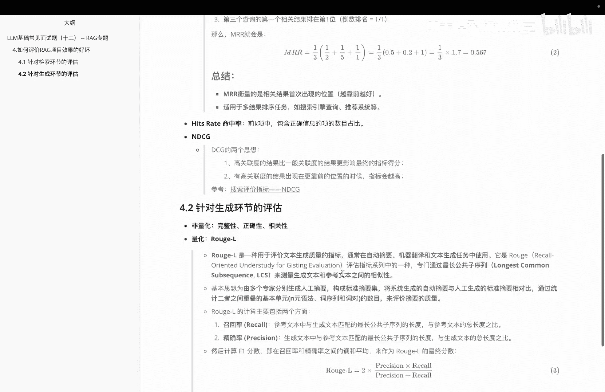

# P12：LLM基础常见面试题（十二） -- [RAG]如何评价RAG项目效果的好坏 - 1.LLM基础常见面试题（十二） -- [RAG]如何评价RAG项目效果的好坏( - AI大模型知识分享 - BV1UkiiYmEB9

Hello，各位嗯，这个视频里面的话，我们给大家讲一下，关于IG里边怎么去啊，评价我们IG的一个项目的效果好坏呢，然后我们会从两方面给大家做一个介绍，一个是针对咱们前面说到的检索环节的评估。

另外一个是针对咱们生存环境的评估，那我们首先看一下针对这个检索环节，在解锁环节里边的话，呃，第一个要给大家介绍的这个指标呢，叫MR是平均倒数排名，它呢主要目的是查询。

或者说啊推荐请求的一个啊排名的倒数的情况，具体来看一下，我们说这个平均倒数排名呢，它一般是一些常用的评估这种信息检索的系统，表现的指标，然后主要用于啊衡量搜索引擎推荐系统。

这些根据查询返回的多个结果中的相关性，然后呃看一下它的意义啊，这个里面的话MR这个值呢啊越高，表示说系统对用户的查询的响应就越好，然后因为第一个相关结果呢，更可能出现在较高的一个排名的位置。

然后如果第一个相关结果排名在前几个位置，那么倒数排名接近一会提高这个MR2值，然后如果第一个啊相关结果排的很靠后，此时这个MRR值呢就比较低，这个呢是一个举例，大家来一起看一下。

我们假设第一个查询的相关结果排在了第二位，此时他这个就是1/2，如果说啊第一个查验结果排在第五位，他就是1/5，那么假设说啊第三个查询呢，第一个相关结果呢排在第一位，他倒数排名就是1/1。

然后M2的计算呢，就是我基于这几次来1/3乘以上，他们个求和得到一个整体结果，比如说这次的话就是0。567。

那我们看一下关于这个M2里面，它一个整体的总结，大家会发现主要说的是这么几个，第一个M2的衡量结果是相关结果，首次出现的位置越靠前越好，第二个它呢适用于一些多结果的排序任务，如搜索引擎查询和推荐系统等。

当然我们这里边的话，因为咱们是在做一个检索嘛，所以检索这边的话也是没问题可用的。

除了这个指标之后呢，我们接着看一下第二指标呢，这边叫呃hit rate，这个其实很好理解，就是个命中率，就是前K项中包含正确信息的，一个项的一个额数目占比，下一个指标呢叫NDCGDCG的思想呢啊。

介绍完大家应该对NDCG呢就啊有一个了解，第一个就是高关联度的结果呢，比一般关联的结果呢更形象，最终的一个指标得分，第二个是有高关联度的结果呢，出现在更靠前的位置的时候呢，指标就会越高。

所以它其实主要就是我尽量让高关联的结果呢，哎尽量处在靠前的位置就OK。

那么讲完关于这个呃，检索环节的一个评估之后呢，我们再看一下关于生成环境的评估。

在宣传环节里面的话，咱们分别会介绍一下非量化的和量化的，非量化这边的话啊，就是啊什么完整性啊，正确性啊，相关性啊，这种指标，一般这种指标呢需要通过啊专家打分，就是说人工来进行一个评估，那关于量化的话啊。

这给大家说一个常用的就是ROGL，那么ROGL呢，它这边主要是用于评价，文本生成质量的一个指标，常用在呢什么自动摘要啊，机器翻译啊，文本生成任务里面，然后他的一个底层原理呢。

主要是通过最长公共子序列来检测，我的生成文本和参考文本之间的相似性，基本思想呢就是啊由多个专家啊，分别生成人工摘要，然后呢构成一个标准的摘要集，接着呢，将系统生成的自动摘要。

与人工生成的标准摘要进行一个对比，通过这种统计这两者之间的重叠的，基本单元的数目来评价，最后摘要的这个质量在计算ROGUL里面的话，它里面会包含两个值，一个是关于record。

一个是PRECIATION，就召回率和精确率，那基本的计算结果呢，其实啊有点类似于F1score，大家可以看到这里边的话，就是通过它来计算整个内容，最后要给大家说的是关于这个RT l呢。

它主要注重的是最长公共子序列，也就是说它意味着要比什么range1和range2，更能衡量我文本生成的结构和顺序，是否与参考文本接近，因此它在衡量文段的连贯性和句子的顺序上呢，比较有优势。

这个视频里面啊，主要给大家介绍的就是关于我们怎么去啊。

评价这个RG项目里面效果的好坏。

然后分别给大家从检索环节和生存环节，介绍了一些指标，那么检索环节里面。

我们介绍了MR这个平均倒数排名，以及hit rate n DC g。

然后在生存环境里面，我分成非量化和量化，非量化这边的话介绍来完整性，正确性，相关性。

