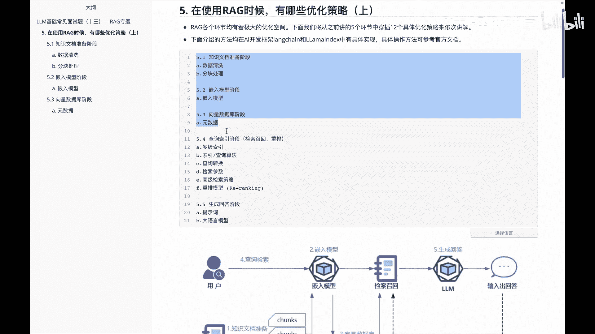

# P13：# LLM基础常见面试题（十三） -- RAG专题 - 1.# LLM基础常见面试题（十三） -- RAG专题( - AI大模型知识分享 - BV1UkiiYmEB9

Hello，各位啊，在前面的这个视频里面呢，我们在lg的专题里边给大家讲了一下，关于lg的一些啊定义啊，特性啊，以及IG里面的流程，还有IG里面对应的一些评估的指标，那么呃接下来我们会给大家分享一下。

关于IG里边如果做优化的话，有哪些优化的策略呢，因为这块内容呢比较多啊，所以呢我会把这块东西啊分成几部分来讲，呃先计划呢分成三部分，分别是啊上中下，其实IG的各个环节里边。

它的优化还是啊使用的方法挺多的，我们会啊通过五个环节里面啊，具体的穿插出十几个具体的优化方案，来给大家啊一个一个的介绍，那在额下面介绍一些所有的方法里面的话啊。

都可以通过long chan或者la index来做一个整体的实现，大家可以看到啊，这块儿里面东西就是啊，我想给大家分享的关于啊lg里面的优化内容，分别对应的知识文档的准备阶段里面啊，数据清洗有关优化。

还有分块处理的优化，以及啊在嵌入模型里面的话，关于嵌入模型该怎么去做优化，还有是在啊向量数据库阶段里面的话，我们怎么去啊存储一些原数据来做一些优化，以及在查询所有阶段里边。

当然这个里面也包含解锁招牌和重排啊，这一系列相关的优化，还有就是啊，深职回答阶段里面的提示词和大语言模型，相关内容，那么呃我们在这个里边呃，主要给大家分享的其实是关于，这是文档准备阶段。

嵌入模型阶段和向量数据库阶段里面啊，怎么优化的一些方案啊。

这个图呢是放这方便大家去更好的理解的。

那首先我们来看第一块啊，就是这个知识文档准备阶段，这个里边可以怎么来做一些优化呢，其实在知识文档准备阶段里面的话，呃，可切入的优化点主要有两个，一个是基于数据清洗。

另外一个呢是基于分块处理，那我们首先看一下关于啊数据清洗这块啊。

可以怎么做优化呢，我们知道啊，数据清洗呢其实是为了让模型更好的去啊，识别出我的这些原始的数据，它主要是为了啊保证我的数据的准确性，那么我们需要这个优化文档里边的话，其实就是我怎么去优化这个文档的读取器。

和这个多模态的模型拿啊，下面这个举例，比如说啊CSV表格，如果我们只是单纯的做这种呃文本转化的话，可能会丢失啊，原有的一些结构，比如我们知道CSV这边，默认它是通过一些逗号来分割的。

那这个时候会和原来的文本里面，逗号呢可能做一些混合，啧，这个时候呢啊我们就需要引入一些额外的机制，然后恢复我们这个表格的结构，以让整体更好的识别表格里面的数据，另一方面呢，哦我们也需要对一些啊知识文档。

做一些基本的数据清洗，那下面这一系列呢，其实就是啊数据清洗的一些啊方法，我们挨个都过一下，第一块是关于这个叫基本的文本清理，比如说啊规范文本格式，好去除一些特殊字符不相关信息。

还有重复的一些文档冗余信息，另外一块呢是关于这种实体的解析，比如说我们要啊消除实体和术语的歧义，然后我们实现一致的一个引用，比如说啊LLM大语言模型，大模型，他们其实嗯表达的可能是一个意思。

但是如果呃我们文档里面的话，多的时候不同的人会用不同的称呼，这块呢建议大家去做一个规范化，再一块呢是关于这种文档的划分啊，就是我们应该啊合理的划分，不同的一些主题的文档，让不同的主题呢集中在一处。

还是分散在多处呃，有一个衡量标准，就是如果说这个文档划分完成之后呢，我们发现我们都没法去啊轻松的判断，或者说能识别出来他应该怎么做，那这个时候呢检索系统大概率是做不到的，再一块呢是关于啊数据增强。

就是关于一些同义词啊，比如说一些字词的解释啊，这个时候呢我们可以给它加入进来，以增加我们这个语料库的多样性，还有呢是关于这种用户的一个反馈循环，就是在现实世界里面的用户反馈呢。

我们应该去不断的更新数据库啊，及时来标记他们的个真实性，再呢就是关于这种时间敏感的数据，有些呃数据呢它会随着时间不断的去更改，比如说啊数据过时了，我们就应该删除，或者说啊数据更新了。

我们就要针对这些文档进行更新，那么这是啊第一块，我们在知识文档里面准备里面对数据清洗啊。

应该怎么做，那我们看一下第二块就是啊数据清洗完了。

我们应该怎么去做分块呢，分块呢之前也给大家说过，其实就是track对吧，那我们呃文档的分割呢，其实呃我们是呃为了后面呢做一个向量的切入，但是怎么去做分割，其实这里边也有很多的学问的。

我们在做分割的时候呢，其实主要目的是干嘛的，是保持语义的连贯性的同时，让尽可能的减少啊嵌入内容中的噪声，从而呢更有效的找到与用户查询，最相关的一些文档部分，那么分块里面的话啊，该怎么区分。

以及分块的大小，其实对我们整个模型都是有影响的，如果说啊分块分的太大了，那这个时候呢，可能块里面就要会包含一些不相关的信息，那么啊块儿如果分的太小的话，它又会丢失我的呃上下文信息，不管说大还是小。

其实对我们的模型都会有影响，那么在这个RG里面的话，我们其实就想找到这个关于这个块儿的一个呃，大和小的一个平衡嘛，好那下面看一下关于这个RG里面track分块，它有哪些方法呢。

首先第一块是关于这个啊分块方法的选择，最基本的就是这个固定大小的分块，比如说我们固定成256512啊，或者其他的一些啊数字，但是固定完成之后呢，我们还需要额关注一个东西。

就是我们这个truck分块之后呢，是否需要有一些呃重叠的部分，因为呃通过重叠之后呢，我们可以啊保证这个羽翼在上下文之间呢，不会有一个块的边信息丢失，除了这块，我们再去看下一个就是关于这个内容分块啊。

内容分块呢就是说根据文档的具体信息内容，进行分块，比如啊利用这种标点符号，或者说我们啊使用一些更高级的，比如LTK或者spy这些库，来进行一个句子的分割。

这是额关于第二块分块里面的一个方法。

那么第三块里面的话，其实是递归的一个分块方法啊，这也是在大多数情况下啊被推荐的呃，其他的方法呢主要是啊，通过重复的应用分块规则来递归的进行一个啊，文本的分块解析，比如说啊。

我们在long time里面会先通过段落来进行一个分割，然后检查这些块的大小啊，如果说我们这个块里面比如说超过一个阈值了，就是这个块太大了嘛，我们再通过一个换行符来分割，这样的话我们不断的去做递归。

就把一个块儿呢从啊大块拆成小块，然后呢拆到我们一个满足要求为止，然后这是关于递归的分块，再下一个是啊从小到大的一个分块，然后呃就是说我们知道小的分块和大的分块呢，各有各的优势，那一种更为直接的方法。

就是说把同一文档里面进行从大到小，所有尺寸的分割，然后啊把不同大小的分块呢，全部把从叫我们的向量库里边，然后保存我们每个分块的一个上下级关系，进行递归搜索，但是啊我们也可以想想。

其实这种时候呢会在我们的一个文档库里面，存储大量的一个重复的信息，会导致我们的存储空间呢啊造成一个浪费，那么下面这个呢是叫特殊结构分块，主要是针对这种特定的结构内容，来划分一个专门的分割器。

然后这个里面呢比如说我们通过啊，long time提供的什么markdown文件啊，latex文件啊来进行一个分割。

嗯那前面讲了这么多，关于啊分块的一些方案选择，那分块大小究竟该怎么选择呢，这个是我们下面要给大家分享的一个内容，然后关于这个呃分块大小选择呢，其实嗯就是不同的啊，方法现在也有一些不同的建议啊。

那我们看一下这里边，首先就是说不同的切入模型呢，有其最佳的输入大小，比如说open i这边，他的TAXEMBEDDINGADI，002的模型，在256，或者说512大小块上效果会更好一些，其次呢就是呃。

文档的类型和用户查询的长度及其复杂性，也是决定分块大小的一个重要因素，有处理长篇文章或者书籍的时候呢，额较大的分块有助于保留更多的一个呃，上下文和主题连贯性，而对于一些社交媒体帖子，较小的分块。

可能更适合捕捉每个帖子的一个精确含义，如果A用户的查询通常是一些简短的具体的啊，那么此时用个比较小的分块来说合适一些，但如果查询比较复杂的话，此时还是用比较大的分块。

那么这儿给大家提一个比较实际的建议啊，就是说如果说呃你这里边儿上来之后，你也不知道块儿分的该有多大，按照经验啊，就是128你就上来先用128先分一下，发完之后呢，呃如果说有时间了啊。

我们再开始去做一些其他的调整。

然后关于呃分块处理，这个呃小节里面呢，给大家讲的东西还是比较多的啊。

并不是在这个里面要求大家这些都记住，大家就是先跟着我这边啊过一遍，有一个基本的印象，那么后面去用的时候呢，我们再做一个深入的了解。

比如说分块里面，先给大家讲一下关于分块的一个方法选择，然后又讲一下关于啊分块的一个内容。

然后讲一下关于啊递归分块，再讲一下关于怎么进行从小到大的分块。

以及特殊结构的分块，最后呢啊说了一下，关于这个分块大小的一个选择，那说完这块啊，知识文档准备阶段呢，我们优化的一些方案就给大家介绍完了。

下面呢我们介绍一下关于这个啊嵌入模型阶段，就是embedding这个里面怎么做的，那embedding这块的话呃，如果是之前在做深度学习的算法的伙伴，听到这个里面应该不陌生。

比如我们之前接触过的这个word to vector，这个模型呢啊，虽然它的功能是非常强大的，但是它其实是一个啊磁向量，静态的一种存储方式，一旦这个模型完成了训练，那么每个词的一个向量表示。

它就是固定不变的了，那我们在处理一些啊一词多义的时候呢，这个时候其实效果就不好了，比如下面这个举的一个例子，比如说啊我买了一张光盘和光盘行动，很明显两个光盘表达的意义并不一样。

但是word to vector呢，这个时候就解决不了这种问题了，那么针对啊前面说的这个问题呢，其实啊在2018年19年那会儿的时候的，提出bird相关系列的模型，他们针对这种啊静态语义的做了一些优化。

然后BT这边就能提供动态呃的一些词语理解，也就是说它可以根据我的上下文动态的调整，这个词义，使得同一个词在不同语境下，有不同的向量表示啊，就比如前面说这个光盘，然后还有一些模型呢啊。

为了让模型对特定垂直领域的词汇，有更好的理解，会做嵌入模型的微调，这个呃是一种方案呃，但是呃我一般不推荐这么做，为什么呢，一方面就是这种训练的数据的质量呢啊，有比较高的要求。

另一方面其实你在做的是一个基本的工作嘛，基做模型的工作，这个时候需要比较多的人力物力投入，而且最后的效果呢也不一定理想，因为我们工作里面可能是面向这种啊，项目制的开发。

那你在这儿调很长时间的embedding，最后效果还不行，其实啊有时候真的得不偿失，那在前面说完这种之后呢，啊给大家推荐的一种比较不错的方法，就是我们选择在一些打榜数据上效果不错的啊。

收藏的一些表现的呃embedding模型，然后直接拿过来用，这个可能更好一些，那下面给大家提示的就是hagin face。

推出的一个切入模型的排行榜，然后我们可以看一下，这个也给大家附了个链接啊。

呃点进去之后呢，大概就类似这样一个图，当然这边这个图呢在这儿没有截取，大家呃可以基于这块链接点进去看一看后面，那我们先看一下，比如在这个里面整个内容的话，他其实做了，这是关于不同的任务的一个划分对吧。

然后你就可以根据自己是要做呃，其他的，比如说分类任务还是聚类任务等等的，然后再看下语言的选择，比如说英语还是中文等等，那假设我们说啊我们要做的是中文的信息，他中文这边的话呃，它的一个测试的一个基准。

但是Mac这个数据集呢，其实是基于基于一个啊中文的一个海量文本，嵌入的一个测试基准来做的，那啊这是我啊今天在录这个视频的时候呢，找的一个最新的截图，大家可以看到现在里边它的一个特大表现。

其实是啊这个corner embedding，那么这个呢其实是啊，北京大学和腾讯团队在24年8月份的时候呢，他们开源的这么一个embedding模型，那假假设大家说啊。

我就要啊直接拿过来用embedding模型推荐，大家呢啊就是比如说中文上，那就选这个模型呗，OK这是我们讲到的关于啊嵌入模型阶段里面。

我们应该做的一些优化的方法，其实就是说哎我们找一个不错的embedding模型。

然后过来之后呢进行使用，那接着我们给大家讲一下，关于这个在向量数据库阶段里面的一些啊，优化的建议，这个里边的话啊就提到了一个点，就是原数据，那我们需要先知道一下到底什么是原数据呢。

就是说啊在呃向量数据库里面，存储向量数据的时候呢，其实某些数据是支持把向量与原数据，就是非向量化的数据一同存储，那这些原数据它又究竟是什么呢，其实就是我们说啊原始的一些数据，比如说像日期呀。

像一些序号啊，像小说里面章节啊这些内容，那呃这么存的意义是什么呢，就是说他的目标是为向量添加元数据标注，是一种提高检索效率的有效策略，它在处理搜索结果时发挥着比较重要的作用。

就比如说下面给大家举的这个例子，大家可以下去自己读一下这个啊，比如说日期日期这个数据呢，呃如果做成embedding，它可能就是一串的啊，in bending数字对吧。

但是如果我们把这个存成原始数据数据的话，会发现它能给我们带来一些更大的帮助啊，那除了这个日期再拿下面给大家说的这个里面，比如说章节来说，章节小结，还有文本的一些关键信息，小节标题。

关键词这些原数据存储进去之后呢，也对我们在后面做IG里面有一定的帮助啊，这是在向量存储库这块里面构建的时候呢，建议大家除了存储这种向量数据，继续也去存储一些原数据好。

这是呃我们再给大家讲这个RG专题里边啊。

回到咱们这块来啊，lg专题里边，然后关于我们使用lg的时候呢有哪些优化策略，那我们这里边呃。

先是给大家讲一下关于这块内容，就是啊知识文档的准备阶段，数据清洗分块处理怎么做优化，以及在嵌入模型里面的话。

关于嵌入模型怎么做优化，还有在向量数据库阶段。

