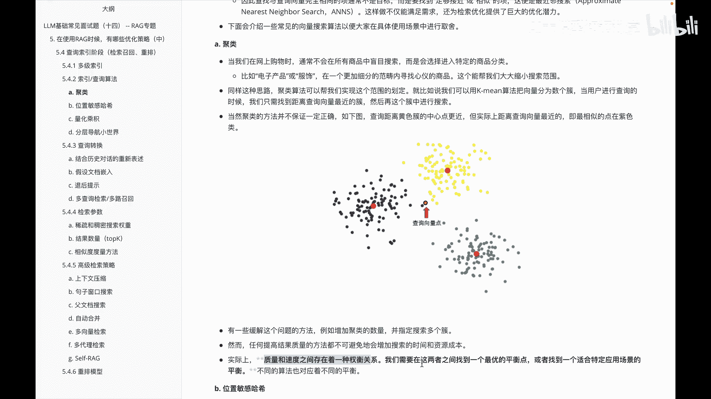
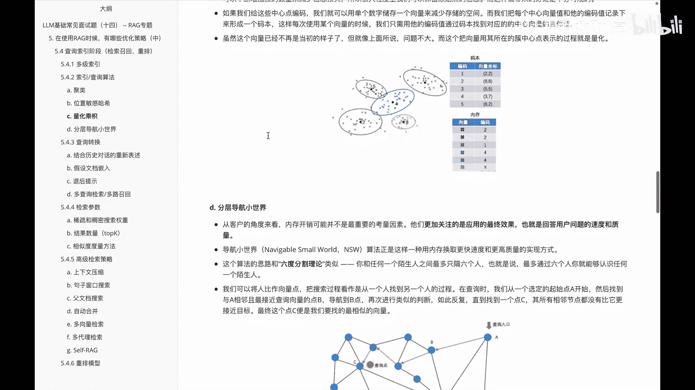

# P14：LLM基础常见面试题（十四） -- RAG专题 - 1.LLM基础常见面试题（十四） -- RAG专题 - AI大模型知识分享 - BV1UkiiYmEB9

呃我们接着来看一下关于RG专题里边啊，lg的优化策略，呃，我们在上个视频里面呢，呃讲到了关于RG里面的一些优化的方法，比如说呃在知识文档准备阶段怎么去优化，在嵌入模型阶段怎么优化。

以及在向量数据库阶段怎么优化，那么我们接着来看一下啊，在查询索引阶段它又该怎么进行优化呢，然后在查询索引这个阶段里面的话，整体内容比较多，呃为了大家方便理解，我还是会把这块呢啊拆成几个视频。

分别给大家去做一个介绍。

那首先我们来看一下啊，关于这个查询索引里面的一个多级索引，关于啊多级索引呢，呃其实是解决我们前面啊原数据，大家记得我们在这块里面做的过程中。

关于啊向量数据库阶段里面，我们用原数据加一些向量数据，存到我们向量数据库里面啊，方便我们去做一个啊后期的索引，但是呢有些数据它并没法直接啊存成原数据。

此时我们就要通过多级索引来做个优化，也就是说我们对应的啊多纯索引的技术，那关于这个呃多存索引技术呢，它的核心思想，其实就是把这些啊庞大的数据和信息需求，按类别划分，并在不同的层级里面进行一个组织。

实现更有效的一个管理和检索，下面给大家举个例子，比如说我们有一个啊索引，它呢专门用来做啊JO类的问题，然后呢另外有一个专门用来啊寻求具体的答案，还有一个呢啊专门用来考虑时间因素的问题。

那这样多个索引来组起来，最后呢给它做成一个分门别类的一个索引，此时啊就会发现啊效率更好一些，同时返回的质量会更好，不过呢引入了动侧索引之后呢，就有一个啊多极落由的机制需要大家关注，多级路由呢。

其实是确保我每个查询都能被高效的引导至，最合适的一个索引位置去，就比如咱们这个举例来说啊，查询最新上映的一个科幻电影推荐，那IG这个系统呢，可能先把啊通过路由至一个专门处理，当前热点话题的一个索引。

然后利用专注于娱乐和影视内容，索引来生成相关的推荐，大家需要知道呃，在多级索引里边的话呃，多级索引和路由技术，可以进一步帮助我们对大规模的数据进行一个，高效的处理和精准信息的提取。

这样就可以提升用户的体验，和系统的一个整体性能，这是关于我们在多级索引里面给大家讲的内容，然后它呢主要是通过啊，多级索引和多级路由来完成的，那么讲完多级索引之后呢。

我们接着来看一下关于啊，索引和查询里面的一些相关的算法。

关于算法这里面的话其实主要是由于什么呢，我们构建的前面这个向量数据的太大了，而且又复杂，此时我们怎么去寻找，就对于我们接下来在讨论的问题里面，是不得不呃去聊的一个话题。

其实就是说啊我怎么去找到一个合理的匹配嘛，嗯就比如啊下面给大家举个例子，说在推荐系统里边，用户呢并不太可能察觉到，或者关系到他每个推荐的项目呢，是否是绝对的最佳匹配，那么他更关键是什么，是推荐的。

是否是与他的兴趣相符，那在这个里边其实我们就是说啊，我们查找的东西呢是否是足够接近，接近或者相似的像啊，那么基于这个点，我们来给大家介绍一下，关于这种啊索引查询相关的一些算法。

首先第一个呢是关于这个啊聚类的相关算法，聚类这边的话呃，就比如我们在这个里面购买一些啊，网上的东西的时候呢，比如啊电子产品或者服饰，而并不是盲目的去找，而是通过这种啊分类之后呢，效率会更高一些。

那么这类算法里面的可以啊，帮我们划定这个范围，比如说我们比较熟悉的k miss啊，当然我们说聚类方法呢并不保证一定正确，就比如啊咱们下面看到的这个举例一样，假设呢我们要说通过这种k mix类的算法。

找一个最近邻的点，那大家比如说假设查询点呢就是这个黄点，那在这个黄点里面，比如说我要查一个最近的很明显黄点的最近呢，其实它并不是啊本来这个黄点，而是旁边的一个误差点，所以我们其实在做这种聚类的时候呢。

还要考虑一些其他的算法来避免这种问题，但是呢呃就是在寻找算法的时候呢，我们需要关注一个点，就是呃它在寻找里边的话，如果我把这个地方扩大，其实带来的是我们查找数据的这个效率会更低，所以我们就需要关注。

在质量和速度之间存在着一定的权衡关，权衡关系，我们需要在这两者之间找到一个平衡点。

然后切入，这是关于聚类内容。

那么下面来看一下另外一个叫位置敏感哈，希嗯这个说了一个什么思想呢，其实就是说我们沿着缩小范围的思路啊，位置敏感哈，希呢其实另外是实现了另外一种策略，它呢呃和传统的哈希算法里面有些不一样。

传统哈希呢其实我们就是啊want to want，就是一个对一个的这种方式吧，一对一的一个唯一输出值，但我们这个位置敏感发现呢，其实并不是，它是呃我们需要增加输出值的一个碰撞的概率。

这个碰撞呢这是分组一个关键，我们会把这个呢分成一个一个组，就或者说一个桶里边，然后我们在这个桶里边的话，空间上距离较近的向量被分到这个里边，此时我们找的时候呢，其实只要找到这个相应的桶就OK了。

这是关于啊位置敏感行期他的一个想法。

那讲完这个我们再看另外一个算法。

叫啊量化乘积额，量化成绩，这个呢是呃我们前面呢呃介绍两种方法里边，他呢主要是牺牲了搜索的质量，来提高我们搜索的速度，但是除了搜索速度外呢，其实内存开销有时候也是一个比较大的挑战。

我们在实际的应用场景里面的话，每个向量呢往往都有上千个维度，甚至呢数据量可能达到上亿，那么每条数据都应该有一个实际的信息，不可能我们把这个数据直接干掉，不要它，此时我们想做的方案。

其实只能是把这个数据呢本身大小做一个缩减，就比如咱们在图像处理里面的话，有时候呢会呃为了减少这些数据量，把这个图像的这个清晰度降低，那一种方法就是把一些像素点呢做一个合并，减少我这个需要存储的信息。

那么关于这种方式呢，其实我们也可以在这儿做一个借鉴，就是啊它在向量里边的话，周边的这个向量它可能做一个相似的，我们比如就拿这个图里面内容来说，每个圈里面的它可能代表的是同一类型的，虽然有一些小的差异。

但我们说可以通过它的这种中心点，来代表周围内容，减少我们这个数据的存储，这个就是关于啊量化成绩的一个思思路。

那说完这个我们再看下一个啊叫什么呢。

叫啊分层导航小世界啊，关于这个分层导化小事件呢，呃其实是从客户的角度来看，我们内存开销可能并不是最重要的一个，考虑因素啊，就是用户他们更关注的其实是一个应用的，最终效果。

也就是说呃回答这个用户的问题的速度和质量，那此时我们就要给大家介绍，一种叫导航小事件的这么一个算法，他这个算法思路呢，其实和那个六度分割理论有点类似啊，这个思路是啥呢。

就是说你和认为一你和任何一个陌生人之间，最多只隔六个人，也就是说最多啊通过六个人，你就能够认识到周围的任何一个陌生人，就如下面这个举例的图来看大家，比如说啊这个查询入口呢是A，从A呢慢慢的一点点去找。

找，到最后呢找到这个C点，会发现我的这条呢就是一个啊分层导航，里面的话，一层一层里面找一个最近的一个啊距离，但不能最近吧，就是一个接近的距离嗯，那么整体里面的话，其实就是类似于这样的一个思想啊想法。

那么介绍到这儿啊，我们其实是在这个里面给大家介绍了一下，关于这个啊查询索引里面的一些优化的啊方案，然后一个是给大家介绍一下关于这个啊。

多级索引里边的一些啊思路，另外一个呢是给大家介绍了一下。

关于这个索引里面的一些查询的算法，分别介绍了一下关于聚类啊。

以及位置敏感的一个哈希还有呢啊是量化沉积，还有就是这个分层导航小事件的对应内容。

