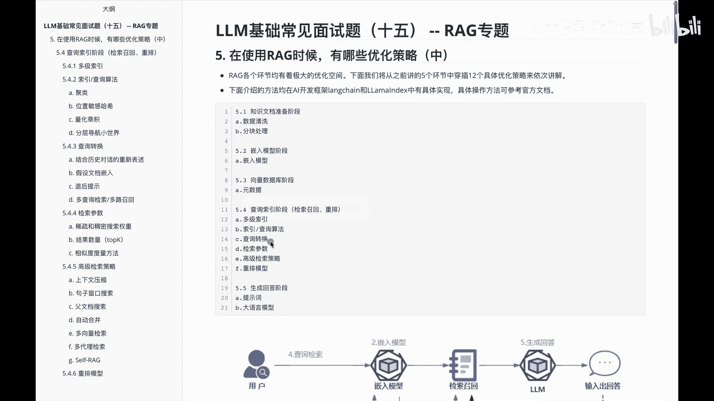
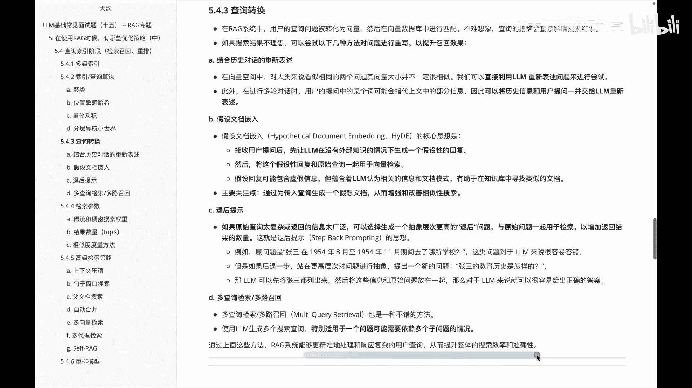

# P15：LLM基础常见面试题（十五） -- RAG专题 - 1.LLM基础常见面试题（十五） -- RAG专题 - AI大模型知识分享 - BV1UkiiYmEB9

这个视频呢，我们还是聚焦于关于IG里面的优化策略，前面呢我们已经给大家把这块的东西呃，都讲了一遍，那我们在这个视频里面，主要聚焦于关于啊查询索引阶段里边的，查询转换相关的一个优化内容。

具体看一下关于查询转换里边儿啊，有哪些优化的方法呢，那我们首先说呃，其实在查询转换里面主要做些什么事呢，就是用户的查询问题对转化为向量后，在向量库数据库里面进行一个匹配，但是呢其实有时候呢。

查询的措辞会直接影响我搜索的一个结果，如果因为啊查询的一些呃表达内容不一样，最后呢呃检索的结果不一样，那此时我们可以通过下面几种方法呢，进行一个问题的重写，然后提升整体的一个消召回的效果。

第一个啊就是结合历史对话的一个重新表述，那么在这个呃结合历史对话重新表述里边的话，我们首先可以使用的方案，就是直接利用这种大模型啊，重新表述问题来进行一个尝试，第二个呢是在一些多轮对话里面的话。

其实有一些指示代词来指，比如说这个那个他等等的这些内容，此时呢可以把这种历史信息和用户提问，一并交给大模型，让他做一个重新的表述，这是关于呃结合历史对话的一个重新表述，那么再看下第二块叫假设文档。

切入他的一个核心思想呢，其实就是首先啊接收到用户提问后呢，先让大模型在没有外部知识的情况下，生成一个假设性的回复，然后将这个假设性回复呢，和查询的一个原始的内容一起用于向量检索，假设回复。

在这个时候呢可能会包含一些虚假虚假的信息，但是呢它蕴含着啊，大模型认为相关的信息和文档模式，有助于在知识库里面寻找到类似的文档，那么假设性这个文档切入呢主要关注点是什么。

就是啊通过未传入查询生成一个假想文档，从而增强和改善相似性的一个搜索，这是关于假设文档的一个嵌入，那接着我们看一下关于另外一个叫退后提示，在我个人理解可以说成叫啊退一步海阔天空。

就是说如果查询呃原始太复杂，或者说呃返回的信息太广泛，可以选择甚至一个抽象层次更高的退货问题，然后啊与原始问题一起用于检索，以增加返回结果的一个数量，下面举一个例子，比如说啊原问题是说什么呢，说张三啊。

在1954年8月到1954年11月期间，去了哪所学校呢，这个问题对于大模型来说呢，他其实非常容易答错的，因为他有啊人名时间的限制，还要做哪些事啊，但是如果我们说后退一步，站在一个更高层次的问题。

对这个内容进行抽象呢，提出一个问题，就是说啊张三的历史教育是怎样的呢，那此时大模型呢啊对于他而言，其实这个问题稍微简单一些了，他可以先把这个张三的相关内容都列出来，然后把这些信息和原始问题放在一起。

那么对大模型来说呢，这个时候相对来说啊容易一些，这是关于额退后提示，那说完这个我们再看下一个叫额多路查询，额多查询检索，多路召回，这个呢其实它主要的思想就是啊，我们在大模型做多个搜寻查询的时候呢。

呃可以把它拆成多个子问题，来进行一个啊查询检索和多路召回，这是咱们给大家讲到的，关于呃5。3里边对应的这个啊，查询转换里面的一些啊优化的方案，那么通过上面这些呢，其实就可以让RG这个系统呢。

能够更精准的处理和响应复杂的一些用户查询。

