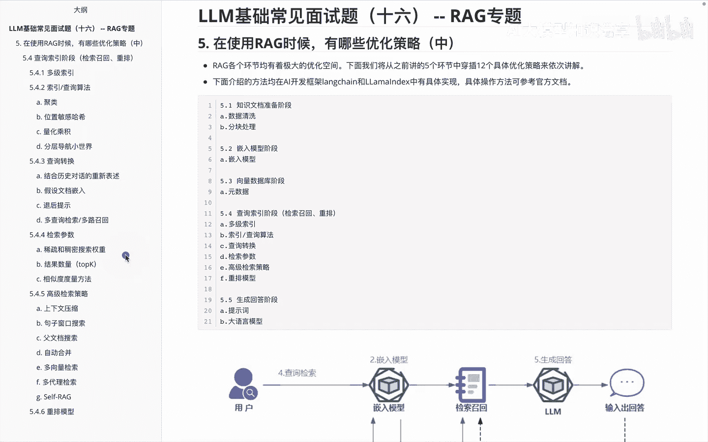
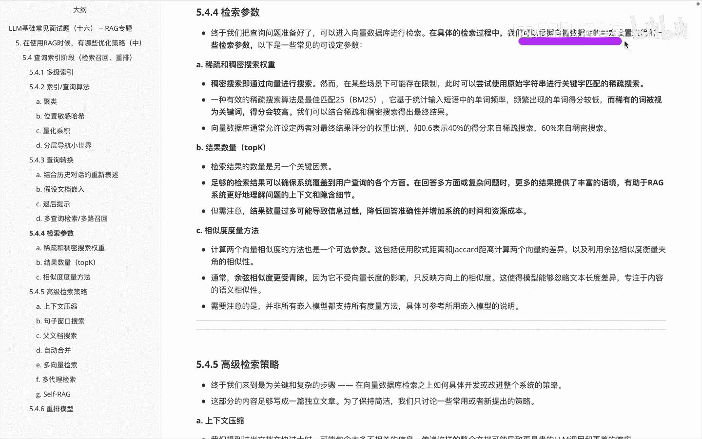
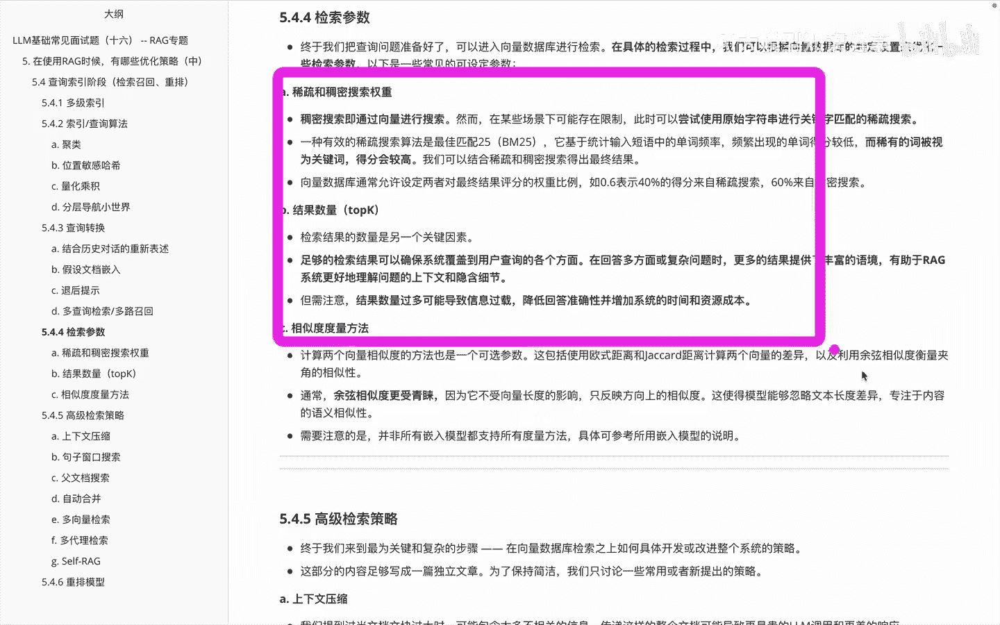
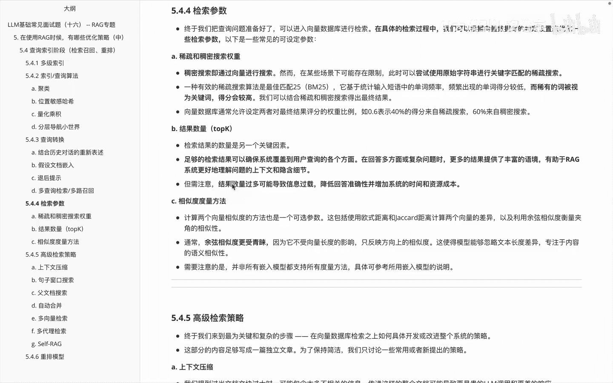

# P16：LLM基础常见面试题（十六） -- RAG专题 - 1.LLM基础常见面试题（十六） -- RAG专题 - AI大模型知识分享 - BV1UkiiYmEB9

我们接着来看一下RG使用时候的呃优化策略，在上个视频里面，我们给大家讲的是，关于查询转换的一个优化方案，那么在这个里边我们看一下，关于啊检索参数这边的优化方案，关于检索参数呢。

呃它这边其实也是有部分的优化的内容，我们来看一下前面的，我们终于把查询的问题都准备好了，可以进入向量库里面进行检索了，但是在具体解锁过程中的话，我们可以根据向量库的特定设置来优化一些啊。

具体的参数，下面呢就是一些常见的。

可以设定的一些参数的一个啊方案，第一个啊是稀疏和稠密的一个搜索权重，首先我们知道稠密搜索呢，其实就是做成一个向量进来搜索，但是呢在某些情况下，它可能存在一些限制，此时我们可以尝试使用一些原始字符串。

进行一个关键字匹配的一个稀疏搜索，这个里面用的比较多的其实就这个BM25，然后来进行一个稀疏的一个搜索算法的匹配，它呢主要基于统计输入短语中的单词频率，频繁出现的分数得分较低。

而稀有的词被视为关键词得分会较高，这种一个呃原始的方案来做啊，呃那么大部分向量数据库里面，其实都是支持这种呃，设定两者对最终得分的一个权重比例，比如说0。6代表着百分，0。

2表示40%得分来自于稀疏搜索，60%来自于重密搜索，这个是long time里面的啊，当然不一样的，里边大家可以基于这块去查看对应的说明文档，就可以，第二个呢是啊结果数量的一个top k。

那么这个数量呢，其实是我们应该返回的一个额数量内容，我们具体看一下，就是足够的一个检索结果呢，可以确保系统覆盖到用户查询的各个方面，在回答多方面或复杂问题时候，更多的结果提供了一个丰富的语境。

有瑞永RIG系统，可以更好地理解问题的上下文和隐含的细节，当然就是啊召回的内容更多一些嘛，但是大家需要注意的就是说，如果我的结果数量过多，可能会造成的一个问题是信息过载，然后降低回弹的准确性。

并增加系统的时间和自觉成本，所以这块大家需要注意一下，第三个呢是呃向量相似度的一个度量方法，那么计算两个向量相似的方法呢，这个里面它也是一个可以选择的一个超参，这里会包括使用什么欧式距离啊。

和解开的距离计算两个向量的差异，以及利用余弦余弦相似度，来衡量夹角的一个相似性，通常呢呃余弦余弦相似度呢更受青睐一些，因为它不受一个向量长度的影响，只反映一个相似度，然后使得我们模型能够忽略一个啊。

文本长度的差异，专注于内容的一个语义相似性啊，那么需要注意的是呃，我们在使用的时候呢，并不是所有的嵌入模型都支持，所有的一个度量方法，这块需要也是一样的，大家去看这个说明文档。

来进行一个三的超参的一个啊调整，那这个里边是给大家讲一下，关于我们对应的优化策略里面怎么优化，对应的检索参数，主要说了三个，一个是稀疏和稠密的一个搜索的权重，还有是结果数量的一个呃设定。

