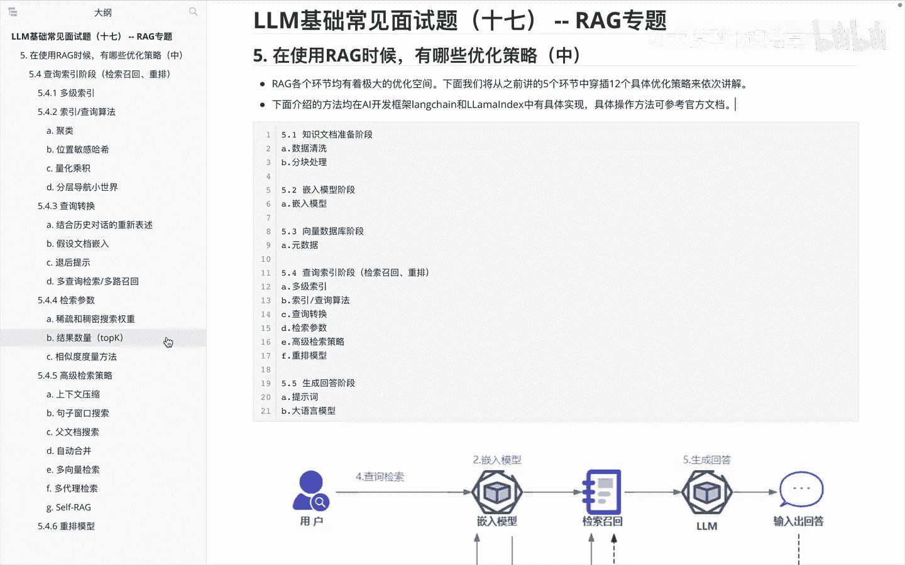
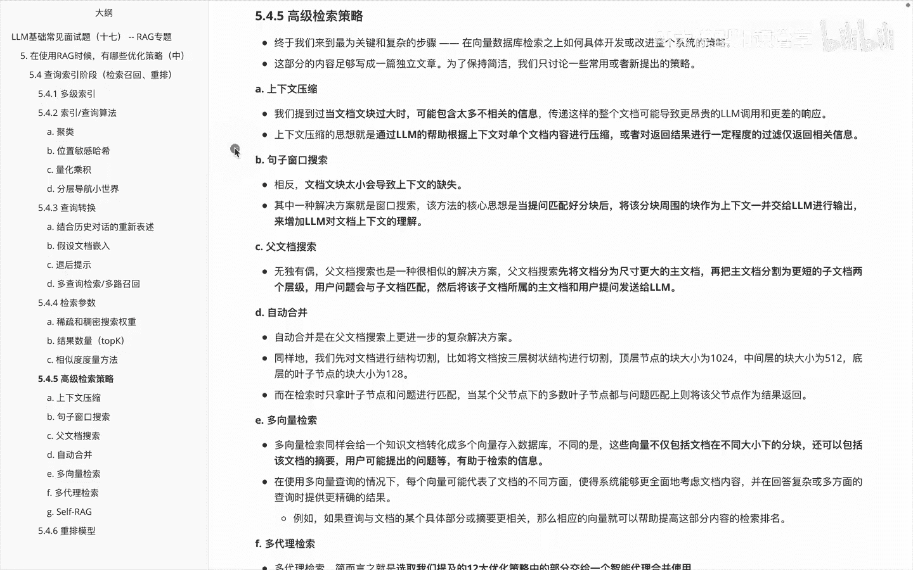
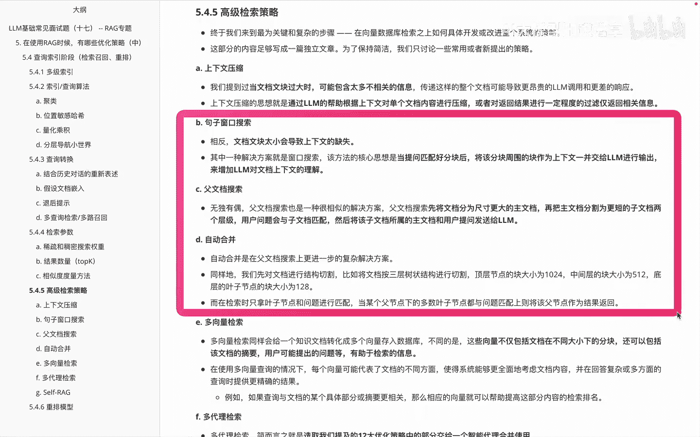
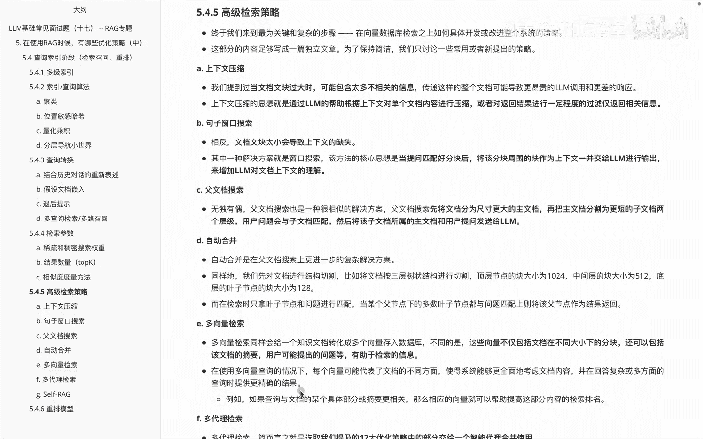
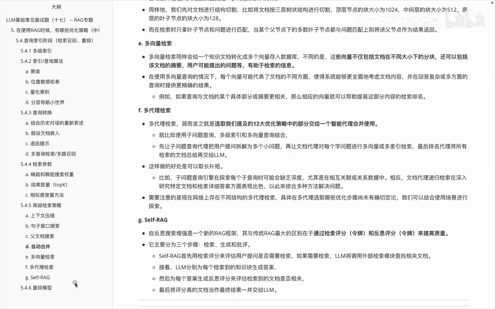

# P17：LLM基础常见面试题（十七） -- RAG专题 - 1.LLM基础常见面试题（十七） -- RAG专题 - AI大模型知识分享 - BV1UkiiYmEB9

我们接着来看一下在RG里面的优化策略中的，查询索引阶段里面，关于高级检索策略的一些内容，那么关于高级检索策略呢。

其实呃它的内容包含很多啊，然后这个里面的话，其实也是我们呃比较关键和复杂的一些步骤，我们在这块并不会给大家去做一个详细的介绍，然后更多的是啊分享一些他的思路，那我们真正需要用的时候呢，再去啊找对应的点。

那有了这块点之后再切进去，比如大家找那个对应的额开发代码，对应的这块里面的细节，再想着去怎么实现，先有一个思想，OK那首先看一下第一块啊，就是高级检索策略里面的第一个叫上下文压缩。

这个呢是我们当文档的一个模块过大的时候，可能包含了一些太多的不相关的信息，那么传递这样一个整个文档，可能会导致我们这个大模型调用的时候呢，一个是比如收费的话，它太贵了，另外一个是他这边响应起来的话。

因为传递的东西太多太慢了，那上下文压缩的思想呢，就是啊我们通过啊大于模型的帮助，根据上下文和单个文档内容进行压缩，或者说对返回结果呢进行一定程度的过滤，仅返回一些相关的信息。

这是关于啊上下文搜索的一个思想，第二个呢是啊句子窗口的一个搜索，上面说的是关于当文档块过大的时候，一些啊解决方案，那下面其实是说当文那块儿太小的时候呢，它这些问题就是导致上下文缺失嘛。

那此时它这个解决方案呢，就是啊窗口搜索怎么做呢，就是当提问匹配好分块后，将这些分块的周围块作为上下文呢，一并交给我大模型进行输出，来增加大模型对上下文的一个理解，第三个呢是关于啊叫复文档搜索。

复文档搜索呢，它这边啊，其实是说，先将我的文档分为尺寸更大的一个主文档，再把这种主文档呢分割为更短的一个子文档，的两个层级，用户问题与子文档进行匹配，然后呢，将这个子文档所处的主文档和用户提问呢。

发送给大模型，就是啊副文档搜索里边它的内容，下一个呢叫啊自动合并，自动合并呢是在副文文档搜索上，更进一步的一个复杂解决方案，同样的呢，就是说我们先对这些文档呢进行一个结构切割。

比如说把文档按三层的一个树状结构切割，顶层节点呢包含啊括号大小1024，中层512，底层128，而在检索时呢，我们只拿这个叶子节点来进行呃和问题匹配，当某个复节点下的多数叶子节点都有问题。

匹配上的时候呢，把这个复节点作为结果返回，然后关于啊BCD这三个呢。

其实他们都讲的是我怎么把这种选文档块。

然后呢到大文档块的一个啊，向上的一个增量的一个呃扩展的过程，然后第五个啊是叫多向量检索，多向量检索呢同样会给一个知识文档啊，转换成多个向量进行一个输入，但是呢这个不同的是说。

这个向量它不仅仅包含文档的一个呃，不同大小的分块，还包含什么呢，比如说文档的摘要啊，又可能提出的一些问题啊，有助于我们这个最后的整体信息解锁，然后在使用多向量查询的情况下呢。

每个向量可能代表了文档的不同，方，便，使得这个系统呢啊能够更全面的考虑文档内容，并在回答复杂或者多方面的查询时呢，提供更加精确的结果。

然后下面再看一下关于多代理检索，多代理检索呢其实就是我们给大家讲的啊，之前讲过那些优化策略，和后面要讲的这些优化策略里面的一部分啊，交给智能代理，然后让他们进行一个组合来使用。

就比如我们使用啊子问题查询，然后呢和多级索引和多向量查询来结合，让他们来给我们整体里边做到一个不同功能的，取长补短使用，这是关于啊多代理解锁的一个就基本功能，然后再看一下下一个叫self rg。

Self f r g，这边呢其实是啊self rg嘛，就是自我反思的这么一个功能，然后它呢呃主要区别就是和传统的IG的取标，区别，是通过检索评分和反思评分，来提高我的整体质量，然后步骤分检索深沉批评。

基本的步骤呢就是说啊，先用检索评分来评估用户提问是否需要检索，如果说需要检索大模型呢，就调用外部检索模块来查找文档，接着呢啊大模型分别为每个检索的知识块啊，生成答案，然后把这些试卷答案呢评分。

来评估检测到的文档是否相关，最后呢把评分高的文档当做最终结果，一并交给大模型，那么在这个里边我们主要给大家讲的是关于啊，就是高级检索策略里边的一系列的优化的，相关方案，然后大家呢先有一个基本的印象。

后面真正用到的时候呢，比如说哎，我觉得这块需要我们在实际的项目里面用。

