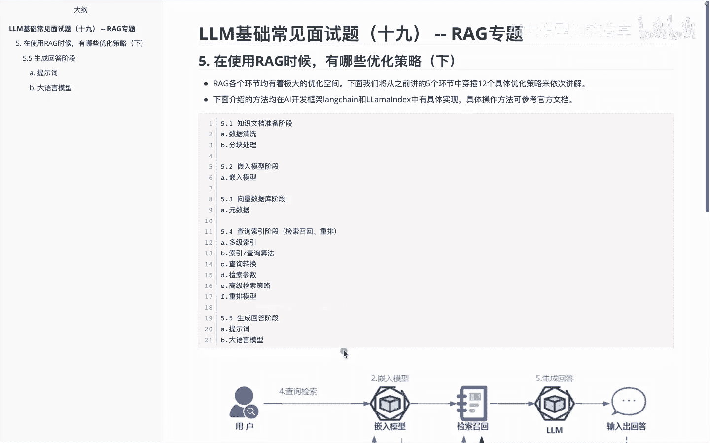
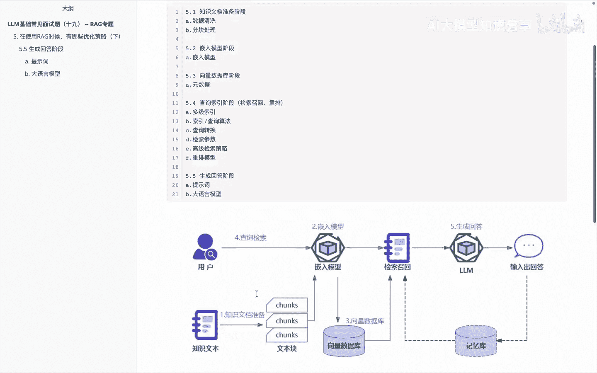
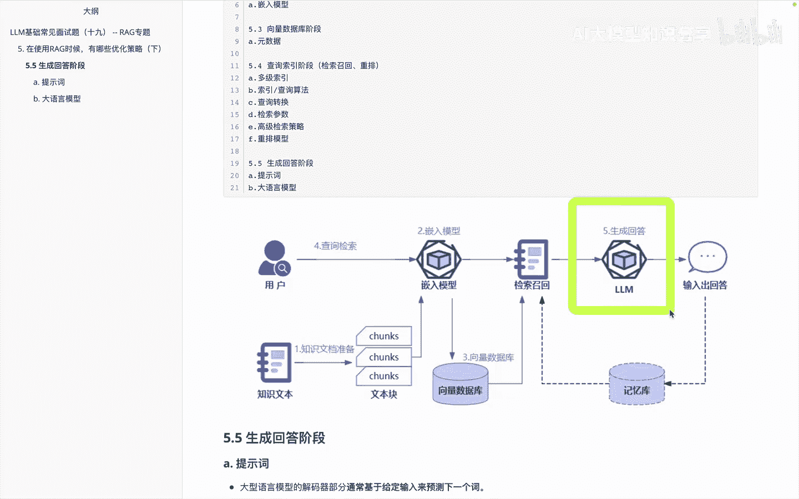
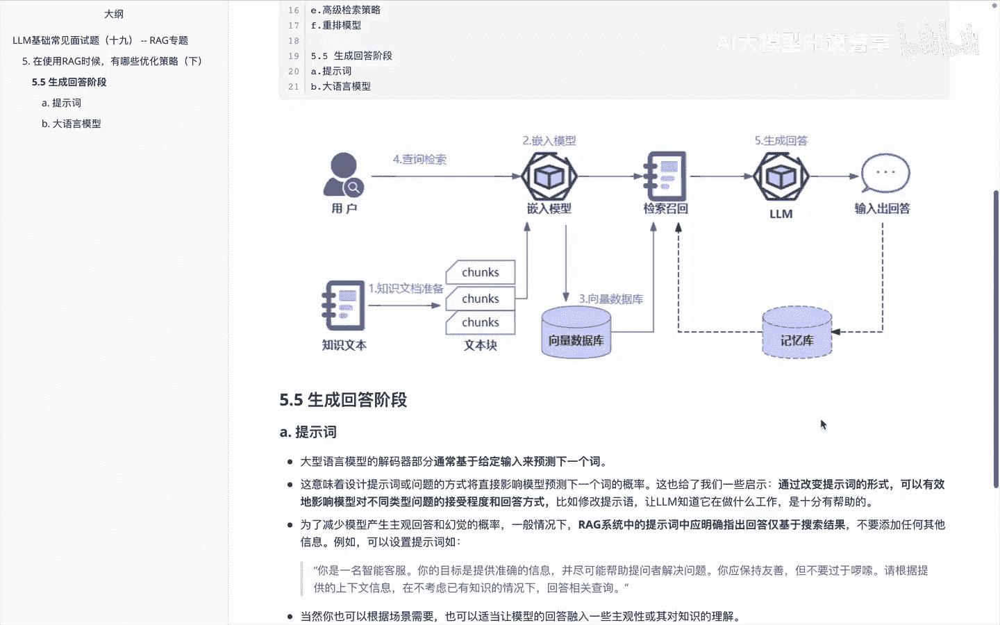
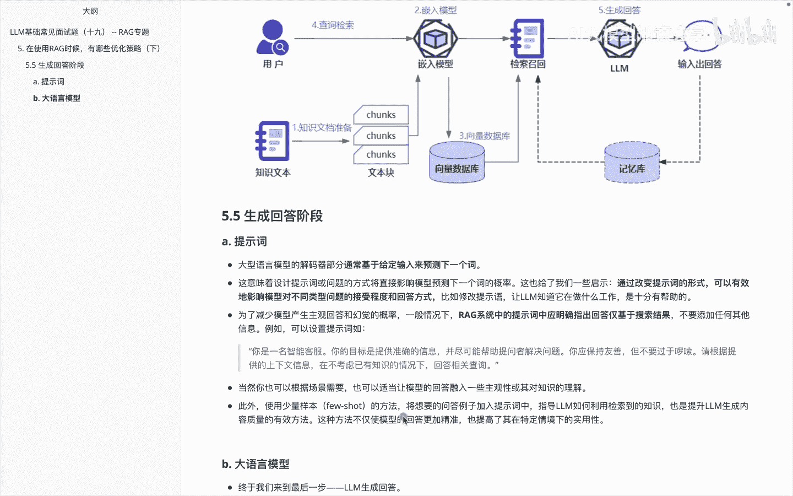
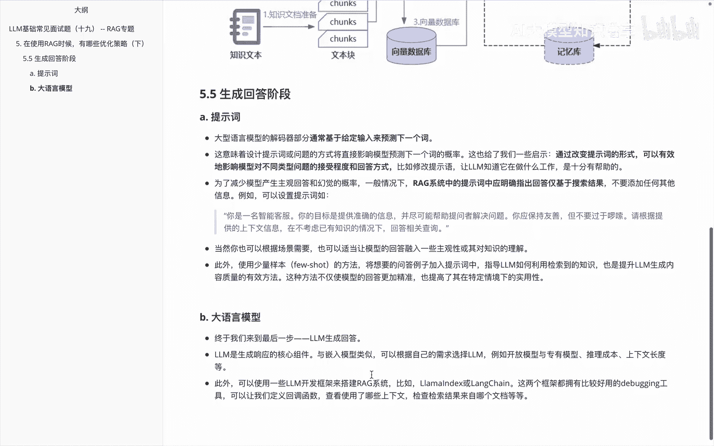
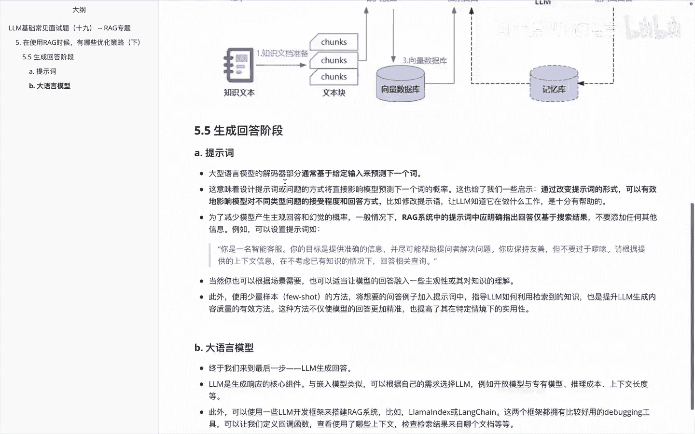
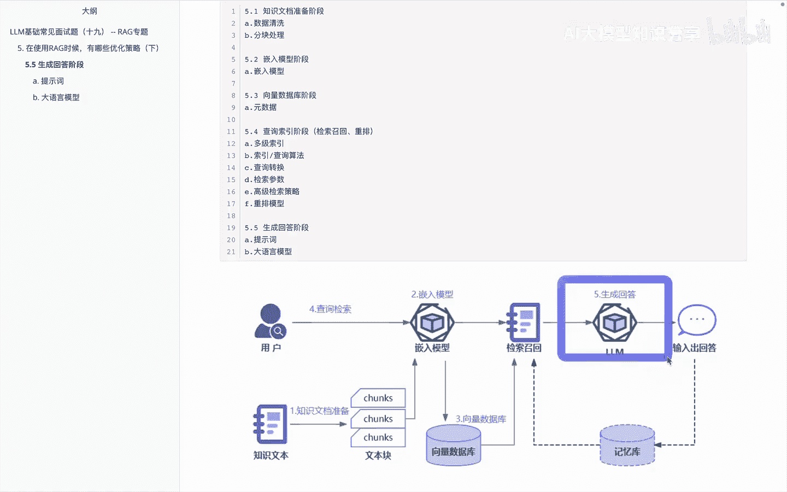
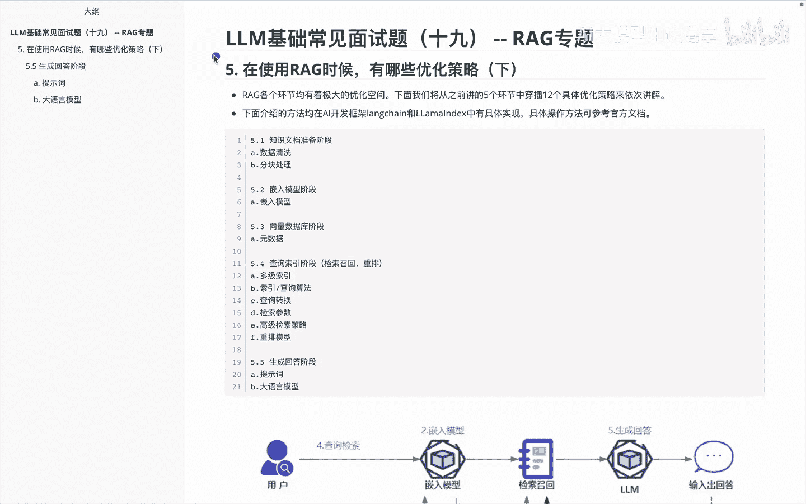

# P19：LLM基础常见面试题（十九） -- RAG专题 - 1.LLM基础常见面试题（十九） -- RAG专题 - AI大模型知识分享 - BV1UkiiYmEB9

呃各位大家好，我们终于又来到了咱们lg里面的优化策略的，最后一块内容了，呃前面呢咱们给大家讲了一下，RAG里面的优化的很多方案，然后我们看一下，在这个里面我们要给大家关注的是，关于在生成回答阶段里面啊。

怎么做优化。

其实主要是关于提示词和大语言模型，这边的一个优化内容，那我们看一下这个总框架图。

它的优化的内容呢其实在哪，就是在这块内容。

然后这个里边我们主要给大家说两块对容，一个是提示词，一个是大语音模型，那首先我们看一下关于这个提示词的优化方法。

提示词关于优化，我们知道呃，大语言模型这边的话，其实它都是通过next token就是预测下一个词来啊，解来用transformer的这个解码器模型的，这也就意味着说呃设计提示词或者问题的方式。

将会对我们影预测下一个词的概率的影响很大，那基本使用方法呢，就是说通过改变提示词的形式，可以有效的啊，影响模型，对不同类型的问题的接受程度和回答方式，然后呢做一个优化，然后呃。

为了减少模型呢产出主观回答和换句的概率，一般情况下呢我们RG系统里边的话，应该明确提出回答，仅基于一个搜索结果，因为其实IG在用的过程中，它呃还有一块问题大家需要关注，就是呃大模型的幻觉问题。

这个时候呢我们在他回答的时候呢，呃如果说这个答案不确定，其实我们有时候呢不希望他在这儿跟我做，胡编乱造的啊，好这是关于这块内容，另一块呢就是也可以建议大家用这种few shot。

就是使用少量认样本来告诉他，i id该怎么去生成，该怎么去回答，这也是一种啊比较不错的方案。

然后除了这个prompt提示词之后呢，另外一块是关于额大于言模型。

那么在大语言模型里面的话，其实就是我们怎么去选择嘛啊，然后这个呢是我们呃不管是呃咱们一直说的，Long chan，还是其他些内容里边，它是一个相对来说核心的一个组件，我们怎么去选择大语言模型。

其实不管是你开源的还是闭源的，以及我们经过微调过的一些模型，大家根据实际的呃任务，以及对应的项目场景来选就可以了，然后在我们的一些框架里面，就像前面提到的along chan，还有leon index。

其实都是一些不错的工具，大家选择完成之后呢，在里边切入进去就OK了，那么这块呢是咱们关于这个啊深沉回答阶段。

里面给大家提的两个可以优化的方向。

讲到这儿之后呢，呃我们来看一下咱们给大家说的整体这块里面，优化策略内容，那我们说在优化策略里面的话，其实我们是啊从这个呃流程图切入，给大家讲了一下知识文档准备该怎么做优化，以及切入模型里面啊。

可以有哪些优化的方案，还有就是向量数据库有哪些优化的方案，还有查询检索里面有哪些优化，同时给大家在这块说了一下，关于检索召回啊，这个是和这块放到一起，讲了一下有哪些优化方案，最后是深圳回答。

那么整体在这块里面呢，我们看一下在这个里边的对应内容，在知识文档解准备阶段呢，我们讲到了关于啊数据清洗该怎么做分块处理，哎有哪些优化方案，然后嵌入模型，嵌入模型阶段呢给大家讲一下。

关于嵌入模型有哪些划方案，向量数据库阶段呢，我们是给大家讲了下，关于原数据这边和我们的向量数据库里面，从内容来结合起来的优化方案，然后在查询所有阶段呢给大家讲了一堆，又包含多级索引。

还有讲到了关于索引查询的一些算法，以及查询的问题的转换，还有啊检索的一些参数的一个超参设定，以及高级检索一些策略，当块过大过小或者其他一些内容，以及react rerap这块的话，建议大家是项目里面。

如果啊可以的话都用上，最后呢是讲到了啊这个视频里面提到的内容，深职回答阶段，提示词的优化，以及大语言模型选择的一些优化内容，好这是咱们给大家讲到在这个优化策略里边啊。

