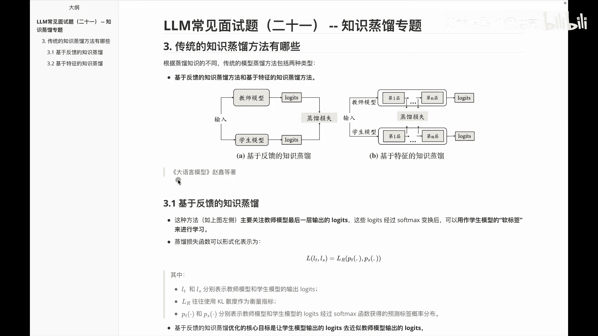
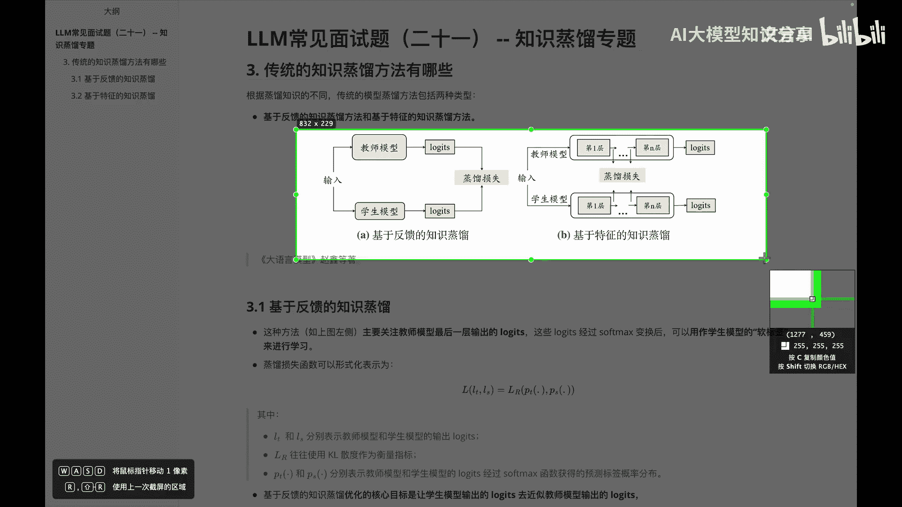
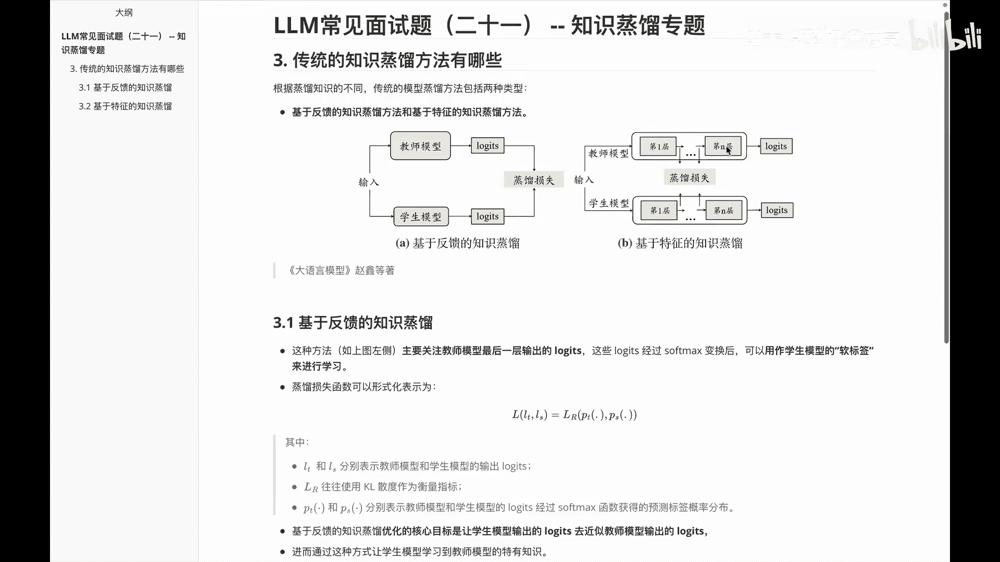

# P21：LLM基础常见面试题（二十一） -- 知识蒸馏专题 - 1.LLM基础常见面试题（二十一） -- 知识蒸馏专题 - AI大模型知识分享 - BV1UkiiYmEB9

Hello，各位我们继续进入咱们的啊，大语言模型的常见面试题学习，还是啊知识蒸馏的专题，今天呢我们看一下关于这么一道题，叫传统的知识蒸馏方法呢有哪些，那么我们在常见的基于知识蒸馏里面的话。

传统里边啊会给他分成这么俩类型，一类型呢是叫基于啊反馈知识的蒸馏方法，和基于特征的一个知识支流方法，下面这个图呢啊先初步做了一个介绍，呃，大家可以看到基于反馈的知识蒸馏呢，它这边其实经过输入。

然后有教师模型，学生模型，然后经过ladies之后呢，在这儿来算一个蒸馏损失，而基于特征的一个知识，蒸馏呢他这边啊其他的都差不多，不过呢在这个具体的各个词之间，来计算蒸馏损失，然后这个图呢是来自于啊。

赵鑫等他们出的一本书叫大圆模型，感兴趣呢大家也可以看一看，那么我们来继续看一下。

针对这块里面的一些细节，我呢先把这个图啊给咱们截图，放到我们的这个位置。

方便大家呢后面在看的过程中更好的理解，首先我们看一下关于这个基于反馈的知识蒸馏，里面讲的具体内容说啊，这个方法呢就如咱们在刚刚说的这个图里面，这种方式一样，他主要关注的是教师模型最后一层输出的LOGI。

然后呢把这些LOGI呢经过soft max变换之后呢，可以用作学生模型的一个软标签，来进行一个学习，然后径流的一个损失函数呢，可以表示成这个函数，大家别慌啊，一般呢啊看到这种公式之后呢。

啊上来之后可能就觉得啊理解起来比较难，那随着我呢把这里面各个参数额说明白了，相信大家对这个啊公式应该也能啊理解一些，首先我们看一下这个里边这个小L，LT和LS是什么意思呢，说这个里面LT和LS呢。

分别表示教师模型和学生模型输出的logic啊，就这两个位置啊，那么我们再看一下这个大的，这个LR是什么意思呢，LR呢往往使用的是kl散度，来作为一个衡量标准，那大家就先理解成这个kl散度呗。

那么再看一下中间这个里面的东西，PT和PS又是什么东西呢，那我们会发现说这两个呢，分别表示教师模型和学生模型的LOGI，经过soft max函数之后获得的预测标签的概率分布，那我们就知道说哦。

他们俩呢其实是分别对应的啊，教师模型和学生模型的一个啊，预测标签的概率分布，然后我们对他俩呢做一个kl散度的计算，咱们知道kl散度的这边，其实是用来衡量一个相似性的，然后计算它俩的相似性。

其实我们希望的是他俩之间啊越相似越好，越相似呢，它整体这个里边的这个损失函数的，这个loss值呢就会越低，所以说他们最终的目标，其实是用来衡量教师模型和学生模型。

他们的一个kl散度计算达到一个整体的值最小，这是啊蒸馏损失函数里面的一个表示方式，那我们经过前面介绍之后呢，啊就能知道说基于反馈的一个知识，这流的优化的核心目标，其实就是让学生模型的LOGIES呢。

去近似教师模型出的LOGIES，如果他们俩之间完全一样的话，就说明学生模型把教师模型的所有内容，都学会了嗯，这是关于叫基于反馈的知识蒸馏，那我们接着看一下第二块内容，叫基于特征的知识蒸馏。

又讲了一个什么东西呢，基于特征的知识，这流呢啊就如这个图里面的这边这个内容一样，那我们说它呢主要是基于中间特征表示的蒸馏，关注于教师模型的中间层输出的激活函数，然后并使用这些结果值呢作为监督信息。

训练学生模型啊，大家就知道说，其实我们在基于特定的知识争论里面，主要是看一下它们各词之间的内容，就比如说transformer里面的各个词里面，它的每一次的输出特征呢都可以啊，用作一个知识来进行学习。

然后他的这个啊损失函数呢也如下边这个样，也别慌，我们来一个个看一下，里边具体的各个参数代表什么意思，首先关于这个FTX和FSX，分别表示的是教师模型和学生模型的，一个中间层的输出特征啊。

其实就是这些里边的一些输出特征嘛，对吧啊，这块位置和这块位置好，这是关于FTX和FXX，那我们再看一下这个啊，FI这个表示什么呢，FI表示的是一种啊变换函数，用于处理输出形状不匹配的一些情况。

那我们就说这个five呢其实什么情况呢，是我们知道教师模型和学生模型，你要直接进行硬匹配的时候呢，会发现有时候它们会不匹配，那此时呢通过这个泛函数这么一个啊，构建的函数，可以让他俩之间做一个匹配。

那我们再看一下这个LF是什么呢，它呢是一个相似度函数，主要用来衡量教师模型的中间层特征，与学生模型中间所特征的一个相似度啊，那我们就知道说其实在这个里面的话，整体这个是用来衡量一个相似度函数的。

而这一块是啊，教师模型输出之后对应的中间层特征，然后再经过一个泛函数做变换，为了和学生模型呢做一个更好的匹配，那么后面这一块呢，其实是学生模型中间层数的特征，再建一个泛函数之后呢。

他们达到一个和教师模型匹配的一个效果，然后通过一个相似函数来计算，计算完成之后呢，看他们的一个最后的loss总时，然后loss值自然而然越低越好，那我们说关于这个里面的最终预测分布呢，其实是中间层特征。

可以提供更丰富的一些模型信息，有助于在模型交流过程中，实现更为有效的一些知识迁移，当然说这种方法呢其实也有一些难度啊，就是它呢啊怎么去消除这种架构的不一致，还有呢目标层的一些自动化选择等等。

这些问题其实并不好解决，OK那讲到这儿之后呢，我们来看一下，在这个视频里边给大家讲些什么知识呢，其实在这个视频里面呢，呃主要给大家是说的，关于传统的知识交流方法有哪些，主要呢给大家分成两部分。

一部分呢是基于反馈的知识蒸馏，另外一部分呢是基于特征的知识蒸馏，那么基于反馈的知识争论呢，大家就通过这个图来看，知道说哦，他们其实是通过这个LOGI经过soft max变换之后呢，输出的一个蒸馏损失。

让这个里边儿呢他们教师模型和学生模型之间，更可能的一个拟合相似，而基于特征的知识真流，就是咱们讲的第二块内容，它呢主要是用来拟和中间层相关的内容，这是咱们给大家的这个啊题。

