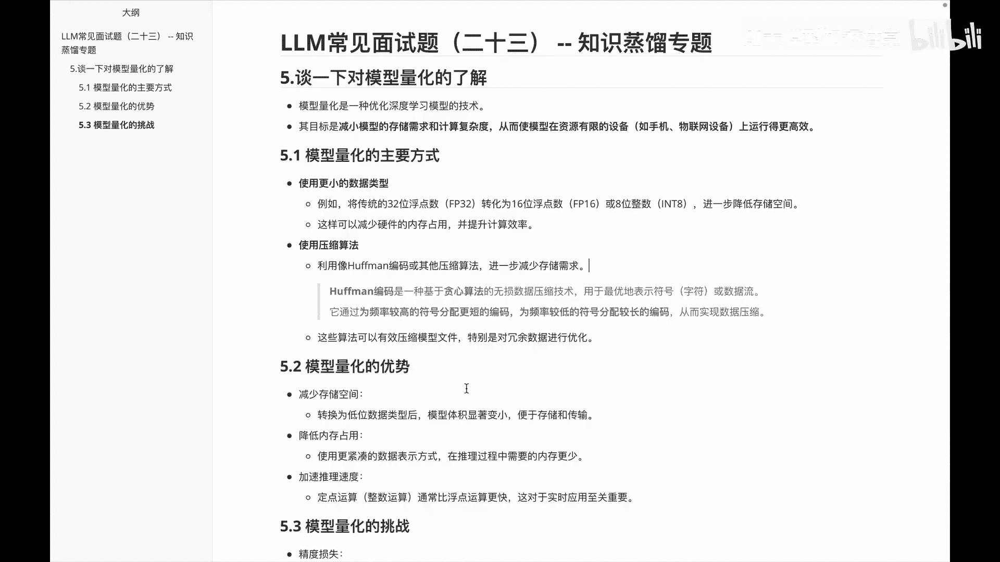
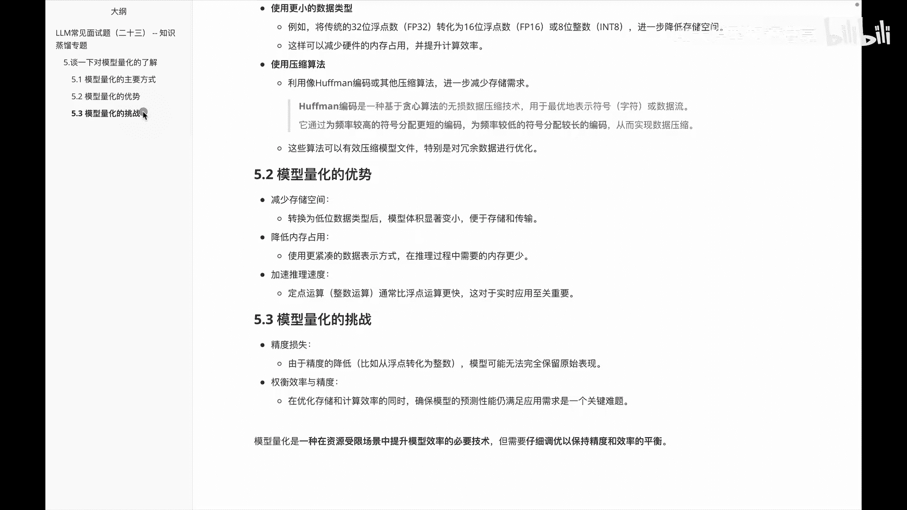

# P23：LLM基础常见面试题（二十三） -- 知识蒸馏专题 - 1.LLM基础常见面试题（二十三） -- 知识蒸馏专题 - AI大模型知识分享 - BV1UkiiYmEB9

各位好，我们接着来看一下，知识蒸馏专题里边的这么一道题，这道题呢并不是啊，仅仅包含与知识蒸馏，它可能会范围更广一些啊，问的是谈一下呢对关于模型量化的一个了解，那我们说模型量化这边的话。

其实它是优化深度学习模型的一种技术，它的主要目标呢就是减少模型的一个存储需求，和计算复杂度，从而使模型在资源有限的一些设备上，运行的一些更高效一些，关于啊模型量化的主要方式呢，呃我这儿给大家列举了啊。

两种方法，当然不止这两种，其实还有很多的啊，第一个是呃使用更小的数据类型，第二个呢是使用一些压缩的算法，使用更小的数据类型呢，呃就比如说是将传统的32位浮点数，转化为16位浮点数，或者说一些八位的整数。

然后呢这样可以达到一个降低存储空间的目的，然后另外一种方法呢是叫使用压缩算法，它呢就像利用比如说像霍夫曼编码，或者其他一些编码来减少一些存储的需求，那么呃什么是霍夫曼编码呢，有的小伙伴可能知道。

有的呢啊可能没听过呃，大家就可以理解成它呢是一种贪心算法，然后它呢是通过啊为频率较高的符号，分配一些更短的编码，为频率较低的一些符号呢啊分配比较长的编码，从而实现一个数据压缩。

就是说它为这些频率比较高的符号呢，分配一些短编码，这样就我们查找的时候呢会更高效一些，而一些长尾的一些内容呢，它就会分配的一些比较长一些，因为我们用的比较少嘛，这是关于嗯模型量化的一些主要方式。

那我们看一下下一个叫模型量化的，有哪些优势呢，关于模型量化优势呢。

额这儿给大家列了三个，一个呢是减少存储的空间啊，很明显嘛量化的时候减少了对吧，第二个是降低这个内存的占用，这个怎么理解，就是说我们在做推理过程的时候呢，可以减少一些内冲的需求，第三个是加速个推理的速度。

然后这边的话自然而然模型小了，他这边推理就会快一些，那么关于模型量化的挑战有哪些呢，主要两方面，一个是精度的损失，另外是权衡效率与精度，精度损失呢就是说由于我们的精度降低了吧。

模型可能无法完全保留我们原始的信息，第二个权衡效率与精度呢，就是说在优化存储和计算效率，同时呢，确保我的模型的性能啊仍然满足啊，原来模型的一个情况是一个难题，然后大家需要知道的是。

模型量化呢是一种在资源受限场景中，提升模型效率的必要技术，但呢需要仔细调优，以保持我的精度和效率的平衡，那么这道题呢主要给大家分享的是关于模型，量化里面的一个了解啊，都分别给大家讲了一下。

关于这个量化的主要方式，从数据和算法的两个维度以及量化的优势啊，空间内存占用和推理速度三个优势挑战，一个是精度损失挑战。

另外一个是效率。