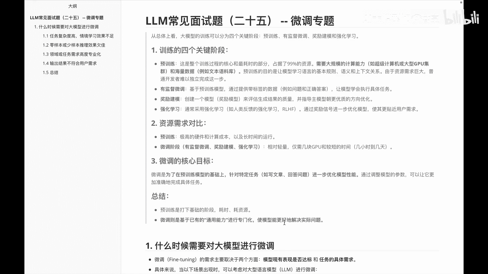
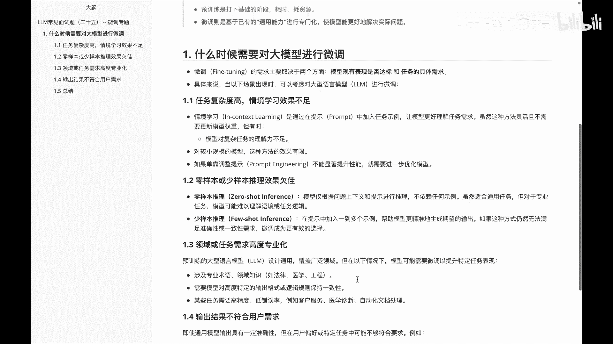
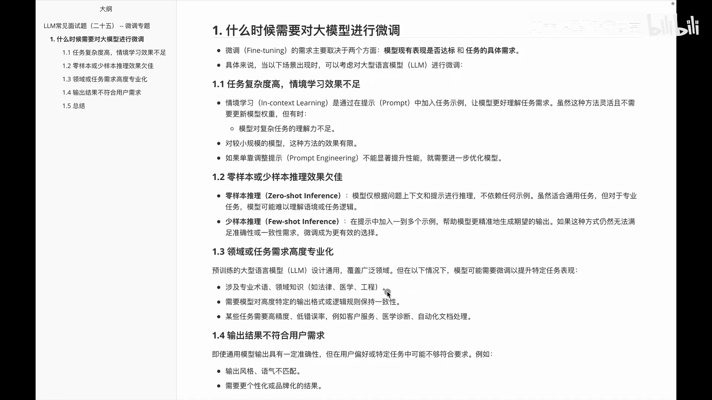
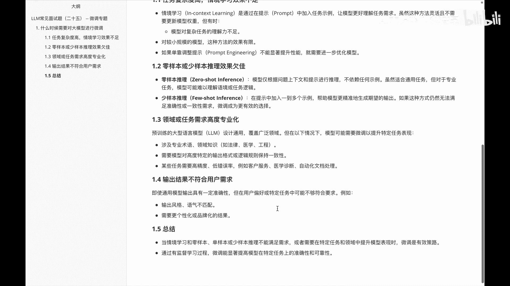
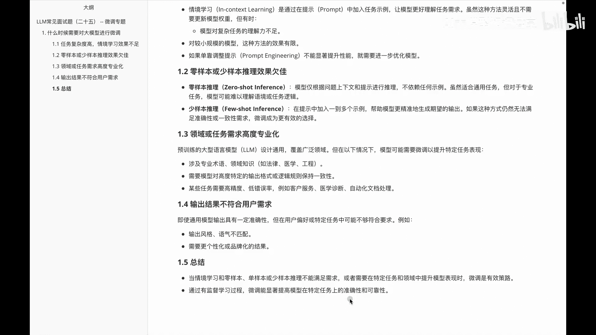

# P25：LLM常见面试题（二十五） -- 微调专题 - 1.LLM常见面试题（二十五） -- 微调专题 - AI大模型知识分享 - BV1UkiiYmEB9

哈喽各位呃，接下来我们要进入另外一个专题叫微调专题，呃，关于大语言模型呢微调，想必各位呢或多或少都会知道一些，那么接下来的话我们就基于微调这块东西，给大家做一个系列专题，讲一讲关于微调的分类。

微调的一些基本的方法，以及我们为什么微调等等等等相关内容，那么在讲微调之前呢，呃我们先快速给大家过一下，就是关于呃大模型这边的一些微调，用在哪个位置呢，我们知道关于啊大模型这边的训练呢。

基本上会分成四个阶段啊，首先是预训练，再做一个有监督的一个微调，再做奖励模型，再做强化学习，然后预训练这边的话，其实是呃整个大模型这边的一个核心部分，它呢会消耗掉啊大部分的资源。

然后整体呢它需要很大的算力，又需要海量的数据，然后呢把我们一个基本的模型架构给训练出来，然后有监督微调，这边的话其实它是基于我们预训练好的模型，通过提供一些带标签的数据，让模型学会执行一些具体的任务。

然后奖励模型呢其实它是啊创建一个模型，用来做一个reward model，来生提高我生成的一个整体的结果，质量强化学习，这边的话通常是采用一些强化学习的方法，然后呢。

呃通过奖励信号来优化模型这么一些过程，那我们在这个里面主要给大家聊的，其实就是关于啊微调的这块内容，那我看一下，就是说首先呃预训练和微调他们一个对比，我们知道预训练这边的话。

它其实对硬件啊计算成本都要求都非常高，而且运营的时间也很长的，而微调这边的话相对来说轻量一些，仅需要几块GPU，或者较短的一些时间来完成整个内容，然后微调的核心目的，其实是为了在预训练模型的基础上。

针对一些特定的任务进行一步优化的一个模型，大家知道前面，比如说我们在做大语言模型的时候呢，就拿啊不管是千问系列还是china gym来说的话，国内这边大家稍微熟悉一些嘛。

其实他那边都会有一些base模型，然后呢又有一个比如说杠chat模型CHAT，其实前面那个base模型呢，它就是用来啊做一些这种没有经过微调的，基本的一些模型。

而chat模型它这边主要会基于一些问答对话，来生成的一些微调过的模型啊，好这个做一个了解就行，那么前面给大家说的这块内容，主要是说啊预训练呢，他这边大家知道一下是为了打下基础阶段，耗时且耗资源。

而微调呢则是基于已有的一些通用能力，进行专门化的一个啊训练，使得模型能更好解决一些实际问题，在呃我们正式进入一些面试题之前，我通过这么一个内容给大家啊，初步的先介绍一下关于大运模型的一些阶段。

以及我们说微调在大模型这里边处于哪个位置。

那下面的话我们就看一下啊，我们想在啊微调的这个面试题系列里面讲的。

第一个问题，就是说我们究竟什么时候需要，对大模型进行微调呢，那好我们来看一下，我们说微调这边的话，其实它主要取决于两个方面，一个是啊模型效果的表现是否达标，二是啊任务的一个具体需求，具体而言的话。

就是下面的这一系列场景出现之后啊，如果说他表现不好，此时我们就要想到我们一条，首先第一个就是任务复杂度高啊，通过情景学习呢效果不足，前线学习是通过我们pro promp来加入一些事例。

让模型能更好地理解任务需求，虽然这种方法呢比较灵活，并不需要我们coding嘛，然后直接就可以实现，但是呢有时候呢模型对一些复杂的任务，他的理解能力并不高，所以这个时候我们就需要啊怎么做的。

需要去加入模型的微调，让提高模型的这个能力，第二个呢是在啊我们的zero shot或者few shot，做推理的时候，效果不怎么好，我们知道zero shot就是零样本推理的时候呢。

其实只是根据问题的上下文和提示来进行推理，然后a future呢是通过我们在啊，props里面加入一个或几个示例，然后让他给我们输出对应的内容，那不管是我们的zero shot还是few shot。

表现不好的时候呢，此时我们也需要去思考微调的内容，然后第三个是关于呃，我们说领域或者任务需求，有时候要求高度的专业化，比如说我们想要他输入一些法律啊，医学啊，工程啊。

然后教育啊等等相关的一些高度专业化的内容，此时我们就需要对这个内容进行微调，并不是说我们通过一个普世的大模型。

就可以实现，那让我们接着看一下下面这块呢。

是啊输出的结果不符合我们用户的需求，比如说有时候我们需要输出一些分格啊，或者说人格啊，这边符合具体的啊要求，比如我们想让他输出一个啊，都市的一个精英倾向的一个风格，或者说说这些专业的一些术语。

如果说呃我们不进行微调，可能它有时候效果就不怎么好，那啊这个视频里面的话，主要给大家其实啊说了一下，对应的里边就是什么时候，我们需要大于模型来进行微调，大家需要知道是当我们一些情境学习。

或者zero shot，Few shot，或者一些啊少样本推理不能满足要求，再或者呢需要在特定的任务和领域领域里面，提升模型表现的时候呢，此时我们就需要去考虑微调，除此之外，大家还需要知道是啊。

通过有监督学习过程，微调呢，可以显著的提高模型，在特定任务上的准确性和可靠性，OK这是我们在啊微调专题给大家分享的，第一个题，就是我们需要思考，什么时候需要大模型进行微调。

并不是说我们上来之后一股脑的把这个啊任务，然后通过微调来实现，有时候其实我们直接通过PE就是property engineer，或者说feel short their short。

