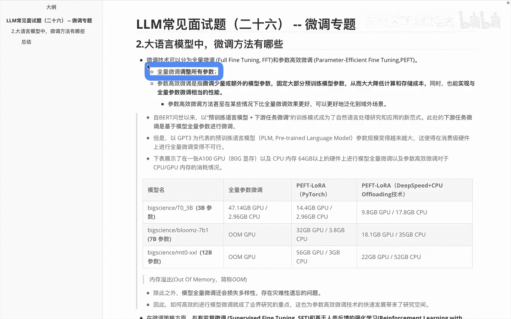
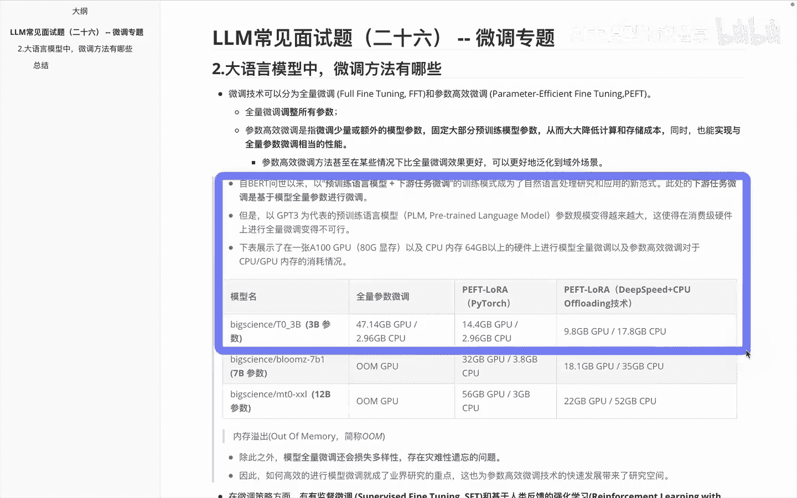
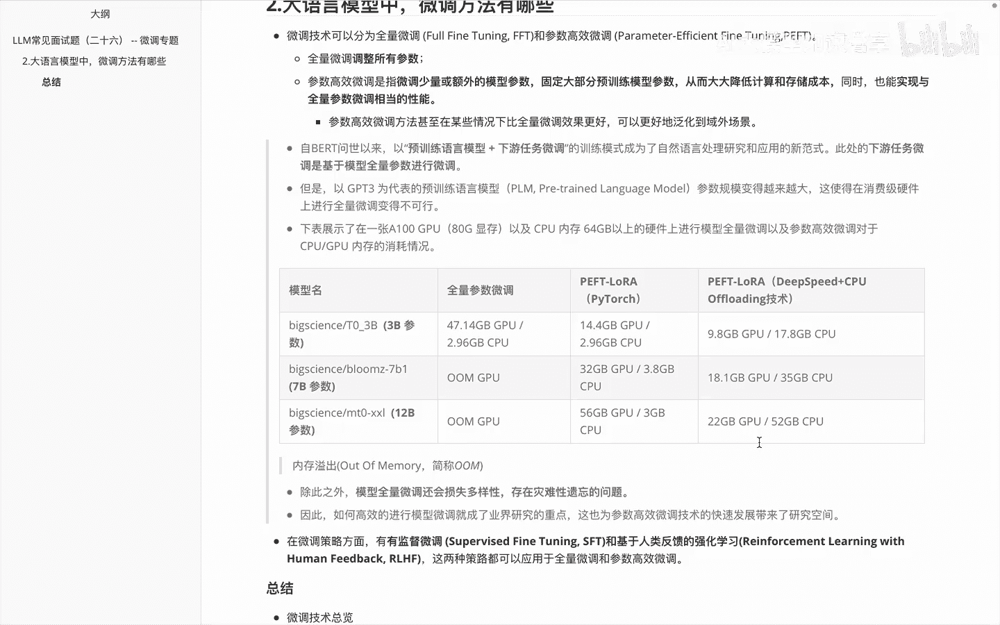
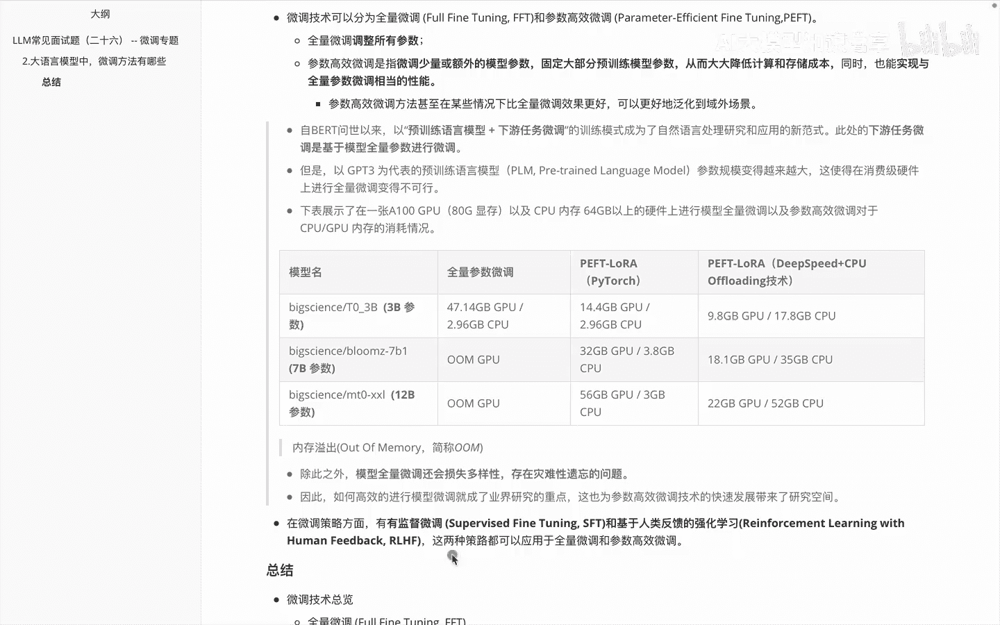
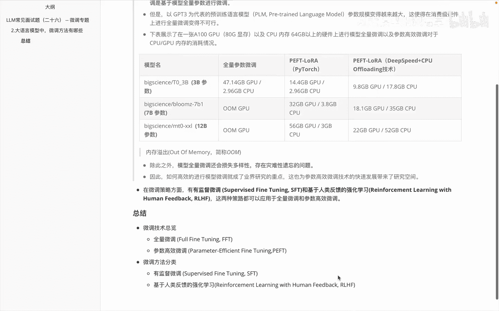
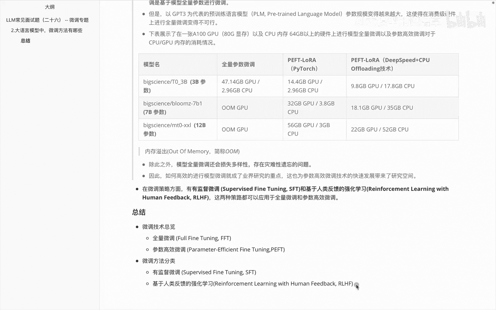

# P26：LLM常见面试题（二十六） -- 微调专题 - 1.LLM常见面试题（二十六） -- 微调专题 - AI大模型知识分享 - BV1UkiiYmEB9

Hello，各位啊，我们接着微调专题内容讲解啊，我们在前一个视频里面呢给大家讲一下，关于微调里边啊，其实是大模型相关的一些流程又讲了下啊，什么时候呢我们需要考虑啊大于原模型的微调，那么在这个视频里面呢。

我们会给大家讲一下啊，在大语言模型里面的微调方法有哪些，那我们来看一下，首先说啊关于微调呢，其实可以分为一个叫啊全量微调，另外一个叫啊参数高效微调，那么全量参全量微调这边的话顾名啊思义，它就是块。

就是调整所有的参数嘛，那么参数高效微调呢，它其实是指微调少量或者额外的一些模型参数，然后呢呃固定大部分预学联无线参数，这样就可以降低啊计算和存储的成本，这个参数高效微调呢，其实是大于模型起来之后呢。

啊才被大家啊着重关注的，那么之前在bird系列或者其他的一些啊，呃那种深度学习模型里面的话，更多的其实是一些全量微调。

好下面这个里边的这块内容的介绍，其实是给大家做了一下。

关于啊，就是我们从深度学习模型到大运模型里边啊，关于微调的一些脉络的梳理，以及啊不同微调方法的一个简单的对比。

那我们来看一下说呃自从呃BERT问世以来的话，通过这种预训练语言模型，加下游任务微调的这种模式呢，啊成了我们在自然语言处理里面的新范式，这种模式其实并不是说，那自然语言处理里面起来的。

是在啊深度学习里面对应的CV领域先起来的，然后那边发展不错之后，才慢慢的借鉴到这边来的，那么这个时候的下游任务呢，微调其实都是基于啊全量参数的微调，不过呢在以GBT3为系列的代表的语言，微调呢。

因为它的模型参数越来越大，这个时候如果我们做全量微调的时候呢，会发现它调起来的话效率特别低，而且有时候呢质量调的未必就高了啊，那下面这张表里面的内容呢，其实是展示了我们在A180G的啊，一张卡上去做啊。

微调当然包括全量微调和啊对应的超参，就是高效微调，它们之间的一些对比，大家可以看一下这里面这些参数的模型呢，如果大家没怎么接触过呢，可以先不用关注，主要关注我标出的几个，比如说这个第一行呢是对应的。

它这个模型参数大小是3B的，第二行呢这个是7B的，第三行呢是12B的，那我们来看一下，先看这一列全量的一个微调，全量微创呢大家会发现3B这边的话还行，能调得动，但是呢在这两个7B和12B的时候。

就OMOM是什么呢，就是说out of memory，就是内存溢出没法调了，然后如果我们使用啊后面两种方法，这两种方法呢我们会在后面介绍到，大家先知道一下，这两个呢是啊PFT里边的一些嗯子方法。

那这种方法里面大家首先看，比如说3B这边的话，他需要的一个GPU啊是4。4G，然后呢需要CPU2。96G，然后以此类推，这边的话三十二三。85106啊，三大家会发现这边呢都是能跑得起来的。

那么再看一下这边对应的PFT，里边对应的LAURA，然后他这边用的deep speed来做了一些优化吧，大家会发现它在3B啊以及7B啊，他们这边的消耗呢相对来说又更少一些。

那这里边是啊对应的他们一个对比，然后大家通过这个表格呢可以看到，他们经过对比之后会发现，确实是参数高效微调啊，他们占的内存啊，然后更加少一些，除了上面介绍之外呢，啊模型的一个全量微调。

有时候呢还会因为啊损失多样性，存在一些啊灾难性遗忘的问题，所以啊PFT就是我们后面可能会更多啊，关注的一些内容，那这个是给大家呃讲了一下，关于这个啊微调技术里边对应的分两个，一个叫全量微调。

一个叫参数高效微调，除了此之外呢，其实在微调策略方面，我们还会把这个呢会分成什么呢，有有监督微调和啊，基于人类反馈的一个强化学习，叫RLHF，那么这两种都可以用于全量微调和参数。

高效微调，OK说完这块啊，我们来看一下在这个视频里面。

其实主要给大家介绍的是两方面的游戏，一个是关于啊技术微调的一个啊总体的总揽，另外一块呢讲了下关于微调方法的一个分类，那我们说微调这边的技术总览呢会分成两个，一个是全量微调，一个是参数高效微调。

然后我们后面呢给大家会花大篇幅去介绍一下，参数高效微调，然后在微调方法分类里面，又分为说有监督微调和啊，基于人类反馈的强化学习，就是RLHF，这是我们在这个视频里面。

