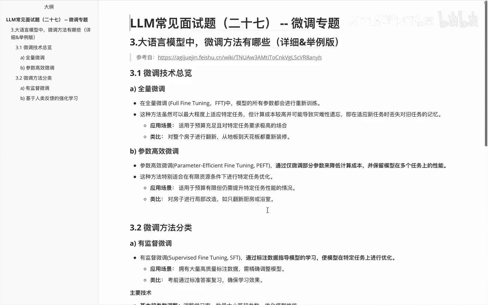
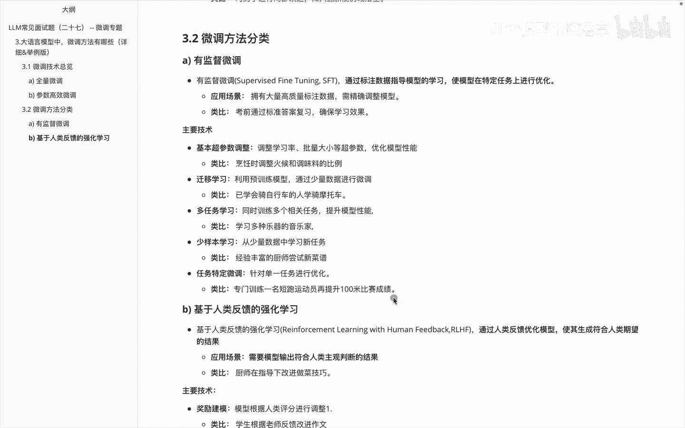
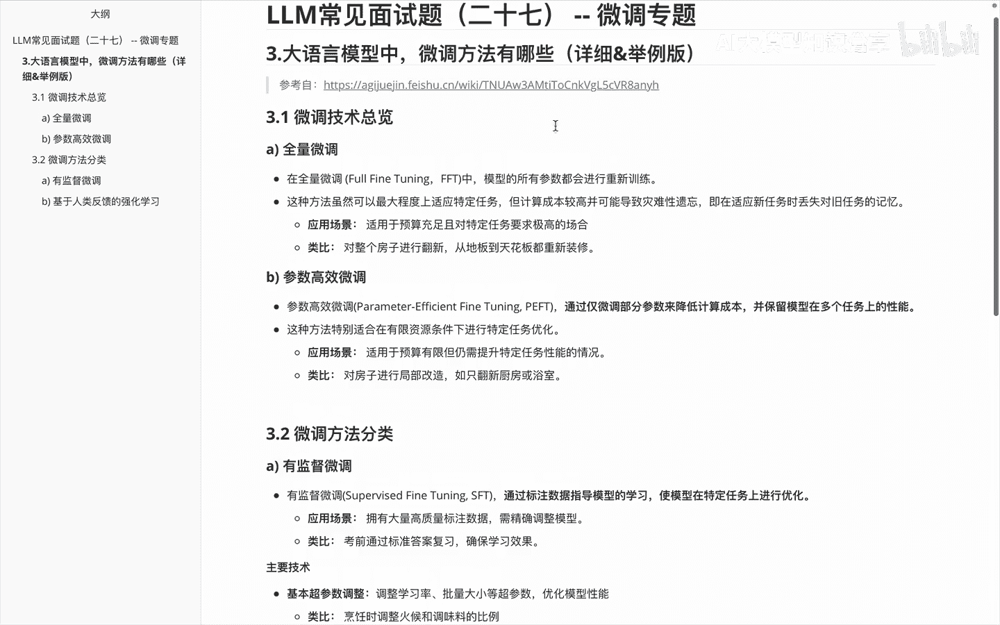
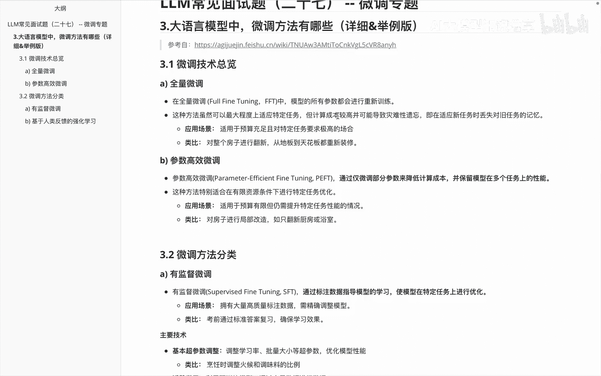
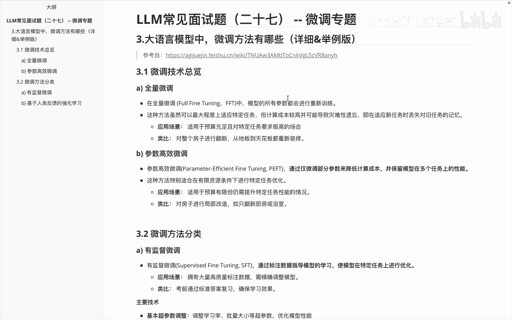

# P27：LLM常见面试题（二十七） -- 微调专题 - 1.LLM常见面试题（二十七） -- 微调专题 - AI大模型知识分享 - BV1UkiiYmEB9

Hello，各位这个视频里面呢我们要接着给大家讲一下，关于微调专题里边，还是这道题叫大于模型里面啊，微调方法有哪些，那么这个里边的话呃，其实是基于这个视频里面，会介绍的更加详细一点。

里面呢还有些举例内容，然后啊这个内容里边主要是参考的这边链接，大家呢呃如果感兴趣，也可以找这个链接去看一看，那么我们来看一下啊，关于这里边的内容，首先说第一块啊，关于这个微调技术的总览。

我们在上一个视频也知道啊，微调技术这边的话分为全量微调和参数，高效微调，那么全量微调呢，就是说我对啊，模型的所有参数都会进行一个训练，它这边应用场景呢主要是适用于一些预算充足。

且对特定任务要求极高的场合，然后类比呢啊这个举个举例子啊，呃大家理解成说啊对整个房子进行翻修，从地板到天花板都重新进行装修，那么参数高效微调呢，我们知道它其实只对一些啊，一少部分参数来进行微调的。

然后它可能是非常小，也可能是呃稍微占比多一些啊，那我们说他这边呢适用于呢是预算有限，但仍需提升特定任务的一些情况，然后我们就可以理解成啊对房子进行局部改造，如只翻新厨房，或者说啊浴室。

这是关于基础总览里面的两部分内容。

那我们接着看一下啊，关于微调啊方法分类的一些内容，在微调方法分类里面，我们知道他这边又分成说，有监督学习和基于人类反馈的一个强化学习，有监督学习，这边的话，我们主要是通过啊标注数据指导模型学习。

使模型呢在特定任务上进行优化，它的应用场景呢，其实主要是啊运用大量一些啊，高质量的标注数据，注意啊是高质量的，然后需要金球的时候呢，调整模型呃，需要在这儿稍微给大家强调一下，就是说数据这边的话。

如果你没有一些高质量的标注数据，反而在这儿这么做的话，效果未必好，如果你的数据在这儿在微调阶段，数据依旧质量不高的话，说出来的这个模型大概率也不怎么样，好的啊，大家理解的就可以理解成。

比如说考前通过标准答案来复习啊，确保整个学习效果，那么关于SFT阶段的话啊，有下面这些主要的技术给大家快速的过一下，比如第一个啊基本超三的一个调整，比如说啊调整的学习率啊，批量大小等超参数。

这个里面就是之前啊被戏称的叫什么叫炼丹啧，然后类比呢就是说烹饪食的时候，调整火候和啊调味料的比例，大家是不是，比如说中国的做菜里面说盐少许是吧，那么啊迁移学习里面的话啊，这块就是利用预训练模型。

通过少量数据进行微调，比如说你已经学会了骑自行车，然后呢再继续学骑摩托车，这就是一个迁移学习的过程，然后多任务学习，这边的话就是说我同时训练多个相关任务，提升模型的性能，那么这个里边就是通过。

比如说我学习多种乐器的一个音乐家，然后下一个少样本学习，就是少量数据中学习新任务，比如说我这边有个啊经验丰富的厨师啊，尝试一些新菜谱，然后再下一个是关于叫啊特定任务的一个微调，然后特定任务微调呢。

他这边其实主要是针对单一任务的吧，那么举例就是说啊专门训练一名短跑运动员，在提升100米的比赛成绩，这就是特定任务，就针对他这100米成绩来提升。

那么这块有监督微调，学完之后呢，我们再看一下，下面就是啊基于人类反馈的一个强化学习，就是RLHF，他这边呢其实更多的是这个反馈啊，大家啊基于反馈这边的话，它的应用场景是啊需要模型输出。

符合人类主观判断的一个结果，就比如说厨师呢在啊，比如说啊这个主人的指导下，去改进这个做菜的技巧，那么他的主要技术呢就是下面这些，第一个啊简历模型reward model。

比如说我模型根据人类评分来进行调整，类比的就是说啊学生根据老师反馈来改作文，然后在PPOPPO这边呢，就是说在确保策略更新平等的情况下，优化模型的一个行为，比如说我跑步者逐步增加一些训练的强度。

在还有呢就是我可以比较排名，就是啊RAC嘛，那排名这边的话，通过人类评估不同的输出优劣来优化模型，比如说品酒师啊，比较不同的一个酒款，再就是偏好学习，比如说我从人类偏好中学习优化输出，消费者啊。

根据偏好来选择一些产品，再就是啊参数高效微调，参数高效微调呢啊，我们把它放到了这个，人类反馈的强化学习里边来，他这边的话是要注意啊，最小化的一个训练参数数量，特定提高特定的任务性能。

那么类比的话就比如说是啊，裁粉仅修改衣服的细节来适应个人需求，而不是重新制作整件衣服，然后这里边这些例子呢啊有些呢我是啊，直接用了在上面放的这个链接里面的内容。

就这个链接里面内容，有些呢是啊又重新经过思考之后修改了一些。

大家呢啊根据自己的理解来看一下啊，对应的内容，然后这是啊我们针对前面也这道题。

又给大家做了一个详细版的介绍，这一版内容呢会更加好理解一些，大家学起来呢可能也更加的平缓一些。

