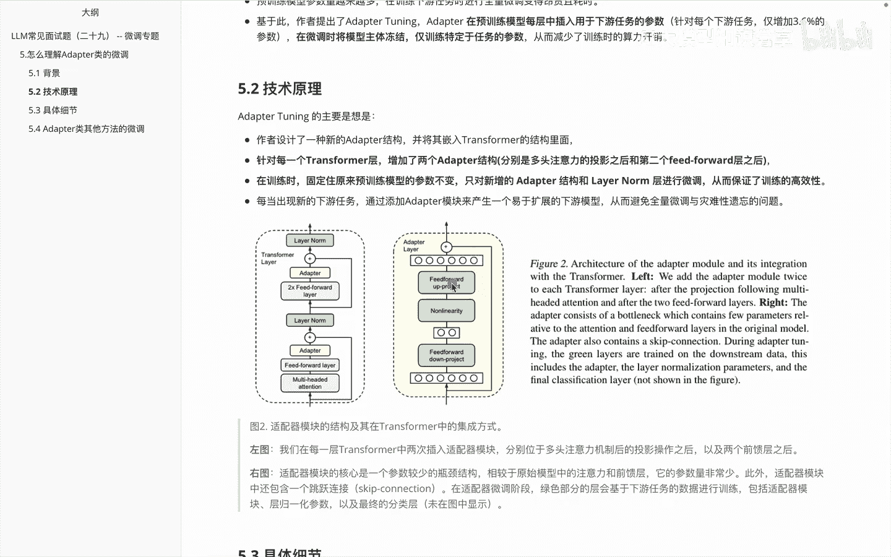
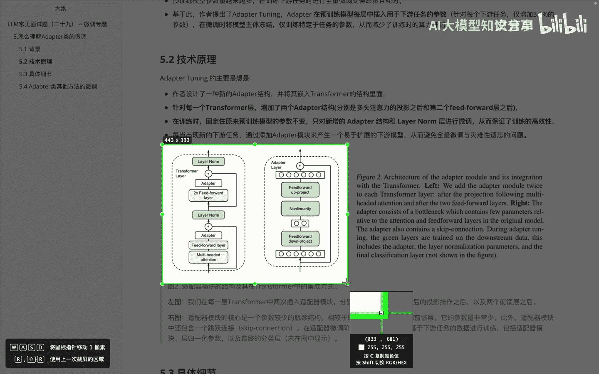
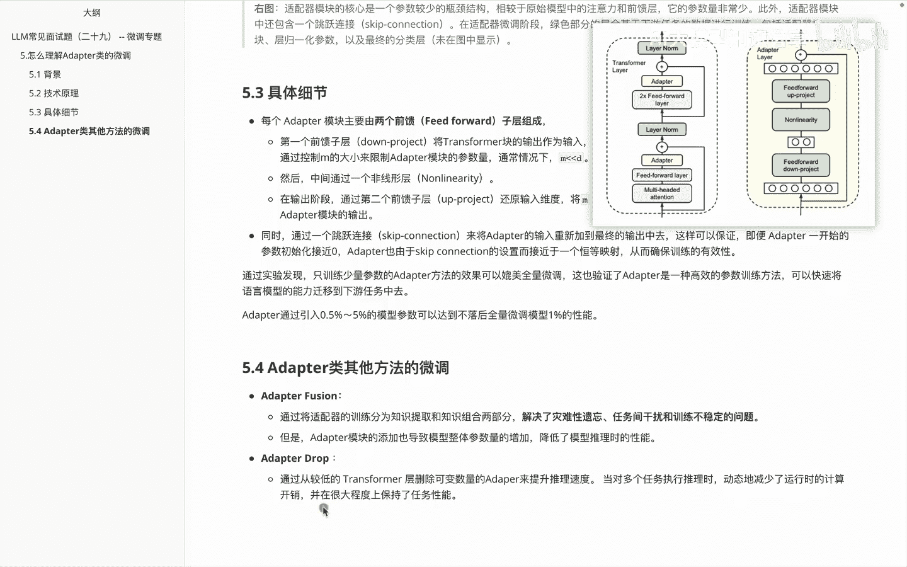

# P28：LLM常见面试题（二十九） -- 微调专题 - 1.LLM常见面试题（二十九） -- 微调专题 - AI大模型知识分享 - BV1UkiiYmEB9

咱们接着进入微调专题嗯，在上一个视频里面呢，我们介绍了一下关于这个参数，高效微调会分成几个类别，大家还记得吧，分别是adapter，prefix tuning和LAURA，那么在这个视频里面的话啊。

我想给大家分享的是，关于这个adapter这个类的一个微调，就是怎么具体理解这块内容呢，adapter这个单词呢具体而言它其实是适配器，那我们有时候也会说到关于适配器的一个微调。

大家知道这块是表达同一个意思就OK，然后关于这个adapt tuning，他的思想来源呢其实是啊，来自于在2019年发表的这么一篇文章，他当时的思想呢，其实主要是用来改进这个BERT的。

OK那我们来接着往下看一下，就是呃adapter这个类，它提出的背景啊等等相关内容，就是在预训练模型的时候呢，参数量会越来越多，呃，在啊训练下游任务时呢，进行全量微调，变得呃昂贵且耗时。

那么基于这个前面的假设呃和问题，作者提出了这个adapter tuning这么一个思想，然后这边呢是啊，在预训练模型每层中，插入用于下游任务的一个参数，然后针对每个项任务呢啊，仅增加3。6%的参数。

然后就可以达到和我们做啊，全猜微调它一样的效果，那具体的技术原理我们来看一下关于这块内容，然后作者设置的这个新的adapt结构呢，是嵌入到transformer结构里面的，这个咱们也都知道。

然后呃针对在每一个词的这个transformer里面，增加了两个adapter的一个结构，分别是在哪，一个是在这个啊多头注意力的投影之后，第二个是在这个fit forward之后，然后在训练的时候呢啊。

只要固定住原来的训练参数的模型的不变，只对新增的adapter结构和layer norm层，进行一个微调，从而呢啊保证一个训练的高效性，那么呃每当出现新的下游任务的时候呢。

我们就通过添加adapter模型，来产生一个易于扩展的下游任务，呃，进而避免呢全量微调和啊灾难性遗忘，下面这个截图呢呃其实是来自于啊文章里边，当时那个paper里面的一个内容。

然后呃右边这个呢是它的一个解释，我在这儿呢做了一个翻译，大家可以看一看啊，就是我们说这个图里面呢，左边这个图呢是我们在每一层transformer中呃，两次插入这个adapter模块的一个位置。

大家可以发现分别在这个位置啊和这个位置，然后额右边这个图里面它代表什么呢，是代表了我们说这个adapter这个模块的核心，大家可以理解成它呢其实是一个什么呀，转换器啊。

然后原文里面呢它是理解成一句叫叫瓶颈结构，那他主要做的一个事是什么事呢，其实就是我把这个啊入参的参数先简化，再给它做成复杂这么一个过程，大家可以看到啊，这块你就可以理解成入的一些参数，然后呢先是这么多。

然后经过一些结构之后呢，变成这么点儿，然后又转换之后呢，哎又变得这么多，那具体怎么做呢，啊会在后面的具体细节里面给大家介绍，我们先看一下，就是说呃在这个瓶颈结构里面的话，它相较于原始的模型中的参数的。

注意力和前馈层，它的参数量呢会非常少，此外呢这个失败器模块呢还包含一个呢啊，Skip connection，就是跳跃连接，大家可以看到就是这块内容从这儿过来，从这儿上来，然后再到这儿。

然后呢在这个里边的话呃，适配器微调阶段，绿色部分的词儿，会基于下游任务的数据进行训练，包括适配器模块，还有层归一化参数，以及最终的一个分类层，就是这块这块和这块的内容。

那么说完这块之后呢，啊我们来看一下它这个里面的一个具体细节。

包含哪块内容，我还是一样把这个截图放到右上角来，我们看一下这里面的一些具体细节内容，首先啊在前面咱们已经知道了，说这个adapt模型里面主要包含两个前馈的，一个子层，fit forward层。

那么第一个前馈子层它是基于呃叫del project，将这个transformer块呢的输出作为输入，就是这块里面啊这儿的位置，把这个输出呢作为输入，把原始的这个输入维度就是高维的一个特征啊。

投影到一个低位特征就可以理解，大家可以看到，假如这个呢是一个高维特征，然后呢经过这个fit for word，就会变成一个低维的特征，然后呢啊通过控制这个M的大小，来限制这个dr。类的一个参数量。

大家可以想到就是说哎通过这边一个控制，我就可以控制中间这个，比如说到底是哎两个圈还是四个圈等等内容，通常情况下呢，这个额对应的一个高维特征和低位特征，里面的话是啊低位特征远小于啊这个高维特征。

然后呢中间会经过一个啊非线性词，就是这个啊这个非线性词经过之后呢，在输出阶段通过第二个前馈子层，含还原输入的维度，为什么还原呢，其实为了我们后面做方便的计算嘛，那么这个时候就是把这个低维特征。

再重新映射回原来的这个高维特征，作为一个adaption模块进行一个输出，同时在这个里面大家可以看到就是这个位置，前面给大家说了一下，会经过一个这个啊skip connection。

那么这个skip connection干嘛呢，它主要是把这个adapt的输入，重新加到一个最终的输出中去，这样呢就可以保证，即便我的adapter，一开始的这个初始化参数为零或者接近零，然后呢。

adapter也会由于这个skip connection的设置，而接近于一个恒等映射，从而确保训练的一个有效性，这个怎么理解，就是说假设我这条通路啊失效了，都变成一个接近零的数，那么我在这条通路里边。

因为我们是直接给他啊映射过来做一个求和嘛，然此时他这边这个参数呢，相当于也是直接照搬过来的嗯，那么adapter呢啊，整体里边就是我们只训练少量参数的，adapter方法就可以媲美出啊全量的一个微调。

然后对应的里边一般做的adapter的引入参数，就是0。5%到5%的一个，模型参数啊，这个是给大家讲的这个关于adapter里面的，这个adapt tuning里面的一个啊整体方法。

那么在这个adapter tuning之后，其实还映射出了一些其他的一些优化的方法，然后我们来分别看一下，第一个呢叫adaptive fusion，这个呢是通过将适配器的训练分配为知识。

提取和知识组合两部分，进而解决了这个灾难性遗忘问题啊，任务将在干扰性和训练部分不稳定性问题，但是呢这个时候因为在这个ADDON模块里面，添加了一些更多的参数量，导致我这个模型的推理性能降低了。

然后在这个的基础上又做了一句话，叫adapter drop，它呢，其实就是我们在一些transformer层里边的话啊，比较较低的一些层数里边，把这个呃内容给无关内容给删掉。

进而提升咱们整体的一个推理速度，当对多个任务执行的时候呢，动态在减少运行时的计算开销，这样就可以保证一个任务的性能呃，关于这个adapter这边的话呃，因为呃目前在这块里面呃。

真正实战里面其实用的并不多啊，用的并不多，但并不代表大家说对这块就不去了解呃，给大家通过这么一个视频呢，是想让大家知道呃，adapter这边的一些基本的方法怎么做。

以及adapter是会去修改你car内容啊，方便比如说面试里面的话，跟别人聊起来的话，别人问你ADAPTOR相关的东西你都不知道啊，现在目前主流的用的其实都是ALLOWER，相关的内容。

