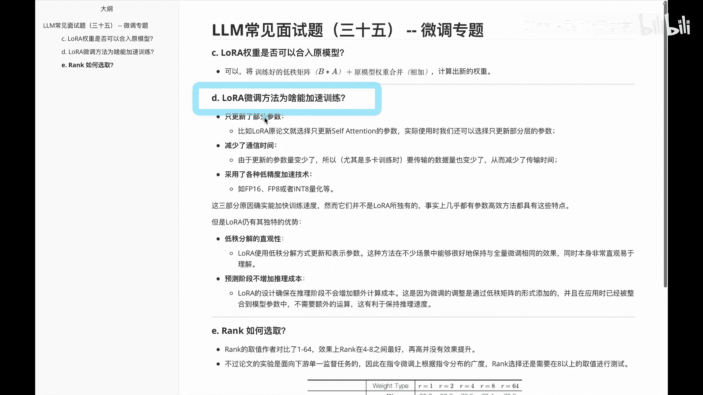
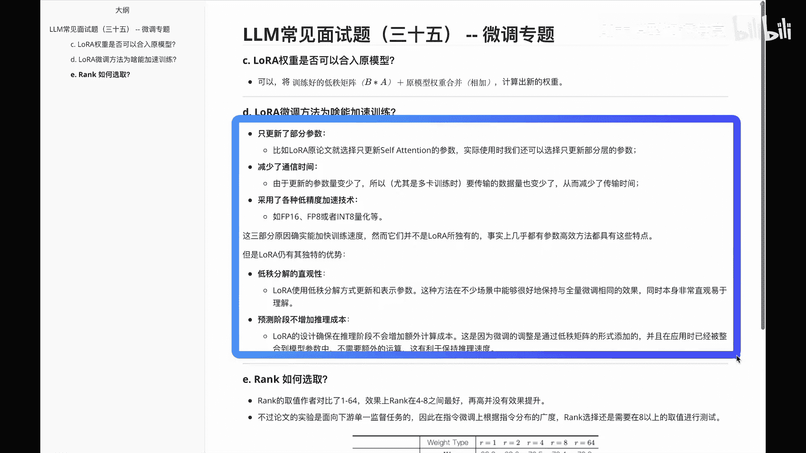
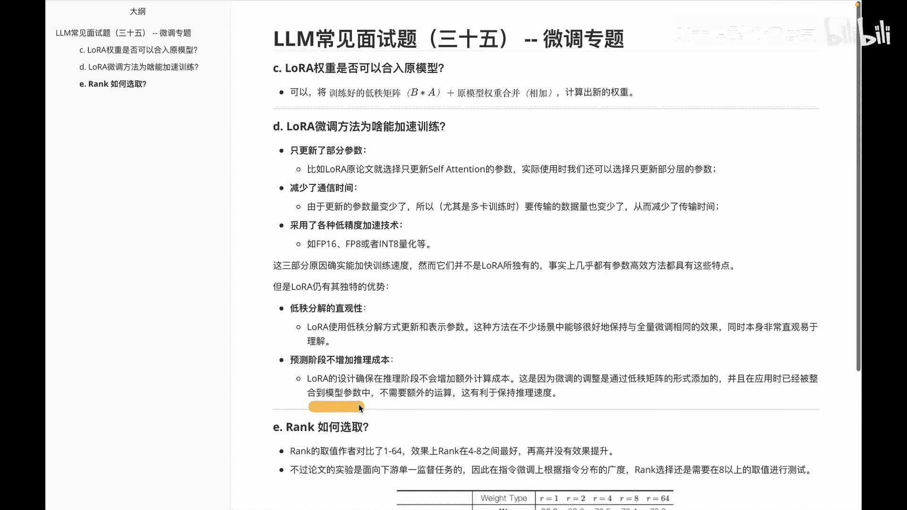
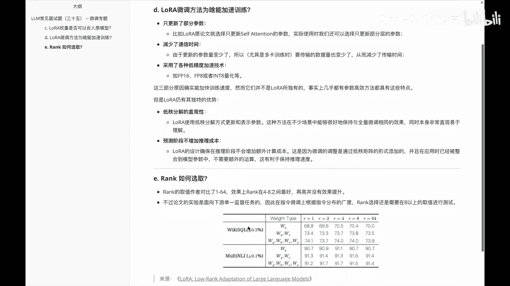
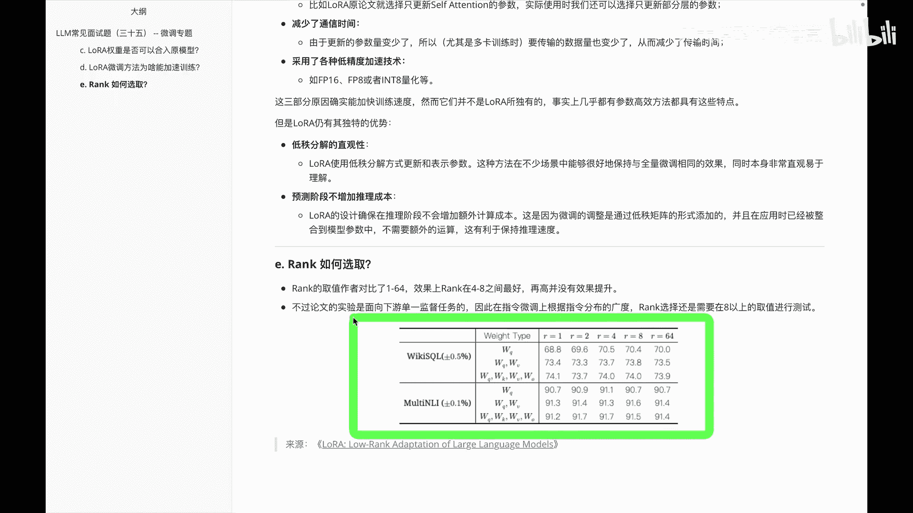
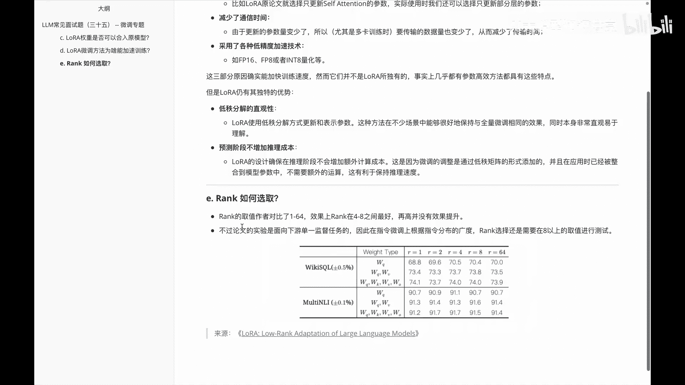
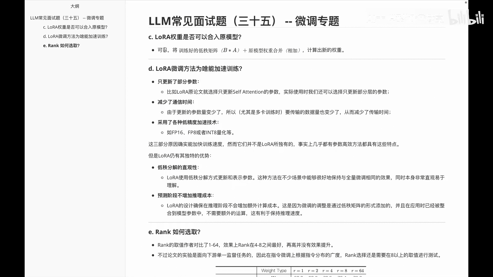
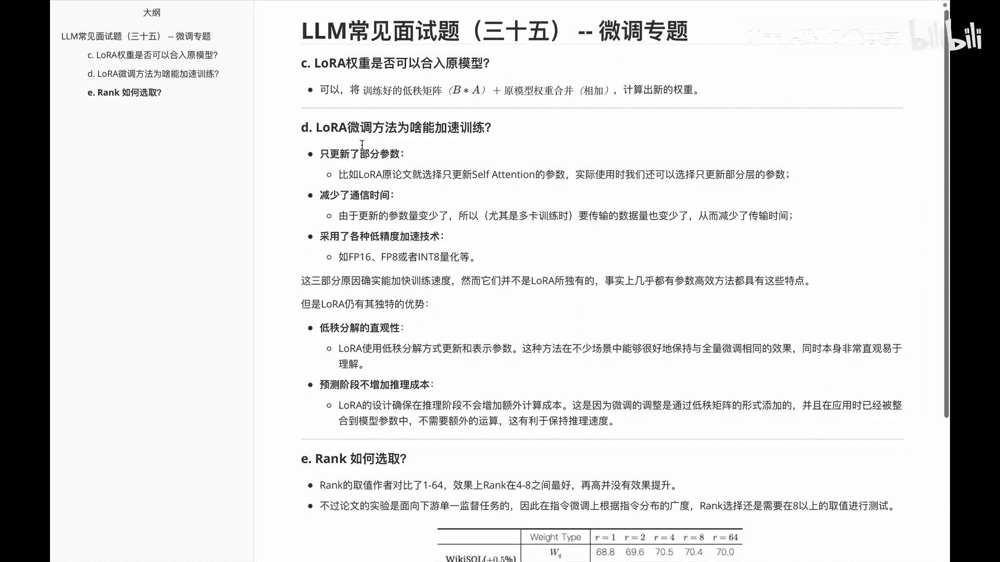
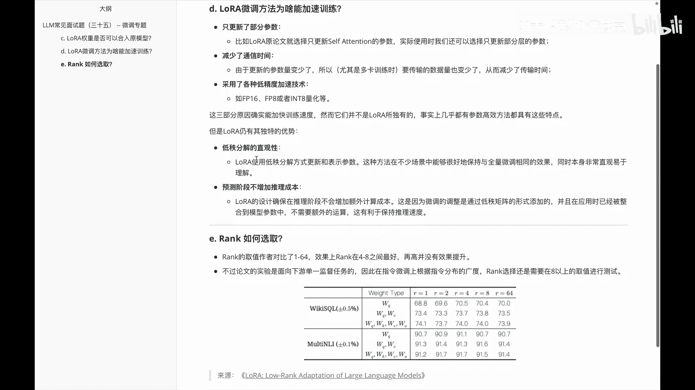
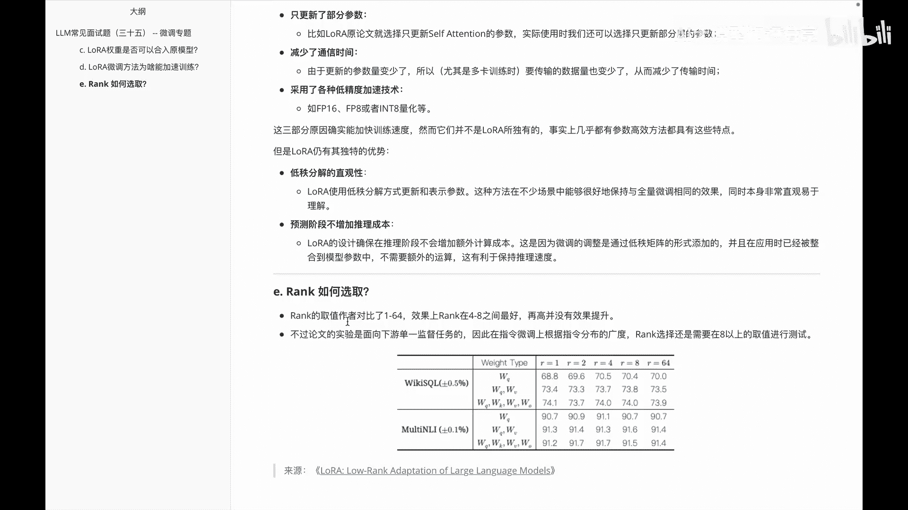

# P34：LLM常见面试题（三十五） -- 微调专题 - 1.LLM常见面试题（三十五） -- 微调专题 - AI大模型知识分享 - BV1UkiiYmEB9

Hello，各位我们继续啊，进入ALLAURA这块的相关内容学习呃，下面给大家讲的这几个题呢，可能会啊稍微小杂一些，但依旧呢可能会被问到，所以还是需要掌握一下，首先第一个啊问到的可能是说啊。

lower的这个权重呢是否可以合入原模型呢，其实这个大家如果听过前面的啊，就会知道自然而然是可以的呀，我们把一些训练好的低质矩阵就是B乘以A嘛，然后加上原模型的权重做一个合并，相加。

它就是啊一个合并的方式嘛，这个没什么问题，然后第二个啊问的是说啊，LAUREN这个微调方法为啥能加速训练呢，啊这个里面呢啊。

从这个微调的综合性，以及lower这边独特的特性给大家啊，分别来拆开讲一讲。

首先第一个啊lower这边的话，因为它针对之前的预训练模型，只更新了部分参数，比如说呃，layer在原论文里面就只选择更新，self attention的这个参数，所以它自然而然就能提速。

第二个是减少了通信时间，因为我们更新的参数量少了嘛，啊自然而他这边数据传的就少了，尤其是在一些多卡训练上，他这边会更加高效一些，第三个啊就是采用了一些额低精度的加速计算。

比如说用的是啊f float16啊，比如INT8啊这块相关的内容，那么上面这三个呢，其实都是啊啊微调里边的一些特性，那么下面我们看一下啊，LAURA这边独特的一些特性，首先第一个叫低质分解的一个直观性。

我们知道lower这边它是通过低质分解，来表示更新的一个方法，那么这个方法呢在不少场景中，能够很好的保持与前量微调相同的效果，同时本身呢有非常直观的易于理解，这个是啊低质啊分解的一个直观性。

第二个呢是啊，预测阶段并不会增加一些推理成本，就是LOL的设计呢，确保在推理阶段不会增加一些额外的计算成本，这是因为微调的调整呢，是通过低质的矩阵的形式添加的，并且在应用时呢已经被整合到模型参数里边了。

所以并不需要额外的一些计算。

然后接着看一下下面这道题，叫啊这个lower里面的RAC是怎么选取的，我们在前面已经知道rock呢其实是质，那么它的质是如何选取的呢，呃前面大家就知道像什么质啊，二啊四啊八啊这块的东西其实是这样的。

就是这个质呢啊，其实作者在原文里面对比了一下，从1~64，然后对比之后呢，它的效果最好的是4~8之间的啊，再高呢就会发现并没有更好的一个提升，但是大家需要注意的是啊，作者在原论文里面。

他只是针对一个下游单一的监督任务，就比如说啊在这个截图里边，大家看到的比如这个是wicked circle，这个是MONTNLI，所以说啊在呃指令微调上，根据指令分布的广度质的选择呢。

还需要在八以上的值进行一些测试，这个当然大家根据实际情况来看就行了啊，然后这个截图呢，我是啊根据原论文里面截出来的一个图。

那么啊，在这里边给大家主要分享的是这么几个题。

第一个啊，就是LAURA的一个权重是否可以合入约模型呢。

啊是可以的，第二个啊，lower微调方法为啥能加速训练，给大家从啊。

综合和lawyer独有的两方面做了一个分析，然后第三个啊。

rock这个值是怎么选取呢，说单任务这边作者在原文里面去啊，证明了一下，说4~8之间它这个效果是最好的啊，这是在这个视频里面。

