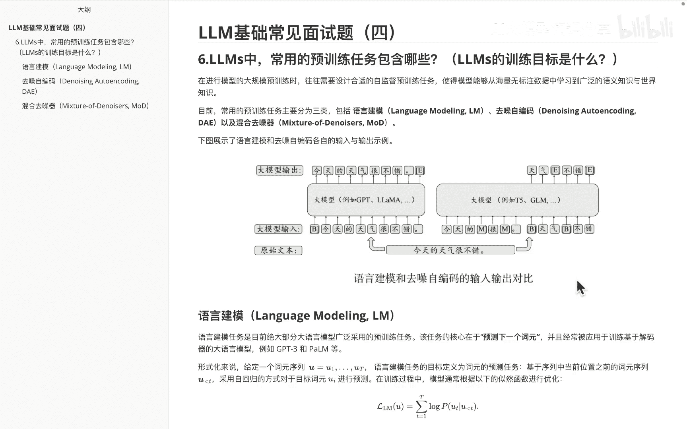
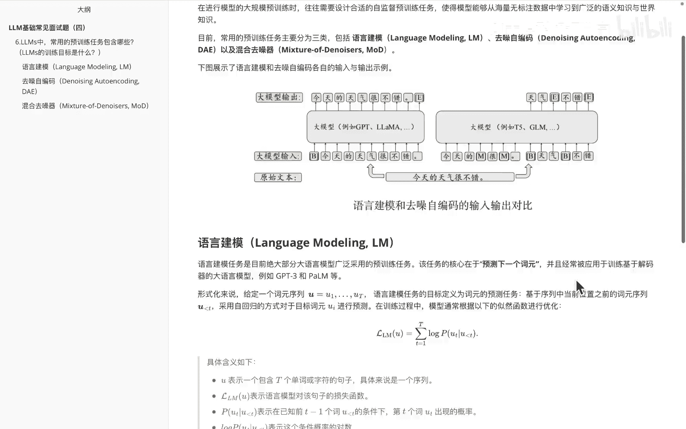
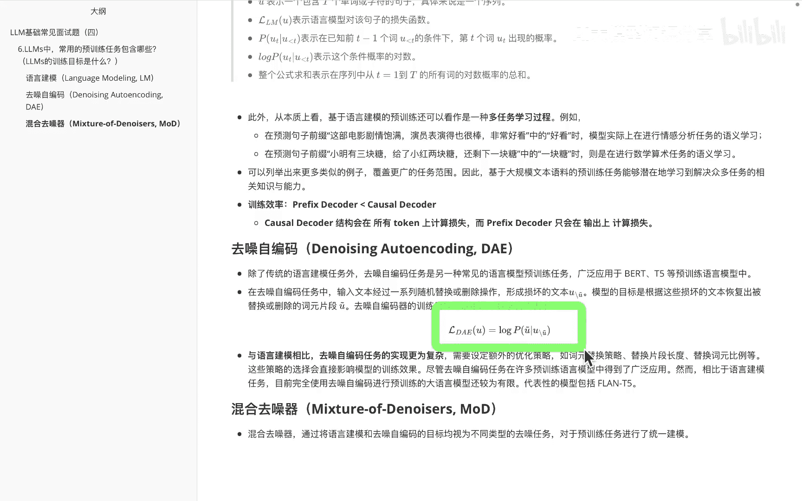
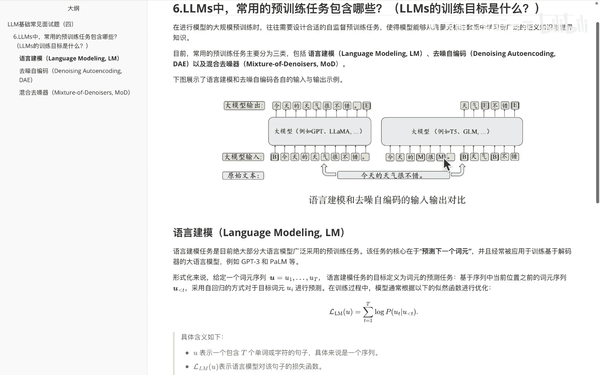
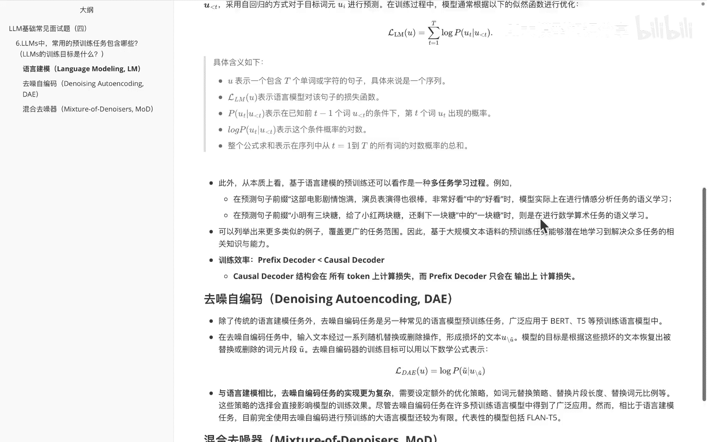
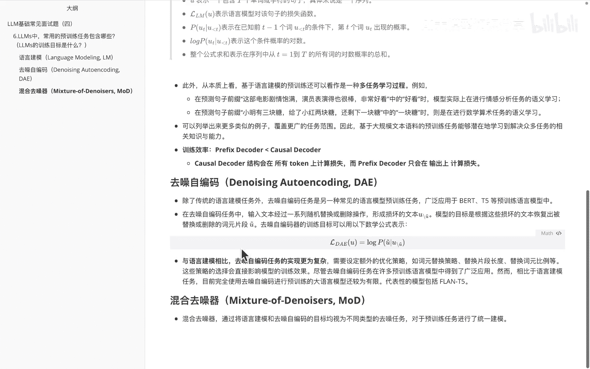
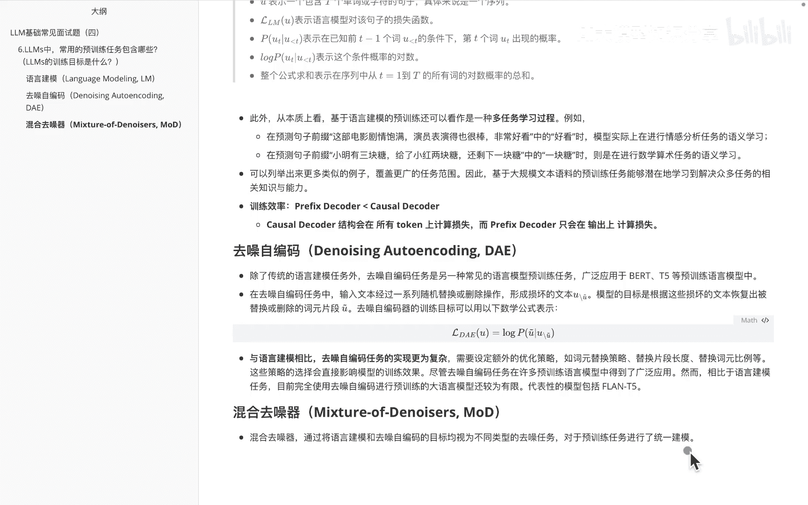
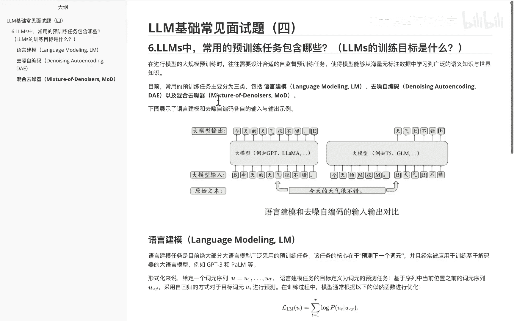
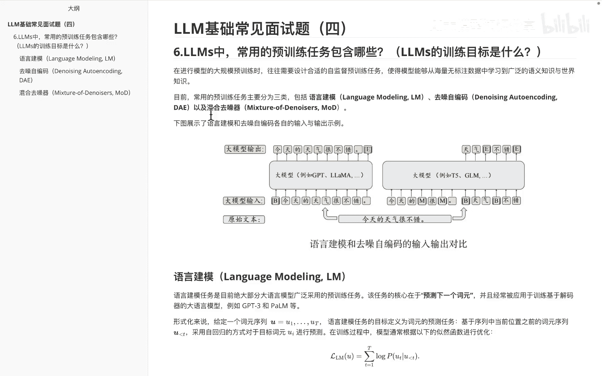

# P4：大语言模型面试题系列(四） - 1.大语言模型面试题系列(四） - AI大模型知识分享 - BV1UkiiYmEB9

今天给大家带来的这道题目呢，有时候呢面试官还会这么想问，大约模型的预训练目标是什么，我们知道大语言模型呢，其实在呃GPT系列之后呃，发展起来被大家呢不断的去讨论，其实主要是包含三种类型的。

一个呢是叫啊语言建模，一个呢是啊去造的自编码，还有呢是啊混合的去噪器，那么我们分别看一下它们三者之间的一个，区别是什么，呃首先来看一下关于呃语言建模和去到自编码，它们之间的一个输入输出的对比。

就拿呃大家在图里面看到这个例子来看，比如说我们现在输入的一个文本呢，就是今天的天气很不错，然后左边这边呢代表的是语言建模的方式，我们来先看一下，那首先大模型这儿输入的是啊，今天的天气很不错，句号。

那这个结果后面呢其实是啊，不确定后面会接什么的，那大模型，这输出呢，其实是会发现输出一个E这么一个标记符号，其实end就是结束的标记符号嘛，嗯那右边呢这边是呃，去造字编码的一个输入输出对比。

大家会发现这个其实就和之前的BERT那种mask，有点类似了，就是今天的啊mask啊，我也不知道是什么很呃什么不知道，那对呢，后面还会说什么天气不错，然后这个里面的话它就会经过我们的大模型。

把这个里面的话啊天气不错，做好排序，同时呢给它映射到这个位置里面来，这是我们对应的去造自编码里边，他做的一些事情，好讲完啊。

基本的这个语言建模和去造字编码的一个啊，基本理解，那么下来我们就啊理解的稍微深入一些。

看一下关于这个啊语言建模的一个啊，基本的概念，然后语言建模呢，就如大家现在在屏幕里面看到的一样，其实它的核心任务就是预测下一个词源，然后他的一些常用的解码的一个语言模型呢，包含GPT系列的pom。

都是那基本的一个计算公式，就如啊在图里面大家看到这个内容一样的，然后分别给大家解释一下，这个里面分代表的什么意思，然后我们再理解一下这个公式，比如说这里面U呢表示的是啊，一个包含T个单词或者字符的句子。

你就理解成哎就是一个这个句子啊，那么在等号左边的这个东西呢，其实是我们要计算这个语言模型，对的一个损失函数，右边这边啊，他其实就是对这些啊损失函数的，最大自然的一个求和。

那我们首先看一下啊这块的这个内容，这个其实就表示的是呃，在已知前T减一个词或者字符的条件下，然后第T个词出现了一个概率，然后整体通过log求的这个值呢，其实是一个条件概率的对数嘛。

然后整柜这个公式呢就表示啊，从序列一到序列T，所有的这个词的一个啊对数的概率总和，那么关于这个语言建模，其实它是可以衍生成很多的一些子任务的，比如就拿下面这个例子来看，大家可以看到这个里边说的是啊。

这部电影的剧情很饱满，演员表现的也很棒，非常好看，那么这个里边的这个好看两个字儿，如果说我把它给mask掉，就是我把它给挡住，让它做一个语言建模的时候呢，其实它就是要做一个啊情感分析任务的，一个学习。

到底是非常好看还是非常难看呢，他需要去学习，那再如下面这个例子，比如说啊小明有三块糖，给了小红两块糖，还剩一块，那如果说我把这个一块糖这儿给挡住，此时他需要去做一些预测的这种语言，模型的时候呢。

其实就是一个数学算术任务，这种例子很多啊，大家会发现其实语言任务，语言建模这种啊演化过来之后呢，其实他的的能力是非常的呃强的，而且他的子任务呢是很多的，说完这个大家还需要注意的。

另外一点就是啊关于训练的一个啊效率，我们在上节课中讲过，关于这个prefix decoder和causal decoder啊，prefix decoder呢我们知道它这边其实是啊。

一部分是采用的类似encoder decoder里面，它是在这样一个啊双层的一个内容，而coder decoder呢，它其实是完全一个啊，通过自回归的方式来生成的一个单项的内容。

那么自然而然在这块里面的话，针对这个里边coder decoder呢，在所有token的计算上其实是更快的啊，而prefix呢是他这边会因为有双层的计算嘛，所以他这边效率稍会稍微低一些。

那么下面我们再看一下，关于这个去造字编码的这个任务啊，关于去造自编码呢，呃其实前面也给大家稍微说了一下，有点像类似于啊BERT里边的这个mask任务，然后整体里边大家可以看看这个公式，它是长成这样子的。

那么整个任务里面的其实做的事，就是说啊输入文本，经过一系列的随机替换或者删除的操作，形成一个损坏的文本，然后这个模型的目标呢，就是根据这些损坏的文本，恢复出被替换或者删除的这些词源片段。

然后整个公式啊就是这个。

那么讲完这块，大家可以翻到上面来看一下，当时讲的这个例子里边的这个内容，大家发现是不是在这块里面的话，其实把这个里边的这些词源给破坏掉。

然后让它来预测这个词源的正确顺序呢。

好这是关于这个去造自编码的整体内容，然后去造自编码。

这个呢其实要比语言模型会更加复杂一些，因为它需要去预测整个任务里边呢，比如说词源的替换策略，替换的片段长度和替换词源的比例等等，相关内容，所以它要比前面的这个语言建模稍微难一些。

那么讲完去造自编码之后呢，我们再看一下关于这个额混合去造器，就混合嘛，其实就是通过把语言建模和啊去造字，编码的目标视为不同类型的一个去造任务，大家啊了解一下就可以。

OK说完这块之后呢，呃大家需要在呃这个里边知道的是。

常包含其实是三部分，一个是语言建模，一个去造自编码的一种方式。

