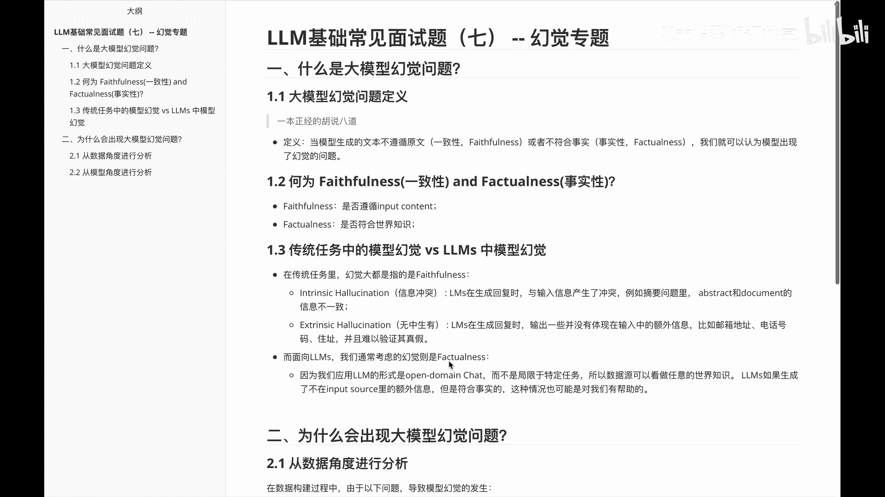
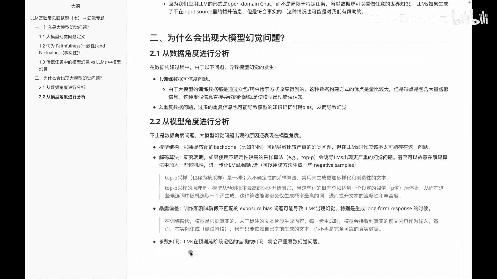

# P7：LLM常见面试题（七） -- 幻觉专题 - 1.LLM常见面试题（七） -- 幻觉专题 - AI大模型知识分享 - BV1UkiiYmEB9

从这节课开始呢，我们要给大家介绍的是，关于大语言模型里面的幻觉专题，那么首先来看一下这么两个问题，第一个啊是关于什么是带模型的一个幻觉，第二个为什么会出现这种大于模型的幻觉问题。

那么关于什么是呃大于模型的一个幻觉问题呢，呃其实通俗说就是一本正经的胡说八道，那正常定义来说，就是当模型生成的文本不遵循原文的一些内容，或者说不符合事实的时候呢。

我们就可以认为这个模型呢是出现了幻觉问题，那么不遵循原文呢啊一般是会说就是一致性吗，不符合事实呢啊我们叫它事实性，紧接着就看一下啊，到底啊什么是这个faithfulness和那个FACTONESS。

就是什么，是一致性和事实性呢，其实首先说一致性，它就是啊遵循你的输入的一个要求，或者输入的内容嘛，这是一致性，而事实性呢就是说是否符合这种啊，事件的一些知识啧，那接着看一下，另外一个就是说传统任务中的。

幻境模型和大语言模型里面的啊，这个幻觉它又有什么区别呢，或者它们之间是怎么样一种关系呢，首先看一下啊，在传统任务里面呢，啊其实幻觉呢大部分都是这种什么呢，就是一致性相关的幻觉，一般时呢会有这种信息冲突。

或者说无中生有，首先我们看一下信息冲突啊，他说的是什么啊，就是这种语言模型在生成回复的时候呢，与输入的信息产生了冲突，例如说啊，摘要问题里面的这个abstract，和document里面的信息不一致。

啧那另外一个是无中生有，他说的是什么呢，是输出一些，并没有体现在输入中的一些额外信息，比如说哎邮箱的地址啊，电话号码啊，住址啊等等这些内容，那么在面对到这种啊大语言模型里面的话。

其实幻觉更多的是这种什么是这种啊，事实性，事实性呢就是说，因为啊我们应用这种待遇模型的形式呢，更多的是这种啊开放域的一些呃对话，而并不是仅仅的局限到这种特定任务里面，所以这个数据里面的话。

他会看到一些啊更多的一些世界知识，此时在生成的时候呢，就可能违背事实，所以说在这种啊大元模型里边，它更多的其实是种事实性的问题，经过这个介绍，大家应该对这种啊大模型的幻觉问题呢，有一个初步的认识。

那么我们再看一下第二个题，他讲的是说啊，为什么会出现这种大于模型的一个幻觉问题呢，我们会分别从啊数据角度和模型角度，给大家做一个解答，首先从数据角度来看一下，在数据角度里边的话啊。

一个是这个啊训练数据的可信度问题，训练数据可信呢，我们知道啊，大于模型呢其实是需要海量的数据的，那海量数据呢在获取的时候呢，并不是十分容易的，一般是通过啊什么爬虫啊等等的方式来获取。

但这种方式获取的数据呢，它有时候数据的质量并不高，比如说里面会有一些脏数据，那此时训练数据里边包含脏数据，或者一些假数据，就会导致我们这个里面模型出现幻觉，第二个呢是一些啊重复的数据，这个也可以啊。

很好的理解，比如说在这个模型里面训练过程中数据不多，那我们呃把这些数据呢人为的做一些重复，再一方面呢就是说我抓取过来这部分数据啊，他本来天然就好，还有很多重复的数据，比如说一条新闻啊。

他一会在这个新闻平台，一会儿在那个新闻平台，一会儿又在啊另外一个新闻平台，此时抓过来之后呢，他们本来天然就有一些啊重复，那么这种呃信息重复呢，也会导致我们的知识记忆呢出现一些偏差啊，从而导致幻觉。

这是从数据角度的一个分析，那么看一下啊，从模型角度的一个分析，模型角度呢会分别做模型结构啊，模型的算法以及暴露偏差，还有一个参数知识来给大家做一个分析，首先呢关于这个模型结构呃。

嗯就是说如果是一些啊比较弱的这种啊，backbone呢，它可能就会带来一些严重的幻觉问题，因为它模型本身太弱了嘛，但是在啊大语言模型时代呢，一般是这个问题啊，其实没有那么重要，或者说没有那么紧迫。

第二个是解码的算法，解码算法里面的话啊，因为我们为了保证这个啊大于原，目前它生成的这种多样性，所以呢有时候会通过这个top p的方式来啊，预测它的下一个啊token。

但这个时候呢就可能会带来这种幻觉问题，那么什么是这种top p呢，在这稍微给大家说一下，其实就是啊一种引入不确定性的一个采样方法，常用来生成更加多样化和创造性的一些文本，再下一个呢是关于一种暴露偏差。

暴露偏差呢是说我的训练和测试阶段呢，不匹配的这种啊暴露的一个偏差问题，导致大模型出现出现这种幻觉，然后特别是在一些啊，长文本的一些回复的时候呢，这个时候他的这种问题可能会更加的严重一些。

最后一个呢是关种啊参数知识，也就是说啊，大模型呢在这种预训练阶段，积累错误知识的是错误的，然后啊导致这个整体的一个幻觉出现，第二个题给大家讲的就是，关于这个为什么会出现大模型的幻境问题。

分别从数据角度和模型角度给大家做了个分析，那么在数据角度里边的话，给大家说了一下，关于这种训练的数据的可信度问题和，重复数据问题，然后在模型角度里边给大家讲了一下，关于这个模型结构解码算法。

暴露偏差和参数知识啊。

