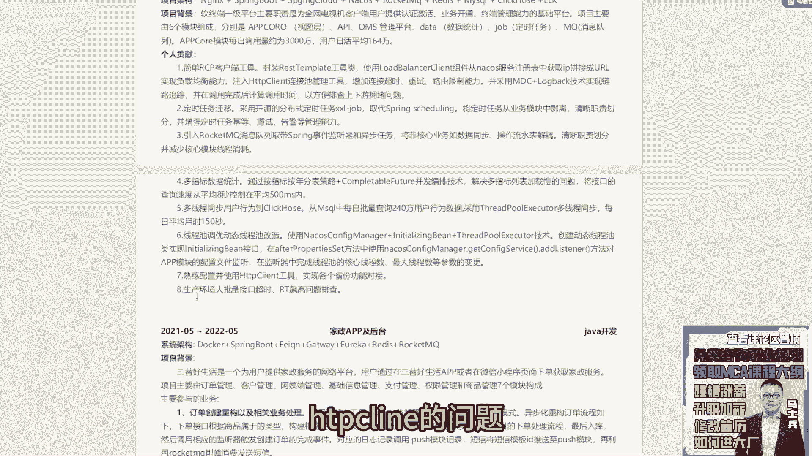

# P1：1.【程序员简历指导】27岁3年工作经验 - 计算机底层原理 - BV1ZnDsYAE7D

呃今天晚上课呢分为两个阶段啊，第一阶段先看一下咱们同学发的一些简历，然后第二阶段呢，我们来呃讲一下简历到底应该如何写好吧，今天呢我们来讲一下简历到底如何进行，一个修改啊。

然后下午的时候呃已经找咱们的咨询老师，找各位同学收集过对应的一些呃简历了，大家也看到了，这儿罗列了一些收到收集到简历，咱们的第一件事，先把这个收集到简历呢，给大家个看看。

那个那个那个什么萧逸同学来的话，跟我说一声好吧，给我说一声，来我们看这同学简历啊，27岁3年的经验，然后呢JVMJUCMYSQL的，然后框架的IOC的，REDIS的rock mq的分布式相关原理。

要查查o job cloud技术经验。

中国移动浙江，然后现在还在职啊。

20021级平台家政app及后台没了呃。

这是谁的，阿乐是吧。

呃阿乐你你你你这个简历投出去之后，我不知道有没有反有有有什么反馈啊。

我先说下这个简历里面存在的一个问题，好吧，呃你现在3年经验目呃。

如果对标对应的岗位的话，应该是一个中级开发，或者说高级开发这样一个岗位，所以呢先说技技能特长这块，基本上常规的技术点该提到的都提到了，然后最好呢在技能这块加一个编号，加个编号，12345。

加个编号区分一下，因为你的有的这个技能描述啊，它是超过一整行的，所以你要加一个编号做一个基本的区分，这是第一点，第二点，你现在所有的技术站写的都是熟掌握掌握掌握，熟悉熟悉熟悉熟悉。

我建议你最好能从这些技术站里面，选择两到三个，把它改成一个描述，叫精通，因为你按照3年的经验来说，你应该具备某些精通的技能项或精通的技能点，所以这块东西呢你要把这东西罗列一下，高级开发工程有列编号吗。

列编号的意义跟你是初级中级高级没关系，列编号的意义，最主要是为了方便hr看起来更加有条理一些，看的更加清晰一些，如果你所有的技能描述都是单行，就可以描述完了，你可以不加编号，但它里面像这条。

像这条是跨是跨超超过一行的，最好加一个编号，让别人看起来更加舒服一点，同时告诉别人明确在什么地方进行区分的，这个很重要，好吧，这是第一个技能这块，然后呢如果有可能的话，最好能把一些其他细枝末节的技术站。

再加一下啊，比如说你掌握的一些例呃，比如你掌握一些那个分布式的一些CP啦，贝斯啦，pars啦，OKEEPER啦对吧。

亮这样的技术站最好往下面追加一下，就是技能站这块能撑的多满就撑多满，尽量去显得更多一些好吧，就这个地方你要不改技术技术站描述。

其实没问题不大问题不大好吧，这块没有什么太太太多要说的，第二个是你的工作经验，工作经验这块要改工作经验，这块你要描述的是什么，是你从业的经历，也就是说你个人的履历。

所以像下面这些所有的描述是没有意义的，因为你写的这些所有的描述，都是跟你的项目绑定在一起的，明白吗，所以这块不需要写，只需要写什么东西，第一个工作时间，第二个公司名称，第三个职位保留第一行就行了。

下面这些所有的描述扔一边，不用去看它，一点意义和价值都没有，因为你这些内容在写的时候，要放在你的项目里面去做重点的描述，重点的描述这块一定要注意，然后呢工作经历这块呃，往下挪一下，不要写到这块。

把它写到项目的下面，好吧行，写到项写，写到项目下面。

然后第三个我们来说一下项目经验，这块项目经验这块呃，技术站没问题，然后呢项目背景把它改成项目描述，这个项目描述这块写的有问题，你在写项目描述的时候，要突出的是什么，是你项目的价值，这个价值表示什么呢。

你要告诉别人这个项目到底解决什么问题，它的核心功能是什么，而不是单纯的去罗列这样的一些模块，就是把中间那个模块给干掉，然后下面的数据量OK了，也可描述了，比如说日交用量3000万，日活160万。

这是OK的，这没问题，但是正好中间这个模块这块，你看通过什么方式把它替换一下，描写成一个重点的核心功能好吧，然后下面这块简单RCP客户端工具，封装什么东西，定时任务迁移引用什么。

解决什么问题，多指标数据统计，然后这是click host多线程同步问题。

线程池动态调优的问题，HTTP client的问题，生产的这RT标识的问题。

这几个点写的没问题啊，这个项目这块写的问题不大，第一项目没问题好吧。

第二个家政app及后台，这个项目写的相对就简太简单了太简单了啊。

这个描述就有点儿过于简单的东西了。

就一定记住啊，像你现在3年经验，你现写了两个项目，有点担保，最少啊，最少写三个项目，就是你在你的项目基础上，你要再加一个项目好吧，然后呢第一个项目描述是没有什么太大问题的。

把我刚刚提到这个点，简单做一个修改就完事了好吧，然后加一个项目。

第二项目你要详细写，类似于仿照你第一个项目的模式，把具体的参与的核心的职责，一定要把它罗列清楚，不能写下处理什么订单重构相关业务处理，然后呢业务数据隔离完了，就每一个项目一一定要记住啊。

很多同学会有一个错误认知。

他觉得说老师反正我面试的时候，重点聊的是第一个项目，那下面的项目就不重要。

对确实是这样的，确实没那么重要，但是该详细写的。

该重点突出的，你还是要重点突出，你不能说因为他不问，所以我可以写的很简单，不要这样好吧，所有的项目保持统一的格式，保持统一内容。

把值的描述这块加的多一点，就这东西好吧，然后下面的背景没问题，这个证书算了吧，这个证书坦白说呃意义和价值并不是很大，所以这个荣誉证书可以去掉，然后个人建议呢，你在简历的最下面最好能加一个模块叫什么呢。

叫个人评价，个人评价，个人评价表示什么意思，表示你要展示一下你的行业背景，和你的技术经验，你要学会去夸一下自己，比如做过什么行业的项目，提出过什么样的技术解决方案，做过什么样的一些架构设计对吧。

然后呢你参与的项目数据量大概有多少，然后你做过哪些技术的深入沉淀和对应的储备。

这东西要详细的去描述一下啊，所以总体来看大问题没有。

但小细节要做一些修改，第一个上面的技能做一些描述，第二个加一个项目，然后把第二个项目写的稍微丰满一点。

然后加一个自我评价这个模块，阿乐听明白了吗，听白话的给我扣个一好，这人简历没问题，OK好吧。

