# P12：12.【程序员简历指导】本科3年工作经验 - 计算机底层原理 - BV1ZnDsYAE7D

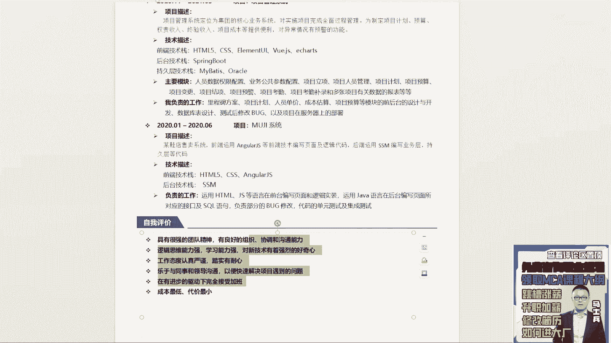

来下一个最后一个啊，老师没做过复项目怎么办。

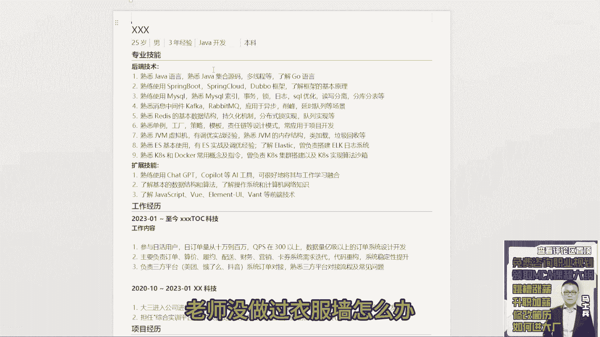

补啊没做过还不补，你现在在这还离职啊，易梦在这还是离职啊。

看你看你这写的在这还离职，24年7月份已经离职了是吧，离你是7月份就离职了，一梦这几位找工作找的怎么样，投了多少份简历，有多少个面试邀请有吗，没开始找呢，你这没开始找呢。

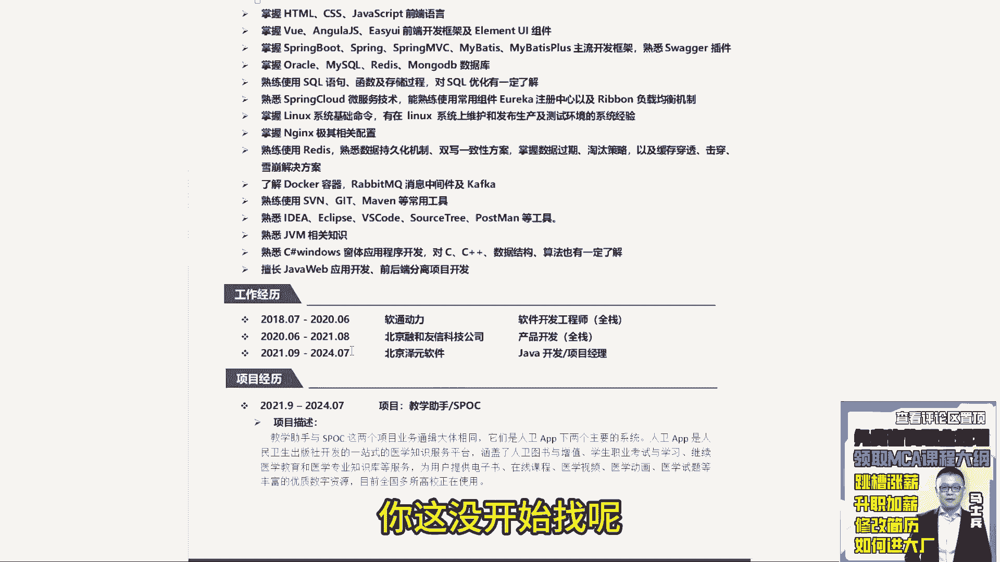

三个月空窗期干出去了，这几个月在干嘛，没微服务项目啊，一定要改一个微服务项目，至少有一个微服务项目好吧，至少有一个你得展示出你微服务的实战能力，那你你如果打算开始找的话。

你就得准备好你的空窗期的这个描述，为什么离职了，然后怎么着。

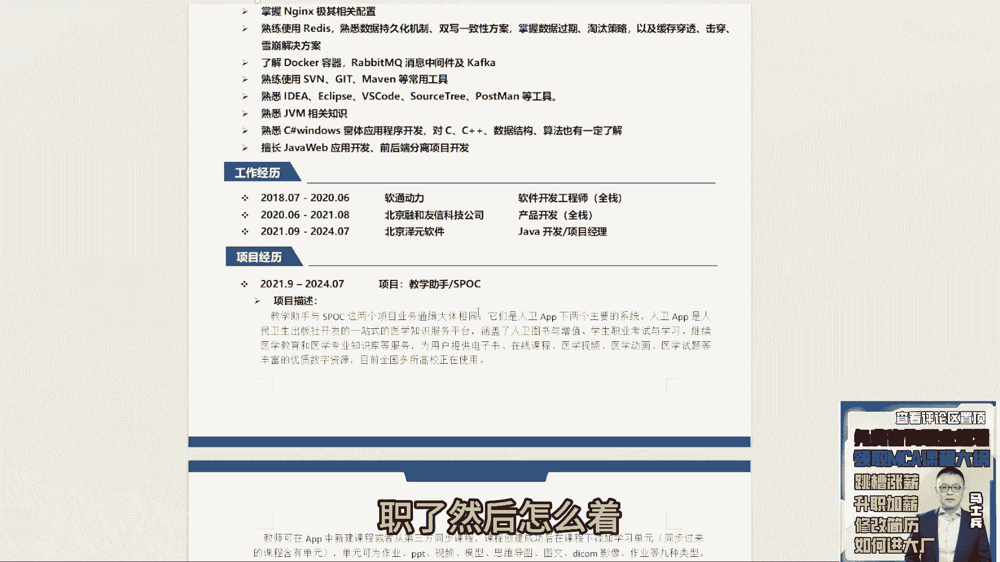

你简历不能这样写，你这样写也没面试机会的好吧，一毛你简历这么写是没面试机会的，我我可以直言判断啊，就没没面试机会好吧啧。

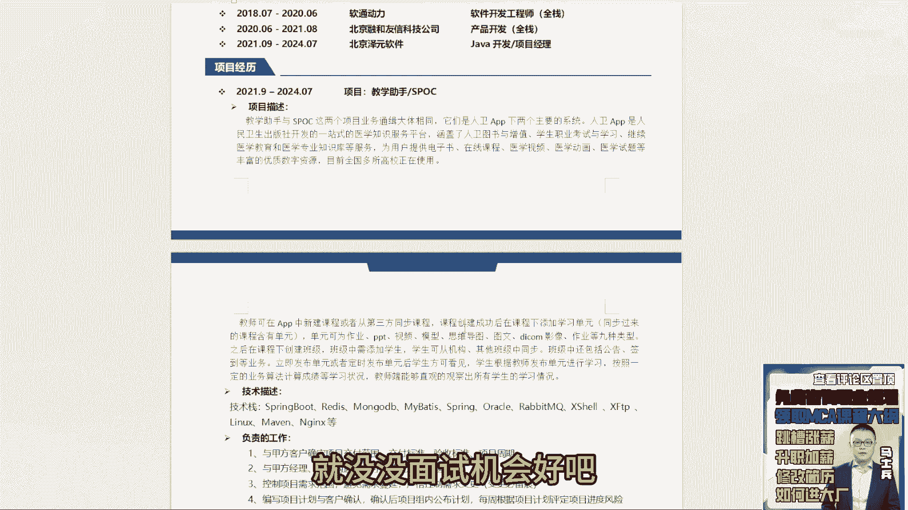

有一会说怎么写啊，最会说怎么怎么写啊，来这同学在吗，在的话来扣一来，不写简历里也不写离职原因，离职原因我一会告诉你怎么搞，刚才怎么搞，3年经验呃，java了解构框架，MYSQL的中间件的。

REDIS的单设计模式的，JVM的es的docker的嗯，怎么说呢，呃基本的宽度都有了，但是微服务的分布式的，我希望你重点拿出来写一下好吧，但是这个写的还是看起来稍微有一丢丢的简单，稍微有一点简单。

就是你你你表达内容，表达内容可以可以这么着，但是你要修改一下你描述的这个具体的方式，这个方式可能看起来有点差点，差点意思差点意思好吧嗯。

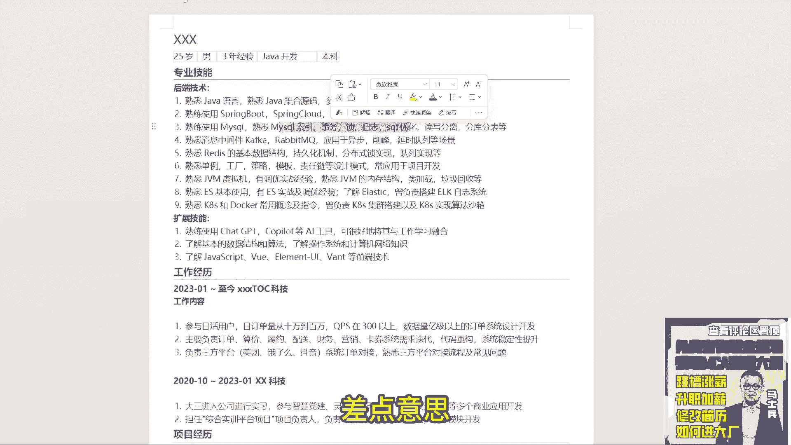

呃工作经历这这这这这这不写了好吧。

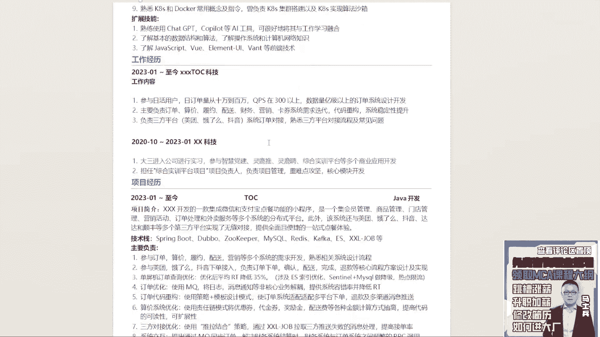

Toc，然后点餐的系统。

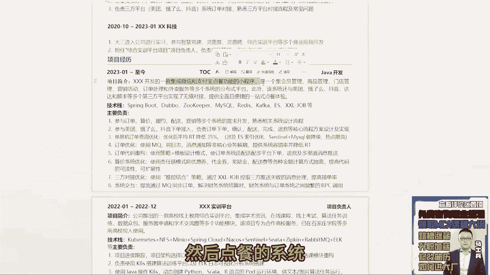

你看啊，这这是一个很大的问题啊，这个这个手可摘星辰，你看啊，你这样写了一个东西，这个项目啊，订单量10万到百万，QBS在300以上，数量级E级以上订单系统，你的E级以上的订单系统的开发。

QPS只有300，这时就有问题，明白了吗，你的日天的订单量百万，百万级别日订单量，你的QPS只有300，你不觉得有问题吗，就这数据量我不知道真的还是假的啊，但是我我只按照我的经验来评判的话。

这个数据是假的好吧，而且哪怕这东西就是真的，你这个数据量不应该写到这，应该把这东西写到你项目里面啊，你要写上我们支持日订单量对吧，比如说100万对吧，Q p s3000，或者或者说1万以上。

让它数据量达到这上上亿级，这样数据描述应该写到你项目后面，而不应该写到这这这个里面去。

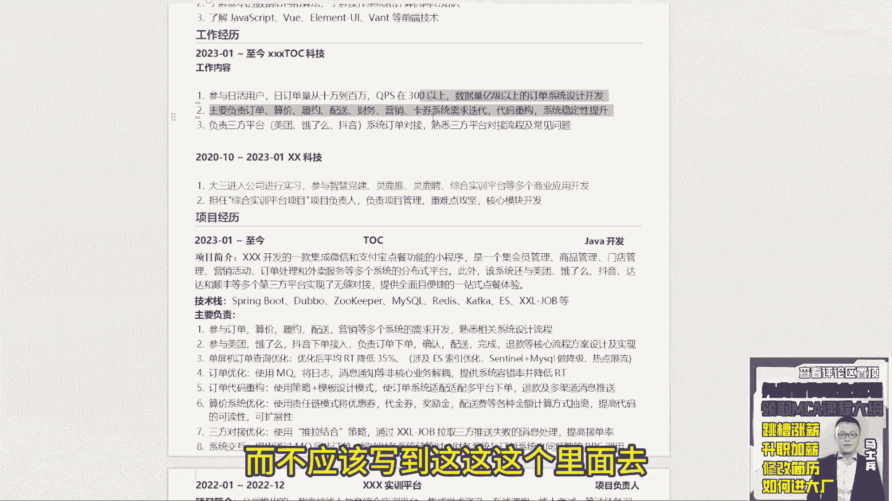

OK然后这儿写的是系统设计流程开发，这是一这是业务流程，RT降低这个可以聊，降低RT没问题，重构没问题，这也是重构的三方对接的，就这块啊，在描述的时候，在描述的时候稍微改一下你对应的描述的方式。

还是改描述方式，就这里面有一点是可以聊的，在聊这些东西的时候，在聊这些东西的时候，把描述方式改一下，改成什么东西，利用什么技术实现什么功能，遇到什么问题，应该如何解决，改成这样的描述方式好吧。

就在这样描述方式上加上你具体的业务背景，它是有的聊的，如果你的数据量比较大，它是完全有东西可以去详细做一些展示的，能够让面试官感兴趣，但你写的东西可能稍微有点有点有点简单，往上调整一下行间距。

把这个行间距调宽一点，调宽一点，看起来更舒服一些，我简单给你调你就知道了啊。

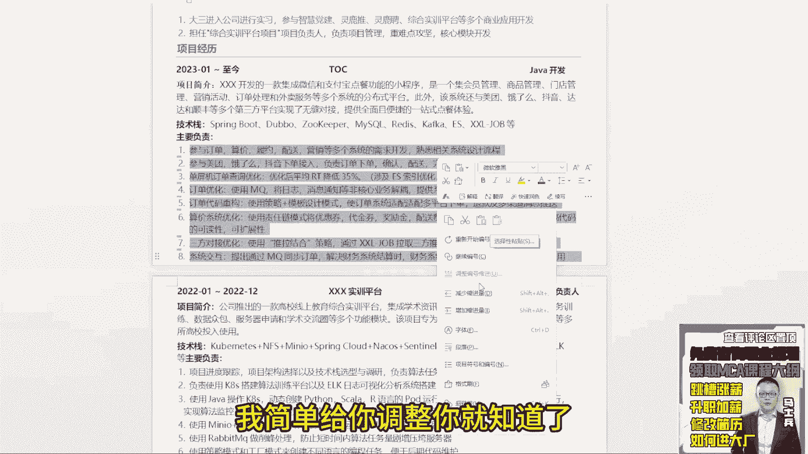

这个这个一条1。5倍行间距哎，太多了太宽了。

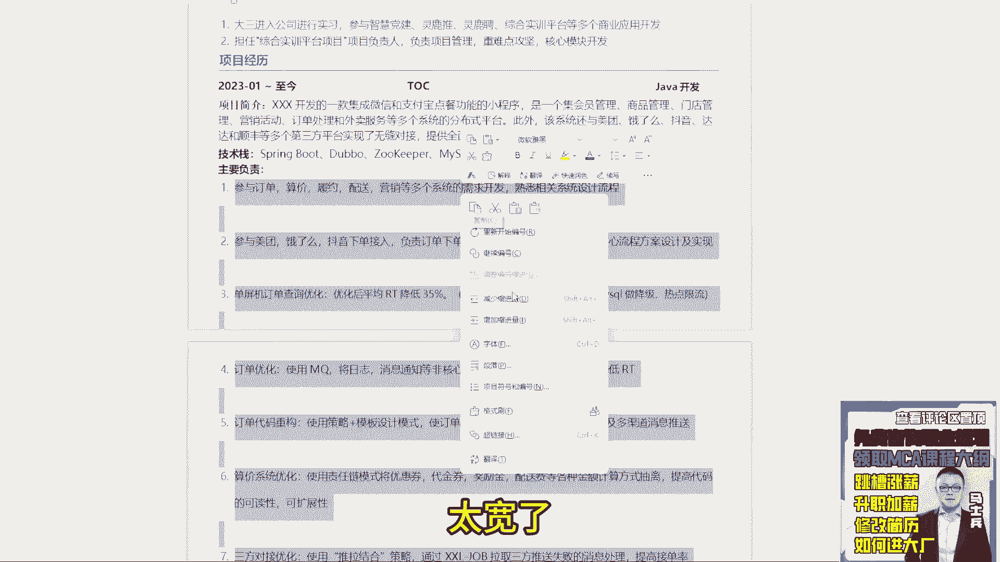

单倍行间距，你这单位有点有点宽啊，算你自己调吧，就这个行间距离有点宽，你稍微再加一点分割，可能看起来更舒服一点，好吧，就这个啊，下面的项目也是一样的，实训平台，高校在线教育的石家庄学院等高校提出。

这是两个项目是吧，这条线再转行离职啊，与收获宅基层再正行离职，在职是吧，啊在这听好了啊，嗯啧这项目改一下描述方式怎么改，我举个例子来说啊，比如说上面第一条你可以写自需求分析开发。

完成这些模块的需求开发设计对吧，数据库相关的设计完事了好吧，第二个核心流程设计也没问题，第三个你要告诉别人，你是下面的括号里面的东西不要写到括号里面。

你就写通过es索引优化select加MYSQL做降级服务，热点限流实践好吧，RT降低频降低35%，把描述方式稍微换一换好吧，第二个订单优化，通过MQ的是通过MQ的什么方式好吧，将日志消息通知好吧。

怎么进行解耦，然后呢提高提高系统的这个容错率并降低RT，把这个描述前置好吧，然后在后面再写代码重构，这怎么写好吧，通过这个这个设计模式对吧，使怎么说，就是使用策略加模板设计方法好吧。

然后呢呃是使订单系统，这想想怎么描述啊，通过策略加设计模式，模板设计模式，这样写啊，重构代码重构，不要使使用，实现订单系统适配，多平台下单及渠道推送的代码重构工作，这样来描述。

把这句话改通顺了改通顺了好吧，算价系统优化也是一样的，你把你这个责任链模式怎么实现的好，把它详细描述一下好吧，三方对接接口，这也是一样的啊，你比如说你这拉取第三方消息处理通知，怎么提高。

怎么提高接单率的，你的叉叉l job怎么做设计的，这样详细写一下，就是把你的业务点详细的再描述一些，这样更好一些好吧，老师不是计算机专业的，应该如实写吗，如实写呃。

你的学位证面试的时候是入职之后是要看的，入职是要看的，所以如果你的学位证你造造假的话，这一眼看出来了，这个基本上给别人的画面太多了，所以不是计算专业的，就正常写就行了好吧。

项目项目也是一样的，你这两个项目应该是有的聊的，按照你所描述的内容。

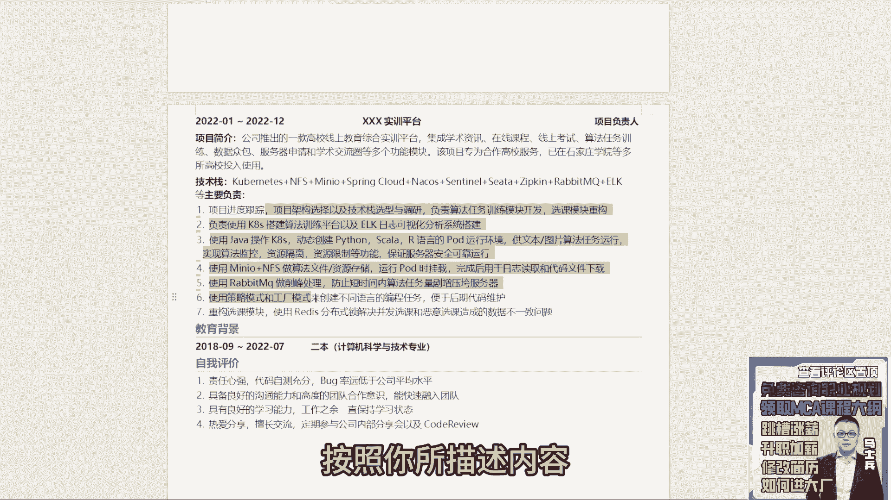

项目应该是有的聊的，然后你是22年毕业两年的工作时间，这块还是要好好去去改改好吧。

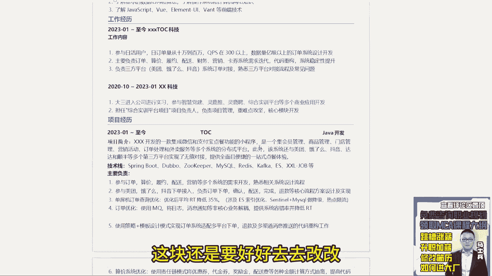

20年到23年，23年至今，这两家公司把下面两个项目好好写一下，有可能的话最好再加一个项目好吧，变成三个项目，这样可能更更好一些。

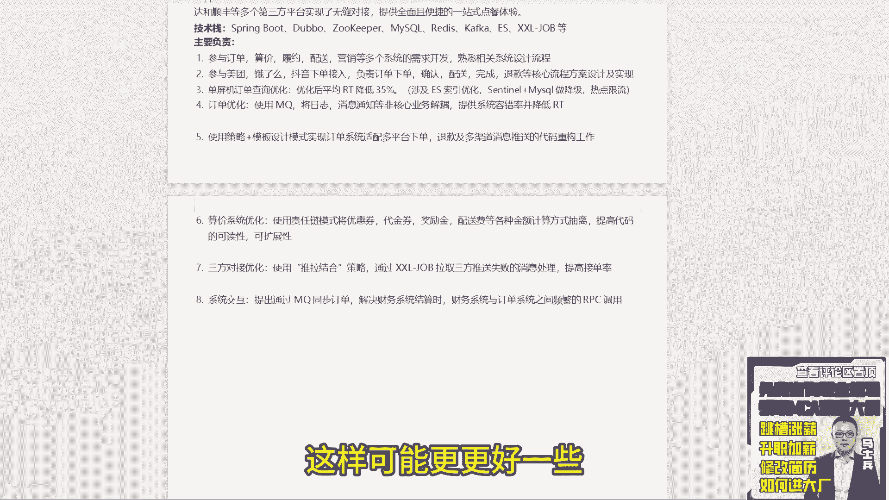

这个自我评价重新写好吧，没用没用好吧嗯行。

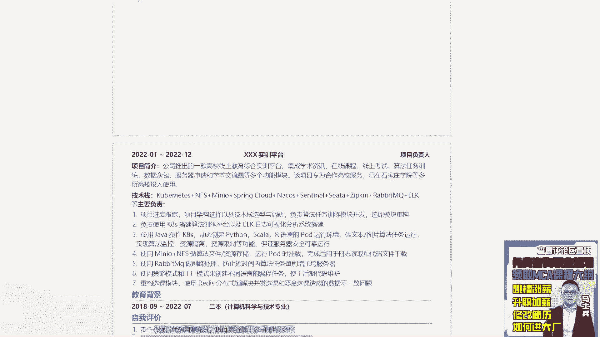

就要这么多吧，就这么多吧，面试要看实际竞争没有没有不需要实习经历。

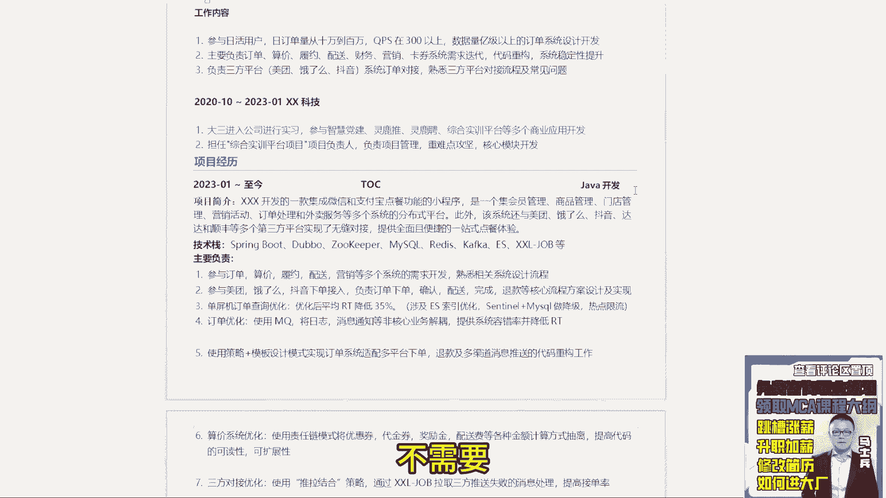

没那么大家没大家想的那么重要好吧，不重要好吧行呃，大家所有的简历啊，我基本上都已经看差不多了，看完了好吧，然后呢也提出了一些问题，呃这个宇光通这不是这个收购摘星辰啊，你换个简历模板好吧。

这个简历模板有点有点丑，有点丑，好换一下简历模板，OK嗯好了，下面我们来讲一下怎么去写简历吧，行吧嗯来刚刚讲的这些东西。

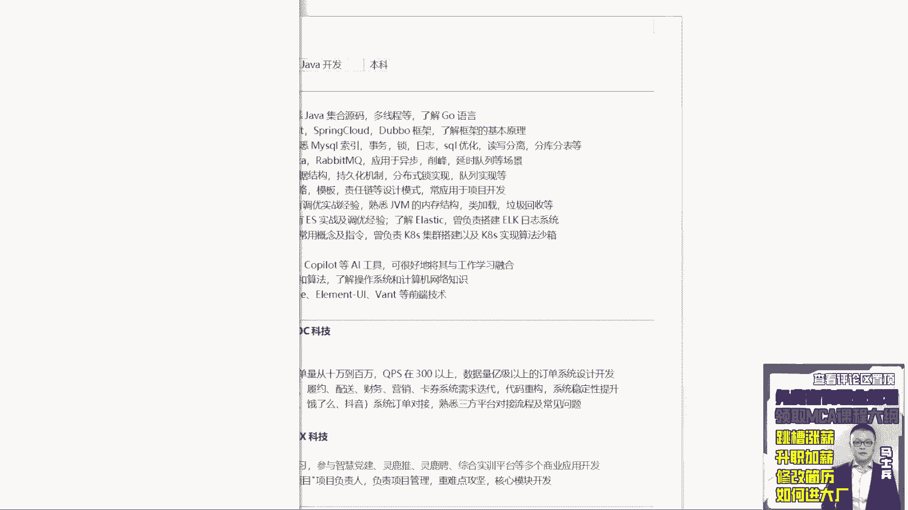

听懂的同学给老师扣个一吧，行不行。

哪个节能拿到面试邀请，我看看啊，我再重新录，重新过一下啊，呃这个简历好好改一下的话，应该是可以拿到面试邀请的啊。

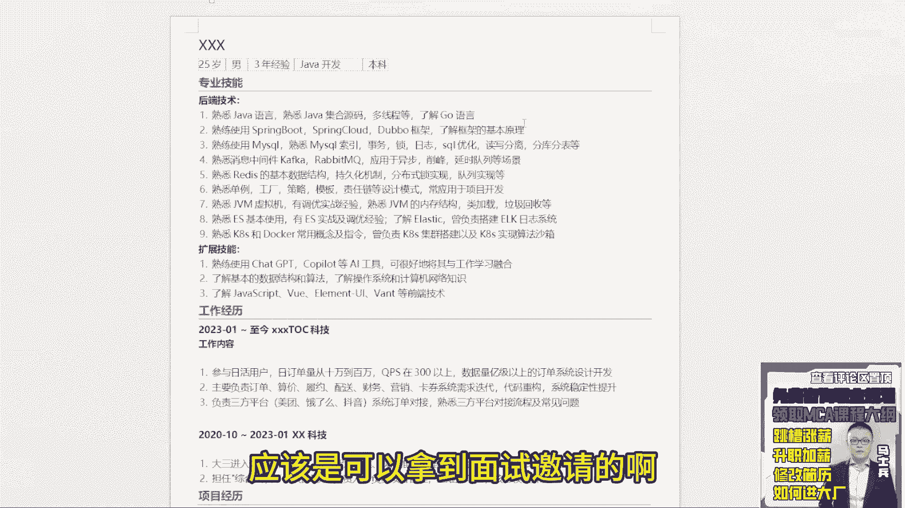

这简历好好改一下的话，这个差的有点远，这个好好改一下也行。

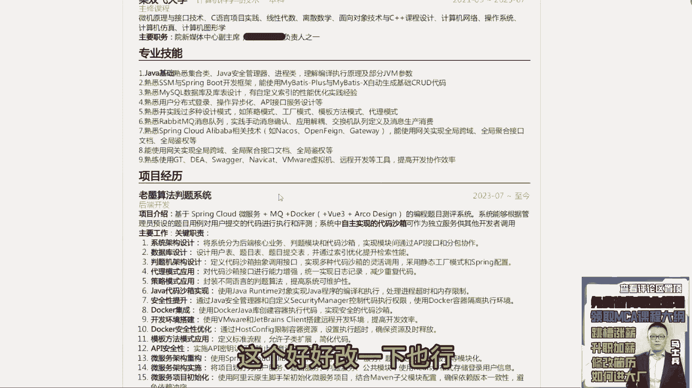

这稿好改一下也行，呃这个不太够。

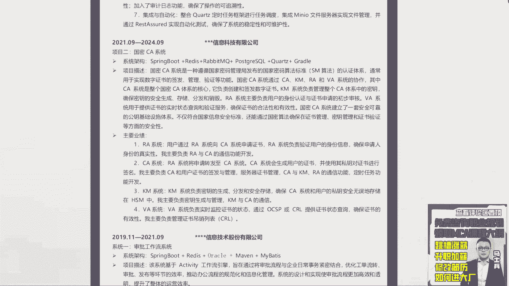

这个不太够。

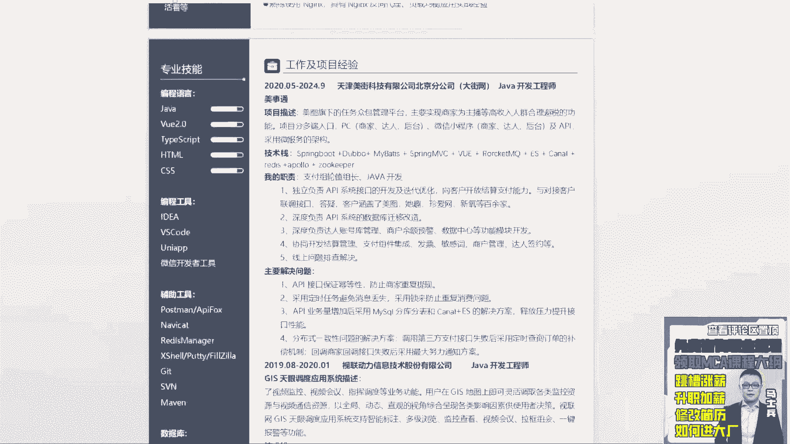

呃这个项目也得改，就现在直接拿出去做做做面，做简历投递的可能不太够啊，就看看今天晚上看了多少份简历啊，这是12个12个简历呃，想直接拿出投递的都差，都差点意思都差点意思好吧，都不太够啊。

呵呵不是我严格要求啊，是现在真的这样，你们如果现在有同学正儿八经找工作的话，你们就知道我说的是真的假的，所以这东西啊呃真得好好写，而且就是你简历写好了，你也不一定有面试机会，但是你没简历，没没面试机会。

大概率一定是你的简历出现了问题，所以这东西啊你不管如何。

