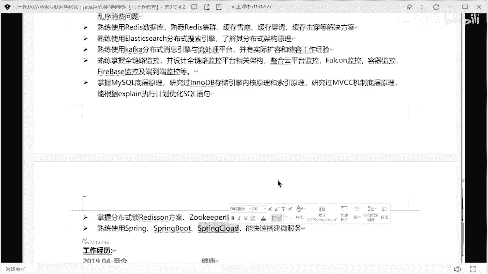
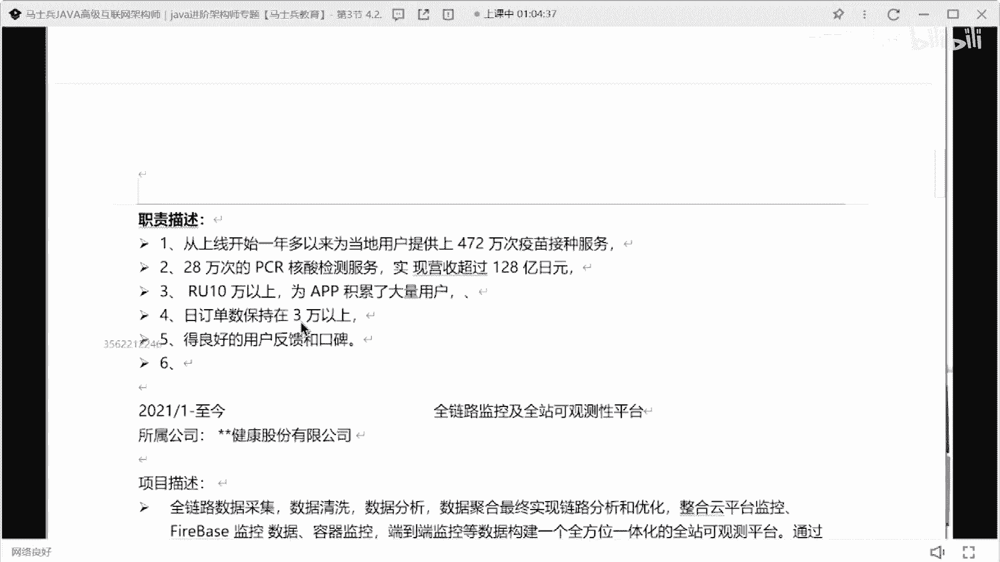
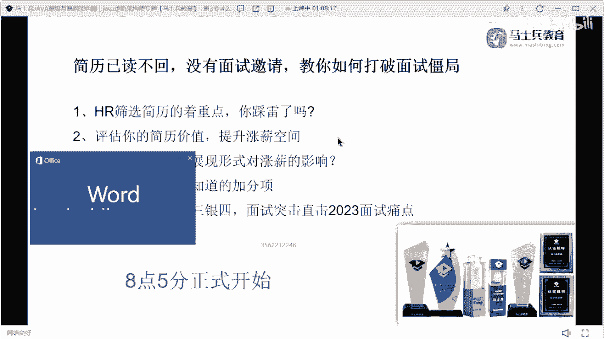

# P13：年薪50w简历指导与建议 - 马士兵小鱼 - BV1oP411Q73J

来来看这个同学简历，84年哎，来了一个大哥，这个号。

小弟大哥在吗，一会我会给你展示的好吧。

一会我给你展示的，别着急，来看好了这个个人成果呃。

个人建议啊，把这个个人成果换成个人评价或者个人优势好，大家看到这个简历，看写完之后有什么好的东西是什么，第10年软件设计价格税金这块儿啊，给个建议啊，你这块在写这个10年软件架构设计的时候。

最好能设说出来做过什么行业的架构设计方案，明白吗，做过什么行业的架构设计方面，最好把这东西凸显出来，然后这写了有医疗平台的项目开发经验，比如说如果什么什么项目，472万次的这个服务，140。

1328 四，什么一用户数是多少，订单数是多少，你们看到这些东西的时候，你会对简历感兴趣吗，就这些东西你看了之后会对简单感兴趣吗，会吧。

这就是我给大家强调的，为什么一定要凸显数据量，这个东西要凸显数据的东西，因为它很扎眼对吧，他一人一眼看到哎，我对东西感兴趣，我可能想去问这样的东西，明白吗，技能同样编程java的n l o的相关东西。

jpm的rp c double的rom，q的blist e s的卡夫卡，前面路监控的mysql的。

这里面啊少了什么东西，专业可以写啊，你有专业你就写呗，这个又没有什么损失。

对不对，这里面啊少了什么东西，把你的微服务和分布式的架构设计方案，最好能把它单独拿出来啊，spring cloud最好能单独拿出来写，你做过哪些服务治理，服务划分服务分层，这样的东西最好能拿出来写好吧。

就这技能体能描述的方式可能不是呃，我觉得也可以说得过去。

可能没有那么那么那么那么那么好，但我觉得可以适度过去好吧。

工作经历19年的至今，这是4年的工作经验。

这是13年的工作经验。

是1年的工作经验，所以这个工作工作经历啊，这个是完全没问题的。

然后项目三秒钟你看到了吗，这些数字数据词大家注意啊。

项目在写的时候啊，项目在写的时候，我希望大家能分好类，分好类，分好什么类，第一个是你的项目描述，项目描述在写的时候，3~4行的文字介绍清楚，这些项目的价值是多少就可以了啊。

3~4行文字表写成向上项目价值就ok了，第二个像你这写这个主要技术，包括不要这样写给一个单独的模块，你这边写的一个上面写了一个模块。

叫做项目描述吗。

对吧，这块再加速一下，对不对，下面再加一个模块，再改一下，技术架构，讲述一下对吧，然后把你这些所有技术，不要用顿号，这个再做一个分割，是把每一个技术都罗列清楚就ok了。

好可以把罗列清楚。

然后下面再加一个最基本的模块职责，描述嘛对吧，然后只能描述这块也加个粗，然后最下面写上一干什么事，然后呢。

二干什么事，那我随便吃，随便翻了好吧，三干什么事不干什么事儿，我干什么事。

六干什么事，他会很清晰，你懂吗，你没必要都用这种无序的话把它分分清楚，其实把这些东西删掉。

这样写，他每个地方很清晰，干了什么事都可以很清晰的把它罗列出来。

面试官可以一眼从里面看到，我到底我到底可以呃。

想不到的东西在什么地方，有哪些核心业务点会直接看出来好吧。

下一项目也是一样的，ok这块还有一个问题啊。

我再说一下，这个同学工作经验明显是比较多的，那么对于这种工作经验比较丰满的同学。

下面这些相对于比较老的项目。

就别想，就你今天写了这么多东西，写这么多项目，其实面试官根本看不到。

而且你也没有详细去做这样一个解释，那么最起码说这些项目，下面这些项目完全都干掉。

简历里面没必要说这么多页，你知道你这个简历七。

完全没必要把这个东西都删掉，该删删删，好像这些东西拿出几个项目，好好去描述一下就够了，没必要说把每一个项目都给面试官做一，种非常详细的了解，这个这个不需要不需要好吧。

别的没啥可说的了。

资质资质没啥意义啊，好吧，他要做修改项目这块好好改改。

然后记住这块，我一会给大家展示一个模板，你们可以好好看一下。

好吧，诶他觉得简单。

你值多少钱，你们觉得这都值值值多少钱，简历啊没有明显的页数限制，这个是没有明显验页数限制的，你只要能说清楚你要表达的意思就可以了。

他如果正常情况下。

他写的这些东西如果是实实在在的，如果他的技术的涵盖面都可以，把这些东西真的都涵盖到，涵盖到他的年薪应该在50万左右。

高的话不会超过60万，好低的话不会低于40万，明白吗，这这大哥他的薪水应该在这个范围，他如果现在没拿到。

你就是技术储备有问题，他如果可以拿到拿到，如果他的技术站描述也好。

项目也好，都是全部都真实的，面试时能搞这些技术架构什么，这东西说的很清楚，50万年薪肯定是没问题的，50万肯定没问题，明白吗，他现在虽然年龄可能稍微大了一点，但是他没有明显这种短板，什么短板。

比如说第一个没有你的这个工作经历。

他没有很频繁跳槽经历对吧，第二个学历也还可以说得过去。

懂我意思吗，那剩下的就是你的技术储备和技术沉淀了，当然很多人可能会考虑，可能考虑出a你岁数不大了，是不是不太能够那个覆盖我现在工作，你的精力可能满足不了我的要求什么之类的，可能会有这样的疑问存在。

所以你要通过你自己的技术战。

去打消面试官对于这方面的一些疑虑，我们只是说从单纯的简历的维度上来说。

他是值得这个薪水的，懂我意思吗，好吧，这大哥在吗，说一下你的薪水多少呗，啊。

刚刚不在不在算了，35~35~40，我说没问题吧，35~40好吧，大家一定要限制范围，30k这个简介是cat 199199的，还是向未来出发的。

啊我觉得这个这个简单啊，如果我去面试我50万，我是肯定肯定会给我。

再再多的话，我就觉得可能看你的面试的储备了好吧。

