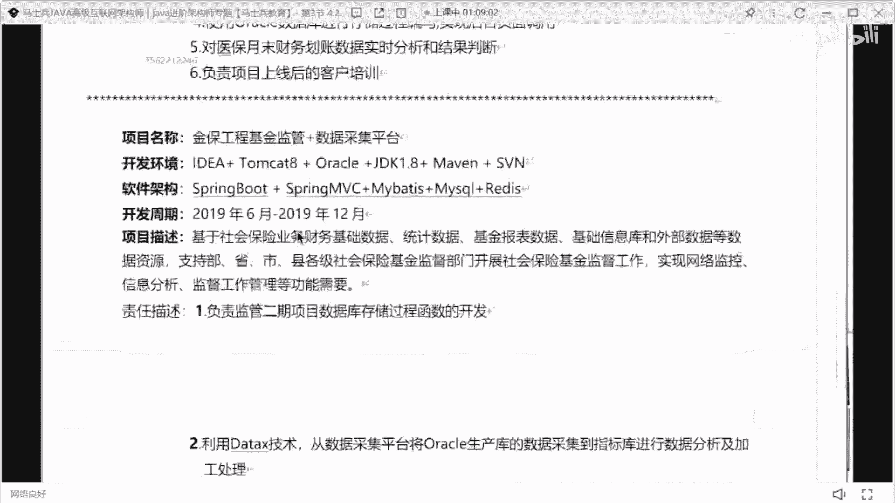
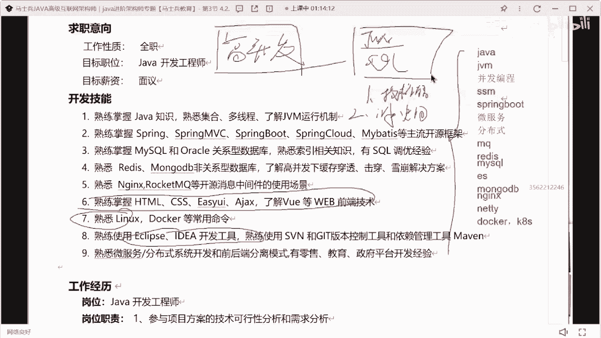

# P14：3年Java经验简历指导与建议 - 马士兵小鱼 - BV1oP411Q73J

呃3年。

前端docker工具，这是谁的呀，我爸爸小强自立，过分了啊，南哥过分了啊，落了什么呃。

技术工作经历。

迈克尔生态汽车21年至今，星座领新诺型零售平台。

保险项目。

别睡啊，这件大军值多少钱啊。

在哪个城市啊，这是这在哪个城市啊，没写城市是吧。

成都是吧，18。

在湖南长沙是吧，长沙这样的简历如果在长沙的话，大概就是十到12不会再多了，大概是十到12不再多了，因为长沙的薪水普遍偏低的，大概就是十道阻10k左右好吧，其实我说的十到12的11k是吧。

所以就是如果你还想说拿到更高的薪水的话。

你应该怎么办啊，我告诉你方案了，跟老同学第一个你的技术站要改改的方式，就是我刚刚说的，你要把你刚刚这些所有会的技术站，也要单独的去罗列清楚，像这里面你这里面有几个东西是没必要写的，这东西没必要写。

这块没必要写好吧，这东西没必要写，这意思吧，其他的技术可以详细拿出来做一个展示和罗列，有人一直靠写说老师我技能我没，我老感觉我的技能其实没啥写的，我不知道我的技能写什么东西，就是你作为一个开发程序员。

你不可能说你不知道你的技术写啥，这个这个这是它本身就不现实，如果你的技能描述这块你都不知道写啥，那你的技术储备就可想而知有多差，懂我意思吗，所以这块你要写写写什么内容很简单。

第一个java可以单独拿出来描述吧，这vm单独拿出来描述没问题吧，并发编程拿出来描述描述没问题吧，s s m可以描述吧，那boss可以当成主板微服务，分布式mq redis mysql是吧。

家里面会有些什么es，可以写吧对吧，加上你你可能还有些比如说index相关点，有可能会nt相关的点对吧，什么docker，你们k8 s对不对，是不是都可以把它展示，你光把这些技能做一个罗列，你想多少了。

你懂我意思吗，不光这东西能出多少，你就是你的技能点可以称得很很丰满很丰满，a0 葡萄说现实中有几个能用到这样的优化，对呀，咱们在公司里面做的就是散热机工作，面工作能不能不会用到这个bm啊。

不用到就这么优化，面试要问啊，那怎么办，就跟什么一样，面试的时候喜欢问高并发，我问一下咱们听课同学，你们谁做国民法，有几个人做过高并发，还有几人做过，那你觉得面试官不知道你没做过吗。

难道你的面试官不是从这个时代过来的吗，他不是从小白一行过渡过来的吗，他为什么还要考虑这个东西啊，它饱和的点在什么地方，就gmm调优，sql调优的魅力，什么要问他不知道你没做过，他知道。

那为什么还要问这种东西啊，它考验的是什么，第一刚刚同学说的，你的技术储备问题，除了你的技术储备问题之外，第二是什么，要考核你对应的解决问题的能力，而且很明显我们知道一件事是什么，只要你写到头的工作。

面试时必问，我在前期面试之前，我就不能去准备一下这些jvm sql调的案例吗，我就不能跟我们的项目做一个整合吗，你能不能提前做准备啊，能准备吗，就你连准备都懒得准备了，你活该面试过，懂我意思吗。

所以面试官想考什么，他知道你没做过，但是当遇到你这样的场景需求的时候，你根据自己的技术储备，你能否给出合理的解决方案，不考核是非常的努力，谁都知道，在公司里面，如果我只是做这种基础的代码开发基础。

这种加力的话，都是谁谁都来做，你只要有工作经验，只要做过项目，基本上都能来做，但是一旦遇到非常难的问题的时候，你的知识储备就很重要了，所以我要考你的知识储备，你懂吗，说白了你现在20k25 k好。

你在公司做c r6 那些工作，给个10k的小孩，他不能做，他能做，为什么为什么那么难啊，你凭什么这么值值值值值值这么多钱啊，不是你蛋白写的多好，你的技术储备，你的价值，你解决问题的能力。

能否在面试中给面试官展示出来，这是重点和核心，你们在面试中你要表现的也是这方面的能力，听懂了吗，好吧，就这个这个这个技术这块描述啊说了。

然后下面项目，这项目就就就刚刚同学说的项目啊，写的太简单了啊，像你这儿有个生态生态汽车对吧，生态汽车你们能不能说一下，你们订单物流有多少，你今天是要订单物流了，订单有多少，物流有多少。

对你的数据量展示一下嘛。

对不对，零售平台，你们零售每天大概有多少订单，基本都可以展示，ok。

下面这些信息管理系统就不说了，这个没啥可说的了是吧，你们两个说的那个做评价不说了啊，这个这个写法肯定是不行的，太简单了，太虚了，没有什么可问的，ok唐鹤涛说，实际上自研的话，虽然大部分都是cl v。

但是遇到各种问题的时候，还是需要这些知来解决问题，就是我说的嘛，他面试问的时候问的是什么，他考的是什么，是你整体的这种知识的处，你能否有这种解决问题的能力，懂吗，能接受加班，这个是吧，能接加班和出差。

没有瞧不起c r o d，但是你要知道c r u d跟c r u d还不一样，有的人做c o d就是纯c o d，有人做c o d就是有价值的c l o d，你们好好琢磨我琢磨我这句话好吧。

我不说了啊，有多少同学啊，刚那个那个love同学听好了，就是我刚说的，如果你想把你的薪水再提高一下，想拿到更高的诶，不是这个想到你更高的薪水的话。

你要干嘛，第一个把你的技术站这块要做一个补充，把深度要处理起来。

第二点想办法去接触一些架构设计的能力，把你的架构设计的能力好可展示出来啊，这才是你的薪水，能获得比较高的一些涨幅的空间所在，然后你在面试的时候，回答问题的时候要怎么回答。

要展示出你自己的技术体系性的东西，在大家一定记住啊，你简历写好了，他只是说你获取到了面试机会，获取面试机会，并不代表说你就一定能通过面试，那么你写的这些东西，每一句话写出来要给到面试官空间。

同时面试官如果问了其中的点，你要想办法去展示你的优势所在，什么叫展示优势所在，我之前举过一个例子啊，举过一个例子，我知道你看过，我知道你看过了，我给大家举举过一个例子，我问问同学们。

就是你们脑海里面去想一个，我问一个问题，你们去告诉我，你们如果面试中问到这个问题，你应该以什么样的呃，这个这个这个这个步骤去回答这个问题，我如果面试问到说来同学。

你给我解释一下jvm的垃圾回收算法有哪些，这个问题你会怎么回答，就面试，如果问到一个东西啊，这vm垃圾回收算法，你会怎么说，这东西说思路好吧，不说不说细节，游记清楚，不知。

就大部分同学可能说一下标记清除，复制标题整理对吧，把这些算法一说结束了，告诉大家，你们如果面试的时候，是以这样的方式去回答问题的话，肯定是不对的，怎么去回答这个问题，第一个点。

先解释清楚我们在进行垃圾回收的时候，是如何进行垃圾回收的，第二分，老年代，新生代，来解释他们分别使用什么样的垃圾回收算法，而且解释清楚每一种垃圾回收算法，它的实现机制是什么，然后除了这个东西之外。

这只是前面只是什么，只是你为了回答这个垃圾回收算法这个问题，应该做个正常的表述，把这个表述做完之后，你要告诉他，你熟悉的这种垃圾回收器，它所对应的垃圾回收算法是哪些，明白吗，第五点你要说明清楚。

在你们的项目里面是如何选择垃圾回收器，以及你做过哪些参数的调整工作，能懂意思吗，这是一个比较完整的回答方式，而大部分同学的回答是什么样子呢，就回答这个东西很多就问老师，不就是面试官问我什么，我答什么。

真的不是，如果只是面试官问你答什么，问什么，你答什么，你在单纯的背八股文，你没有自己的技术认知和自己的技术思考，那有人说老师，我说这么多面试官，你给我打打，那我怎么办，打断就打断，你们能怎么样。

难道你不是坏事儿，听到了吗，就你要把他好不容问到一个问题，这是你会的问题，好不容易遇到了，你要把你跟这个知识点相关联的，所有知识体系相关的细节，要尽可能多的去给面试官做一个展示和罗列。

要不然的话说白了你的技术水平是不达标的，能懂我意思吗，然后我刚说这东西能理解他的，扣个一好不好，你们在回答任何一种类型问题的时，候，任何一个类型的问题的时候，都应该尽可能的去展示自己的扩展性。

一定不要让自己再停留在那种问啥答啥，一问一答这种傻瓜式的面试，这种面试在当下这个阶段通过的概率是极低，极低的，听懂了吗，而且一个面试里面，如果面试官经常说话，你说话很少，你的面试一定过不了。

你们也不要担心说老师我回答一个问题的时候，面试官打断我，打断你是好事，他只要打断你了。

说明他对这个问题已经不想问了，他想问其他东西，这是个好事，你懂了吗，就是你不要说面试官问啥，你答啥，然后面试官再在你这个问题基础上再问个啥，你再打个啥，不要脸，你要自己去主动的去展示自己的技术体系。

而不是等着别人去问。

