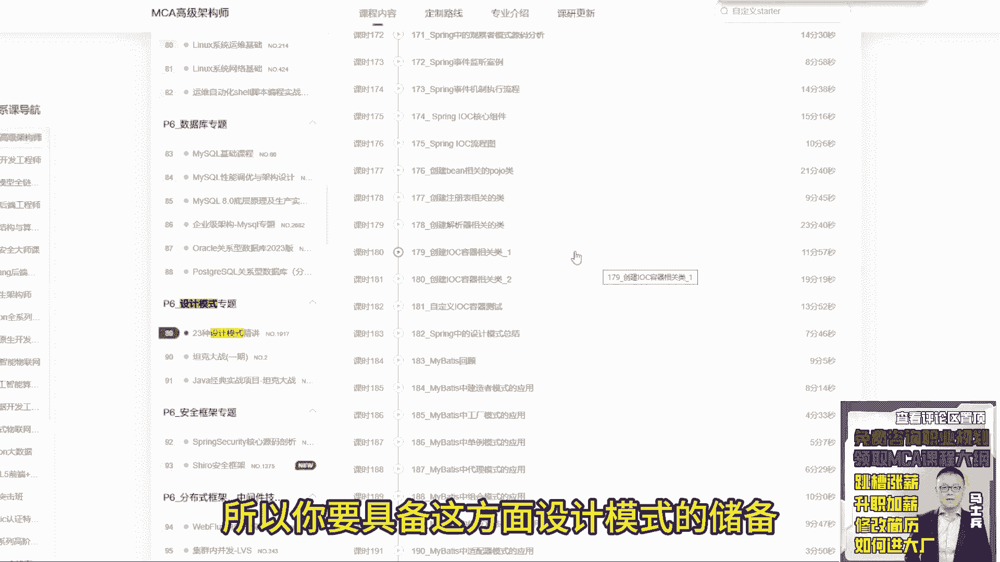
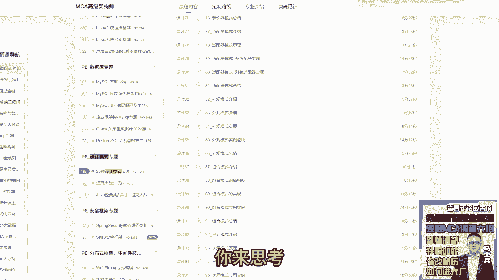
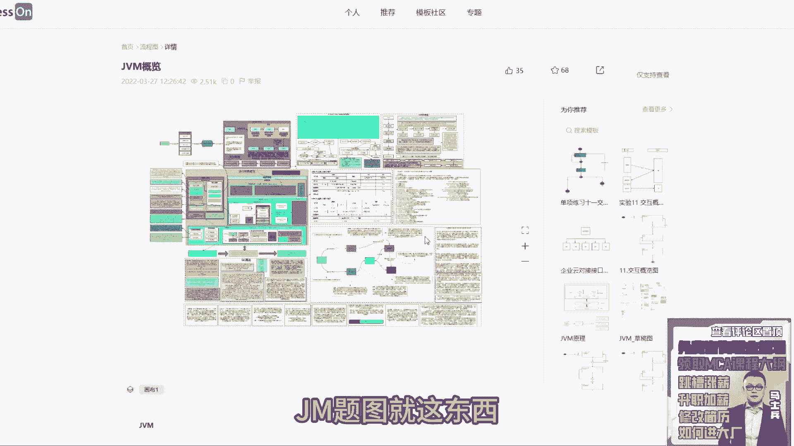
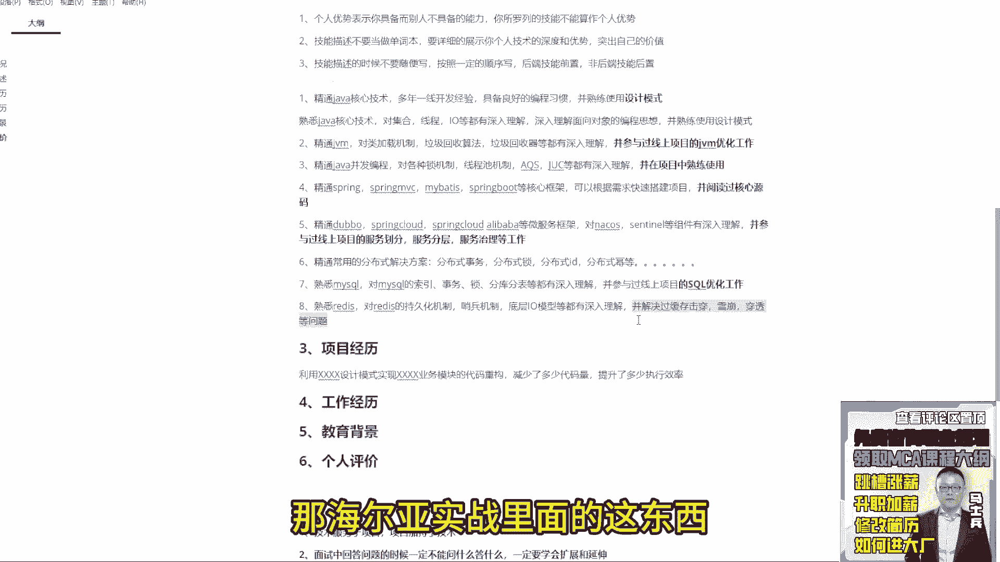

# P15：15.简历技能描述怎么写？ - 计算机底层原理 - BV1ZnDsYAE7D

来第二个我们来说技能描述，技能描述，注意这样属于注意点了，技能描述不能称之为个人优势，有很多同学啊拿着这个简历，这次咱们这次没有啊，之前有同学拿那个简历啊，给我看的时候都是从boss吧。

你看直接下过来的简历模板，在这里面有个模块叫个人优势，很多同学把个人优势呢写的都是技能的描述点，不要这样写好吧，个人优势表示什么意思，个人优势表示你具备而别人不具备的能力。

你所罗列的技能不能算作个人优势，明白了吧好，所以大家一定要注意教技能描述或者专业技能，改成这样的描述就OK了，有时候看一顺眼，技术要求没那么高，也是看眼缘，对对对，就这意思，就这意思好吧。

接着描述的时候还要注意什么东西呢，一二技能描述，不要当做，单词本要详细的展示你个人技术的深度和优势，突出自己的价值啊，计价值，第三个技能描述的，的时候不要随便写，按照一定的顺序写。

后端技能前置非后端非非非后端技能后物质，比如前端的大数据的，LINUX的运维的，往后放，往后放，前面写，你java东西好吧，这块怎么写呢，按照我们学习的。

学习这个这个这个技术的点来写就行了，什么叫学习技术点，比如刚开始你先学java，对不对，你可以怎么写呢，第一条，一精通java核心技术，多年一线开发经验好吧，具备良好的变成习惯，并熟练使用设计模式。

能看懂这意思吗，同学们问个问题，我这样写完第一条之后，我想让面试官问我什么东西，我想让面试官问我什么东西，这玩意吧，能懂我意思吗，就是我想让面试官问的是什么，是我对于设计模式的理解，这东西就是一个钩子。

有人老师我在这儿埋了这样的钩子之后，它有什么用处，用处非常简单，很多同学你写的技能和你的项目是并不匹配的，而我们要做的是什么，你的技能描述跟你的项目经验，实战能力是要匹配起来的。

所以当你写完这个东西之后，你就可以在项目的职责描述里面加什么东西，利用叉叉叉叉设计模式实现好吧，叉叉叉业务模块的代码重构减少了多少代码，这样提升了多少执行效率，这东西是不是一个具体的业务点。

就是你在简历里面你的职责描述没什么，写的时候，我是不是可以写成这样的东西，他跟你这儿写的技术描述是不是吻合的，就面试官问到哎，你这是看你这写到这个熟练使用顺序模式，你能聊一下设计模式吗。

啊面试官这个很好，之前呢我阅读过23种设计模式，包括对应的设计原则，了解的比较多，所以呢我在做代码设计的时候，经常会考虑设计模式的一些点，当然我们在刚开始做的时候啊，一般都是以完成业务功能需求为主。

所以呢当我在完成业务功能需求的情况下，我会有利用额外的时间把代码进行重构，比如说在我们之前什么项目的，什么模块开发的时候，我通过什么设计设计模式，完事了，要什么代码的重构对吧，整体的执行效率提升了很多。

而且增加了代码的复用性，提高代码的扩展性啊，这是设计模式的一个优势，所以我们在写代码的时候，一定要想办法去应用一些设计模式，你是不是可以做两个描述，明白吗，就大家一定记住，你在面试的时候表达的时候。

不要把技术跟项目做得很割裂，能这意思吗，什么叫技术跟项目割裂啊，我听过很多同学的面试录音好，包括你跟同学们很多同学聊过，比如很同学想报名对吧，老师给我打电话来聊一下你个人情况，看你是不是适合对吧。

需不需要聊这样情况的时候，我经常问一些技术点，或者问一些项目业务流程，问到同时同问，到时候很多同学都是割裂的，什么意思，聊技术点，只聊技术点一点不聊实战，聊项目流程，业务流程，只聊项目流程。

不聊任何一点技术技术实现，这是不对的，一定记住你所学的所有的技术干嘛，用的是为了更好的做代码开发，你所做的所有项目要干嘛，要反哺你的技术深度，所以经常说一句话叫什么叫技术服务于项目，项目加持与技术。

它们两个东西一定是相辅相成的一个关系，而不是相互独立的，所以你们在面试的时候，包括你在写简历的时候，你要做好这方面的准备工作，等，当面试官问到这样点的时候，我能够游刃有余的把这些点给表达出来。

而不是说遇到这种情况了，我临时现想这是不对的，来我刚刚说那个点能理解，同学给老师扣一，刚说一个什么东西来着，写到后面吧，叫技术服务于项目，项目加持于技术，这句话我希望你们好好去理解一下。

你如果你在学习的过程中，你把技术和项目做的很割裂，面试的时候你很难有体性的做一些完整的表述，所以好好了解下这东西好吧，当然有人会说老师我对于设计模式并不熟，我应该怎么办，学呗还能怎么办对吧。

设计模式的东西都固定死的，你说你这玩意你不学咋整，对不对，之前马老师讲过一个设计模式的课，你们看最近老师能不能给你们啊，我不知道。

就你们如果不知道设计模式是啥，打开马士兵教育官网，你去搜，我不卖课啊。

我就展给大家展示一下啊，你搜一个东西，RF设计模式有23种设计模式的精讲，里面也讲了很多设计原则，各种模式，包括在源码里面怎么去应用设计模式的都有啊。

如果说你对设计模式实在不熟悉，比如代码实现里面没用到过。

你就告诉他，你了解哪些框架里面用到了什么样的设计模式。

我对这东西是怎么理解的，我的认知是什么样子的，这东西都是可以聊的，所以你要具备这方面设计模式的储备。

当然这里面有些东西是基本上用不到的对吧，什么样的，比如备忘录模式，我基本上我也没用过对吧，还有个响应模式，我基本也没用过，所以有些设计模式用不到的，但有些设计模用的很多。

所以你把一些常用的设计模式能掌握好就行了，比如说单例工厂模板方法对吧，策略模式，适配器模式，责任链模式对吧，装饰者模式这东西是用的比较多的，那你完全可以把这些设计模式用起来好吧。

好好了解一下这个设计模式怎么做的，然后好好把东西总结一下，设计模式是一个非常基础点。

你不能不会，所以这是最基本的要求，明白了吗，好了，这是第一个点，不多说了，来第二个再写，学完写完JVA基础语法了，再写什么啊，当然啊再再说一句啊，咱们有很多学老师，我是大学生，大学生怎么写啊。

大学生可能没有多年一线开发经验，那我怎么写啊，能写吗，可以，但应该这么写，熟悉java核心技术，对集合什么线程，对吧，IO等都有深入理解，好吧呃深入理解面向对象的编程思想对吧，并熟练使用设计模式。

大学生能不能能不能这么干，可以吧，无所谓，就是换一个描述方式的问题啊。

你可以根据你的经验，根据你的储备，你来思考我到底要做什么样的描述方式来。

这东西能听懂的，给老师扣一，能听懂吗，哎能理解吗，同学们，好下面再聊java，写完了写什么，写JVM精通JVM对类加载，机制对吧，垃圾垃圾回收算法，垃圾回收器等器，都有深入理解。

并参与过线上项目的JVM优化工作，好吧，那这块重点突出是啥，这东西吧，你做过哪些gm优化工作，这不是要重点突出的恶，若说若是只有一年工作业，工作都是C2D岂不是很难写，大家一定记住一点啊，同学们。

你在面试找工作的时候，你之前有没有真实的做过这件事情，有没有那么重要，听好问题啊，我们来做一个讨论啊，就是你想一件事，你比如说微服务，我之前从来没没没没用过，难道我没用过这东西，我在面试中我就不能写吗。

我之前举过例子，我说同学们，比如说你现在一年工作经验，你在公司里面六个月开发一个项目，你六个月开发了一个项目之后，你能够保证你对项目里面的每一个项目，每一个细节，每一个优点都很熟悉吗，能做到吗。

做不到吧，是不是做不到，如果做不到的话，凭什么你觉得面试官就会对你的项目非常熟悉，非常了解呢，所以你之前的项目里面有没有做过这些事情，一点儿都不重要，重要的是什么，你有没有足够的技术储备，在面试过程中。

能够把这些自己没有做过的业务点，业务流程能详细的表述清楚，这东西最重要，来这东西能理解，扣一就之前有没有做过，不重要，重点是什么，我在面试过程中说，能把我之前没有做过的业务点，业务功能技术实现。

能完整地自圆其说地表述出来，这个很重要，因为你项目中到底是怎么做的，实际是怎么做的，没有人能够调查出来，听懂了吗，所以它的真实性无所谓，但是你在描述的过程中，你不能出现特别大的bug。

你别说这东西完完全全都是错的，这肯定不行啊，但是你只要能够把里面的一个流程说清楚，就OK了，所以你的项目是要做总结，要做处理的，哎这东西能理解吗，懂不没，能来扣个，一来给我个反馈好不好，哎，能听懂吧。

你看求求求求都听懂了，所以一定要照这个方式去努力好吧，照这个方式去写好吧，当然前提还是那句话，什么你要具备这个能力，有人说老师这块我要怎么写呀，我要怎么去写这东西啊，我这罗列的是什么类加载机制。

垃圾回收算法和垃圾回收器，每个同学都这么写吗，千万别啊，同学们，你们别别，今天晚上听完课了好，今天听课的这200个同学都这么干，每个人简历面都是对类加载机制，垃圾回收算法，垃圾回收器都有深入理解。

别都这么写怎么办，你从这些技能点里面挑你熟悉的，你擅长的去写怎么办。

还是那句话给你思路方案，你打开马什么教育官网，你搜JVM的课程，在JVM课程里面有很多，比如说class文件的解压方式，类加载器，双亲委派机制对吧，包括下面有这种运行时数据区对吧，包括像CMS。

比如说g one对吧，比如说j stack对吧，然后j map这样的一些定位定位问题的工具对吧，这些东西不包括像这种呃并发标记算法对吧，这些东西都是可以写的，明白吗。

就是你从一个JVM的整个知识体系里面，去挖掘一个点，去挖掘一个点或者两个点或者三个点，你比较擅长的，你比较熟悉的，写进去就完事了就完事了，别的不重要。

不要每个人都写成一样的，听明白了吗，好但是最后面这个思后JVM的优化工作，这东西是必须要写的好吧，而且这再给大家提一个醒，提个什么醒，你们在面试过程中回答问题的时候，面试中回答问题的时候。

一定不能问什么答什么，一定要学会扩展，和延伸，这句话我不知道大家能不能理解，什么叫一定要学会扩展和延伸，这句话代表代表什么意思，我问一个问题，同学们问一个问题，比如面试。

咱说咱咱比如咱们模拟一个正常面试环节，我说哎，你能给我描述一下常用的垃圾回收算法吗，我问这个问题，这个成常规八股了吗，对于这个问题，同学们，你告诉我，你正常的回答问题的思路是什么样子的。

这个问题垃圾回收算法，你正常回答问题的思路，只说思路，不说细节，你会怎么回答，哎有几种还有呢，怎么干，我说一下咱们这个打你们打字比较慢啊，你听你听下，你会不会这么回答。

绝大部分同学在描述的时候会怎么描述哎，常用垃圾回算法有哪些啊，标记清除，标记整理复制算法，分代算法对吧，然后呢，详细的介绍一下每种算法的具体实现原理，基本上说到这就卡死了，有些同学可能想延伸。

延伸的时候可能会扩展一些，比如说什么怎么来判断为垃圾，比如说用那个那个什么累计计数法啦，跟可达算法来判断一下什么叫垃圾，说到这完完事了，告诉大家，你说这只是单单的把这个问题回答完了。

他不能展示你技术的体系性，那么下一步你要回答什么东西，除了回答算法有哪些实现原理是什么，你还要告诉面试官什么样的垃圾回收器，它会使用什么样的垃圾回收算法，好吧，你在你的生产环境里面。

你用的是什么样的垃圾回收器，并且你有做过哪些JVM的优化工作，你调整过哪些JVM的参数，为什么要做这样的描述，为什么很简单，你只说这个东西，它叫八股文，你会别人也会因为这个东西你随便一搜。

百度上面一堆答案，面试官如果听到都是这样的表述，那你告诉我面试官凭什么让你来入职，没道理的，所以除了展示一种理论基础之外，你更多的是要通过自己的表述和表达，带出实际的实战场景，就是后面这东西。

但你也不能直接从垃圾算法，就直接输出到gm m调优，来一回收器过渡一下好吧，展示你的体积性，由点到面来进行扩展和延伸，同学们能理解吗，来我刚刚说的那个回答方式，能理解，给老师扣一能理解吗。

我希望你们能感受到面试官到底想听什么，和我我我单单单说我如果我是个面试官，我想听到什么样的答案，这是我的要求，如果你能做到这个层面是OK的，明白了吗，一定要做这件事情，想达到这个层次要求做到一件事。

你们在学这些东西的时候，一定要做到一个点叫体系化学习，什么叫体系化学习，一定记住，好像咱们很多同学已经都学过JVM，因为刚刚看简历的时候，很多同学基本都写JVM了，但是当我提到JVM这个词的时候。

你的脑海里面有没有一张图，能把JVM的所有的体系印在脑海里面，有没有两样东西，如果没有，说明你的技术储备是有问题的，如果有OK了，你就可以沿着你的体系图展开，有有有有脑子，有有有这个图吗。

有JVM的体系图吗，有的来扣一，没有的扣二，有没有没有的，想看看吗，我给你们看一个，有人想看吗。

我给你瞅一个好吧。

这是我之前经常展示，因为这同学画图画的真的很好，画的很好，真的很好，这是我今天上课经常展示一个东西。

这是一个同学，他在学完JVM之后。

他做的一个图，gm体系图。

就这东西我给你放大看看啊，从最开始的java源文件到class文件。

到类加载的过程对吧，到后面的j i it到后面的这种对象创建过程。

到下面这些参数的总结，到我们后面对象头的一些基本信息。

到运行时数据区各个各个区块，各各个空间用来干嘛的对吧。

垃圾回收算法对吧，这些算法垃圾回收器他都总结的很详细对吧。

包括这个地方锁的一些应用，强软弱虚的东西都会有，所以他脑海里面有这个图的。

当他有这个图之后，好了好吧，有这图之后好了，我在面试的时候涂在脑海里面。

你无论问我任何一个点，我可以给你扩展做延伸，那么你们也要求大家做到这个层次，明白意思吗，就这个图里面细节上的东西你可能忘了。

比如说哎这里面有个参数哪去了，这个参数我忘了，参数忘了不重要，但是体系性你得有明白了吧，好吧，这都是不看字号，他自己总结的，当然这个过程是一定要反复看资料，反复看资料的，你要反复看视频。

反复看笔记才能总结出来啊。

但是最起码他有脑海里面有这样的东西在，所以你们要做到这样，在这样的层次。

这是基本要求，好吧好了不多说了啊，说的有点多了，OK来回收，我们接说简历，第三个该写什么了，并发编程，精通java并发编程对什么，java中对各种，锁机制，线程池机制对吧，A qs。

嗯local等都有深入理解，并在项目中，熟练使用。

好吧，那这个地方我预留的钩子是什么。

你在项目中哪个场景用到了并发编程啊，你是用的是锁呀，还是用的线程池啊，还是用的AQS，还是用的si local啊，对吧，那这块也是一样的，这块你可以写这四个，你也可以加synchronized。

你也可以加lock，你也可以加volatile，细节东西你自己挑自己熟悉的往里面加，但是这个伏笔要留着能理解吗，好了这是第三条，好了，java核心东西介绍完了，下面来第四个该是什么了，给框架了吧。

来精通spring spring mvc，Mybatis，spring boot等核心框架，可以根据需求快速搭建项目，并阅读过核心源码来同学们想问的是什么，面试完会预留哎，你读过哪些框架源码。

咱们能聊一下吗，这是预留预留的伏笔，你是不是要去看这个东西，唉还能还能还能听懂吗。

同学同学们，感你们，你们没人搭理我了，是听不懂吗。

能理解不，这是给你们展示的东西来再写，第五个框架，写完了该写什么了，精通spring cloud啊，你比如微服务有很多，对不对，你可以随便写，比如double，Spring cloud。

Spring cloud，阿里巴巴，等微服务，框架对吧，对什么NUCKLES对吧，什么SELINO等组件有深入理解，这块还是八股文好吧，然后再写什么东西，并什么东西参与过。

线上项目的什么服务划分服务分层服务，治理等工作那一样的，前面这东西谁都会，我要聊的是这东西，你在项目中怎么做服务之类的，怎么做服务分层的，怎么做服务划分的，打叉说SALLOGO没用过对吧，没用过。

你换个呀，换个不行吗，lock行吗，甚至我不写了行吗，我说了，你要去挑你会的东西去写，整个多线程里面有很多东西，你你你不会的东西会这玩意会吗，JOC会吧，能不能说JOC可以吗，就这东西啊。

如果你不知道写啥，我说了，给你们个窍门。

你去打开马士兵教育的官网，你去里面搜行不行，这里面课程里面目录你不用看内容，你就看目录就行，叫多线程与高并发实战。

这里面讲了很多现成的东西。

什么volatile synonized的cs的对吧，有很多对吧，阻塞队列的有很多，你看这东西行不行，你就从里面挑关键字，哪个关键字你熟哪关字你熟你就写哪个。

是不是这意思，你挑你喜欢你，你挑你喜欢的，你挑你会的，最新发股八股文没有什么最新最旧考的八股文，就那些常规东西没啥变化，还是那句话，朋友们一定记住，背八股文不好使，你从网上你随便搜八股一堆一堆。

你觉得你背完的东西好使吗，特不好使，因为你背完之后，你这东西依然不敢写，我一定我一直说一句话，叫体系化补充很重要好吧，简历里面需要标错吗，不需要简历里面不需要标错。

不需要标错，别标错，你标粗的话，你就引导的意义，太太太那个太太明显了。

不要不要加粗好吧，我这是为了给你展示，我加错了，你不要加粗，明白吧好吧，来第六个还有什么精通常用的分布式解决方案，比如说分布式事务，分布式锁，分布式id，分母是密的，啊呀呀呀一堆，是不是可以写，对不对。

之前面试一家问了都是哪个地方使用的，你可以说呀JO在哪个地方写使用了对吧，线程整理地方使用了，我说了吗，并在项目中熟练使用，你就告诉他，你写的这些点是在项目中已经用到过的，你项目中没用到过。

你是不能写的。

所以你我为什么要给大家说一句话，我说你需要花两到三天的时间去准备，其实如果只写这些文字的话。

你需要花两到三天吗，俩小时都搞定了，就是你要考虑的是是什么项目的理论知识，加上对应的技术实战，明白意思吗，这样对应的场景，这是你要准备的东西，就是你要提前想好，面试官如果问到我这个问题的时候。

我应该怎么做，我应该做什么准备，就不打无准备之仗，懂我意思吗，所以要花两到三天时间，两到三天时间，不是说光写字，你光写字的话，两个字223小时就搞定了，是你要考虑这些东西，明白吗，我我写的是精通。

你写熟悉行不行，我不想再跟大家争论这个简精通和熟悉的事了，就如果你不敢写精通，你就写熟悉无所谓的事好吧，但我的基本要求是什么，至少要有两到三个，你写精通，至少有两到三个写的写精通好吧。

来我前面写的这几个东西，大家好好去想想，我上个厕所好吧，你们好好想想这几个点，我想想上个厕所回来之后，我们继续往下讲，Ok，来回来了啊。

我们接着往下聊，写完之后还可以写什么，第七个MYSQL吧，数据库吧，精通MYSQL，熟悉吧，不写，精通了，熟悉MYSQL对MYSQL的索引事务，分库分表等都有深入理解。

并参与过线上项目的circle优化工作，老规矩吧，这玩意是不是想问的，对不对，来第八个，熟悉REDIS，对REDIS的持久化机制，哨兵机制对吧，还有什么呃，底层IO模型等都有深入理解。

并解决过缓存击穿雪崩穿透到问题，那还是一样，实战里面的这东西。

能理解吗，同学们，我给你们写了八条了，我这八条写的方式和思路能不能理解，能理解，来给老师扣个一，能理解吗，你并不是所有人都要按照我这个统一模板，这么去干，我还是那句话，我不建议大家都这么干。

简历一定是千人千面的，一定不能所有人写都一样，如果所有人都写的一样，我告诉大家，我之前之前晚上讲这节课没意义了，但是这种写的方式你得理解，你要结合自己的技术储备和你自己的技术体系，去思考什么样的东西。

思考怎么写，这东西是根儿，所以你得把这个事儿想明白了，我到底需要的是啥，以及我到底应该如何去做对应的技术储备，和做做对应的技术沉淀，明白了吗，好吧，所以你要想清楚这东西，OK来能听懂的。

除了习惯都没听懂，宝贝们还在吗，给我点反馈，我这辛辛苦苦，你们一我一个字一个字敲的，同学们，你给我点反馈吧，我讲了俩小时了，今天晚上讲东西干不干，你就告诉我干不干，对不对，啧好了，这是八条了对吧。

那么其他东西你也是可以这么写的，那么还可以写什么东西对吧，MQ是不是可以写，不管是rock mq还是卡夫卡，rock mq是不是都可以写，依然加嘛，对不对，第九个第第十个有人会说啊。

老师我熟悉MONGODB是不是也可以写对吧，11个刘老师，我输熟悉POSTGRAPHICAL是不是也可以写，对不对，还有说老师我数学es s可以写，不对吧，那这些点都是可以的。

你不可能说老师我的技能描述里面，我没有什么东西可以写了，这种情况是不应该出现的，明白吗，除了写这些具体的业务点之外，比如还可以写什么，比如NT能写吧对吧，比如说你还可以写nginx lbs。

Keep alive，是不是可以写对吧，还有什么东西可以写，想想想还有啥，比如docker，K8S可以写不对吧，还有比如说操作系统G组，G组，算机组成原理，计算器写全吧及网络对吧，是不是可以写算法。

是不是可以写对吧，太多太多了，你可加东西很多，所以自己根据自己的实际情况就往里面加强，技能站，你是一定要充满的好吧，包括还有什么，有同学老师，我现在能写一些理论知识，比如CP能不能写，比如pars。

能不能写ZAB能不能写，可以啊，好吧，把这些点编到上面去，能编的尽量去编，听明白了吗，就站没问题，项目没任务，不知道怎么做项目，还是那句话，你就找场景去你的项目背景里面去加，找场景。

往项目背景里面加就行了，最起码前面几条常用的技术站你可以加吧，不可能加不进去吧，你你学这些技术干嘛的，你学技术不可能说不学应用吧，你学应用的时候你怎么用，你是不是给加进去，编造具体的方案就行了。

再再告诉你们招哎呀，比如说卡夫卡有哪些具体的应用场景，你去里面搜搜到这些应用场景之后，比如分布式系统里面具体场景是不是这些东西。

你能不能把这些东西，你项目背景里面有具体的业务的时候。

能不能加一些东西，能不能套进去，你不要考虑说老师我实际都没做过。

谁关心你有没有做过，你面试的时候还是那句话叫自圆其说，你得把自圆其说这几个字想明白，你不能说你不知道自圆其说，这很明显有问题，明白了吗，所以要知道自己干嘛的，OK基站这块我就聊这么多。

所以如果谁的技术储备不达标，你给我好好补技术，老师，我这个场景不知道怎么用，技术不达标去补技术，简历描述的方式可以有很多种，但是它一定是你实际的技术储备为支撑的，你说老师我啥也不会，你也可以这么写。

你可能也能拿到面试机会，但是你面试过不了，我们要保证是什么，如果我拿到面试机会，我要想办法过面试，所以你要想办法去把这东西准备好。

而不是说完全纯抄，但是我啥都不会，这不行好吧，不聊了啊，OK来下面开标项目这块。

技术这块不聊了吧，咱们聊项目好不好，俩小时了。