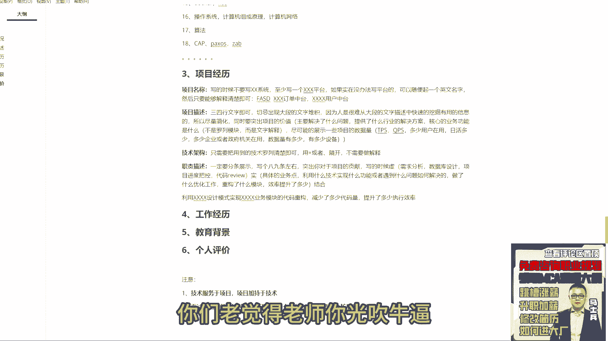

# P16：16.简历项目怎么写？ - 计算机底层原理 - BV1ZnDsYAE7D

项目怎么去描述啊，其实也非常之简单，很多同学一直发手写项目其实很简单好吧，怎么去写呢，来举例子，第一个项目名称，咱们有很多同学并不在乎项目名称这个东西，其实项目名称很重要好吧，写的时候不要写叉叉叉系统。

至少写一个叉叉叉平台，明白了吗，不要写系统，至少写一个平台好吧，如果实在没办法写平台的，写平台的怎么办，可以随便起一个英文名字。

然后只要能够解释清楚即可，比如说我就起个名字好了，就叫这个名字，我名字叫FASD，明白吗，什么意思，你找单词去匹配吗，你找单词去匹配吗，啊匹配到啥算啥啊，我告诉大家，这个招很好使，算了不行。

不不不不扯不扯闲篇了啊，就这东西就像名称，大家一定要注意，而且大家在写项名称的时候注意一件事，你不要写什么订单中台用户中台，你写这样描述的时候，一定要加上叉叉叉，订单中台，叉叉叉用户中台，你要显得真实。

而不是只是罗列名字，懂这意思吗，所以像名称这里也是很很重要的点，大家一定要注意好吧，这是第一个，第二个叫项目，描述下描述怎么写呢，也非常简单，三四行文字即可，切记出现大段的文字堆积，为什么，因为。

人是很难从大段的文字描述中，快速的挖掘有用的信息的啊。

所以尽量简化，同时要突出项目的价值，很多人不理解老师项目价值指的是什么，其实非常简单，主要解决了什么问题好吧，然后呢提供了什么行业的解决方案，对不对，核心的业务功能是什么，这块一定要注意啊。

这个核心功能不是罗列模块，而是文字解释明白意思吗好吧，然后呢尽可能的展示一些项目的数据量，什么数据量呢，比如说最简单的TPSQPS，有说老师我项目中这个数据比较低，怎么办。

多少用户在用日活多少to b的项目，多少企业，或者政府机关再用对吧，数据量有，多少是不是都可以写好，有多少，比如你们是做那个物联网相关的多少设备，这都会写，只要是跟数据量相关的都可以写。

因为大段文字里面出现数字的时候，人很敏感，能一眼看到，所以尽量写数字，比如老师，我实在没数字可以写，不写了，介绍清楚项目干嘛的就行了，这是我的项目描述，不知道大家能不能听懂，好吧，那除了这块之外。

来第三个叫什么技术架构记账，什么意思，不需要啊，只需要把技术用到的技术罗列清除即可，用加号或者逗号隔开，加上逗号隔开就完事了好吧，不需要，做解释，很多同学微服务，Spring c，阿里巴巴数据库。

MYSQL中间件卡不卡，不需要好吧，大家都搞基础的，别那么low啊，有些基础名词就完事了，这是技术架构，好吧，来第四个职责描述，这个模块是最重要的模块，这个模块写的怎么写，因记住不要啊，一定要分条展示。

写个八九条左右啊，突出你对于，项目的贡献，好吧，写的时候虚实结合，什么叫虚实结合，所谓的虚指是什么，什么需求分析啦，什么数据库设计啦，什么项目进度把控啦，什么代码review啦，随便写好。

类似这样的东西叫虚的东西好吧，那什么叫实呢，十指的是具体的业务点好吧，利用什么技术，技术实现什么功能或者遇到什么问题，如何解决的，类似这样的东西写好吧，还可以写什么，做了什么优化工作对吧。

重构了什么模块。

效率提升了多少都可以写，要写这样的东西。

这是我们的职责描述好吧，5年经验写几个合适，一般情况下项目的个数我的建议是3~5个，你工作了15年，20年，5年十年，你可能做了十个项目，20个项目，30个项目你可能写的很多，但是好吧，但是一定要注意。

但是一定要注意，你不是每个项目都要写的，还是那句话，把你核心东西写出来就完事了，能理解吗，同学们，来这东西能听懂的，给老师扣一，不知道大家能不能听懂这东西啊，理解吧，所以啊好好想想。

你自己的简历里面到底缺了什么东西啊，到底应该如何去做对应的一个储备好吧。

想明白这个事，还是那句话，你一定要想办法去吸引面试官的注意力，如果你没办法去吸引面试官的注意力的话，就会很尴尬，就很尴尬，好吧，来正常年限行项目的比例没有什么比例，无论你工作多少多少年，我我的建议啊。

大学生可以写两个，只要不是大学生，至少三个项目啊，最多最好不要超过五个，最好不要超过五个，好吧好了，这东西聊完之后来给大家看几个好吧，还是看看吧，不看的话，你们老觉得老师你光吹牛逼。

不能给我们展示几个好看的，来看这东西，看那写东西啊，技术描述项目干嘛的，它也没有数据量展示，下面一设计模式对吧，它通过策略模对吧，负责这个模块的编写，开发需的东西，下面也是虚东西对吧。

然后呢使用NX做什么事情对吧，然后呢这策略模块通过什么方式解决什么问题，REDIS的什么东西做什么问题对吧，缓存模块干什么事的啊，ROMMQ做什么事情呢，es做什么事，叉叉job做什么事啊。

网关模块通过什么东西东西来实现，什么功能都是可以写的。

所以你要写这些具体的业务点对吧，包括这个完成分布式id实现对吧。

干什么事，然后呢数据迁移做什么事情，然后呢安全健全能力做什么事情。

分表逻辑优化干什么事情，然后呢JVM优化做什么事情，线程池优化做什么事情都可以啊。

所以你要想明白你可以写什么东西好吧，没有微服务项目，就在那学习报个名吧，找一个微服务的项目经验，这个很多好吧，找不到的话，你就报名学一下，找到你就GITHUB学好不好，这个老师讲的很实用。

唉我说了你你们唉算了，不聊了，不夸自己了好吧，夸自己了，那老省得你们老觉得我我那个啥，刚刚同学一直在问那个那那个项目个数的事，我问个问题啊，同学们，我现在工作5年，我写一个项目行吗，我现在工作5年。

我写一个项目行吗，行还是不行，一定要记住一件事，你写的所有的项目是为了展示你的能力的，解决问题的能力的，好吧，那么给大家看一个东西，看一个啥呢，你不要去截图，这个东西没意义，你你回去看视频，你可以截图。

那个东西没意义，同学们，你就要掌握这样写的方式，这个很重要，我给你看一个一个同学工作了多少年，我忘了，就他只写简历里面就写了一个项目。

但是很牛逼，看一下给你们看看这个东这个东西啊，这一个同学写的，他就简历里面他工作应该是5年以上了，但他就写了一个项目，但项目很吊。

给你们瞅一眼好吧，看这啊，通过基于什么东西。

然后呢解决什么问题，es做什么事，开DB干什么事，MONGODB干什么事，12天DDBC干什么事对吧。

然后呢下面有一些OS2。0加JWTSKYWALKING，干什么事。

STINO干什么事，NINREDIS干什么事，DNSS做什么事，这有很多这个不看了，看他下面的值的描述。

他这次描述基本上全是虚的，但是这东西有的聊看怎么写的，参与核心模块需求评审，架构规划设计以及技术选型系统重构，性能优化，工科系统技术难题，构建高可用高性能，高并发高扩展性能系统架构对吧。

第二个参与核心模块需求评审，根据需求合理性开发周期，开发资源项目排排期定稿，最终产品原型，第三个设计大版本下的平台整体架构方案，跨部门流程协作沟通，第四个架构团队技术研究。

解决复杂系统下系统架构难题，第五个参与系统重构，多维度分析系统问题。

制定解决方案，架构改进策略，最终生成处理方案，第六个负责高并发多级缓存架构的设计与研发。

负责高并发秒杀系统的架构设计研发，参与系统网关集群中间件，服务层数据库JVM全链路性能优化，对MYSQLREDIS，Td b post，MYSQLMONGODBES等存储系统全方位性能调优好吧。

参与百万级高性能资源网关的架构设计研发，灰度呃，参与平台分布式实时数据同步，中间件的架构设计研发，参与系统恢复发布方案的设计与改造，来敢敢这么写吗，同学们哈，他这么写的，就一个项目，没有别的了。

他就写了这一个东西，你们觉得够使不，够用吗，够了吧，所以大家没必要去盲目的追求，说我一定要写三个，写五个，写十个项目，没必要，就我给个统一的建议，一般情况下写3~5就行了。

重点是你的项目中要有可聊的东西，起码我看到这个东西之后，我就想问问哎，你们系统这个高并发多级缓存架构怎么设计的，哎你们项目这个秒发系统怎么设计的对吧，你怎么做性能调优的，你能把这个组件好好给我聊聊吗。

他有的聊就面试官感兴趣，这是唯一的核心点。

就是我要对你感兴趣之后，咱们才有聊下去的，可能我对你一点兴趣都没有，完蛋了，就给你举个不太好的例子，我不知道咱们之间有没有女孩子啊，举个例子，大家让你看个姑娘，看完之后你都不喜欢她，你会跟她聊天吗。

你看这姑娘怦然心动，你一定想各种招加人家微信，是不是这意思，一个道理。

面试也是一样的，好吧行了，不说废话了啊。