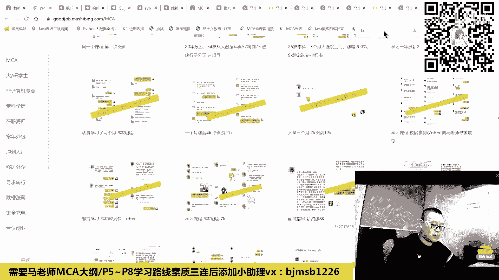

# P2：【首次公开】适合所有Java程序员的自学路线（2023版） - 马士兵小鱼 - BV1oP411Q73J

在这里呢我们也会给大家介绍，我们2023版的整个的咱们架构师的大纲。

这是我们最新组织的大纲啊，哪怕你将来是自学都没关系的啊。

你会发现这个大纲对你的指导指导性还是很高。

呃因为呢新的新版大纲呢，我基本上采用了一种呃小白从小白，然后直到百万年薪啊，或者百万年薪以上啊，这种水平的人。

他大概会经历走过哪些步骤呃，当然不是说每一个人呢，他的步骤走的是完全一样的，这是我们一直以来的教教育理念，就是每个人不同的背景，应该是学习不同的路线，这也是我们一直采用定制化的原因。

就是教大家呢你们有些人比较着急，几个月就想工作的，有些人呢他有充分的时间，我想系统化学习的，那么他走的路线一定是不一样的，重点花费的精力也是不一样的，你的目标是进大厂，那么你的精力会放在什么。

要放在什么地方，那么你的目标是找份工作，精力放在什么地方，这些东西呢会跟大家伙不同的背景，不同的定制，但是呢呃也需要有一版，就是从一个普通的小白开始，我们大概去经历哪些个打怪升级的过程，我们才能升职升。

才能面对最后的boss，ok那大概是从，入学这种学前指导这就不说了。

教你怎么学习方法的，然后呃如果对于非计算机系的同学，我真心强烈建议你一定一定要理解这几门课哦，我这么讲，就是说其他像什么数字电路呀，逻辑电路呀，什么这种硬件设计啊，这些东西啊。

对我们软件工程师来说不是很重要，但是你如果想跟计算机系的同学差不多，这几门课是必须的，呃，操作系统，计组网络，还有呢这个编原理的话呢，我给它两星边原理，一般是不需要去了解它用到的啊。

如果你感兴趣可以去了解，呃这里面比较重要的一项叫算法与数据结构，这块呢，我重点介绍一下，因为明天左老师也会来到咱们现场啊。

就是咱们主讲算法的老师呃，也会跟大家见面呃，左成云左老师啊，这个那个那个那个那个这个有了解过他的，也给老师扣个一吧。

好不好，明天呢他应该也会在现场啊，跟我一块儿跟大家见面，他是原来从华中科大毕业到呃，美国的芝加哥大学读的研究生，然后在美国亚马逊，在中国的百度工作很长时间，然后一直讲算法呃，我们马士兵教育呢。

现在从我的站在我的角度，是越来越重视算法课的啊，我一直从开始就比较重视，到现在呢越来越重视算法课，好多新版的这种实验都是从算法课开始哦，我想呢也给大家强调一下为什么，原因是什么，为什么这么设计。

我们比较强调算法，比较强调原理原因，因为站在那个全球一线大厂的角度啊，北美的工程师的角度，美国的工程师的角度，他们基本上考一个程序员，什么都不考，这些东西全部考，知道吧，他只考一个，就是这个算法。

同学们你们琢磨过没有，为什么啊，你们可能没有接触过，你们现在从百度上搜一个东西，就是那个原来东莞电子厂的一个女工啊，机缘巧合到了美国之后，冲了半年左右的算法题，面试进了谷歌，他们也没有没读过大学。

也东莞电子厂的女工就靠算法啊，面试面进了谷歌啊，为什么会这样，为什么会这样啊，张天琪看过是吧，嗯就是为什么国外的面试很很重视算法，而我们国内的并不是很重视，原因是什么呀，听我跟你讲算法。

可能呃我我们讲知识点啊，我们讲就说我们国内很多人面试你的时候，就面试的一些基础的原理，面试很多应用的东西啊，spring spring vc了，my bis了，你用过没有啊，哪个参数怎么设置啊。

它会有面积最显好，国内所看重的就是你来了之后能上手，能干活，能够做c r u d就ok了，就干这个可以了，非常初级的，切个菜啊，好那个那个那备备个冷盘啊，就够了就可以了，明白吗。

但是这些东西是完全可以用突击来完成的突击，而且这个突击的效果很好，我告诉你，所以如果你们只是想找一份很简单的工作，或者说简单想提个新，这个相当的容易，就是老师帮你总结出来系列的涨薪，提一些。

你要从2万向头提到28000，中间差哪些知识点，我帮你总结出来之后，你背就可以了。

突击做一个突击就可以，这个效果是可以的啊，这个这个不是不是说不是说很差的一个效果啊，这个我我我给大家也看看几个案例呃，这个是十天啊，就十天我帮他帮他规划好之后，突击面试就干干净，滴滴了啊。

27k 15个月啊，滴滴的d6 这突击的这个内容的挺多的啊，你们也可以去自己去看，这是6+2加面试突击啊，有6+2，是我们内部的一个常见的这种这种呃，学习路线啊，然后六个知识点加两个项目。

141000涨38万亿的啊。

我找几个那个最近的，这是突击了，一个月薪资14~20k就是突击的效果。

实际上是很容易的，就是应付国内这个是比较容易的，你知道吧，他真心不难，但比较麻烦的，实际上是应付国外的，就是老外考，为什么他重点考算法，重点考算法的原因呢，是因为算法没法突击。

我没有听说过说你算法不太好，然后有一个月时间我突击成了算法大神，没听说过啊，说我不是计算机行业的，然后呢，我背那个知识点我能背过，说我一个月之内我我算吧，我跟你这个其其他的搞搞计算机的，差不多没听说过。

所以这个玩意儿是没有那个什么的，这是整个课程有完整的课表啊，呃等会我给你看就可以了，那个这个玩意儿是没法突击的，一定要理解这一点，没法突击的东西就意味着你没法作弊，你没有办法去搞什么。

搞什么那个那个那个强强强通猛偷去背题，你背也背不行，只能是老老实实扎扎实实的练逻辑，练思维，你才能够做好算法题。

所以这是为什么，在这里头呢，我们专门给大家设计了算法课的原因，算法课呢很少有机构去设计这一点。

尤其是做这种应用级别培训，我们为什么设计这一点。

就是我们不想让大家伙儿这个内内力太差了，一共有两版，两版加起来是878个小时，一版大概是400多个小时，学一版就可以啊，不要学那么多，会从新手班到体系学习到刷题到大厂的算法，每周的大厂算法题。

算法的高频面试和全面押题啊，这是往期的算法，那就不说了，这是咱们直播的内容，每天都有直，每周都有直播左老师讲课呃，详细的内容，由于大家伙对算法的理解呢每个人不一样。

我在这就不一一的去给大家念这些专业的名词，大概呢我跟大家这么说，国内的厂子一线大厂不是很强的这种，比方说像京东呃，像什么京东啊，还有像像阿里，那就是对算法看着没那么没那么看重的，这样的厂子。

大概你搞到动态规划部分基本就够了。

但是呢如果说你想的到字节啊，到微软到腾讯，到华为这样比较看重算法的场子，那不好意思，动态规划之后呢。

还有系列的问题啊，还有系列的问题，大概你就得成体系化的来补，玩算法的人，最合理的时间点实际上是在大二大三左右，如果是这样的话呢。

我们就是在安利里面的，也通过好多同学啊，能送他就是通过算法就直接送他，送他进那个那个大厂的实习了啊。

这是评算法，应届生是60万的，package是600000加股票，这是那个理想的offer。

涨了8k，这是拿了字节的，被字节录用了，算法的学习。

那个想进大厂的同学啊，这块知识务必掌握好吧，咱们不能够说因为它难，然后就br就退而求其次呃。

我也给大家请到的是国内最牛逼的算法老师，好好跟着学，进大厂就有戏，如果你不想进大厂的，没关系，算法扔扔一边没人理你啊，起码到目前来看没人理你，但是呢你如果想进那种中高端的一些厂子。

现在有一部分也已经开始重视这部分哎，主要是原来呢进这些厂的人呢，他不是靠算法进去的，所以他面试的时候，面试你的时候也不会考你，算法他自己都不会，但是越正规的厂子就越会考你算网课，这个你要了解了解这一点。

这是为什么我们在课程里面呢，给大家专门加这块的原因。

基础的编程项目，数据库，网页框架。

项目工具项目。

微服务项目项目算法。

数据结构的进阶，软实力好在这里面我大概重复了四五个项目。

同学们要告诉我为什么项目很重要，那个你们简历有些人投出去之后没反馈，这个我今天刚上课之前，有同学就跟我说了，为什么注意你简历里头有两大类写法，第一类叫知识点，我可以负责任跟你讲。

任何一个知识点的学习都很容易，就像我这么跟你讲，你是不是很容易听懂嗯，我们老师我现在要求我们老师，就是你不仅要讲的清楚，还要讲的漂亮，还要讲的那个，容易好吧，我这么跟你讲，其实任何一个知识点。

你只要肯下下下功夫钻，你用碎片化的知识，每天在车上的时间都能都能搞得定，很容易，但是为什么你写了一大堆的知识点上去，一大堆名词堆上去，人家面试还不给你机会，是因为你的项目十分不给力。

所以在这里是进行了系列的项目，如果你没有做过项目，应届生，大学生扎扎实实把项目全做完。

写简历上，一般刚毕业的时候，要求四个左右项目加系列知识点的写法，这是你现在找工作的标配。

线下的培训都是这样，你说你只有两个破项目。

不好意思，没戏好吧。

然后如果是想进阶后面的项目，这里的项目亿级流量，网游后端高并发相关日志中台设计。

如果还想进阶进行架构方向上的项目设计，怎么办，容器化要了解是吧，服务保障要了解啊。

然后这时候的项目该怎么办。

大型团队的架构的管理啊，然后。

两大项目啊，第一个呢是我们的网约车的第四版，这里第二个呢是我们的严选商城呃，我建议大家，比方说你如果只是想了解落地网约车，第四档够了，如果你想了解站在更高的角度，除了落地之外，还要了解设计。

还要了解把控带头团队怎么合作出来一个项目。

了解咱们这个项目严选商城，这个呢你们可以在网页上直接访问到啊，也可以下单买啊，这个都是都是可以直接运营的。

这是优点满身点com，你打开之后呢。

其实它就是一个电商网站，我拿电商举例子，主要是为了突出技术，业务逻辑比较简单。

主要为了突出技术，那这个东西呢呃前端页面看上去比较简单。

但是它核心点呢，实际上是在于它后端的架构设计，以及人员的组织和配备。

我们来看一下就知道了，呃这是咱们后端的技术架构。

运营的人，用户的人开发和运维全部组织到一起，通过运维开发运营。

运营开发的一体化devos结合在一起，网关服务治理微服务技术。

中台的系列的组件，以及我们的一些基础组件，短信的e locstash是吧，cano，然后mysql redis等等，从技术框架来讲，你可以来了解怎么去自研框架。

从技术的核心技术来讲，有用到了这系列的技术监控警告的啊。

中台的角度来讲，可以去了解支付中台怎么做i m中的啊。

我们是真正的支持每天上亿流量的i m，没没有没有任何问题啊，上10亿没有问题，没有任何问题呃，搜索的中台用户的状态，以及后端的大数据该怎么做。

大数据相关的ai推荐该怎么做啊，就是从前台到后端，当然做这样一个项目也很累啊，我就直接告诉你，马老师为了这个教学项目，大概投入了这么多人啊，这是我们的启动，启动会前前后后30 30多个人吧。

不要小看30多个人，兄弟们30多个人，在很多大厂里面都是一个巨大的项目组啊，不信你去了解一下，从前台到产品到测试，到运维，到开发，到团队的组织，到代码的落地，所以项目呢整个系课程体系里面为你设计了。

从最初级的简单的小p项目。

一，直到你可以带领几十个人团队开发的大型项目，做这种投入的，给老师点个赞吧，好不好，一般来说做教学项目好多呢，都是一个老师带你敲嘛。

对不对，但是想做这种投入的不多啊。

包括这里系列的项目，这些项目的话呢对你们来说怎么说呢，就是当你们简历上没没得写的时候，没关系，把这项目写进去，当你们项目有所有的写，但是你的项目比较传统的时候，用学到的技术封装你原来项目你能听懂。

再重复一遍，你简历上项目没得写怎么办，挑这些项目写上去，老师呢也会在就业突击里面教你啊。

教你怎么办呢，就是教你别人问到你项目什么问题的时候，你该怎么回答，那么如果你的项目有的写，你原来做过项目背背景也也也不错，但是呢你原来项目比较传统，没有那么好的并发量和架构。

没有那么牛逼的架构应用进去怎么办。

用学到的技术去封装原来项目，你的简历就比较值钱了。

简历里面其实就两个，无非就是前面的这些知识点，什么架构方案的设计了。

架构的理论了，组件的应用了，框架的原理，源码了，底层知识了，性能调优了。

都无非就是这些知识点是你的前半点，以及你后面的系列项目。

无非就这些。

当然如果你追求的是更多的。

比方说要做呃，掌掌控全局的技术视野方面的，团队的管理，产品的管理。

生产事故的分享，前端的架构等等。

或者是你横向综合能力的这种啊，云原生相关的大数据相关的，那么go on相关的是吧，呃c k a相关的c k的相关的，如果你需要的是这些，那就是在这里好吧。

所以大概马老师的学生呢。

从这种13k的涨到25k的是吧。

刚才大家也看了什么，7k的涨到12k的啊。

从这种的一直到什么呢，一直到我带的学生里面。

年薪70万涨到120万的，跨面跨度跨度比较大啊，主要的原因就在于第一进来之后，先评估你是到底处于哪个台阶，上，下一个台阶该怎么卖呃，跳槽要涨多少，该不该跳，本地能不能涨。

然后一步一步一步一步一步一步走下去，一门课全包啊，好我我整个的我们的架构体系啊，还有这个知识点的内容啊，大家如果有愿意要过去啊，我建议你去了解了解啊，就是说你你可以不跟我们学，你说不想掏钱没有关系啊。

那你就自学自学，那就是效率比较低，耽误时间比较多，我带你仨月自学12个月，九个月你是亏的，你自学找15k的，我带你找20k的，每个月差5000，随你好好算算账，多了解，把咱们的大纲要过去，对你来说。

哪怕自学都是一个指导。