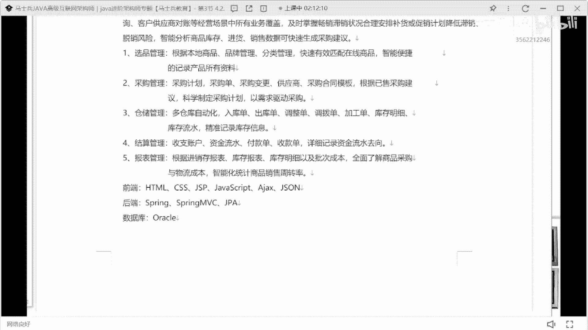
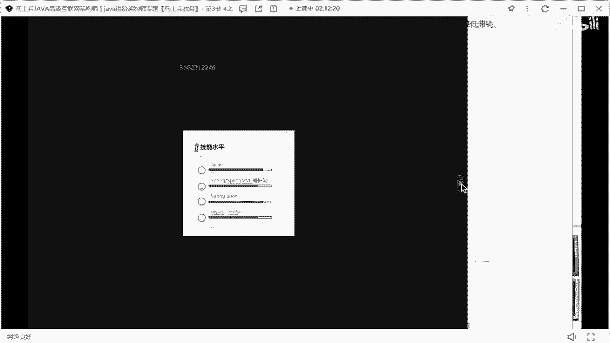
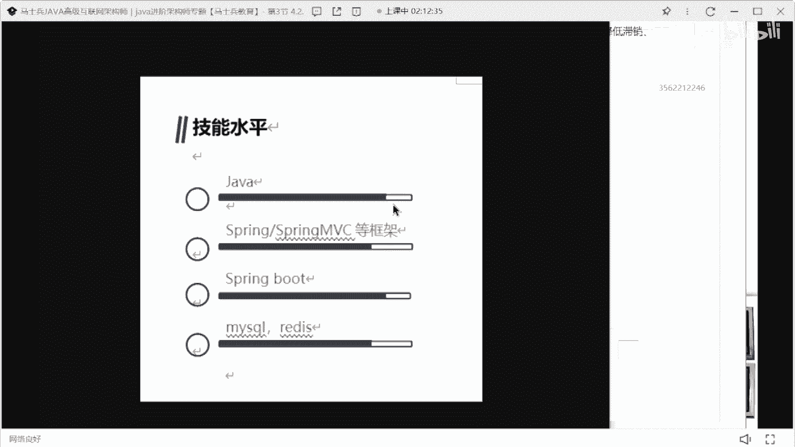
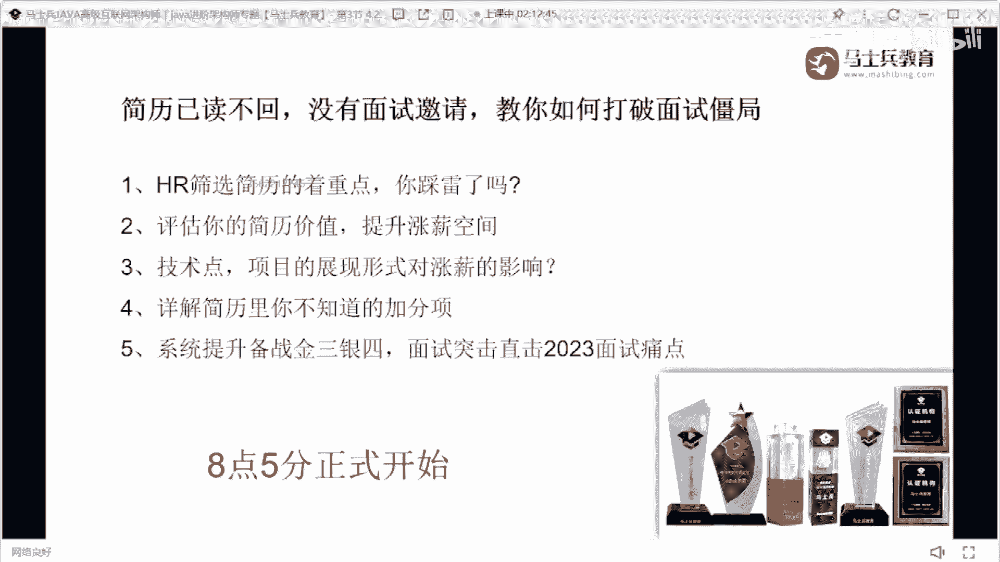

# P22：某位帅哥的简历指导【反面教材】 - 马士兵小鱼 - BV1oP411Q73J

嗯来看一下某位帅哥的简历，谁的谁的简历啊，来，唉哟这谁的简历，陈同学陈同学，记住啊，不要去招聘网站去下载这种简历模板，人们问第一巨丑，第二可读性不好，第一个先说你的技术站，该对齐的地方要对齐。

你上来你作为一个后端工程师，先立了一堆前端技能，还是非中网前端技能干啥，没必要好熟悉这些框架的原理，然后sql语法啊，spring cloud啊，ucraven源码有研究有研究没了。

就你所展示的技术站就这几个东西，这肯定不够吗对吧，你肯定要把你的技术站给充满，对不对，然后呢，求职意向就这状态积极找工作，这样写好吧，然后193年零七个月的工作经验，你的技术描述肯定撑不起你3年的经验。

百分之百的刚刚怎么写，我已经说过了好吧，然后项目经验oa，oa啊，大家注意这个oa不是说不能写，就现在的写oa的话一定是一种sars平台，要不然的话你就是一种私人定制的平台，一定是这样的。

不要写这种单体的oa项目，用单体的oa项目来说，不能那个啥好吧，然后他写了一下模块，但这个技术还这么去罗列嗯，没必要，真的没必要好吧，职责就写了俩，这肯定不行，那雅阁hr也是一个多平的东西。

有这技能关肯定要换好吧，不明物业，就你的所有的项目看起来都是基础的，c r u d的平台，就你要经过适当的包装，把你的项目看起来更多，更加高大上一点，这是肯定必须的好吧，然后最让我生气的是下面这个东西。

就这个东西啊，一定不要这样写好吧，一定不要这么写，这东西干掉，你一定不要这么写，然后我之前见过这种写法，还见过一种什么写法，有的同学呢把这个技术写上之后，后面有个进度条来，金条到这儿好吧。

有有有这个技术进度条，到这儿就不要写这种东西好吧，这是啥玩意儿，而且你要想明白一件事，你前面已经写过这些技术上的描述了，你后面又去加了这么个玩意儿干啥，真的真的没必要好吧，我不是开玩笑。

我给你找一下那个案例，我我这专门截图，我找那个案例，我专门截了个图，看下简历有没有简历了，我找一下，因为我那个唉这呢。

你看这个这个进度进进进度条啊，我这有很准备了很多这种失败的案例。

对啊，看到没，这种就这种东西，我真的我看着我都要笑死了，就是，我都不知道你你写到这块是百分之几。

所以一定不要一定一定不要这么写，好吧。

