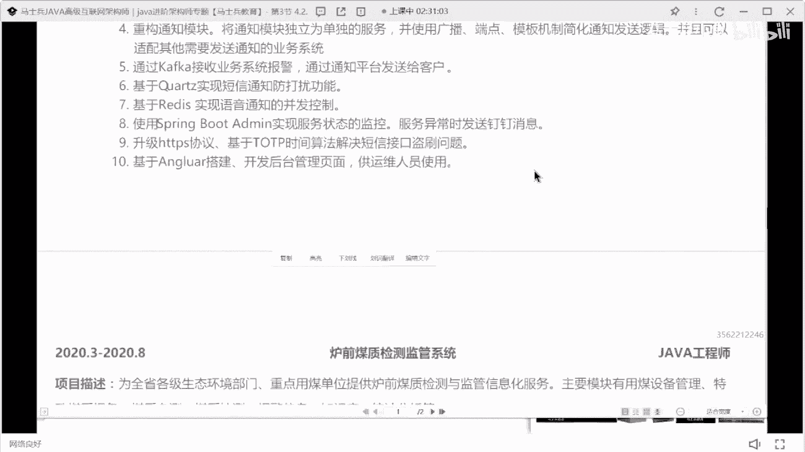
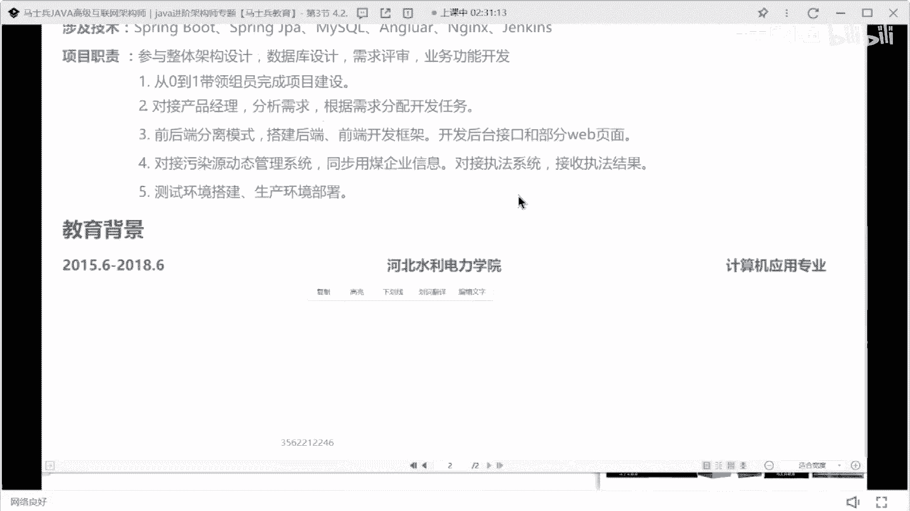

# P26：石家庄5年Java经验9k简历指导 - 马士兵小鱼 - BV1oP411Q73J

26岁5年经验，小小心点，我感觉我要被他骂死了，框架mysql redis。

卡夫卡，docker and这个词呃，调整一下你这个房间距，调整一下你这个行间距，调整完房间距之后，一会应该会好看很多。

我现在没法帮你调调，房间也好好看很多。

18年到现在5年经验没换，工作挺好，不能说。

你现在5年经验只有两个项目啊。

是我的经验吗，你看啊，你这有个大漏，这这这简历是谁的，之前是谁的，不值得写也要写啊，就一定注意一件事啊，你看你现在从18年工作的。

你这个最近的项目是20年开始的，前面也要加一个项目，把你前面的经验给撑满一点行吧，你你现在这两个项目不够大。

所以呢不太能够支撑得起你这5年的经验啊，基本描述啊，我刚说的方式去改cd没关系。

cl该写写该写写，这句话说你要把你这个时间充满，因为你现在的每一个项目可能不太能拿得出手，或者不太有可聊的东西，所以该写东西要写出来，如果你一个项目就可以有很多，可以聊的东西的话，你就大胆去写一个项目。

但在你没有更多可聊的东西的时候。

你写一上面就是有问题的啊，所以该把该写的东西要充满的地方，该充满的地方要想办法去充满它行吧，你要充满，ok，河北人老乡啊，我为何为河北人，好吧。

大家这个简历值多少钱啊，哪都在哪工作呀。

在河北西庄吗，是在西庄工作吗。

没写在哪儿瞎装是吧，是想装，给不到15啊，血量肯定给不到15，血量薪水也很低，血量给不到15，这个简历啊，石家庄看他现在新的水平啊，我已经到十就不错了，你现在多少钱，有10k吗。

石石家庄10 15k已经是很高的鞋子了，看到没，9k吧，对石家庄薪水是比较低的，因为我也河北人好吧，我也河北人，所以咸阳那边薪水很低。

建议啊，你现在26岁还小，可以去一线城市里面拼一拼。

搏一搏。