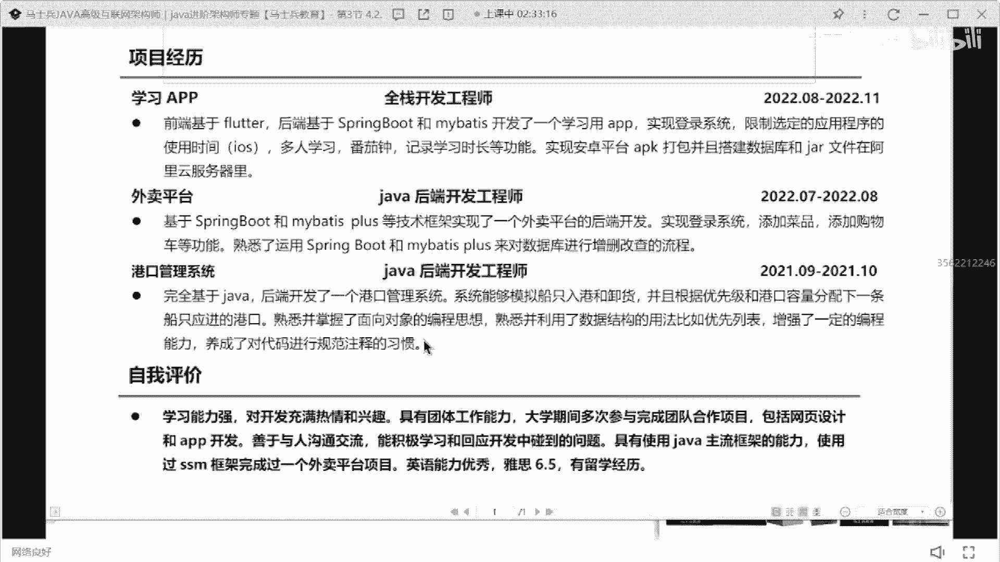

# P27：应届海归硕士简历指导与建议 - 马士兵小鱼 - BV1oP411Q73J

ok，看这个3年级，这是硕士海归。

重庆邮电，好学习，我这个在北京值多少钱，北京啊至少翻个倍吧。

北京至少翻个倍。

实习。

啥时候毕业，2年10月份2月毕业就已经毕业，大学已经毕业了呃。

技术占有点少，这同学啊学历很好啊，但是这个技术站有点少。

就算有点少，项目就没啥可说的，你这个项目其实都说白了都是这种练。

练手的项目，练手的项目，这种项目几乎没有啥可问和可聊的东西。

所以就是如果你现在想找一个呃校招后也好，还是说想参加找个工作也好，第一你该补的技术战能力要补，你现在只学到spring boss肯定是不够的，肯定不够的，像这种release了中间件这些东西。

微服务分布式这些东西你是一样有所接触的，第二个你的项目要改。

你这些项目都太，就你写的这项目，前看起来就是基础的入门级项目啊，就是这个链锁的项目，练手的项目，它不是一个正儿八经的企业，真实的生产环境里的项目，所以下面是要改技术，也好好描述一下。

就宽度基础宽度有缺失。

