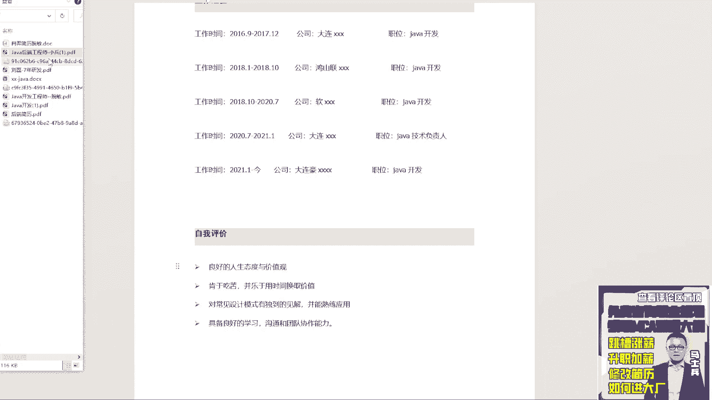
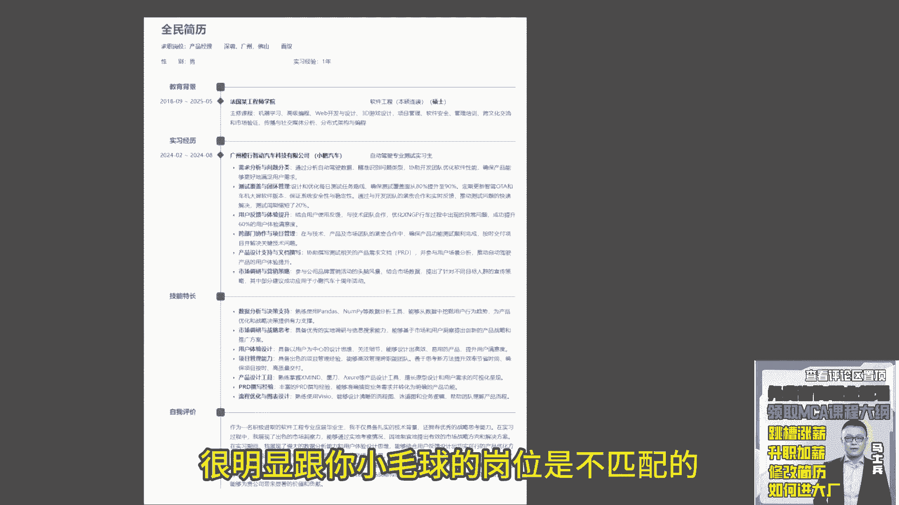

# P3：3.【程序员简历指导】法国某工程学院，硕士在读，明年毕业 - 计算机底层原理 - BV1ZnDsYAE7D

来看下一个同学，这是谁的大宝贝儿，谁能在吗，在的话来扣一来，挨个都会看的，都会看都看，别着急好吧，都会看啊，SE1同学四同学看同学啊，他是法国某工程师学院软件工程，明年毕业还没毕业啊，呃一定要记住啊。

所有的大学生同学，咱们有多少大学生啊，大学生给我扣个一，来看看，大学生给我扣个一，所有大学生听好了，你们在写简历的时候，不要把你大学里面学的这些课列出来，我我一点意义都没有，这些东西对于你找工作啊。

对于你面试而言没有半毛钱用处，所以这东西不需要写，不需要写好，展示你的学历就完事了啊，这是第一个第二个实习经历，这是一个段实习经历，实习经历不能这么写啊，你是做的是次测试工程师，然后这是技能特长。

数据分数据分析与决策，然后呢市场调研与研发啊，你这同学S1同学，你最终找的岗位是开发岗还是什么岗，SE你最终找的岗位是什么岗，是研发岗还是什么岗，还是测试岗还是什么，产品经理，如果你做的是产品经理的话。

一定记住一件事，你在你的技能特长里面，展示的全部都是产品相关的东西，别的东西不需要讲，不需要展示，而且呢既然做产品经理，那你把你这块产品的设计工具，这东西你要重点去做一些展示和突出，而且如果有可能的话。

把你之前做的关于产品方面的一些思考好吧，可以把它作为一个贴图也好，还是功能解释也好，最好能展示给面试官，中央检职面试官，那你这段实习的经历我希望你改一下，如果你找产品相关的岗位。

那么你的经历就要变成把它变成一个产品，产品岗，你做了一个测试实习生对吧，然后呢，你找个产品岗，这个是驴唇不对马嘴的，就是我们写的所有的实习经验，实习经历意义在什么地方，是为了展示我具备这方面的工作能力。

明白了吗，不是说我我随便有个实习经历就完事了，如果你没有这个产品相关经历，你要编，你要编，那你就把这个岗位名称换了，明白吗，就是你要找的这个写的实习经历也好，项目也好，所有东西都要跟你所谋求的这个岗位。

做一个匹配，不是说我想写什么，我就写什么的，明白了吗好吧，然后这块下面这块技能特长，你要再描述一下关于产品的东西，你要重点写一下，除此之外你没有项目经验咳，你这个简单应该截全了啊。

截权的话你没有展示你的项目经验，这是不对的，就是你做过哪些对应的产品相关的一些思考，或者做过哪些产品相关的一些东西，一些项目要把这些东西重点描述，你没有经验的话，让别人看起来你就到实习经历。

没有正式的项目经验，这别人感感受起来不太好，明白了吧，还是那句话，就检测你的技能的时候可能不太完善，那我就会评判你到公司之后到底能不能干活，哦对你之前的项目确实可以是深度学习的，这个没问题。

你要找几个产品相关的项目，产品相关的经历，把它写到你的项目里面去，因为你要找的是产品相关的岗位，所以你要给hr也好，面试官也好，展示的是什么，我具备产品设计的思维和对应的方式，包括各种理论啦。

各种实操啊，这些东西我都没问题，所以你要展示这方面的经验，明白吗，而不是说因为我不具备这样的经验，所以我就没放你编假的也要去编，听懂了吗，懂这意思吗，但你这东西完全就我看完你的简历之后。

我完全看不出来你是做搞产品经理的，能懂吗，然后我不会写简历太长了吗，额有很多大学生会有一个错误认知啊，都觉得说老师我们今天听过很多人告告诉我们，说我的简历最好就1亿，我不知道你们从哪得到这个描述的。

从哪得到这个这个这个反馈的，告诉大家，你的简历没必要去限制页数，你简历里面写的每一个段落好吧，每一个文字都是要展示你对应的相关的匹配的，经验和能力的，所以不要拿页数来衡量，说它到底多或者少。

你真的有东西，很多东西可以写，你写sin都没关系的，明白吗，所以不要去限制页数，重点是你有没有足够内容，可以去填充到你的项目，你的简历里面去，能让面试官看到你的价值，OK听他们说现实，扯淡了。

浓缩能力我一句话，我做过产品行行不行，别听他瞎叨叨好吧，该详细描述的要详细描述，因为你要让hr对你感兴趣，你写的东西很简单，hr根本对你的东西不感兴趣，明白吗，别他们瞎叨叨，OK好了。

这是这个产品相关的啊，因为产品我并不是很专业，所以专业技能方面的东西，我可能给不了你太多的帮助啊，但你的项目很明显，跟你所谋求的岗位是不匹配的。

