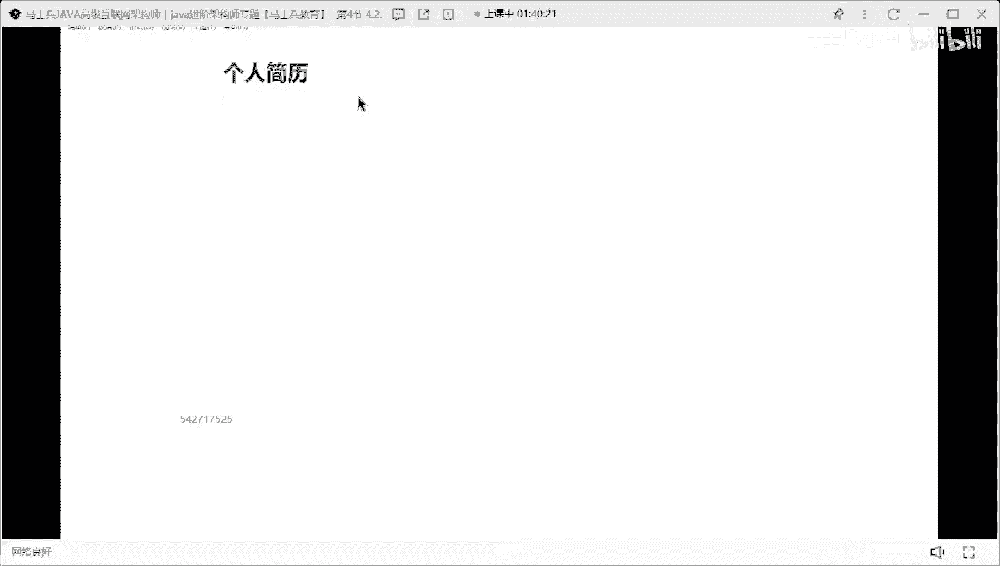
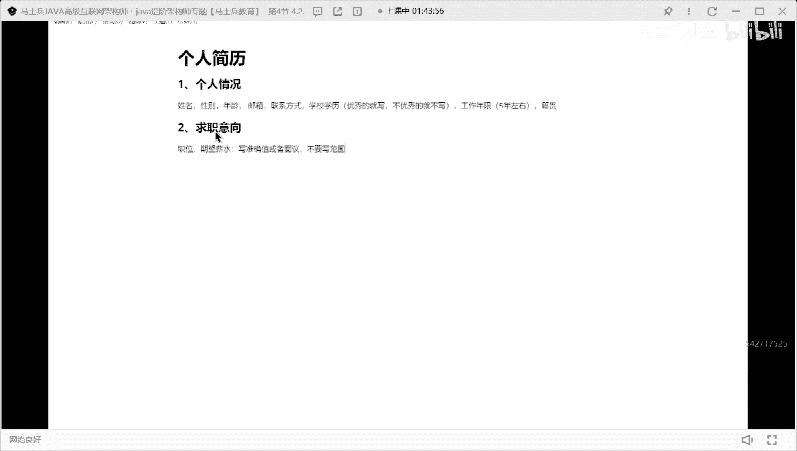

# P3：程序员简历指导：个人情况，求职意向怎么写？ - 马士兵小鱼 - BV1oP411Q73J

写简历的时候大概要分为几个技术模块好吧，第一个模块做个人情况，个人情况，这个模块呢其实非常简单，把你个人要展示的基本信息展示性就行了，比如说姓名对吧，性别年龄对吧，然后呢邮箱联系方式。

我把这些基本的信息，首先先写到写到写到这些基本的信息方式之后，紧跟着后面可以加什么东西，很多人一直问我老师学校和学历要不要写，要写吗，注意这点啊，同学们优秀的就写，不优秀的，就不写明白了吗。

好吧就你你你是八五，双一流还挺好玩，也要双一流，你就写好吧，你是在科班出身，你就写非这样的，可以不写，可以不写，ok除了这之外，还有一个很重要的点，好像还有个我一般建议大家写这样的东西，叫籍贯籍贯。

有人说老师我写这玩意干啥不喜欢干啥，就是我们在面试的时候，现在大部分人应该在一线城市找工作，但也有二线城市的，可能跟你的家乡不在一块对吧，就这这这东西啊，有可能面试中碰到你那个对应的省市那样的人。

明白吗，就是这个这个这个这个很重，这个你不要觉得这东西不重要，这就碰碰运气的事，就你写上了，你没有什么损失不写哦，可能是损失，懂我意思吧，习惯有什么占不占优势的，就今天下午那个冰冰老师找我去打电话。

我那个电话打过去之后一看河北邯郸，我上完之后就问他，我说你合拍到哪了，他说武安的，我说我也是武安的，就是我自然而然我就跟这个学生有一种亲切感，你懂吗，你你懂我的意思吗，所以就这东西你加上你。

你加上他没啥损失，所以该写的写，别在这扯犊子了好吧，什么日本级别扯犊子了好吧，但还有人喜炫喜欢写什么身高体重没必要好吧，还有人喜欢写东西叫工作年限，这儿我给大家一个建议啊，这个工作年限这个东西啊。

如果你现在处于是5年左右的好吧，你可以写，但是你年龄特别大的，我其实不太建议你写这个工作年限，听懂了吗，不太现在还写，就5年左右的，你该写写了哦，其他就算了，ok这些个人情况这块你随便写一下。

其实这块关系倒不是特别大好吧，第二块大家非常喜欢写一个求职意向，求职意向求职，这个求职意向这个模块啊，你可以写对应的职位对吧，他还写了一个叫期望薪水，这我说一下职位就写开发工程师。

你也不要去加什么初级开发工程师，中级开发工程师，高级开发工师，不要加这些东西，以后jjava开发工程师就完事了，不要加那么多东西好吧，然后呢，期望薪水这块还是我刚才说的，写准确值，或者面议是不要写范围。

一定记住，不要写范围。

好吧。