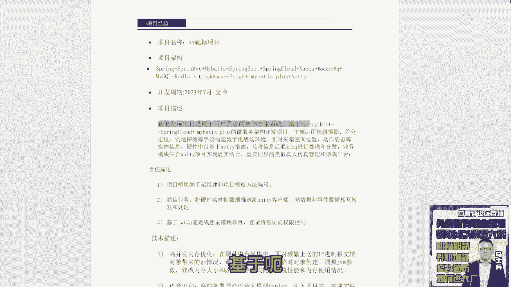

# P4：4.【程序员简历指导】29岁7年工作经验 - 计算机底层原理 - BV1ZnDsYAE7D

来下一个刘磊，刘磊在吗嗯，一方通行有一个实际问题，现在java的话可能二二十之后收费，然后的话需转语言，马上进入这一块，你先干着收费再说。

你考虑那么远，干嘛来养牛人嗯。

还是老问题啊，第一个呃，我不知道这块是因为删脱敏的问题。

还是什么问题，没对齐，该对齐的要对齐好吧，这是第一个问题，第二个问题，专业技能。

你看你这专业技能写的是哪有问题，我怎么感觉看着这么不舒服呢。

是你这个缩进的问题还是啥问题啊，是我老看着好难受。

啊这PDF吗。

PDF算了，就这块啊，行间距你要稍微的去调整一下，然后前面这个这个这个是个啥，你这是怎么导出来，有的大有的小，这东西啊，保持统一好吧，保持统一啊，呃然后这JVM的，这是java的，这是JVM的。

这这这是JVM并发机制，这个没有没有没有说JVM并发机制的啊，这个描述不太对啊好吧，然后下面是框架的，这是微服务的分布式事务的MYSQL的咳，Redis，Redis，Es mongodb，这三个东西啊。

全部可以单独拿出来做描述好吧，中间建的tomcat n这个词，HTTPPROTOBUFF和JASON，PDSL和LICO，这个了解就不写了好吧，这个了解写了跟没写一样。

Ok docker compose。

就docker的应用能力嘛，你这个排版好好排一下好吧，好好排一下，真的看着挺挺挺挺难受的，咳咳基本的技术宽度啊还是OK的。

但技术深度这块，可能要再详细的去去做一个修改啊，这第一个第二个项目这块也是一样的，下面这个工作描述不写了好吧。

没意义啊，没意义，哎呦，你看这大段留白。

这这这留这东西干啥呢，没用啊。

嘶这个项目咋写成这样，这看你你自己看着不难受吗。

对这个养养养牛人，你换一下字体吧，你这啥字体我不知道啥字体，这字体看起来很难受啊，稍微稍微换一下好吧，还是你格式的问题，看着看着不太舒服啊，热压轴基项目，智能靶场项目属于教学原生系统，基于呃一定记住啊。

咱们现在是一个正儿八经的职场人，在职场里面做项目研发的时候。

我们很少写基于什么什么东西，而你上面本身已经加了技术架构。

或者技术站的一个描述了，那下面这块就没必要再加什么基于什么东西了，然后基于NT搭建，基于unity什么东西没必要写这东西，还是那句话，项目的描述写三四行，重点突出的是你项目的价值，主要解决什么问题。

核心功能点是什么，如果有可展示数据量的话。

做一些可展示的数据量展示就完事了，好吧，是这东西，那职责描述呃。

脚手架组件和项目模块编写通信业务，然后基于GWT完成登录模块登录。

高并发内存优化，语音识别，数据统计和分析权限管理这块啊，把你的这个职责描述和这个技术描述。

两个东西合二为一，那样的合到一块，合到一块之后起统一的起一个编号。

这个地方在写东西内容的时候，最好能突出一些具体的业务点，写的越细节越好。

没必要去总做总结，什么高并发内存优化。

语音识别没必要写，这东西你就111行或者一行半，把你当前业务点好吧。

以及对应的技术实现能够描述清楚就够了，别的东西不需要写，不需要写好吧，但是你写的东西我简单看一下啊。

呃JC这是一个ZM优化东西啊，可以问第二个就是通过访问语音接口库，这不就调，这不这不就是个调用远程接口吗，这没啥可问的啊，然后引入click house nuo，发现服务自定义负载均衡。

这有啥问的，权限过滤器拦截器实现权限校验功能。

control追加注解呃。

反正反反正我看完啊，如果让我我是面试官的话，如果想问你的话，我可能问你就就就这东西。

别的我可能也没啥感兴趣的好吧，所以这个值得描述这块。

我觉得你要好好去去去修改一下，OK现在这个汽车零售售中项目。

零售寿终项目描述呃。

REDIS分布式锁的问题，钉钉审批集成，这不就调钉钉的接口吗。

相当于只做建一个钉钉的机器人吗，通过机器人之后来提醒提醒用户做些事情。

性能优化，这SQL优化的问题，就这个写的方式啊，我觉得应该好好画一下，一会一会给一会讲简历的时候，给大家展示几个描述的方式，你好好去去改改好吧。

这敢上吗。

你你几年工作经验啊，你是17年，这个这个不算吧，这个就不写了好吧，这个跟java无关的工作间就不写了好吧，养牛人。

你是18年工作的，一般到现在为止6年时间了，6年时间写两个项目不够啊，你这两个项目的规模并不大。

所以你如果简历里面只写两个项目的话，没办法支撑起你这6年的经验。

这项目至少至少再加一个。

至少再加一个好吧，这个这个就不说了好吧，这个没啥用啊，没啥用。

你你别同学们听好了啊，你们在做这种学历展示的时候啊。

学校名称专业时间够了，没必要告诉别人是本科三本，因为在面试时别人问到你哎，你是统招还是非统招，统招统招本科就完事了，别告诉他什么三本二本，他自己哪怕认为知道诶，一看诶这个学院肯定是个三本没关系。

但你自己没必要展示出来这个三本的学历哇，你写这玩意干啥，画蛇添足好不好，所以简历好好再再再改改啊，而且有个问题，工作证严的话，现在是一个能力范围的话，应该写高级吗，还是架构一看，感觉面试问题。

基本架构的结果都不知道该怎么去准备了，咳咳架构也好，大家一定记住一件事啊，这个一方通行的问题啊，架构也好，高级也好，它只是公司给你的title，不同的公司对于不同的title，它的定义和对应的工作职责。

工作规范是有所区别的，所以你没必要太纠结于说我一定要找一个架构，或要找一个搞一个高级，你只要看到有对应匹配的岗位，都可以进行相关的一个投递，至于说在面试过程中，他问的都是一些架构上的问题，这个很正常。

因为他在纯粹的去面试八股文的时候好吧，现在因为所有人都在背八股文。

咱们有没有同学没背，没背过八五的，没有吧，咱们基本上每个同学都在B85问。

那么面试官其实很难受，或者对于公司而言很难受，为什么，因为他通过简单的去问一些八股文的问题。

很难去筛选出来大家的技术储备是什么样子的，所以不得已的情况下，他只能去问一些你项目里面的业务流程，如果项目中没有什么特别复杂业务流程的话，他只能问一些开放性的这种场景设计题。

让你来给出对应的解决方案和对应的技术架构，那这种问题其实大家一定记住一件事，你大胆的去聊就行了，因为我们在做架构设计的时候，或者做这种方案设计的时候，它没有明显的对错之分，它只有好坏之分。

就是你设计架构性能好还是性能差，只有这个区别，所以你要按照你自己的对于技术的理解和认知，给出你自己的解决方案就行了，而绝大部分情况下是什么样子的，面试官根据你所做的技术表述之后。

他一定会根据你的表达去提出一些质疑。

或提出一些疑问，来反推你自己的技术储备是什么样子的，所以遇到这种开放性的场景设计题，不要慌不要慌，正常去做一个表述即可，明白吗，也不要怕面试官提出质疑。

他提出的所有质疑，都是为了让你能够更好的去表达自己。

所以有很多点可能是你在刚开始设计的时候，没有想到的，那么它给了你提示之后，你可以把这个点做优化，它没有对错，只有性能优良之分，所以把你的心态要调整好好吧，那至于怎么准备，还是那句话。

你要对各个技术的应用。

底层的原理，各种应用场景要做到足够熟练，这样的话当遇到各种这种场景问题的时候。

你才能够根据自己的技术储备，形成一个条件反射，在短时间之内给出对应的解决方案。

不要刻意追求解决方案的完美，有很多同学为什么害怕问场景题。

因为很多同学基础学不够，他就是背了一些八股文，所以当面试过程中，一旦提到这种场景题的时候，他大脑里面一片空白，什么都想不到，这是一个很尴尬的问题，所以我刚刚说刚刚讲简历课之前说了。

我说大家一定记住一件事，想把简历写好，一定是以技术储备为核心的，明白吗，你没有技术储备，你写简历写的再花，可能有面试机会，但面试过不了，所以技术储备是很重要的一件事，OK中级软件设计公证书。

写简历加分项吗，呃意义不大好吧，软考没啥用吧，对于落户有用，落户和积分有用，对于找工作而言意义也不大好吧，软考这东西，大学生第一次实习简历怎么写，编造一段实习经历好吧，实习经历是一定要有的。

OK实习定要有好吧，面试表达是重点，候选人的知识储备，认知水平，沟通表达能力，呃，这里面认知可能还还还可以稍微往后放一放，主要是你的技术储备，表达能力，就是你满腹经纶，能不能通过你的语言表达。

让别人认识到你的技术储备和深度好吧，包括你主要是你的思维能力，就是你到遇到一些问题的时候，你能不能想出一些解决方案。

因为你绝大部分同学或者咱们的小伙伴吧，如果你只是单纯被扒我们的话。

你没有做过解决方案的思考，面试的时候是很难答上来的。