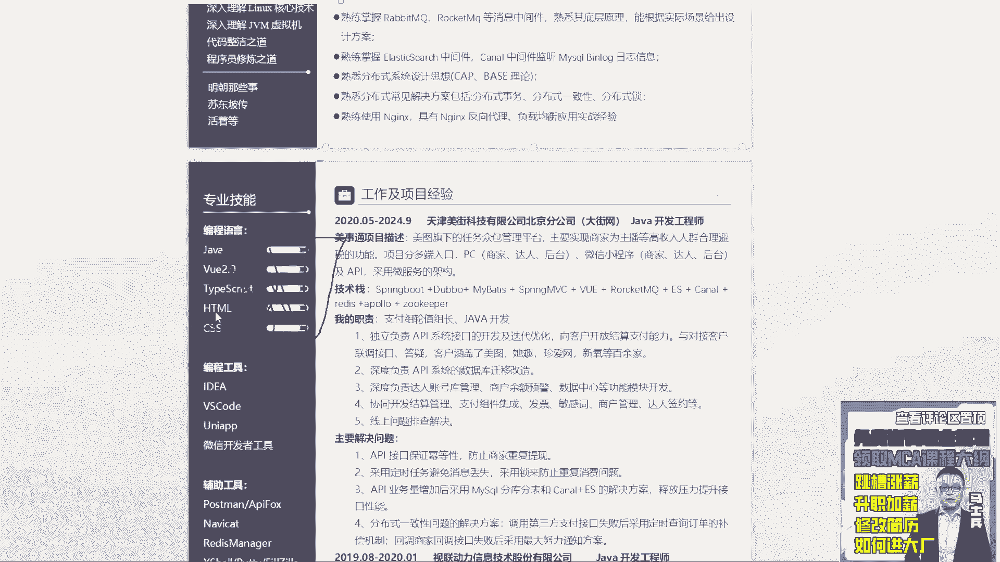
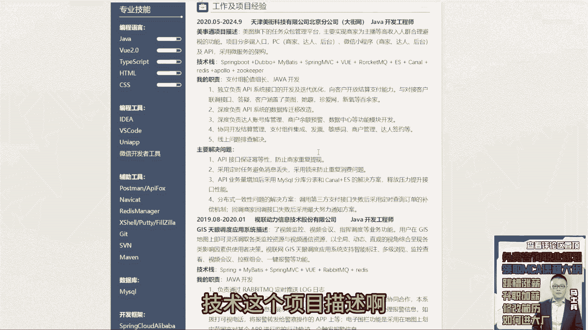
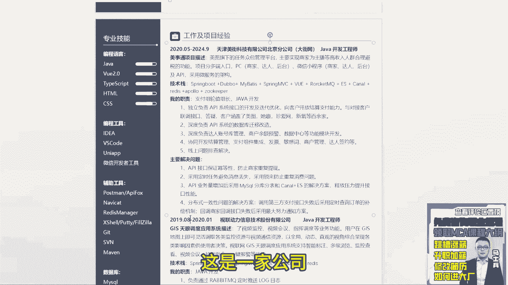
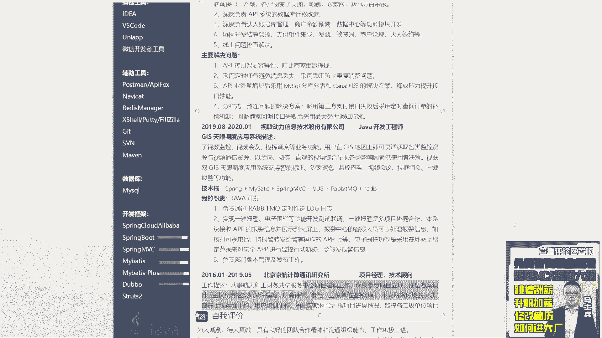

# P5：5.【程序员简历指导】30岁8年工作经验，曾获全国大学生机器人大赛三等奖 - 计算机底层原理 - BV1ZnDsYAE7D

来我们看下一个啊叉叉正太在吗，这话来扣个一来，哎直接同学嗯。

先说第一点啊，呃你现在是有工作经验的同学好吧。

你不是大学生，所以我建议你在简历在进行排版的时候，不要左右排版，这种左右排版的方式看起来不是很舒服，不是很舒服，所以把你这种左右排版的方式给改掉好吧。

这是第一个呃，第二个呃，这些兴趣爱好干掉没用，他对于你找工作而言没有任何意义好吧，呃阅读书籍跟技术相关的。

可以写，跟技术无关的，不要写了，也是没有价值的好吧，然后专业技能你告诉我这个这个进度是多少。

Zz，你告诉我你现在是80%，还是90%还是70%，你告诉我VEE，你是90%还是多少，你写这玩意干啥，你说你画个进度条，你也不告诉我进度条是干啥的，干掉干掉没没用好吧，不要不要不要不要。

一点意义都没有好吧。

编程工具没用，辅助工具没用，就是你有没有发现一件事，你这块的专业技能和你上面写的这个东西。

它是不是重复的。

是的吧，而且你这块写的很详细的，那下面这块没必要写了，意义不大，所以把这块东西全部干掉啊，特别这种小图标不知道都不知道干嘛的。

没必要写好吧，然后再写再看交易背景，没问题呃。

经验相关基础相关，分布式架构相关这块我给个建议，把这些经验相关的东西放一放一边，把这些把这块内容这块内容变成一个模块，叫个人评价，啊或者叫个人优势，不要跟你的技术真写到一块技能模块。

就是专门来罗列技能的，罗列技能的好吧，然后在罗列技能的时候，我也不建议大家把这个基础呢做一个区分。

什么基础相关，分布式架构相关，没必要就所有的技术站挨个罗列就行了。

像你这写这些东西都没问题好吧，这是java的，这是J，这是并发编程的，JVM的框架的，MYSQL的，像这个VEE就不写了好吧，你这技能站已经很多了，没有用的东西没必要写，其他东西没必要写好吧。

然是设计模式的，然后这是为了计算机操作机机组，这是计算机相关知识的IO的没问题。

加密算法的微服务的REDIS的中间件的es的分布式，这个理论的cp base的，然后分布式解决方案的ANGX的没问题。

技能代写的没问题好吧，把这个前端东西给干掉，然后调整一下这个编写的顺序好吧，java然后呢JVM并发编程框架，微服务分布式MYSQLREDISMQ好吧，以及其他一些额额额外技术站。

好想详细写一下这技术站啊。

写的很丰满啊，宽度上面来说绝对够了，OK下面来看你的技术及这个项目描述啊。

哎呃下面这块我我我再给个建议啊，CZ把你的公司名称，就是公司的工作经历和你这个项目分开，把所有的单独的工作经历写到一块，比如这是一家公司，这是一家公司对吧。

这两家公司嘛，这三家公司把这三家公司公司名称起，那个时间职位写到一起就行了。

不要跟项目合到一块好吧，然后项目写的时候，这是一个美式通，美式通，这是美团下面的众包管理平台，主要实现避税的主播，高收入中些避税的功能，然后你像你这个做这样的平台的话，你可以把你的数据量。

订单量这些东西可以详细写一下吧对吧，然后职责开发叠项目迭代，然后呢数字与迁移改造模什么模块开发。

然后这个模块的开发，现在功能排查，还是那句话，这东西啊，这几个东西写的都是比较虚的东西，这些虚的东西啊尽额可以写，但不要全部都是这样内容，然后还是那句话，把职责和主要解决问题，把两个东西合并到一块。

第一个是实现分布式密导，第二个呢是实现定时任务消息丢失，防止重复消费，第三个分库分表好吧，解决数据库的一个业绩查询问题，第三个是分布式一致性问题，这几个点没问题，这几个点是可以写的。

就类似于这样的业务点，可以尽量多写几个，可以尽量多写几个啊，这样多写几个，然后呢把它合并到你对应的职责里面去，职责里面去好吧，像这种线下任务排查，这东西别不要写了啊。

没意义，OK第二项目呃，这是一个了视频监控等功能，这什么意思啊，是不是删点东西啊，这是不是删删错东西了，做了监控，然后做做一些这样的工作，然后这是基础框架，下面负责rob rob mq。

然后定时任务推送log1键报警，这个写就太简单了好吧，这个ZZ下面这个更简单就大，还还是那个问题啊，同学们一定记住，你既然写了，既然写这个项目了，不管面试官问不问，最好能把这个简历面或这个项目里面。

涉及到的核心点尽量详细写一下，详细写一下，我给你看一个啊，展示这么多，我给你看一个啊，点错了嗯，哪去了。

就我们抛开内容不说啊。

这样的排版的格式和这样的东西，大家感受下哪个看起来更舒服，抛开内容不是不是不是项目里面写什么东西，咱们咱先不聊。

就这样的方式和这样这样的东西写到一块，你们感觉哪个格式更舒服一些。

懂这意思吗，就是你写的时候也要防着这样东西去写，而且里面里面要把各个模块尽可能的多，展示一些具体的业务功能的实现，业务功能实现。

让别人能够根据这些业务点去进行一些提问，还是那句话，重点是吸引面试官注意力。

没啥写的，没啥写的，就编没啥写的，就编，因为你现在刚刚说了吗。

这几年6年的经验，6年经验，你写的这三个项目，你觉得能撑得起来吗，能撑起来吗，撑不起来了，撑不起来的，所以所以这东西你得好好改改，就最起码你简历里面要写两个可以聊的项目啊，第三个项目也好。

第四个项目也好，你可以简单写啊，甚至省略也写都没关系，但是最起码说我看完你的东西之后，我觉得你的工作经验很丰富对吧，解决问题能力很厉害，我们得有这样的展示才行。

所以好好改一下好吧，最下面这个自我评价也不说了啊，这个这个写的很很普通了。

没啥可聊的，OK这还带个java图标。

没用啊，没用是吧，行这是同学啊。