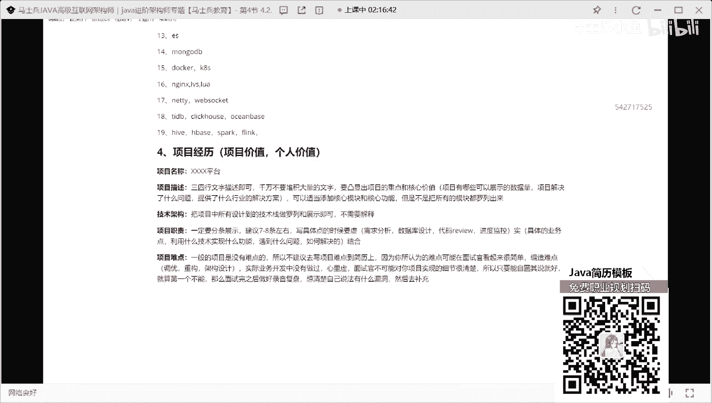
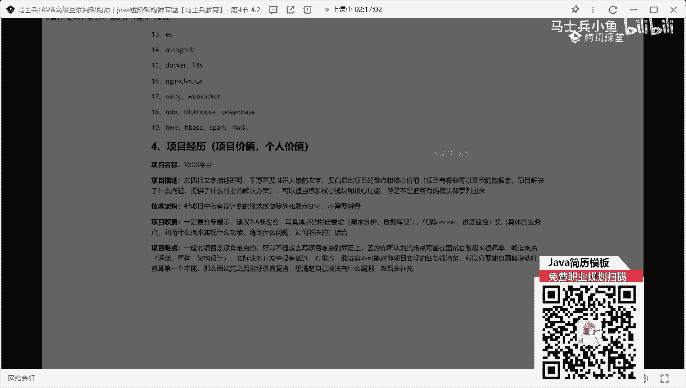
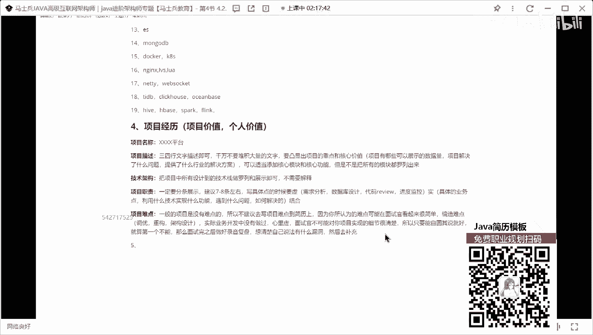

# P5：程序员简历指导：项目经历怎么写？ - 马士兵小鱼 - BV1oP411Q73J

那除了技术描述之外，第四块表要写什么东西，写项目，心理上面这块你们是也也也不太会写，也不太会写，下面这块怎么写啊，其实项目的时候写的也非常简单，其实可以分几个模块来进行描述，第一个就一定要记住啊。

你写项目是为了凸显什么东西，第一个是为了突出你的项目的价值，第二个是为了推荐什么，你个人价值，这两个东西都好凸显出来好吧，那么第一个在项目数的时候，它也要包含具体的模块，就第一个项目名称。

很多同学可能不太在意项目名称，这东西可能不太不太在意项名称，东西在项目这种很重要很重要，就能写一个什么什么管理系统，系统就是我在没看到你的简历之前，就看到你的简历名称之后。

我第一下就觉得你的项目没啥可写了，比如说你你你你你一个下午就oa怎么写，换个描述吗，无纸化办公平台不这样写，你懂我意思吗，就是你在写的时候不要再加什么系统，什么东西了，叫叉叉叉叉叉好吧。

那下一个平台还有这样的描述好吧，刘老师，我项目确实是个技术，确实是个系统，系统和改成平台，懂吗啊，这东西很重要好吧，这第一个项目名称要做一个描述，项目名称完了之后，第二个什么叫项目描述。

像描述这块记记住啊，同学们一定要记住一些点什么东西，就是三四行文字描述即可，千万不要堆积大量的，文字因为人啊，人的眼睛啊，对于文字和大量的文字特别挤在一起的文字，是有视觉疲劳的。

他没办法从这么多文字里面，一眼看到我们的重心所在，明白吗，所以这块要写什么东西，就我刚说的不要写文字，三四行，简单描述一下好吧，要凸显出，项目的重点和核心价值，这东西问老师，什么叫项目的重点。

什么叫核心价值，你能说的通俗一点，就举个例子诶，很简单的例子非常简单，这块这块可以怎么写好吧，写什么项目，有哪些可以展示的数据量，这些数据量的量词，你是一定要想办法把它展示出来的。

因为这东西能拉高你整个项目的逼格，但也不是老师，我项目很low啊，一共上千条数据，我怎么办，你可以上千条好吧，如果你的业务正好是to c的，可能比较low，虽然虽然比较low，一点也是to c的。

你能不能把对应的数据量乘以一个倍数，乘以十倍，行不行，乘以100倍行不行，谁知道你项目到底多少啊，你谁知道谁也不知道，我问一个问题，你们做一个项目做了三个月，六个月，半年1年。

你能保证你对项目里面的每一个细节，都很清楚吗，同学们，你能保证吗，能保证，啊不能吧，那你告诉我，作为一个面试官，他都没做过你的项目，他怎么可能知道你项目中的实际数量是多少，他能知道是什么，根据你的表述。

在他自己的技术认知和行业经验上面，去做一个判断好吧，这个东西到底是否合理，明白了吗，到底是否合理，你只要说的很合理，基本上没有问，基本基本就没问题，懂我意思吧，还能写什么东西项目，解决了什么问题。

提供了什么行业的解决方案，对不对，如果实在还是没啥写，可以适当添加核心模块和核心功能，但是不是把所有的模块，都罗列出来，把所有模块都读列出来，这是有问题的，明白了吗，所以两行多三行，简单写一写就ok了。

好吧数据量能写一点，写这块还好好吧，那下一个叫什么叫技术架构，什么叫技术架构，什么技术架构，把项目中，所有涉及道德技术站做罗列和展示即可，不需要解释，听明白了吗，你不要去解释哇，接着啥你不要说啊。

release做缓存是吧，热热热rom q做中间件，不要接着这东西就把单词一个一个用逗号也好，用逗号也好，把它分割开啊，用加号也行，把它分割开，把它改成金属就完事了，这么简单啊，重心按捺在于项目，职责。

项目职责怎么写，项目这段有要求，一定要分条展示，我建议7~8条，左右明白了吗，建议7~8条左右好，不要写少了，那么这块是吧，写具体点的时候要虚实结合，什么叫虚实结合。

所谓的虚就是大家都会写的什么需求分析对吧，什么数据库设计，什么代码review对吧，什么兼项目进度监控这些东西哇，你可以写一些虚的，那实际是什么，具体的业务点明白吗，具体业务点这句话怎么写。

利用什么技术是实现什么功能，遇到什么，问题如何解决的都可以写，能懂我意思吗，必须按照这个方式去写，整把它整丰满了好吧，你要展示出来这个项目也是别人，你就不行了啊。

你在做项目的时候一定有这样一些比较难的点，如果业务比较复杂的话，可以把业务一些比较复杂的点，也可以把它展示出来好吧，基本上项目写着四个模块基本上就够了啊，当然还有一些同学喜欢干一件事。

在stem上面的加一些东西的项目难点，有多少人喜欢写项目难点，有吧有很多人愿写这个东西吧，给大家一个建议，来个建议好吧，什么建议呢，一般的项目是没有，难点的听完了，所以不建议去写项目。

难点到简历上明白吗，因为你所认为的难点，可能在面试官看起来很简单，明白了吗，好吧，当然这个问题啊，面试的时候先秦真说的，每次面试方面项目的练的时候，不知道怎么回答了，你说和你写出来效果是不一样的。

你写出来之后，面试官一看就这啊，好在你说的时候，你表示无法变成话题的，原来是这样，这就是你一些难点好，但是你写出来之后，给他的印象和感官是不一样的，你通过嘴表述和通过它文字展示出来的东西。

完全不是一个东西，明白了吗，所以这块我建议大家你去准备难点啊，但是不要写到简历上面去，不要写到你的项目里面去啊，如果说记住了，如果说你要去准备难点，记住没有，怎么办啊，编造哪里让大家从哪些维度去编造呢。

非常简单，第一个调优的东西，班级业务里面的gtm调优耐特调优说一下好吧，第二个同构比之前单体项目，现在我要重构成微服务，怎么做价格升级升级对吧，第三个在重过程中我做哪些架构设计。

我在做技术选型的时候是如何去评定的，明白了吗，这就是你要瞄准的方向，你可以照着这几个方向就行了，但是有人就会有一个疑问，苏老师，你说这个方向我理解，实际业务开发中没有做过啊，心里虚怎么办。

记住我刚刚说的那句话，面试官不可能对你项目实现的细节很清楚，所以只要能自圆其说就好，就算第一次不能，那么要准备，那么面试完之后做好复盘好吧，想办法想清楚自己的说法有什么漏洞，然后，去补充，那我没办法了。

你不会，你不会撒谎，那我咋办，我也替不了你啊，那你就大胆告诉他，面试官，我们这项目的很low啊，然后呢，我们那个呃没办法，我确实没啥难点，我也我也我诚实说，我确实没啥难点，病了怎么办，懂我意思吧。

就是你自己心里面过不了这道坎，你就觉得不行，我就要到实说话怎么样，那我我拦不住你啊，不用算了，不敢拦住你，回答，因为给大家看几篇评论写的啊。

你截截截几个。

你看这个吧，技术框架，第一个项目描述干什么事，第三个工作职责，123456789，看到了吗，就你一定要想办法把你的简历写的丰满一些，好吧，不看了啊，因为我这有的简历啊，都是其他vip同学的。

有些东西不就不那啥了，好吧好，下面这块提高这么多吧，ok读完之后，第五个写什么，半路转账，按照之前相关不相关，多点写成，不要是吧。

如果要写之前的项目经验，也编造成java了。