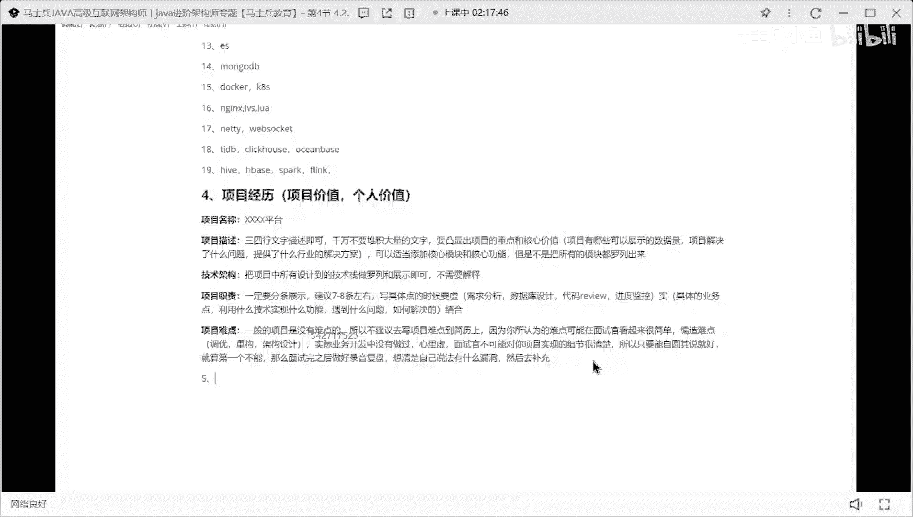
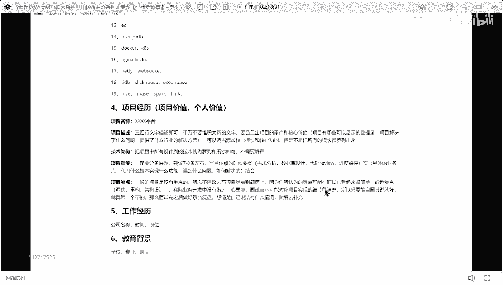
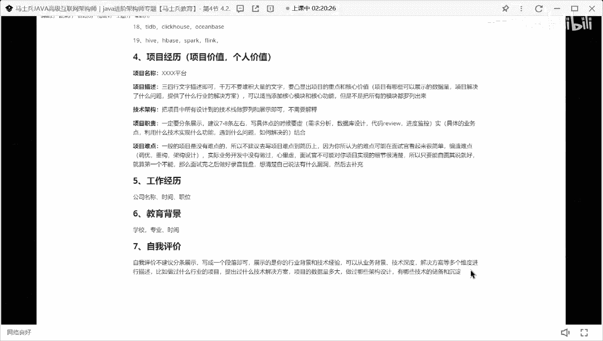
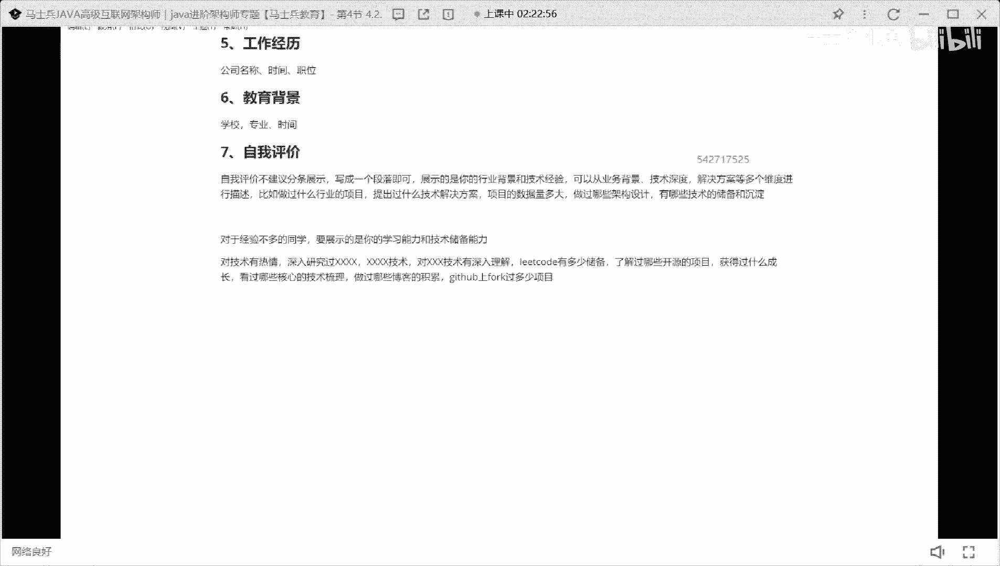
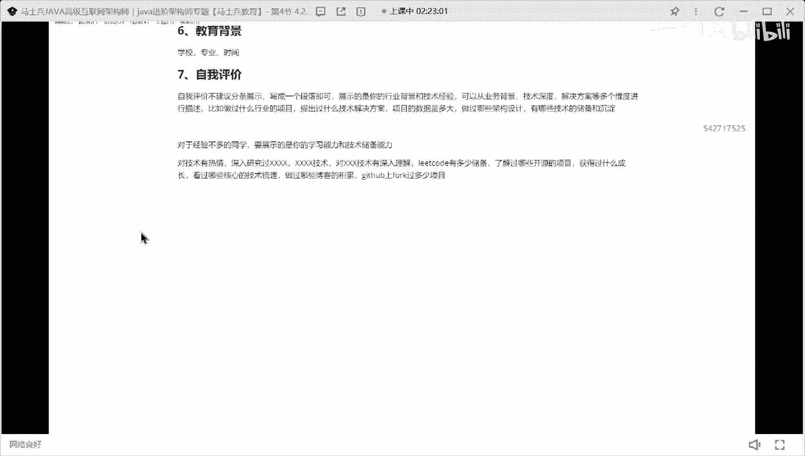

# P6：程序员简历指导：工作经历，教育背景，自我评价怎么写？ - 马士兵小鱼 - BV1oP411Q73J

第五个，教育背景，工作经历，固定，这块我说明一下工作经历，这东西不没必要写的特别复杂，只需要写几个东西，第一个公司名称好吧，第二个叫时间，第三个的职位就行了啊，第六个教育背景一样的学校，专业时间。

搞定ok。

不要写项目都写，不要写项目周期，我不建议大家写项目时间，我都在后面写上，2022023年1月到点1~2023点三，没必要，不要想好吧，第七个叫自我评价，怎么写啥嗯，这是我的评价，不建议分条展示。

写成一个段落即可，好展示的是你的行业背景和技术经验啊，可以从，有背景技术，深度解决方案等多个，维度进行，描述啊，比如做过什么行业的项目，提出过什么技术解决方案项目，这数据量不大，做过哪些，架构，设计。

有哪些技术的储备和沉淀，是这样写的，好吧，把这东西和ok了是吧，当然咱们这儿一定有一些同学是应届毕业生了。

我问一下，对于没有工作经验的同学，这这这这怎么写，没有工作经验，东西能写吗，老板洗啥要做些啥，肯定可以写，没有工作经验，没有实机，你怎么办，热爱加班，不要大小了，对于经验多多的同学。

要展示的是你的学习能力，主要技术储备能力好吧，所以这块呢怎么办，比如说对技术有热情，怎么有热情呢，深入研究过32加h2 技术哇，对什么技术有深入理解对吧，你的code有多少储备对吧，做过哪些，了解过。

哪些开源的，项目好吧，获得过，什么成长对不对，然后呢看过哪些核心的技术，初级做过哪些博客的积累，行不行，第3号上four和过多少，项目这都可以写吗，明白吗，就是你的学习能力好吧，展示你的学习能力。

学习态度就ok了，不是应不是应届生的话，还要展，还是要展示你工作相关的东西，如果你不是应届生，还是要展示你工作相关的东西，你把你工作相关的东西展示出来好吧。

ok这是一个简历里面要描写的东西啊。

参照这个方式去把你的简历好好去润色好。