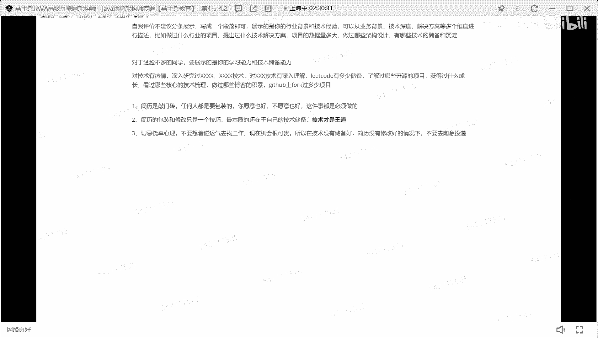
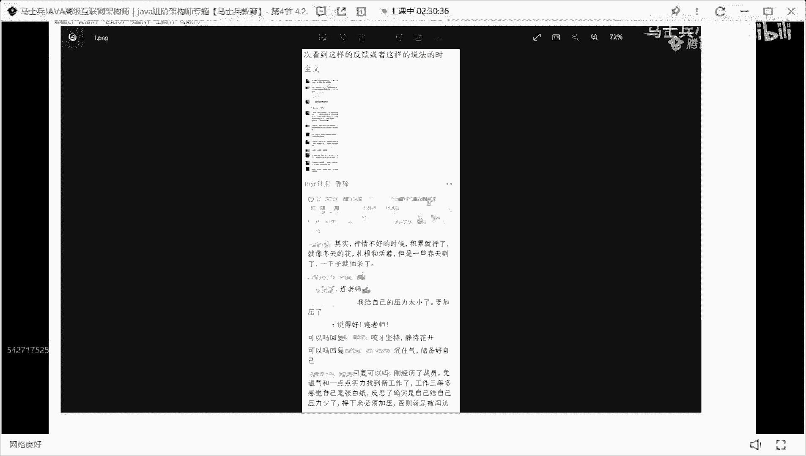
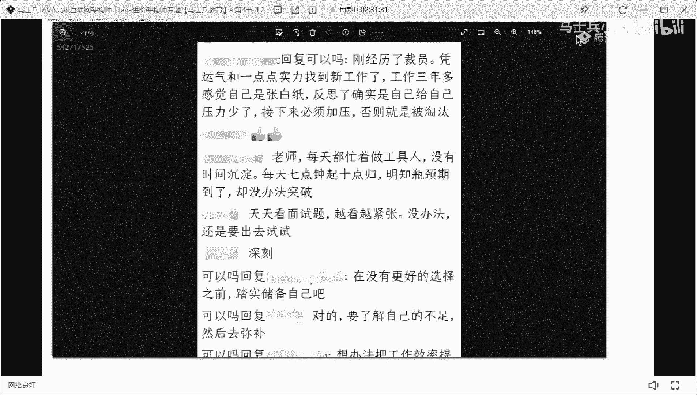
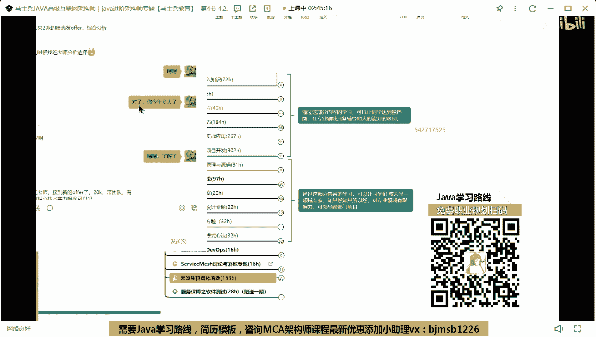
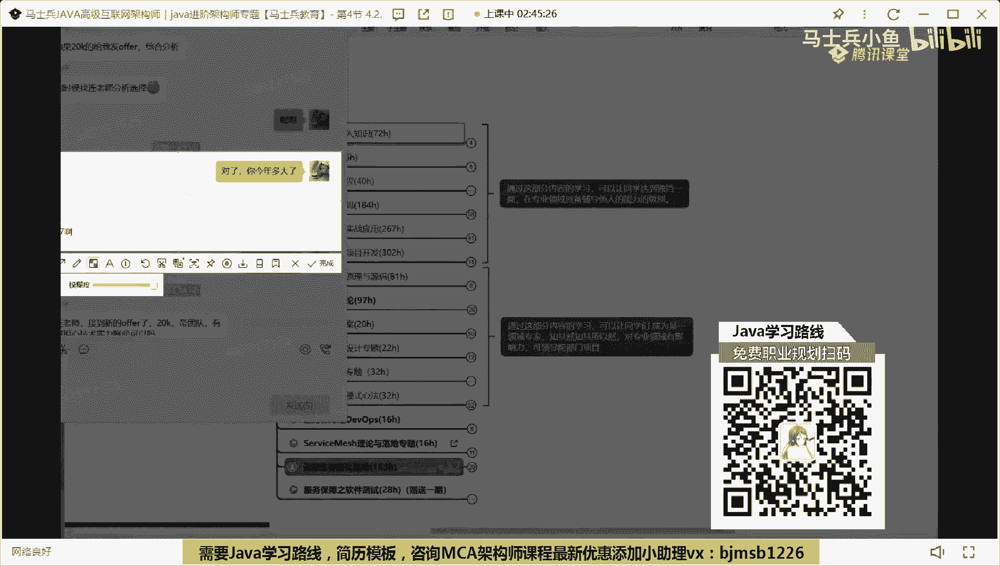
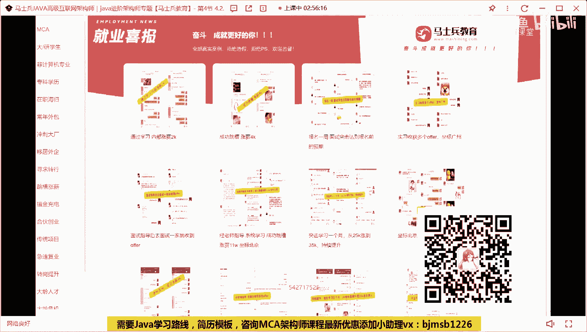

# P7：程序员简历指导：认知篇（写好自己的简历有多重要？） - 马士兵小鱼 - BV1oP411Q73J

后来建到现在了，咋样有收获没有说话的，扣个一呗，你说话吗，这最后给大家普及一些认知好吧，这很重要好吧，听好了，他们有很多同学啊不太愿意包装经理，我有些同学啊，老师我不太内心里面过不去这个坎儿。

我不太想去包装我的经验和包装我的简历是吧，这就是我说这句话，简历是三分钟，任何人都是要包装的，你愿意也好，不愿意也好，这件事都是必须做的，你不要格格老师，我实在我就按照真实情况去写。

你要按照真实情况去学，我告诉你1000000%没有机会明白了吗，项目这些几何是没有个数要求，三个码，三个左右，130左右，ok，啊这第一件事，第一点大家需要注意的，第二点简历的包装，和修改啊。

只是一个技巧，明白吗，最本质的还在于自己的技术储备，所以还是那句话说，技术才是王道，这个这个我刚才写的结晶，就这样，我给了你这个东西，有几个人敢这么写，我这么写就行了，敢这么写行吗，我写出来模板。

你们很多都不敢写，你懂我意思吗，就是你如果你觉得你这样去描述你的技能，描述你的项目的话，你会不会有面试机会，一定会有，但有多少人敢这么写吗，不敢，所以当你真正的具备这样的技术自信。

和这样的技术底气的时候，你就这么写，当你不具备的时候，管子先苟着，先苟着，明白意思吧，所以一定要这样好吧，还有一点，第三点，切忌侥幸心理啊，这侥幸心理什么叫侥幸心理啊，不要想着碰运气去找工作。

能懂我意思吗是吧，现在机会很可贵，所以在技术没有储备好，简历没有修改好的情况下，不要去随意，投币懂我意思吗，往这儿一定要注意了，一定要注意了，别去浪费这个机会，别浪费这个机会啊，这个机会很麻烦。

q p s编辑来怎么翻译比较合理，这个东西啊，主要看你的项目，你的项目是业务是to b的还是to c的，to c的话才会有q p s t p s相关的东西，to b的话就没有了，明白吗。

你的项目背景能不能扯q p s，能不能扯t p s，这都很重要，好吧，我们有一套科学的计算方式，设计的方式告诉你设计多少东西是合理的，行吧好了，这是想给大家所表述和阐述的东西吧，啊就是说破天呢。

还是那句话呃，任何时候呃，这东西才是最本质的，所以呢希望大家每一个小伙伴好吧，详细的去了解一下你的技术储备，当然了，我之前在上咱们的面试突击班的时候，也给大家做过一些面试前的心理辅导。

我把那个画截出来给大家看一下好吧，这个之前我在讲我写的这个东一半的内容好吧，这块有一个心态方面的东西，我这给大家说明一下啊，这东西成功的时候有些心态你需要了解好吧，第一个面试前一定要调整好心态。

不管你会点东西干就完了，出去面试就给心态，老子天下第一，自己超过超常发挥，明白意思吗，就很多同学呢出去面试时候感觉虚，当你准备去面试那一刻开始，不管你多虚，内心里面都给我，把这个底气给我升起来，明白吗。

要不然的话你很麻烦啊，这个点第二点得失心不要太重，全中国企业有很多好公司，有很多没必要在一棵树上吊死，你可以有新的公司留到最后，等你准备充分了再去面试哦，但是不要觉得说因为一家公司患得患失，大可不必。

大可不必好吧，第三个，找工作永远不可能准备好，很多同学怂，心态不好，不敢去面试，我要准备按照你的技术储备，先尝试一些公司好吧，面试过来之后做好总结，做好准备，不断复盘总结，开场三个成长啊。

这是他先跟大家说的一些，掌握了心态方面的东西，因为现在很多人其实心态是很焦虑的，心态是很恐慌的，所以我希望大家还是把心态调整好，因为你只有把心态调整好了之后，你才能够在面试的时候。

发挥出你自己正常的一个水平，正常的一个水平，这点很重要，ok大家现在对于这个这个简单，我们就聊就聊这么多了好吧，应届毕业生技术不够，现专业技术没有实际的开发经验的项目，就能找工作吗。

能因为你在学习的过程中，不单单是学技术，也会学项目，和睦同学听明白了吗，就你不单是学技术，你要学项目，我还是那句话叫技术服务项目项目加持的技术，懂我意思吧好吧，spring考核自学一遍吧，为了应付面试。

但平时项目都没有我昨天的包装，想办法把你的单体项目拆分成微服务项目，这里必须要做的一要素拆分啊，上分工作五个月，其中其他工作2年以上，这个五个月是写一面写，要写要写最近一份工作五个月，这是必须要写的。

因为不写的话，你的社保记录很难过得去啊，所以这是要写的，看，这样啊我希望能给大家再说一个新变量的事啊，大家觉得就有多少同学对这个行业，报一个悲观心态，给老师扣个一，就现在心里很焦虑。

对这个行业抱悲观心态，同学在这扣一，下面我想说一说一些话，我希望大家能把这个画呢记到心里面去，嗯我知道呢最近很多同学找工作不太顺利，或者说面试不太顺利，我压根就没有面试机会，有这样一个心态呃。

我也收到过很多同学类似于这样的一个反馈啊，类似这样的反馈，所以在那天有一天晚上呢，我发了个朋友圈啊，朋友圈内容的有有很多，我等一下就我发了一个诶草，这怎么看，就我自己发不出，内容很多。

不带大家看了好不带大家看了，然后这个我这个微信号上面，基本上都是我们的vip同学，我想给大家看的是什么，是我们的vip同学，对于现在的行情所持有的心态是什么样子的。

我希望他们这些回复能给到你一些单位。

或者一些建议，这是我当时发的朋友圈，这是很多同学说的话啊，他说其实行情不好的时候，积累就成了就像冬天的花扎根和活着，但是一旦春天来了一下头条了对吧，还有同学说我给零压力，四压太小了，要加压了。

然后说说得好的老师好吧，然后说了，刚接了一次裁员，凭运气和一点实际找不到新工作，工作3年多了，感觉自己身上白纸反思了，确实自己给自己压力少了，必须加呀，否则就会被淘汰，后来还有很多同学的平板老师。

每天晚上做工具，人没有时间沉淀，每天七点起，十点亏，明知纯电期到了，没办法突破，天天看面试题，约翰一节，没办法，还是个数据面试啊，在没有，我跟我跟他说了，我说在没有更好的选择之前，他是处于自己。

我就来自己的不足反思复习没我好吧，想办法把效率提升起来，把零散时间学习，可以说到打铁还得自身硬啊，继续修炼内功，就还是那小朋友们现在行情差不差，差确实差。

这东西不用我说，大家每个人都有自己的心理感受和支持，自己最真实的一个体会，但是对于这种差行情，你要想的是什么，你要跟很多人一样一起去抱怨行情吗，你要跟很多人一样一起去想着，这个行业怎么怎么样了呢。

不要这样，因为你在短期之内你是不会不会去转行的，听明白了吗，你是不会去转行的，所以说破天你现在还是要坚持做开发这件事情，那你所瞄准的矛头是什么，就是如何去突破现在的困境，怎么突破，非常简单。

你看看你现在的技术储备，和现在市面上在招人的公司，他们的要求到底差在哪了，你是否知道自己的差距，当你知道自己的差距之后，去做了对应的弥补和提升之后，你就可以去成功，你就可以找到工作。

这个市场上面并不是不并不是说我不缺人了，很多公司在招人，只不过那个人不是你而已，包括我那天发了朋友圈之后，有很多人也也也，我本来联网是自己发着玩的好吧，咱们有很多资源老师也转发了我的朋友圈。

然后呢有很多人在底下说了这样一说了，这样一句话，我也可以截截给大家看好吧，他说这个百里挑人是是你，这是什么虎狼之词，他们是这样说，网络上一直在制造焦虑，这些行业是产生资本最高的行业，不存在什么不行。

如果说这个行业不行，也就完蛋了，还有说天天加班，人加班就是缺一缺人，分别一个人干不完，他就是不招，非让一个人干，当黑工干几个活，那样肯定不招人了，招人少，老师都在，老板都在，不想多花钱。

资本压迫才是本质所在，就是我看到这些东西的时候，甚至还有同学发一些更更好玩的，看这个好pv，他说我发的东西是pv，他说现在没做，现在大家找工作都难，但是企业呢有招聘的时候，同样很难免些大的剪投币。

真正适合简历万里挑一，现在企业并不是缺人，缺的是真正有能力的人，但绝大部分同学太浮躁了，只是疫情一些追求高工资，却忽略了自身能力的提高，就我希望大家把这些话听到心里面去，这东西不叫pv。

我pv你没有意义，你也不会给钱，你也不会给我干，干什么事，我是想法是什么，但我们都知道难好吧，就他这个东西已经是一个现状了，对这种行情难也好，什么东西啊，你能改吗，谁能告诉我，你能改变行情，给我扣个一。

有人改变行情吗，改变不了咱们谁也改变不了，对于咱们谁也改变不了的事情，好吧，干什么事，我之前说过，把时间，和精力放在你能改变的事情上，什么叫你能改变的事情上，你的技术，你的能力，这是你能改变的。

那天上课我们聊了一件事，叫小时数，我问一个问题，同学们，大家觉得学多少小时数，可以保证我在这个行业里面找一份工作，学多少小时数可以保证你在行业找工作，啊就多少300是你投入学习的时间。

就是你投入学习的时间，你们每个人冷静的分析一下，你在搞技术这件事情上面，你到底投入了几个小时，你抽了多长时间，你扪心自问，你真正有意义的学习时间到底有多少，你真的好好想想，当你找不到工作的时候。

你反思一下我有没有学到足够的金属，我有没有取到足够的能力，当你的能力满足不了工资需求的时候，你找不到工作的时候，你去抱怨市场，你不觉得他有问题吗，最关键的是，你的抱怨带来不了任何积极的影响和。

积极的效果，充分让你越来越颓废，越来越难受，我之前举个例子，比如说我有多少人听过我讲源码课，给老师扣个一，我之前讲过源码课，有多少人听过，给我扣个一，人听过吗，这两个人听过，很多人一直好奇。

老师你是雅马克，你花多长时间准备的，或者你花了多长时间，你学spring源码的，我之前给大家举个例子，我说源码的时候，我在vip课里面，我讲了70个小时，对吧，我老师讲课是要备课的，对不对好。

那么我备课我乘以一个四倍的时间，不过分吧，比如说我花了280小时时间去备课，我自己想把这东西了解清楚，理解透了，我再乘以个四倍时间，不过分吧，1120 1120小时，我问一下，你拿出这个时间了吗。

如果你没有拿出这个时间，凭什么你觉得你可以把源码搞错，凭什么你觉得可以把原文写好，不讲理了，都不讲道理了吗，你懂我意思吗，所以还是那句话中的，我们现在难不难，难好吧，越难的时候越要沉住气，咬牙坚持啊。

又要想办法，我如何去突破困局，而不是跟很多人一样发牢骚，行业不行了，我要转行了，你告诉我转哪去转够云先生转啥，转发数据，你告诉我哪个行业不卷哪个行业找工作很轻松，你告诉我，你给我说说，我也去。

没有这样的行业，商品少儿编是兴趣类的，明白吗，你是没办法通过少儿编程你去变现的，你怎么赚钱啊，当老师当少儿编程老师前，中国在12变成没有那么危险的，明白意思吗，所以想明白现在自己该做的事情到底是啥啊。

把该要做到该处的东西，你给我储备好，该学作业都学好了，你再去报案，你说老师我现在真的很牛逼了好吧，我比你们把视频教育的每一个老师都牛逼了，我现在依然找不到工作，你过来告诉我，报警行行。

我认当你的技术td真的那个扎扎实的时候，你说老师现在行情不好，我并不认可你说这句话，我觉得你在无病呻吟，明白吗，所以关键是这种负面情绪会影响很多很多人，所以我希望大家每一个人正向起来，是能够积极起来。

是能够朝着正向发展去看，因为别人都告诉你说劝你要转行，有没有人告诉你说，你转到什么行业能收获高薪啊，谁也给不出这样的方案，所以你现在在做的事情，就是你最应该做的事情，踏踏实实的把你该做事情做好就很简单。

那我今天讲课的这些例子来说，就这些技术，你说你不知道，你知道吧，有几个人花时间真正的琢磨过和研究过，你自己不去花时间，花精力研究和琢磨这玩意儿，你想拿高薪，你想找到工作凭什么呀，虽然赵少说那句话。

你是不是对账号这个行业太不尊重了，这个行业给了你那么高的薪水，你反而不投入学习，你就可以拿那么高的薪水，凭什么这个这属于不劳而获，他没道理，你懂吗，所以所有的回报都是你付出的结果，你得先付出。

你在没付出之前，因为你没付出，所以没有结果，所以做好，你骂你，你骂市场不有问题吗，就你喜欢姑娘连追都不追，你告诉我，你告诉我，我姑娘真他妈傻，我这么好的人都看不上你干啥了，人都看上你啊，同样道理啊。

所以这些话就说这么多吧，我言尽于此，每个人都想明白自己应该做的事情，完了那句话以后好吧，找工作可能会变得越来越难好吧，但是这个行业里面依然会有很多的高薪是吧，但是你要想办法确定的事情是什么。

那个高薪的人到底是不是你啊，这个东西现在行业所带来这种动荡也好，这种行情差也好，说白了他在进行行业洗牌，因为太多的人进入这个行业了，太多的人良莠不齐的，太多的人摸鱼滥竽充数了，这样洗一下也挺好。

写完之后就会把真正适合这个行业里面的人，留下来，而不适合的人淘汰掉，特别是有很多不学习的，有很多年龄稍微大一点的，有很多混圈的，这样的人可能都会被淘汰掉，所以有些同学希望你们能抓紧时间来，学起来了是吧。

至于你怎么学，你自己选择方式，你可以自学，也可以选择把生命教育的方式，你觉得选择你自己最适合的方式就行了好吧，但是自学有什么猎手，我这不强调了，你自己选择，我还是希望能找到一个最高效最有效的方式。

大家来学习，来抓紧时间沉淀储备，完成你自己的这种技术上的这种跃迁，这才是你最应该做好吧，行了聊这么多吧好吧，非科班简单写一样啊，这个大家也一样啊，可把你你如果是非科班出身，意味着你的专业更差一点。

所以这个时候就越要展示你技术的优势，和你项目的优势，好吧好吧，我今天晚上也聊了很多了，也说了很多东西了好吧，然后设计员们都催我了，没打广告好吧，简单跟大家说一下，就是马什么教育呢，有一套mc的课程。

我是来帮大家进行这种进阶和提升的，大家如果有需要的话，可以找一下咱们的孙老师呃，这样有一个sm的文件，这个文件呢是我们的大纲，大纲里面呢就是展示我们的vip同学，在马士兵教育入学之后。

它所要进行储备和学习的相关技术点，当然东西啊可能有很多啊，大家呢去详细了解一下呃，我还是那句话，不管你报不报课，我希望你把这个大纲去拿走，因为这个大纲我们老师花费了很多时间精力，去琢磨，去研究。

去探讨啊，这里面我们给每一个具体的技术点标注了时长，并且标注了对应的技术难度，所以有需要这些内容的同学，有需要的找咱们自己老师好吧，有自老师联系方式，直接找他，没有资询老师联系方式，扫一遍。

扫码加一个好吧，大家也不要把它理解为说老师，你们不就提供了一门课吗，真的不是一门课，它提供的是一整个完善的服务体系，一会我来详细跟大家聊好吧，那可完了，下面我要说一下呃。

很多同学觉得三岁份比较难找不到工作，其实我手里有好多，找到工作的同学的成功案例啊，我可以大家做一个最基础的分享好吧，有人想看吗，有人想看吗，就是最近找到工作，同学给他给你们点信心好，给大家看一下。

好吧呃这是一个学生在今周三的时候，这周三说当上了开发经理，加油站，他的状态其实跟你们的状态是非常非常类似的，我可以给大家看一下，我们两个整个沟通交流的过程好吧，这些人找工作也找得很很艰难，真的很艰难。

他说了30 30 33上，老师告诉我说投了200个简历，只有两个面试，还收到这样的回复好吧，小团队给他回复，然后呢，我刚才有个面试录音，我说我要听录音，他说问题是什么样子，说了一堆好吧。

然后最后来了一个结论，结论是什么，我来看，他说我就担心我上一份工作不是互联网的，最后一份开发，我上一份工作可能是互联网的，最后一份开发工作了，后面我就要转行去卖煎饼果子了，我说你抓紧时间储备技术。

然后面试前面试了一家，不至于我说卖什么煎饼果子，然后在后面的某一天，老师们突击班，这是几号星期一的时候，就这周一老师们突击班的效果棒棒的，今天面了一个20k也有意向领导给谈了，带团队好吧，这东西都好了。

我说还卖煎饼果子不，他说副业煎饼果子可以搞搞，我说继续学习补全自己的技术体系好吧，在南京，那就拿着这个这个东西，这个这个这个offer好吧，他今年我们你往下看好吧，老板新项目做教育方向的。

之前做医疗的好吧，往下看，我说要沉淀自己，有信心，大家看好，我说我说你今年多大了。

给他截个图啊，把名字隐藏一下，就截这个就截这块东西，我把这个头像打个码，上面会有名字。

我直接平移过来，他今年37岁了，在南京完了，那要是收到信号，20级的战队有点担心技术实力，我说先入再说，没准没啥问题呢，啊还没开始干，有啥可担心的，37岁真年轻，看不出，朋友们，你要沉住气。

你要有自己的技术储备，你要想办法去获得这些成功，你懂我意思吗，这是你应该做的好吧，看这个4月份的李老师示爱的喜报，那个hr找我聊了33k，给我压到31k乘15星，比我一想少了4万好吧，现在右方向没变。

还是物联网那套钱少一点好吧，但是现在大小周双休什么之类的好吧，感谢老师指导，没有联合马士兵团队，谢老师指导，肯定找到这份工作课程，我几乎都入了个门，后面跟着一起学习，共同进步，社会工作过的看了吗。

就是大家总结的时候找不到工作，再看这个3月份的，刘老师，周老师，你们太强大了好吧，上周我去深圳现场面试一个面试，问了一个多小时，问线程池，jvm release e s mysql rock。

you rock q卡夫卡c a p好吧，按照你们之前讲的技巧搞定了，面试完周末催着走上去，又有新工作，不至于失去事业，感谢你的课程强无敌，李老师，你们讲的太好了，大神果然不一样。

这是人两天记录都有时间看了吗，所以你要想明白你现在缺的到底是啥东西，想明白你现在要补船的技能是啥，所以我说了，我说马士兵教育课给你带来的是什么，不单单是说我最近买一套视频课，你看视频就完了。

不是这种更多是什么呢，是我们底下全程这个配套的服务，每个学生报名之后，我们会学生做这种学习规划，对每一个学生都会做学习的规划，因为咱们现在学生每个人的学历年龄，城市薪资资的什么东西都不一样。

所以不可能有一个统一是非路线，所有人都都统一，不可能，所以我们会给你做路线量身定制这个路线好吧，同样的你在学习过程中有任何疑问，老师给你做答疑对吧，面试前老师给你做剪子，做简历指导是吧，做你去面试的。

给你做录音复盘，有人好奇这个录音复盘吗，咱们我问一下咱们听课的同学，有多少同学做过录音，做个录音复盘，你自己做个录音复盘，给老师扣个一有吗，有没有做过的，没做过的，扣二有吗，你说我对不对。

我给你看我怎么做的好不好，这是最近前两天3月份吧，你去送上一个3月份，我说一下，我们叫叫同学，我一样给你看，人家记录好吧，我给你整个截图好吧，你们总说没有面试机会，你看看他有多少面试机会，好吧。

这是做路线，刚开始是前面是做了，前面是做路线的工，做前面是做做路线的东西都不看了，好吧，做完线之后，面试录音复盘，下面这个东西怎么去做录音复盘的，告诉你哪有问题，怎么求回答，怎么去做表述。

你知道他有多少多少面试吗，刚刚是一个对不对，这是后面给他改简历的过程，这鱼马上穿好吧，当然第一个面试路径复盘两个，三个，四个每一个录音方面都有很多大量的这种回复，对面答疑给他解答，这个面试中问题五个。

这中间老师答疑的过程六个看到了吗，你看你看这东西了吗，就是改良简历的，把你该做的事情做好了，那肯定也不会有面试，肯定不会去面试机会的，懂我的意思吗，所以这些东西都是要做的，就是你要不断的成长自己。

不断迭代自己啊，这是你在需要做的事情，而且你要把自己的能力去展示出来，这样的话你不会重面试机会的，而你们现在所欠缺的其实就是这方面的东西，懂我意思吧，现在笔试多不多，这个看公司，有的公司要求笔试。

有的公司不是笔试，就看情况，所以我还是那句话，对于现在想换工作的，或者是已经离职了啊，有空窗期的同学，你现在不要去投简历了，你给我踏踏实实地完成自己技术的储备和沉淀，等你把自己的技术储备沉淀好了之后。

再去面试，再去找工作，那个时候你的成功率才会有，而如果你只是盲目的去投简历，我告诉你，你基本上没有啥机会好吧，想明白每天自己应该做什么事，好想要在这个阶段我应该做什么事，把这些东西你都要想明白。

就是这样的话，你才会获得更高的成长，最终成长机会，小伙伴的话完蛋了好吧，嗯行，我觉得别人说多说了吧，应届生怎么办，应届生如果想进入这个行业，永远记住你，首先要保证自己的技术储备。

可以做一个独立的开发工程师，首先你要先想办法覆盖你的技术宽度，当你的技术宽度覆盖好了之后，再想办法去加深你的技术深度，你如果作为应届生，刚看见有很多学生像咱们刚刚看简历，很多学生里面那个简历。

如果你们的简都写成那样，我告诉你，你连面试机会都没有，怎么说，通过不通过面试机会都没有，现在市场上面有大量的人，所以你要想办法在这批人里面脱颖而出，那这里面就涉及到我要怎么去学，明白吗，第一种方式。

你自己学，有多少人在b站看视频一堆吧对吧，今天看点这个，明天看那个，随便看你，你真的思考一下，你看那些东西之后，你学会多少，你掌握了多少，你理解多少，几乎没有好好的，很少啊，你需要做的事情是什么。

跟着咱们好好学，有体系的学成长起来，把你的技术体系真正处理起来，是你自己该做的，你现在有人说老师你们学费太贵了，我花我不舍得花这个钱，我告诉你，你现在是要通过花钱买时间，你可以自学，花2年3年自学。

你这么学完了，我告诉你，黄花菜都凉了，懂我意思吗，我们的课卖成这样，这么多人来买，为什么它有它自己的价值和含量，这么多同学来购买课程，不说别的，把什么叫官网官网官网站里面，有一辆就业喜报。

这是找我们汇报就业喜报的同学，这是进度条，你看看光这些同学有多少人跟着我们学了，你再想想你自己，你差在哪儿了，能懂我意思吗，有的学生学了几万个小时，我学了几千个小时，你想想你才学了多少，能懂我意思吗。

所以人和人之间的差距就这么拉开的，你要想办法在短时间之内弥补别人的差距，你主要耗费什么，就是钱花点钱买课好，要的就是老师，我没钱我就自学，没关系，你自学去对不对，选择你最行之有效的方式来学习好吧。

还是那句话，马士兵教育教育带给你的是什么，课程服务好吧，来保证你在短期之内或者最短时间内，达到你的目标，懂这意思吧，你说这些买课的学生找我们汇报喜讯的学生，他们都是傻子吗，他们学完课之后达不到效果。

他们会找我们汇报喜讯吗，这里面任何一张图你随便可以看，有一堆明白吗，一堆他们他们又不是傻子，涨工资涨2000，内部涨薪，对不对，还有一个学生啊，对忘忘了学生了，那群叫啥来着。

还有学生学生那个机会我要给你们看一下，就那天那个学生跟我说的挺好的，叫叫叫，叫啥来着，这些生，周三的时候说的，今天今早看雷老师的发文，我深有感触，市场上虽然卷的厉害，但是只要有技术。

是能力帮生面试是没有什么问题的，这次面试我投稿有165家公司，大部分因为非统招本科挂掉，其中提交过简历，有20家拿到面试机会的有三家，这三家都到了二面了，而且拿到其中一家的offer。

有一家二面因为学历挂掉了，我觉得是技术能力足够努力的提升，投资自己，提到妈妈面试机会肯定会脱颖而出，本来想入职新公司之后来报喜来报喜的，看到杨老师的发文，忍不住跟老师感慨一下。

我之前的当前现在是17x15，拿到offer是24x13，明白了吗，今晚二期人事查的时候，觉得我得税个税可以谈得更高，听明白了吗，感谢各位老师的支持，感谢刘老师简指导，感谢马师傅教授的课程，看到吗。

不会把什么教育课程涨幅，薪资有40%涨幅，不然我不会有这么大的提升，明白意思吗，就是就是就这这这这这些东西，你你当时告诉我奔着联网源码课来的，看上联想是讲源码课学的知识吊打好多面试官，感谢袁老师。

就这种东西，你说你不学，或者你不想投资金精力投时间进去，他不可能达到，就我讲的源码课，你说老师，你把你每个任课共享出来，凭啥我花了1000多小时琢磨出来的东西，我免费分享给你们，凭啥。

换句话说马上就要理他，这家公司，它不是一家慈善机构，我这有老师哦，生活老师有自己的孩子，妻子他要生活，所以你要理解知识付费这件事情，同样的，你所付出的时间，付出的精力，付出的金钱。

最终都会换成等价的东西，回报给你换的是什么，你心存涨幅，而且不是长期性的涨幅，是短期内实现的涨幅好吧，那后面再长期学系统学。

