# P8：8.【程序员简历指导】四川党员26岁，电子商务专业 - 计算机底层原理 - BV1ZnDsYAE7D

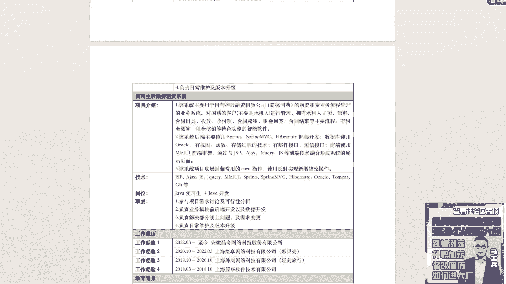

来下一个，呃这段再往下的话来扣一来。

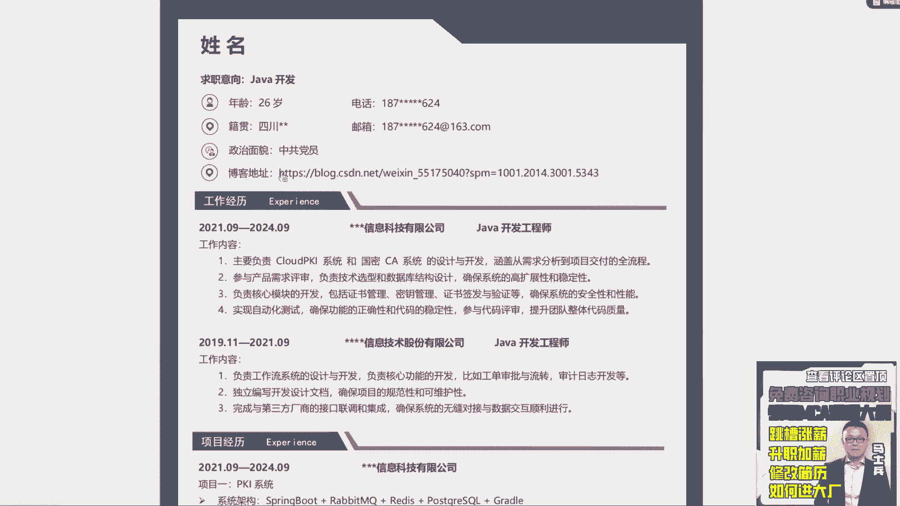

嗯还可以啊。

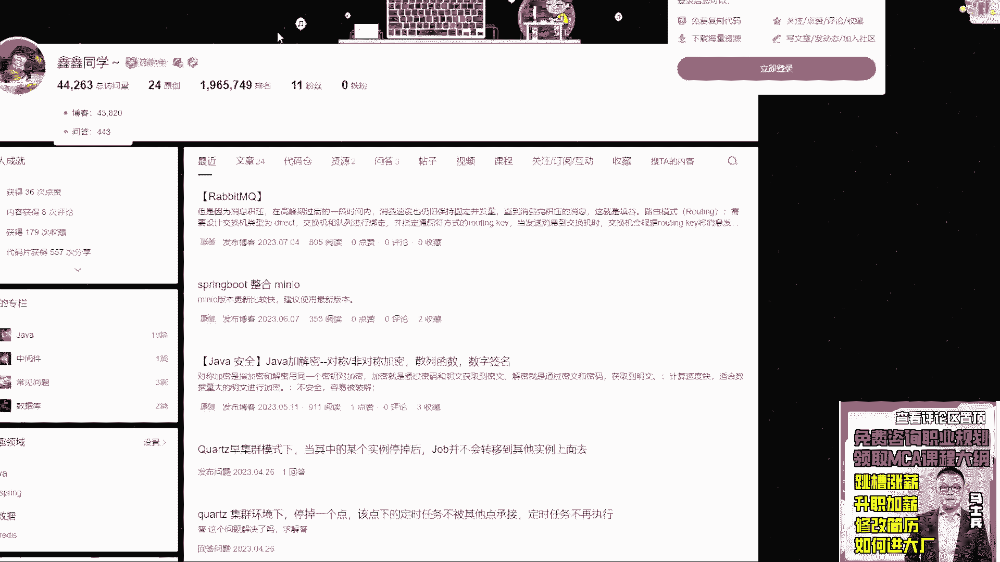

写。

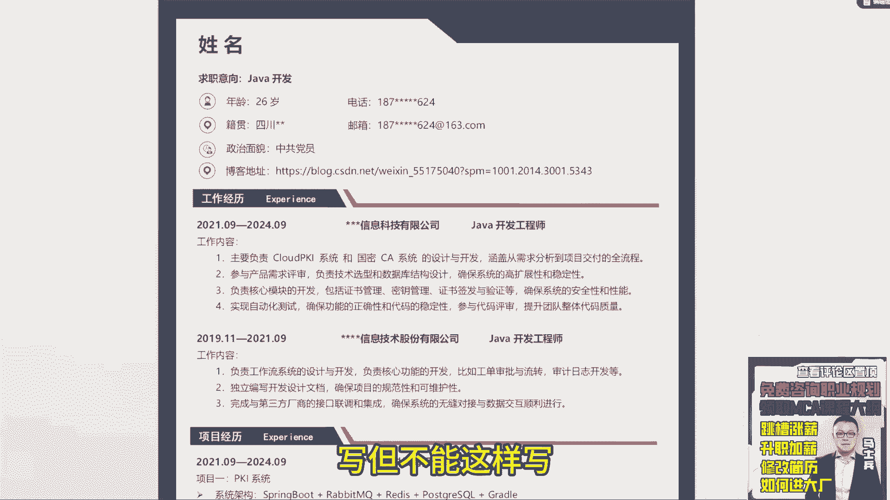

但不能这样写，这样写是没意义的，这个写是没意义的，要写，但但你不能写成这样，你告诉我我怎么感受到你为人诚恳，我怎么感受到你热爱生活，怎么感受到你热爱工作，怎么感受你的团队协作能力，怎么感受你的尽职尽责。

我面试怎么考，你告诉我太虚了，面试的时候聊聊聊这东西，我怎我怎么聊出来，聊不出来的。

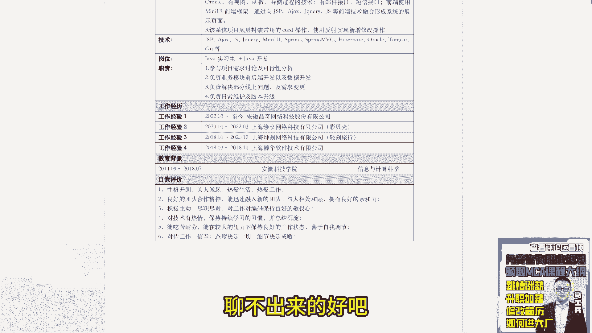

好吧嗯来这同学在吗，在的话来扣一来嗯，来潜水同学听好了，在写技能的时候，在写写写简历的时候啊，把你重点要突出的东西往上放，非核心东西往下放。

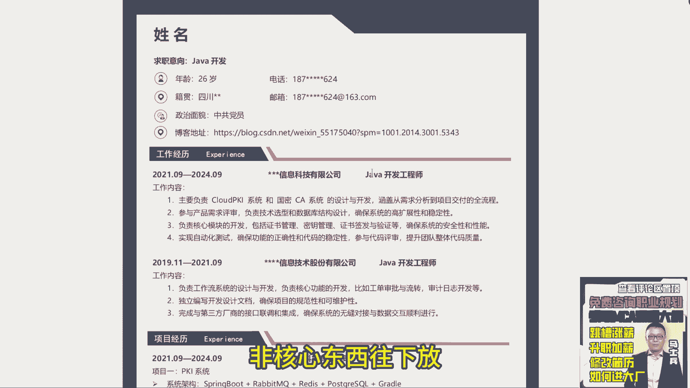

你的工作经历并不是一个很重要的模块，所以可以往下丢，一定要把你的技能描述往上扔。

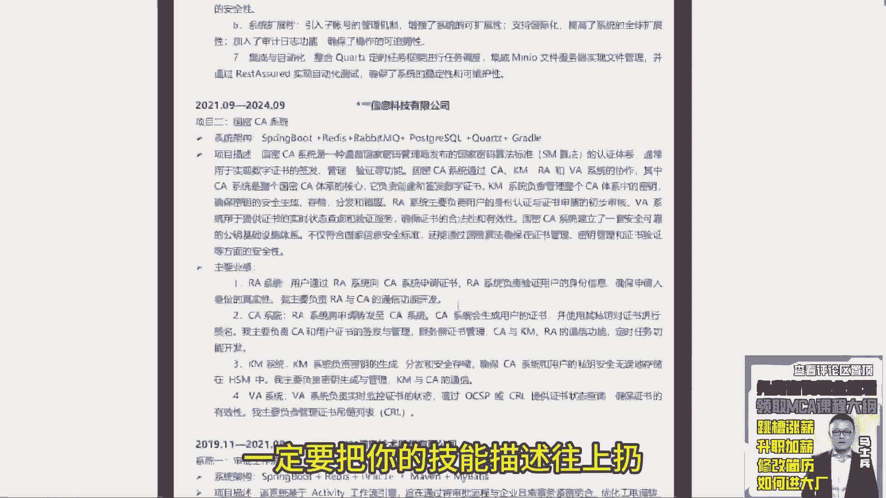

把这块东西往前放，这东西往前放好吧，然后写的是框架，这个字体得改改啊，是不是字体不一样的东西，Rob m q or redis，然后聊到java，然后扒拉新特性。

然后postgresql restful呃，单看你的技能描述有短板吗，有吧，微服务分布式没看到对应的描述点，这是不行的好吧，然后JVM并发编程，JM写了并发编程，写的多线程开发，这不够。

然后这个这个这个不写了好吧，这个也不写了好吧，大家一定记住啊，像现在面试的时候，你们去找去看招聘网站，很多同学在写技能的时候，总不知道写什么东西，其实很简单，你打开一个招聘网站，打开招聘网站之后呢。

你去招聘网站里面去搜，去搜是看20个那个岗位的JD，从里面筛选关键字，把那关键字做一个top10，top20你就能知道什么东西是面试官喜欢考的，那么把那些点一定要重点突出好吧，现在应该写这个新特性。

它不是一个重点点，没必要写写没，你想写可以写，往下放，没必要写到这这个里边，明白意思吗，好吧嗯，这个做评价也不行啊，不多说了，然后看上面的项目吧，KPIPPKI系统，pk i什么东西。

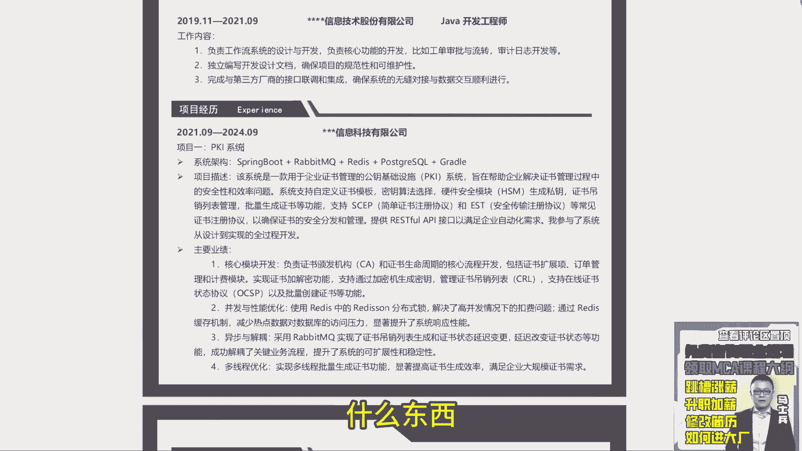

基于企业证书管理的工程PDPI系统，然后呢，核心模块开发并发与性能优化，一步一久多线程优化安全。

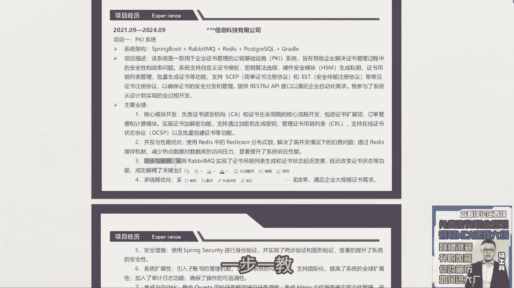

增强系统扩展性，集成与自动化这块潜水给你个建议啊，呃不要去加这个前缀的总结，没必要加前缀，总结就把你后面写的这些东西，一条一条罗列清楚就行了，明白了吗，你写的东西还可以啊，分布式锁的问题。

然rob m q的问题。

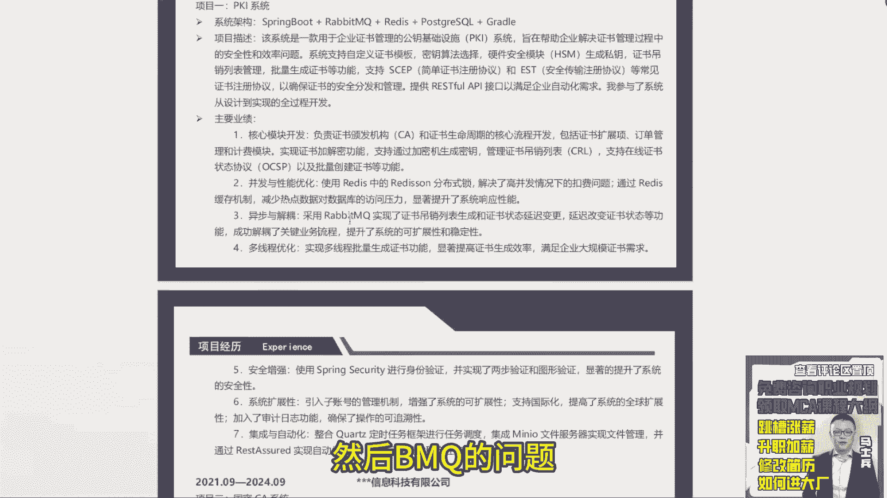

然后像这多线程的问题啊，这块包括下安全权限认证的问题。

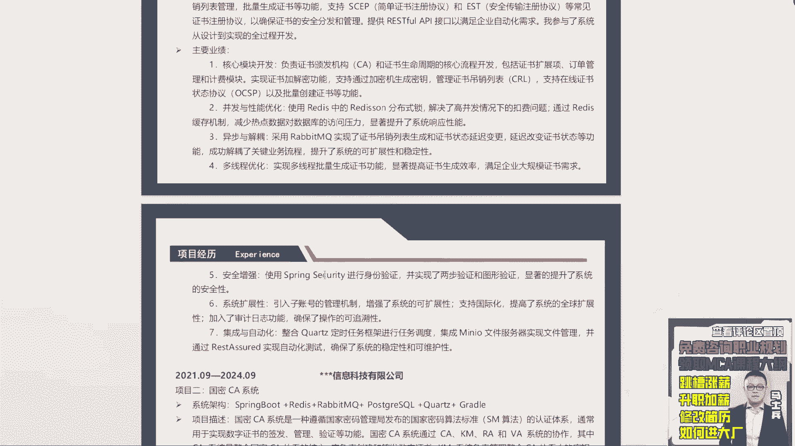

呃这个第五条可能没啥可问的啊，系统扩展性和定时任务的问题可以啊。

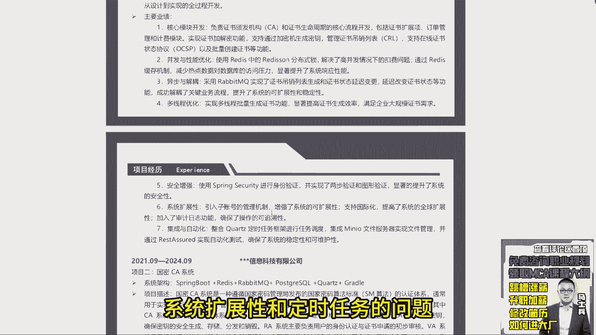

这第一个第一个还就聊得还还行。

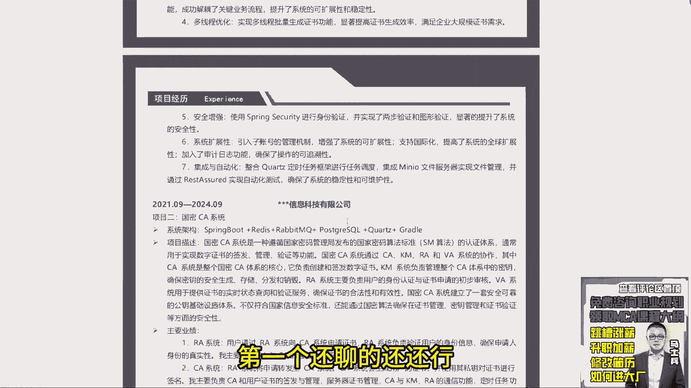

写的还行好吧，第二个ZA系统也是个密钥的，你这样做的都是都是安全认证，安全相关的是吧，RA系统嗯，嗯你看你这个这个这个写就好玩了啊，第一个项描述的太多了，呃项目描述最多333~4行，最多3~4行。

不能再多了，再多的话，我我在看简历的时候啊，面试官看简历的时候，时间是很短暂的，他不可能在短时间之内，从这里面能看到非常重要的核心点，所以简化写好吧，这第一个第二个这个RA系统。

ca系统就是就是你你如果是一个陌生人啊，大家一定记住啊，你在做项目描述的时候，或者项项目展示的时候，不要把你的面试官当成是你公司团队里面的人，你在给别人解释这东西。

RA系统通过RA系统向ca系统申请认输，RA负责什么东西，然后呢，我负责RAC通讯功能开发，CA系统，RA转换成CA系统，C系统干什么事，然后KM系统干嘛的，VA系统干嘛的，就你这个你这个去聊。

你这面试官能听懂吗，嘶能不能听懂，还是那句话，介绍业务点不纯粹是介绍业务流程。

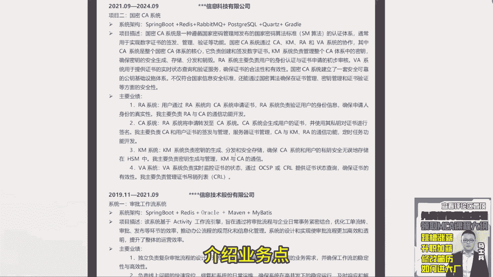

其实你前面写的东西挺好的啊。

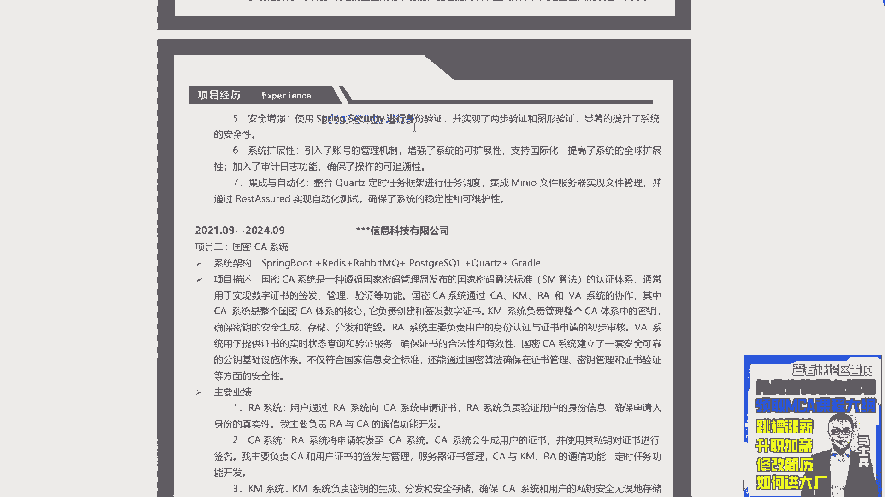

你前面那个写的挺好的，但但这这东西写的不太好，这得稍微改改好吧，还是那句话，聊的是什么，具体的技术业务点，不是聊你现项项目的业务流程，不是聊业务流程好，这事你要区分好好吧，审批就没啥说，这个很简单。

一个审批额。

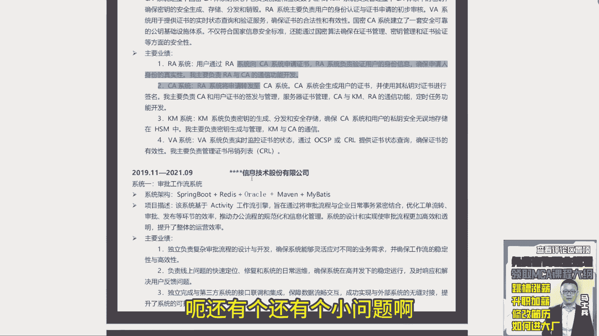

还有个还有个小问题啊，我我给个建议啊，我我我觉得你你这个项目上。

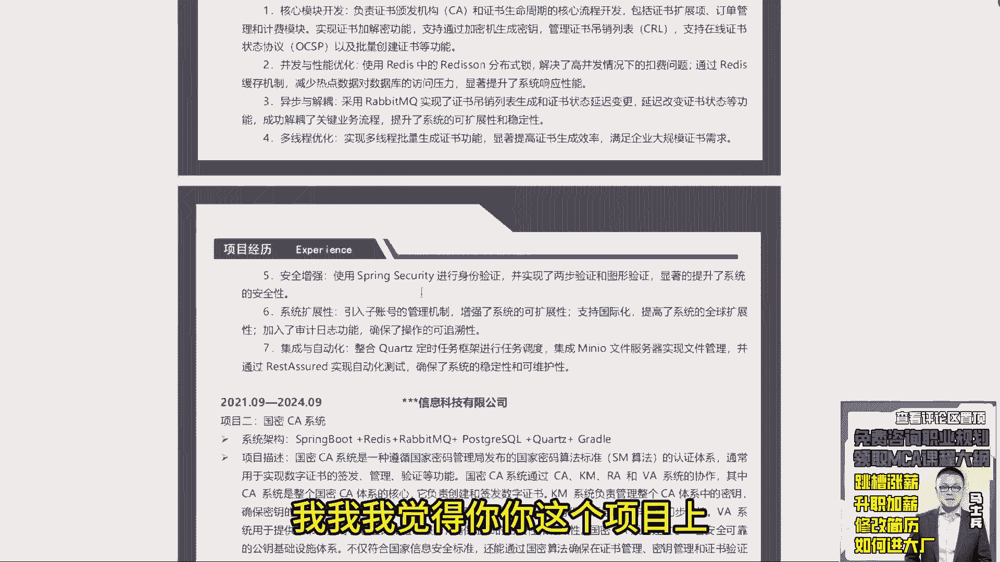

时间是不是不写了呃，这个项目3年，这个项目3年。

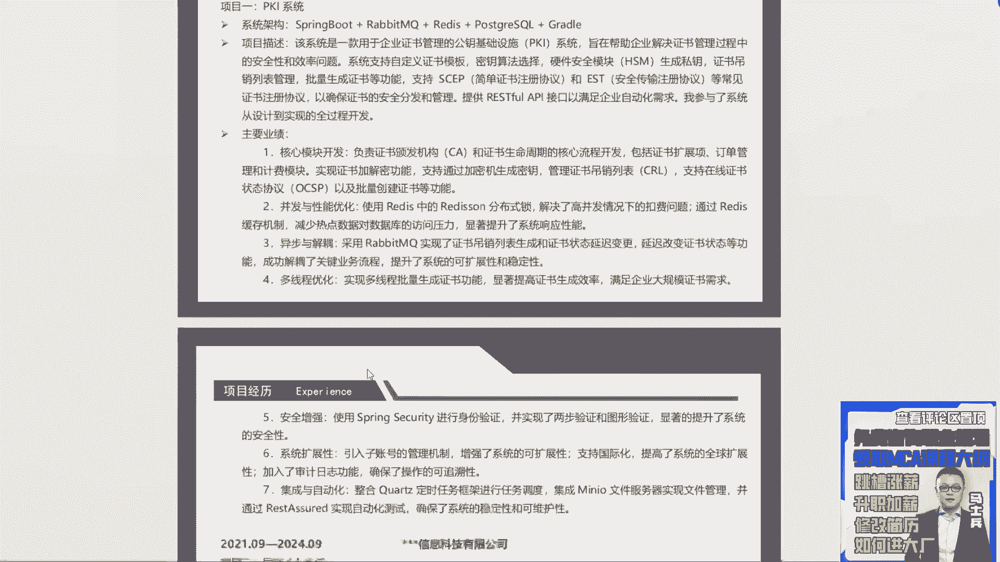

这个项目两年，按照我的，我不知道是不是因为我技术储备不够啊，按照我评估的话，我不知道你们技术团队开发多少人啊。

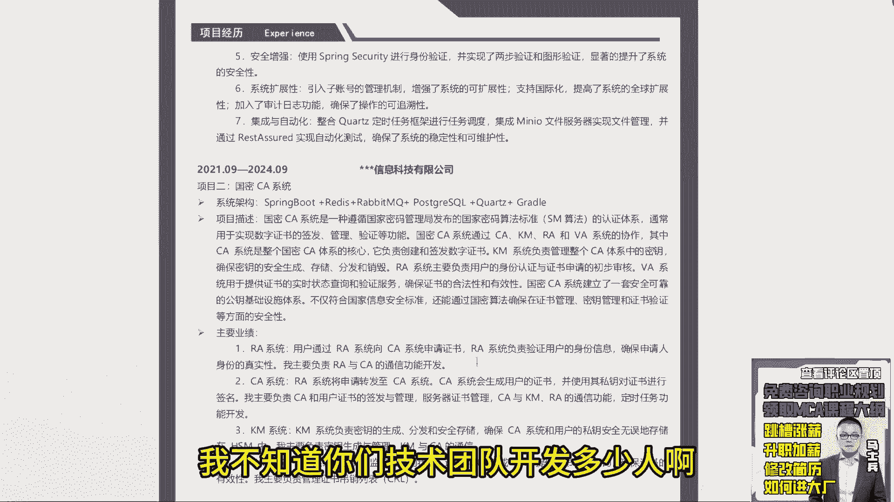

这样的东西要开发3年时间吗，你就如果你们团队里面只有你一个人，你开发3年，我我就我就理解就是这个搞了3年，就是时间太长了好吧，就是这个时间啊，两个人3年，这可以理解啊，两个人，所以人少的话是可以理解的。

但这个业务点并没有那么多呃，迭代升级的东西，你不能不能不能这样去写，所以我建议这个时间别写了好吧，时间不写了，OK然后我就觉得我3年写这么点东西，我觉得有点问题好吧，开发我们也在维护哈哈可以。

但是维护的时间不要别想时间别写好吧。

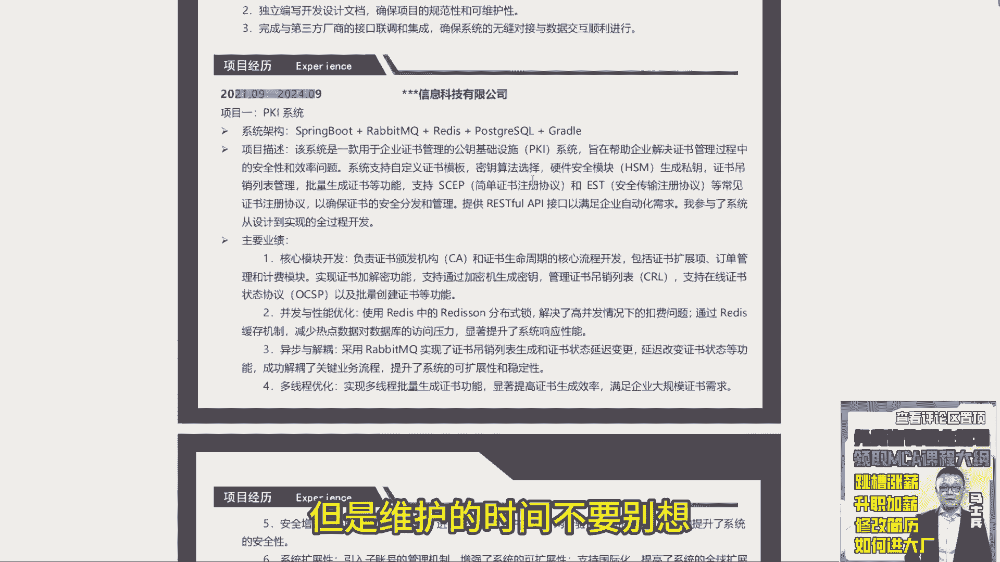

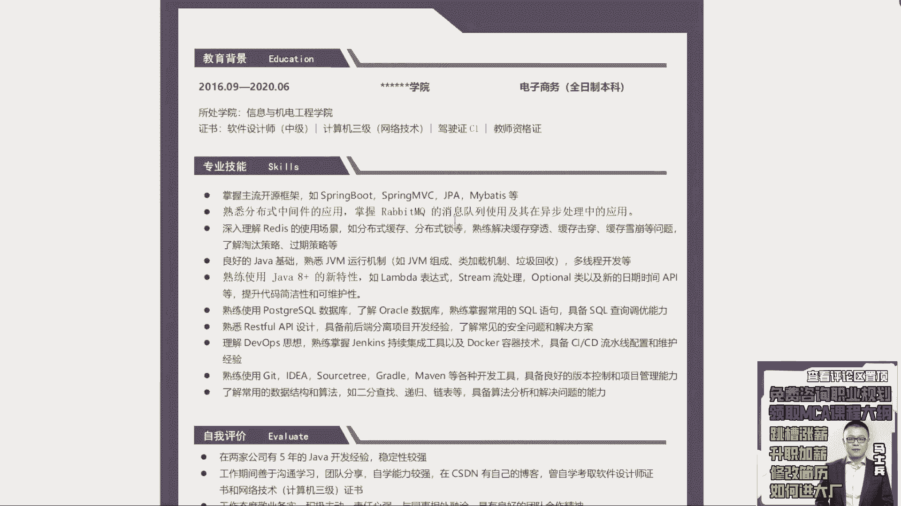

行别的没啥了。